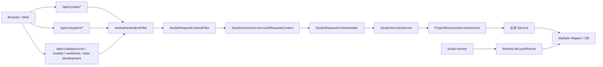
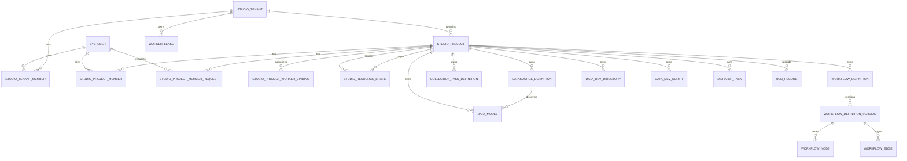
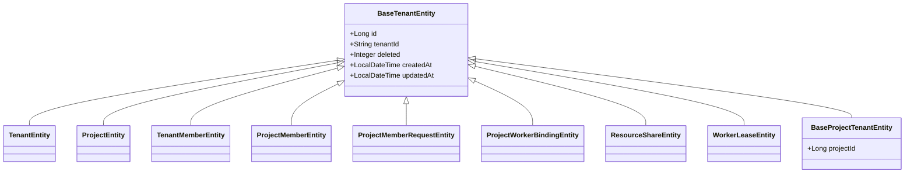
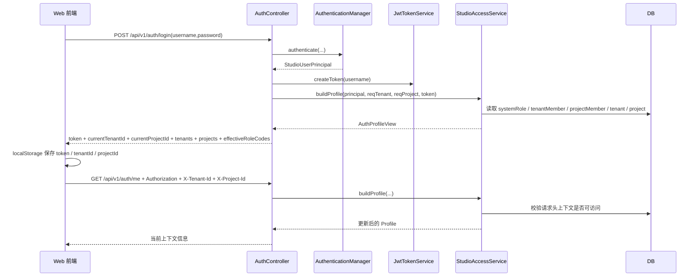
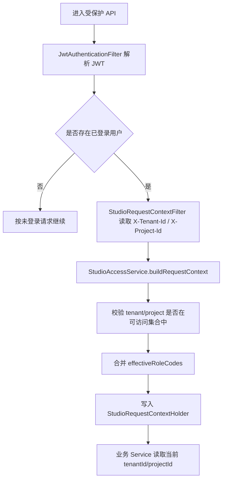
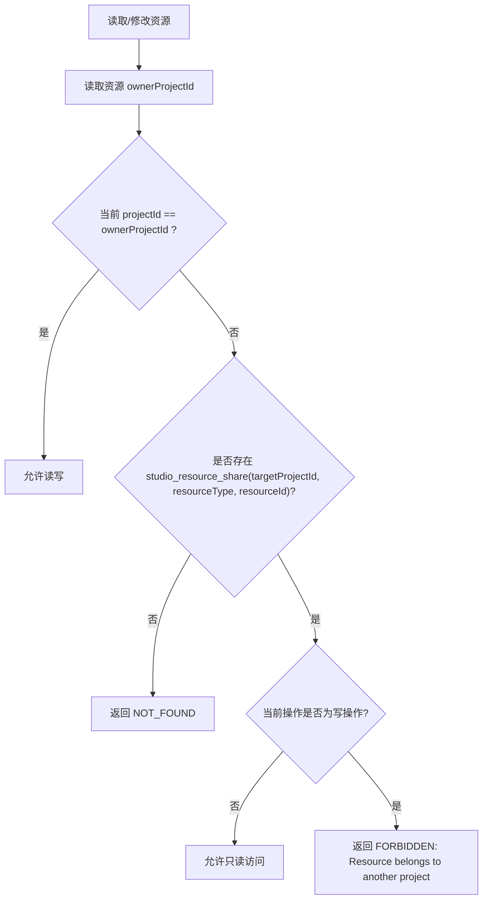
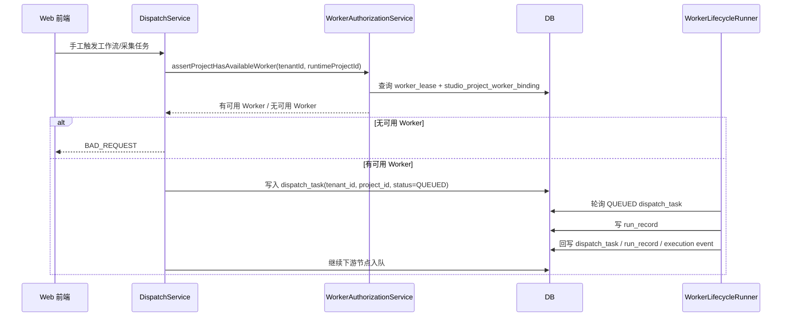

# Studio 在线版租户/项目实现交接文档

## 1. 文档目的与范围

本文用于交接 `data-aggregation-studio` 在线版当前的多租户、多项目实现。

覆盖范围：

- 后端：`backend/studio-server`、`backend/studio-infra`、`backend/studio-worker`
- 前端：`frontend/apps/web`
- 数据库：在线版 MySQL/SQLite 结构与升级逻辑

不覆盖范围：

- `desktop/runtime` 离线端的独立数据一致性方案
- 业务插件自身的租户适配细节

当前实现的核心思路是：

- `JWT` 只负责“身份认证”，不绑定租户和项目。
- 每次在线请求通过 `X-Tenant-Id`、`X-Project-Id` 指定“当前上下文”。
- 数据资源默认按项目隔离，跨项目访问依赖共享关系。
- Worker 目录归属于租户，项目通过“绑定关系”声明可用 Worker。

## 2. 术语与设计约束

### 2.1 术语

- `Tenant`：租户。逻辑上是一组项目、成员、Worker 的容器。
- `Project`：项目。数据资源的主要隔离边界。
- `System Role`：系统角色，来源于旧 `sys_role` / `sys_user_role` 体系，当前仍保留 `ADMIN`、`SUPER_ADMIN`。
- `Tenant Role`：租户成员角色，当前主要使用 `TENANT_ADMIN`。
- `Project Role`：项目成员角色，当前主要使用 `PROJECT_ADMIN`、`PROJECT_MEMBER`。
- `Request Context`：一次请求内生效的 `{ userId, tenantId, projectId, effectiveRoleCodes }`。
- `Owned Resource`：资源归属项目与当前项目一致。
- `Shared Resource`：资源归属其他项目，但通过共享关系对当前项目可见。

### 2.2 当前固定角色

定义见 `backend/studio-commons/src/main/java/com/jdragon/studio/commons/constant/StudioConstants.java`：

- `ADMIN`
- `SUPER_ADMIN`
- `TENANT_ADMIN`
- `PROJECT_ADMIN`
- `PROJECT_MEMBER`

当前权限语义是“内建语义优先”，而不是依赖一套动态可配置的通用 RBAC。

## 3. 总体架构

### 3.1 分层概览

- `AuthController` 负责登录与当前用户信息。
- `StudioAccessService` 负责把“用户身份 + 请求头上下文”解析成当前请求的租户/项目/有效角色。
- `StudioRequestContextFilter` 把解析结果写入 `StudioRequestContextHolder`。
- `StudioSecurityService` 给业务服务统一读取当前 `tenantId`、`projectId`、`userId`、`effectiveRoleCodes`。
- `ProjectResourceAccessService` 负责资源的“当前项目可读 / 可写 / 共享可见”判定。
- 业务服务如 `DataSourceService`、`DataModelService`、`CollectionTaskService`、`WorkflowService`、`DataDevelopmentService` 在查询与写入时应用项目隔离。
- `SystemManagementService` 负责租户、项目、成员、申请、Worker 绑定、资源共享管理。
- `DispatchService` 负责运行前的 Worker 可用性校验与任务入队。
- `WorkerLifecycleRunner` 负责 Worker 心跳、拉取任务、执行节点、写回运行记录。

### 3.2 架构主线

## 4. 数据模型

### 4.1 关系总览

### 4.2 核心表

#### 身份与成员

- `sys_user`
  - 账号本体，仍然是登录入口。
- `studio_tenant`
  - 租户主表。
  - `tenant_id` 与 `tenant_code` 目前保持同值使用。
- `studio_project`
  - 项目主表。
  - 唯一键为 `(tenant_id, project_code)` 与 `(tenant_id, project_name)`。
- `studio_tenant_member`
  - 用户在租户下的成员关系。
  - 唯一键 `(tenant_id, user_id)`，当前一个用户在同一租户只能有一条成员记录。
- `studio_project_member`
  - 用户在项目下的成员关系。
  - 唯一键 `(project_id, user_id)`，当前一个用户在同一项目只能有一条成员记录。
- `studio_project_member_request`
  - 申请/邀请记录。
  - `request_type` 使用 `APPLY` / `INVITE`。
  - `status` 使用 `PENDING` / `APPROVED` / `REJECTED` / `ACCEPTED` / `CANCELLED`。

#### Worker 与共享

- `worker_lease`
  - Worker 心跳与在线状态目录。
  - 当前结构只有 `tenant_id`，没有 `project_id`。
- `studio_project_worker_binding`
  - 声明某个项目可用哪些 Worker。
- `studio_resource_share`
  - 项目间共享关系表。
  - 唯一键 `(resource_type, resource_id, target_project_id)`。

#### 项目隔离资源

以下表已纳入 `project_id`：

- `datasource_definition`
- `data_model`
- `data_model_attr_index`
- `collection_task_definition`
- `collection_task_schedule`
- `workflow_definition`
- `workflow_definition_version`
- `workflow_node`
- `workflow_edge`
- `workflow_schedule`
- `data_dev_directory`
- `data_dev_script`
- `dispatch_task`
- `run_record`

### 4.3 实体继承关系

说明：

- 并不是所有表都直接继承 `BaseProjectTenantEntity`，很多实体仍自行声明 `projectId` 字段。
- `BaseTenantEntity` 统一接入了 `tenantId`、逻辑删除、审计字段。

## 5. 认证、上下文与前端切换

### 5.1 认证与上下文的分离

当前实现明确区分两件事：

- 登录只校验“你是谁”。
- 后续请求头再声明“你现在以哪个租户/项目工作”。

也就是说，同一个 JWT 可以在不同请求中切换不同租户/项目，只要该用户对目标上下文有权限。

### 5.2 关键类

- `AuthController`
  - `POST /api/v1/auth/login`
  - `GET /api/v1/auth/me`
- `JwtAuthenticationFilter`
  - 从 `Authorization: Bearer <token>` 恢复登录用户。
- `StudioRequestContextFilter`
  - 从 `X-Tenant-Id`、`X-Project-Id` 构建请求级上下文。
- `StudioAccessService`
  - 合并系统角色、租户成员角色、项目成员角色。
  - 校验请求头中的租户/项目是否属于用户可访问范围。
- `StudioRequestContextHolder`
  - `ThreadLocal` 保存当前请求上下文。
- `StudioSecurityService`
  - 业务层统一读取当前上下文。

### 5.3 登录与上下文解析时序图

### 5.4 请求内上下文建立流程

### 5.5 前端上下文切换

当前前端实现位置：

- `frontend/apps/web/src/stores/auth.ts`
- `frontend/apps/web/src/layout/StudioLayout.vue`
- `frontend/packages/api-sdk/src/client.ts`

实现方式：

- `auth.ts`
  - 保存 `token`、`currentTenantId`、`currentProjectId`、`tenants`、`projects`、`effectiveRoleCodes`
  - 调用 `auth.me()` 时，如果当前上下文失效，会清空本地上下文后重试一次
- `StudioLayout.vue`
  - 顶栏提供租户和项目切换器
  - 切换后调用 `authStore.selectTenant()` / `authStore.selectProject()`
- `client.ts`
  - 给每个 API 请求自动带上
    - `Authorization`
    - `X-Tenant-Id`
    - `X-Project-Id`

## 6. 角色模型与权限边界

### 6.1 角色来源

有效角色由三部分合并：

- 系统角色：来自旧 `user_role + role`
- 租户角色：来自 `studio_tenant_member`
- 项目角色：来自 `studio_project_member`

合并逻辑在 `StudioAccessService.buildProfile()` 中完成。

### 6.2 当前权限语义

- `SUPER_ADMIN`
  - 可浏览全部租户和项目
  - 可创建/删除租户
  - 可在任意租户、任意项目建立管理关系
- `TENANT_ADMIN`
  - 当前租户下可管理项目、租户成员、项目 Worker 绑定
- `PROJECT_ADMIN`
  - 只能在当前项目上下文下管理该项目成员、申请、资源共享
- `PROJECT_MEMBER`
  - 使用项目资源，但不具备项目管理权限

### 6.3 注意点

- 当前 `TenantMemberEntity` / `ProjectMemberEntity` 的唯一键都只允许“一个成员一条记录”，因此同一用户在同一租户或同一项目下暂时不能同时持有多个成员角色。
- 代码里 `effectiveRoleCodes` 是列表，但落库结构当前更接近“单角色成员关系”。

## 7. 项目隔离与共享实现模式

### 7.1 统一模式

项目级资源基本都遵循同一套路：

1. 查询时只看当前 `tenantId`
2. 如果当前没有 `projectId`，退化成租户级查询
3. 如果当前有 `projectId`
   - 先查当前项目自有资源
   - 再并入共享给当前项目的资源
4. 详情读取时用 `assertReadable(...)`
5. 修改、删除、发布时用 `assertWritable(...)`
6. 名称唯一性只在当前项目下校验

关键入口类：

- `ProjectResourceAccessService`
- `DataSourceService`
- `DataModelService`
- `CollectionTaskService`
- `WorkflowService`
- `DataDevelopmentService`

### 7.2 资源可见性决策流程

### 7.3 已接入共享的资源类型

定义见 `StudioConstants`：

- `DATASOURCE`
- `DATA_MODEL`
- `COLLECTION_TASK`
- `WORKFLOW`
- `DATA_DEVELOPMENT_SCRIPT`

### 7.4 共享语义

- 共享关系是“源项目 -> 目标项目”的单向关系。
- 共享后的资源在目标项目可见、可引用、不可修改。
- 共享关系限制在同租户内。
- 删除共享时采用逻辑删除。
- 重新共享时会复活原记录，而不是插入新记录。

### 7.5 各资源实现差异

#### 数据源

- `DataSourceService.buildAccessibleQuery()` 合并“当前项目自有 + 共享数据源”
- `ensureUniqueName()` 只校验当前项目内重名
- 共享数据源在目标项目里可以用于模型同步、任务引用、脚本引用

#### 模型

- `DataModelService.syncFromDatasource()` 有一个关键特性：
  - 即使数据源来自别的项目，只要当前项目对它可读，模型同步仍写入“当前项目”
- 这保证了共享数据源上的模型可以在目标项目里形成独立的模型资产

#### 采集任务

- `CollectionTaskService` 对源/目标模型、数据源引用采用“先读再装配”策略
- 列表、详情、保存、发布、删除都受项目上下文控制

#### 工作流

- `WorkflowService` 在定义、版本、节点、边、调度上全部写入 `projectId`
- 工作流共享只共享定义，不把所有执行记录一并跨项目暴露

#### 数据开发目录与脚本

- 目录与脚本都已纳入 `project_id`
- 脚本支持共享，目标项目中表现为只读
- 如果共享脚本绑定的数据源没有同步共享，脚本仍可见，但数据源名称可能为空

## 8. Worker、调度与运行链路

### 8.1 设计目标

设计上希望做到：

- Worker 属于租户
- 租户管理员把 Worker 下发到项目
- 只有项目被授权的 Worker 才能执行该项目任务

### 8.2 当前已落地部分

- `worker_lease`
  - 记录 Worker 在线状态与心跳
- `studio_project_worker_binding`
  - 记录项目授权的 Worker
- `WorkerAuthorizationService`
  - 根据租户 + 项目查询“当前在线且已绑定”的 Worker
- `DispatchService`
  - 在手工触发、调度触发前校验当前项目是否存在可用 Worker
  - 如果没有，直接拒绝执行

### 8.3 手工触发时序图

### 8.4 当前实现与设计的差异

这部分很重要，交接时请按“代码真实行为”理解：

1. **预检查已实现，执行面强隔离未完全收口**
   - `DispatchService` 已经会在入队前校验“项目有没有可用 Worker”
   - 但 `WorkerLifecycleRunner.pollAndExecute()` 当前直接从全局 `dispatch_task` 取 `QUEUED` 任务，没有在 SQL 层按租户/项目绑定再次过滤
   - 这意味着当前更接近“入队前防呆”，而不是“Worker 拉取时强授权”

2. **Worker 配置里没有显式 tenantCode**
   - `StudioPlatformProperties` 当前只有 `workerCode`、`workerApiBaseUrl` 等字段，没有单独的 `workerTenantId`
   - `heartbeat()` 也是按 `workerCode` 更新 `worker_lease`

3. **运行态上下文已经会把 task.tenantId / task.projectId 注入执行线程**
   - `WorkerLifecycleRunner.executeWithTaskContext()` 会在执行节点前手工写入 `StudioRequestContextHolder`
   - 因此节点执行期读取当前租户/项目是可行的

结论：

- 当前“任务写入时”是项目隔离的
- 当前“任务执行时的上下文”也是项目隔离的
- 当前“任务被哪个 Worker 拉走”这一步还没有完全做到按绑定关系硬过滤

## 9. 数据库升级、回填与初始化

### 9.1 结构升级

入口类：

- `StudioSchemaUpgradeService`

职责：

- 新增多租户相关表
- 给项目级资源补 `project_id`
- 新增项目级唯一索引与查询索引
- 对旧数据执行 `project_id` 回填

### 9.2 默认租户/默认项目初始化

入口类：

- `BootstrapDataService`
- `TenantProjectFoundationService`

当前行为：

- 确保存在默认管理员 `admin / admin123`
- 确保存在 `ADMIN`、`SUPER_ADMIN`、`TENANT_ADMIN`、`PROJECT_ADMIN`、`PROJECT_MEMBER`
- 确保存在 `Default Tenant`
- 确保存在 `Default Project`
- 把管理员补成默认租户管理员和默认项目管理员
- 把现有用户补到默认项目中，管理员给 `PROJECT_ADMIN`，其他用户给 `PROJECT_MEMBER`

### 9.3 旧数据回填

`StudioSchemaUpgradeService.backfillProjectIdsMysql()` / `backfillProjectIdsSqlite()` 会把旧数据补到默认项目，覆盖：

- 数据源
- 模型
- 索引
- 采集任务与调度
- 数据开发目录与脚本
- 工作流定义、版本、节点、边、调度
- 分发任务
- 运行记录

## 10. 前端对多租户的承接方式

### 10.1 登录态与上下文状态

`auth.ts` 维护：

- `token`
- `currentTenantId`
- `currentProjectId`
- `tenants`
- `projects`
- `systemRoleCodes`
- `effectiveRoleCodes`

上下文切换流程：

1. 先把目标租户/项目写入 `localStorage`
2. 再请求 `/auth/me`
3. 由服务端返回“该上下文下真实可用”的租户、项目、角色信息
4. 如果本地上下文失效，前端会清空后重试一次

### 10.2 API 透传

`frontend/packages/api-sdk/src/client.ts` 的请求拦截器会自动附加：

- `Authorization`
- `X-Tenant-Id`
- `X-Project-Id`

因此绝大多数页面不需要手工拼接上下文请求头。

### 10.3 业务页面的约定

当前多租户页面约定：

- 列表页展示 `projectId` 或所属项目名称
- 共享资源显示“共享来源项目”
- 当资源不是当前项目拥有时，页面进入只读态
- 切换租户/项目后，页面应监听上下文重新拉取数据

## 11. 当前真实行为与待收口项

这一节建议交接时重点读。

### 11.1 已实现并可依赖的行为

- JWT 与租户/项目上下文分离
- 顶栏支持租户/项目切换
- `auth/me` 会根据请求头返回当前可用上下文
- 数据源、模型、采集任务、工作流、数据开发目录/脚本已接入项目隔离
- 资源共享已支持
  - 数据源
  - 模型
  - 采集任务
  - 工作流
  - 数据开发脚本
- 同名唯一性已收敛为“项目内唯一”
- 手工触发与调度触发前会检查项目是否存在可用 Worker
- 运行记录与日志查询已按 `tenantId + projectId` 过滤

### 11.2 当前与设计不完全一致的点

1. **Worker 拉取阶段还没有按授权项目二次过滤**
   - 见上文 8.4

2. **普通用户的“主动申请加入项目”仍偏管理端模型**
   - `SystemManagementService.saveProjectMemberRequest()` 走的是 `requireManageableProject(...)`
   - 当前更像项目管理员代为创建申请/邀请记录
   - 不是一个完全开放给任意普通用户的自助申请入口

3. **删除项目的资源完整性检查还不完整**
   - `hasProjectResources(...)` 当前只检查
     - 数据源
     - 模型
     - 采集任务
     - 工作流
   - 没有把以下内容纳入阻断条件
     - 数据开发目录/脚本
     - 资源共享关系
     - 项目成员
     - 项目申请记录
     - 项目 Worker 绑定

4. **成员关系当前是一人一条记录**
   - 如果后续要支持一个用户同时持有多个项目角色，需要先改表结构或改成 role set

5. **共享资源是只读引用，不是复制**
   - 如果业务未来需要“引用后可派生编辑”，要新增“复制到当前项目”能力，而不能直接复用当前共享表

6. **共享脚本对未共享数据源采取的是“降级展示”**
   - 目标项目里脚本仍会可见
   - 但关联数据源名称可能为空
   - 这是为了避免列表/树因为缺数据源直接报错

## 12. 新增一个“项目级资源类型”的接入清单

如果后续还要把更多资源纳入租户/项目体系，建议按下面顺序做：

1. **数据库结构**
   - 给资源表加 `project_id`
   - 加当前项目范围下的唯一键或查询索引
   - 更新 `schema-mysql.sql`
   - 更新 `StudioSchemaUpgradeService`
   - 更新结构快照

2. **实体与 DTO**
   - 实体、DTO、View 补 `projectId`
   - 列表页需要区分共享来源时，再补 `ownerProjectId` / `ownerProjectName`

3. **服务层**
   - 查询：补 `buildAccessibleQuery()`
   - 详情：补 `assertReadable(...)`
   - 写入：补 `assertWritable(...)`
   - 唯一性：收敛到 `projectId`

4. **共享管理**
   - 在 `StudioConstants` 增加资源类型常量
   - 在 `SystemManagementService.validateShareableResource()` 注册新类型

5. **前端**
   - 类型定义补字段
   - 列表页显示所属项目
   - 共享资源进入只读态
   - 在系统管理页把新资源类型挂到共享管理中

6. **回归点**
   - 当前项目可见
   - 跨项目同名允许
   - 共享后目标项目只读可见
   - 非共享目标项目不可见

## 13. 建议的后续收口优先级

如果继续完善该体系，建议优先级如下：

1. Worker 拉取任务时增加“租户 + 项目绑定”的硬过滤
2. 给 Worker 增加显式 `tenantId` 配置项
3. 补齐“普通用户自助申请加入项目”的独立接口与页面
4. 补齐删除项目前的完整依赖检查
5. 如果需要多角色成员，重构成员表表达能力

## 14. 快速定位清单

### 后端关键文件

- `backend/studio-commons/src/main/java/com/jdragon/studio/commons/constant/StudioConstants.java`
- `backend/studio-infra/src/main/java/com/jdragon/studio/infra/service/StudioAccessService.java`
- `backend/studio-infra/src/main/java/com/jdragon/studio/infra/service/StudioSecurityService.java`
- `backend/studio-infra/src/main/java/com/jdragon/studio/infra/service/ProjectResourceAccessService.java`
- `backend/studio-infra/src/main/java/com/jdragon/studio/infra/service/SystemManagementService.java`
- `backend/studio-infra/src/main/java/com/jdragon/studio/infra/service/WorkerAuthorizationService.java`
- `backend/studio-infra/src/main/java/com/jdragon/studio/infra/service/DispatchService.java`
- `backend/studio-infra/src/main/java/com/jdragon/studio/infra/service/StudioSchemaUpgradeService.java`
- `backend/studio-infra/src/main/java/com/jdragon/studio/infra/service/TenantProjectFoundationService.java`
- `backend/studio-server/src/main/java/com/jdragon/studio/server/web/filter/JwtAuthenticationFilter.java`
- `backend/studio-server/src/main/java/com/jdragon/studio/server/web/filter/StudioRequestContextFilter.java`
- `backend/studio-server/src/main/resources/schema-mysql.sql`
- `backend/studio-worker/src/main/java/com/jdragon/studio/worker/runtime/runner/WorkerLifecycleRunner.java`

### 前端关键文件

- `frontend/packages/api-sdk/src/client.ts`
- `frontend/apps/web/src/stores/auth.ts`
- `frontend/apps/web/src/layout/StudioLayout.vue`
- `frontend/apps/web/src/views/SystemView.vue`
- `frontend/apps/web/src/views/DatasourcesView.vue`
- `frontend/apps/web/src/views/ModelsView.vue`
- `frontend/apps/web/src/views/DataDevelopmentView.vue`
- `frontend/apps/web/src/views/WorkflowsView.vue`
- `frontend/apps/web/src/views/RunsView.vue`

---

如需继续交接，建议下一位同学先从以下顺序阅读源码：

1. `StudioConstants`
2. `StudioAccessService`
3. `StudioRequestContextFilter`
4. `ProjectResourceAccessService`
5. `SystemManagementService`
6. 任意一个资源服务（建议从 `DataSourceService` 开始）
7. `DispatchService`
8. `WorkerLifecycleRunner`
