# Nacos 适配层架构交接文档

适用仓库：`C:\dev\ideaProject\cloud-parent-springboot3`  
文档日期：`2026-04-25`  
文档范围：只描述当前最终代码，不包含迁移过程、历史方案、试错记录。

## 读图导航

先看这 4 个结论，再看后面的图：

1. `studio-nacos-compat-core` 是当前 Nacos 兼容层的实际运行内核，源码位于 `DataAggregation/data-aggregation-studio/backend`。
2. `studio-server`、`studio-worker` 直接依赖 `studio-nacos-compat-core`，不依赖 cloud-parent 内任何模块。
3. `platform-starter-config` 当前是空 façade，只把 cloud-parent 侧依赖导向 `studio-nacos-compat-core`，没有运行时代码。
4. `platform-starter-discovery` 当前不承载 Nacos 协议兼容主逻辑，只承载项目自定义 `CustomerLoadBalancer` 与 `ClusterFeignClient`。
5. `gateway-service` 通过 `DiscoveryClient`、`NacosServiceLoader`、`NacosLoadBalancer*`、`RefreshRouteConfig` 消费兼容层能力；它默认不依赖 `@EnableCustomerLoadBalancer`。

当前对外可见集成面固定为：

- `spring.config.import=nacos:...`
- `spring.cloud.nacos.config.*`
- `spring.cloud.nacos.discovery.*`
- `platform.nacos.compat.*`
- `@EnableCustomerLoadBalancer`
- `load-balancer.services.*`

当前代码里的生效边界固定为：

- `studio-nacos-compat-core` 不包含 `com.syy.datacenter.*` 业务类，是 studio 提供、cloud-parent 消费的通用基础设施 artifact。
- `platform-starter-config` 没有运行时代码，不参与 Spring Bean 构建。
- `studio-nacos-compat-core` 通过两种入口生效：
  - `spring.factories` 注册 `ConfigDataLocationResolver` / `ConfigDataLoader`
  - `AutoConfiguration.imports` 注册刷新与发现自动装配
- `platform-starter-discovery` 没有自动装配入口，只有显式加 `@EnableCustomerLoadBalancer` 才会启用。
- 当前仓库内显式启用了 `@EnableCustomerLoadBalancer` 的应用有：
  - `platform-data-base-info-service`
  - `platform-data-fusion-service`
- `gateway-service` 通过自己的 `NacosLoadBalancerConfig` 和 `RouteConfig` 默认生效，不依赖 `@EnableCustomerLoadBalancer`。

当前仓库未检索到显式配置：

- `platform.nacos.compat.*`
- `load-balancer.services.*`

因此当前默认行为来自代码默认值：

- `platform.nacos.compat.mode=AUTO`
- `platform.nacos.compat.probe-timeout=3s`
- `platform.nacos.compat.log-probe-detail=true`
- `platform.nacos.compat.config-read-timeout=3s`
- `platform.nacos.compat.legacy-long-polling-timeout=30s`
- `platform.nacos.compat.legacy-beat-interval=5s`

## 模块定位

| 模块 | 当前定位 | 是否有运行时代码 | 备注 |
| --- | --- | --- | --- |
| `studio-nacos-compat-core` | 实际运行内核 | 是 | 位于 studio backend，承担配置中心、服务注册发现、自动装配、协议判代、legacy HTTP 访问、modern SDK 访问 |
| `platform-starter-config` | cloud-parent 空 façade | 否 | 当前只有 `pom.xml`，依赖 `com.jdragon.studio:studio-nacos-compat-core` |
| `platform-starter-discovery` | 项目自定义增强 | 是 | 不承载协议兼容主逻辑，只承载 `CustomerLoadBalancer*` 和 `ClusterFeignClient` |
| `gateway-service` | compat core 的消费方 + 网关自定义增强 | 是 | 负责动态路由、实例选择、路由刷新 |

## 生效阶段

按当前最终代码，Nacos 适配层只在这 5 个阶段起作用：

1. 启动前配置解析阶段  
   `spring.config.import=nacos:...` 进入 `NacosConfigDataLocationResolver` 和 `NacosConfigDataLoader`。
2. Spring 自动装配建 Bean 阶段  
   `NacosConfigRefreshAutoConfiguration` 与 `NacosCompatDiscoveryAutoConfiguration` 创建核心 Bean。
3. 应用启动注册阶段  
   Web 应用收到 `WebServerInitializedEvent` 后，由 `NacosRegistrationLifecycle` 触发注册。
4. 运行期刷新阶段  
   `NacosConfigRefreshManager` 启动监听，legacy 走长轮询，modern 走 SDK Listener。
5. gateway 请求 / 路由决策阶段  
   `RouteConfig` 构建初始动态路由，`RefreshRouteConfig` 定时刷新，`NacosLoadBalancer` 负责实例选择。

## 图 1：模块依赖图

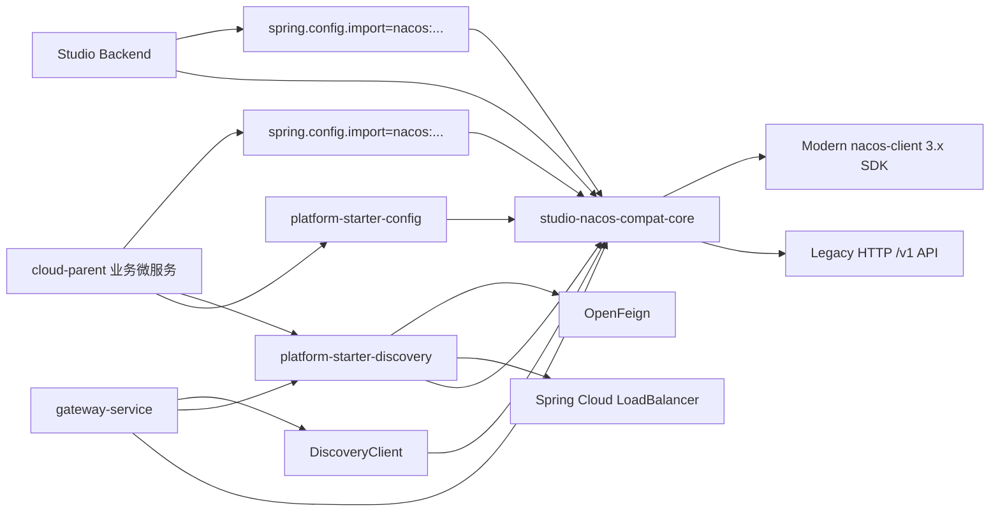

读图说明：`studio-nacos-compat-core` 是通用内核。studio 直接依赖它；cloud-parent 通过 `platform-starter-config` / `platform-starter-discovery` 或 gateway 侧依赖消费它。`platform-starter-discovery` 只提供可选的自定义负载均衡扩展。

## 图 2：适配层总览流程图

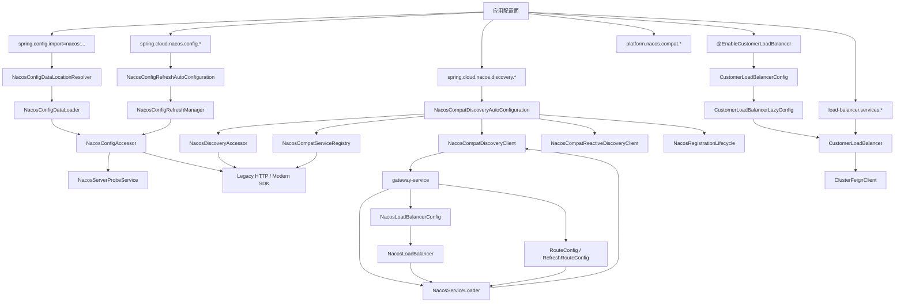

读图说明：配置面、发现面、gateway 面和可选自定义 LB 面是四条并列链路，其中只有 `CustomerLoadBalancer` 这条链路需要显式注解启用。

## 图 3：配置路径类图

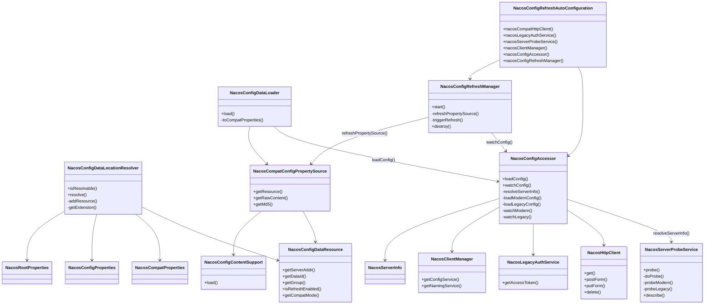

读图说明：配置链有两个入口。启动前 `Resolver + Loader` 负责把 `nacos:` 位置解析成 `PropertySource`；应用启动后 `RefreshManager` 再为这些 `PropertySource` 挂接监听。

## 图 4：发现路径类图

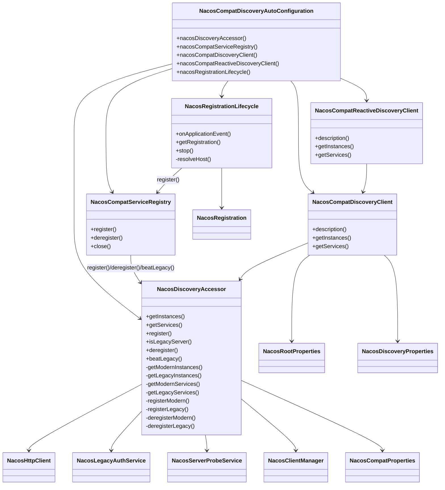

读图说明：发现链的统一入口是 `NacosDiscoveryAccessor`。它先判代，再决定走 legacy HTTP 还是 modern SDK。

## 图 5：gateway 适配类图

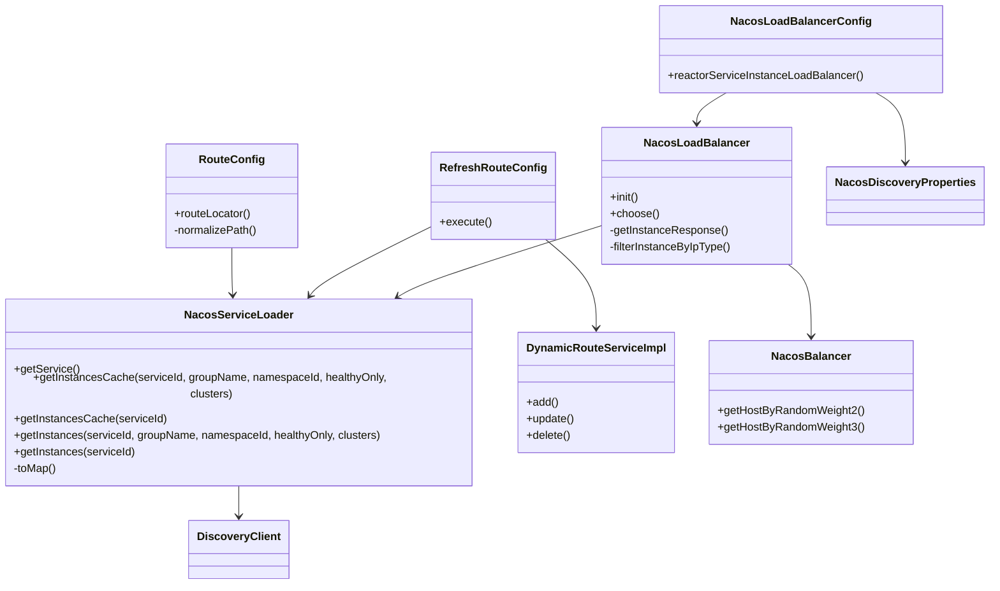

读图说明：gateway 的 Nacos 适配由自己的一套组件驱动，不依赖 `@EnableCustomerLoadBalancer`。实例目录来自 `DiscoveryClient`，选实例和动态路由由 gateway 本地类完成。

## 图 6：可选自定义 LB 类图

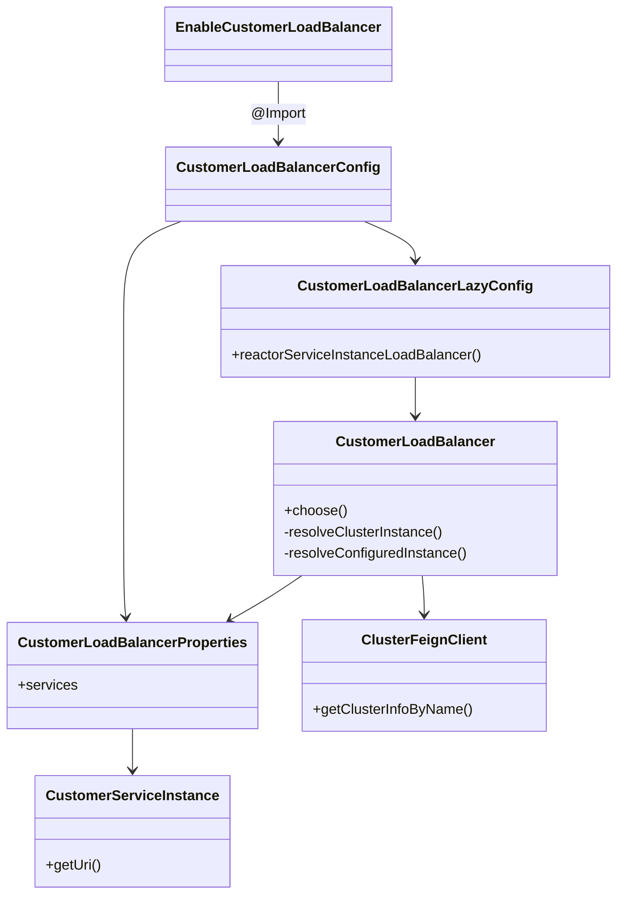

读图说明：这条链不是协议兼容核心，而是项目自定义 LB 增强。只有显式加 `@EnableCustomerLoadBalancer` 的应用才会装入这条链。

## 图 7：激活条件流程图

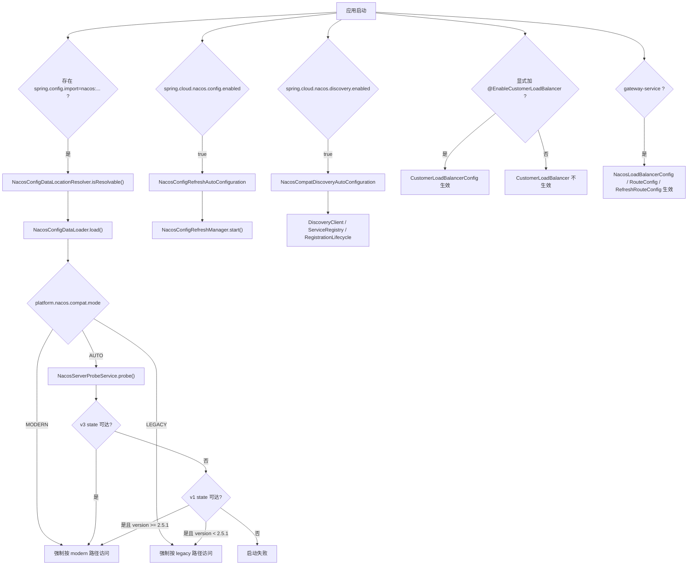

读图说明：compat core 的默认判代入口是 `AUTO`。`CustomerLoadBalancer` 和 gateway 自定义 LB 是两条独立条件链。

## 图 8：端到端请求路径图

```mermaid
flowchart LR
    Boot["Boot 启动"] --> ConfigResolve["Resolver / Loader 读取 nacos 配置"]
    ConfigResolve --> Probe["NacosServerProbeService 判代"]
    Probe --> ConfigFetch["NacosConfigAccessor 取配置"]
    ConfigFetch --> PropertySource["NacosCompatConfigPropertySource 写入 Environment"]
    PropertySource --> Refresh["NacosConfigRefreshManager.watchConfig()"]

    Boot --> AutoConfig["Discovery AutoConfiguration 建 Bean"]
    AutoConfig --> Register["NacosRegistrationLifecycle.onApplicationEvent()"]
    Register --> Registry["NacosCompatServiceRegistry.register()"]
    Registry --> Discovery["NacosDiscoveryAccessor.registerModern/registerLegacy"]

    Discovery --> Client["NacosCompatDiscoveryClient"]
    Client --> GatewayLoader["gateway NacosServiceLoader"]
    GatewayLoader --> RouteInit["RouteConfig.routeLocator()"]
    GatewayLoader --> RouteRefresh["RefreshRouteConfig.execute()"]
    GatewayLoader --> GatewayLB["NacosLoadBalancer.choose()"]
    GatewayLB --> RequestForward["lb://serviceId 转发"]
```

读图说明：这张图把配置、注册、发现、gateway 路由和请求转发放在同一条端到端链路里，便于定位某个问题属于哪个阶段。

## 时序图 1：Boot 启动读取配置，`AUTO -> LEGACY`

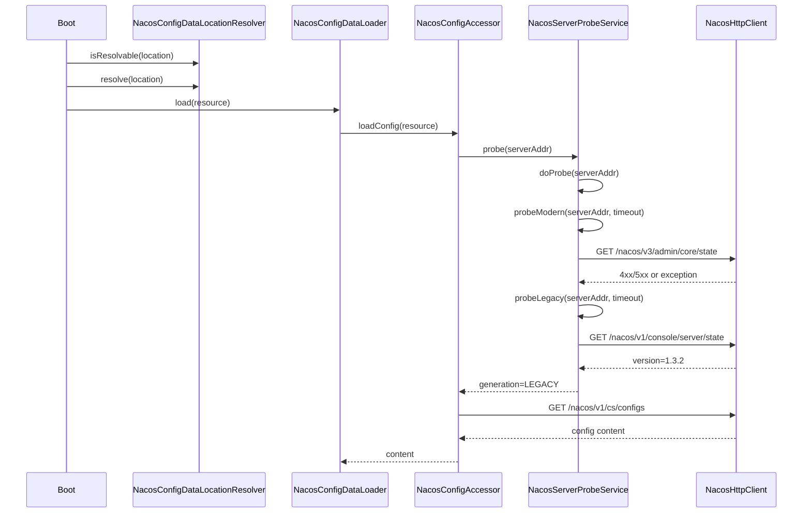

读图说明：`AUTO -> LEGACY` 的关键不是“直接走 legacy”，而是先 modern 探测失败，再由 v1 state 判成 legacy。

## 时序图 2：Boot 启动读取配置，`AUTO -> MODERN via v1 state fallback`

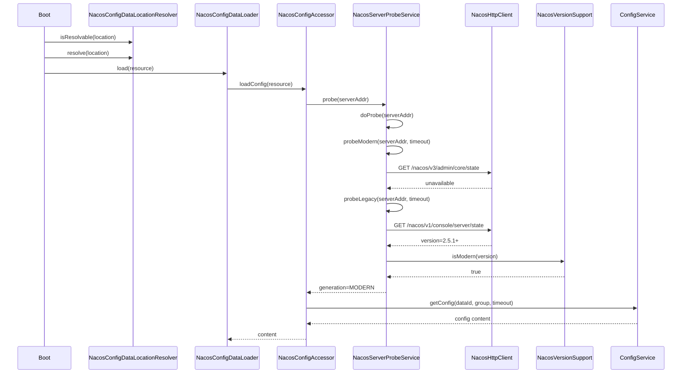

读图说明：这是“v3 state 不可达，但 v1 state 仍可把版本判成 modern”的路径。当前代码对 `2.5.1+` 使用这个兜底判定。

## 时序图 3：Boot 启动读取配置，`AUTO -> MODERN via v3 state`

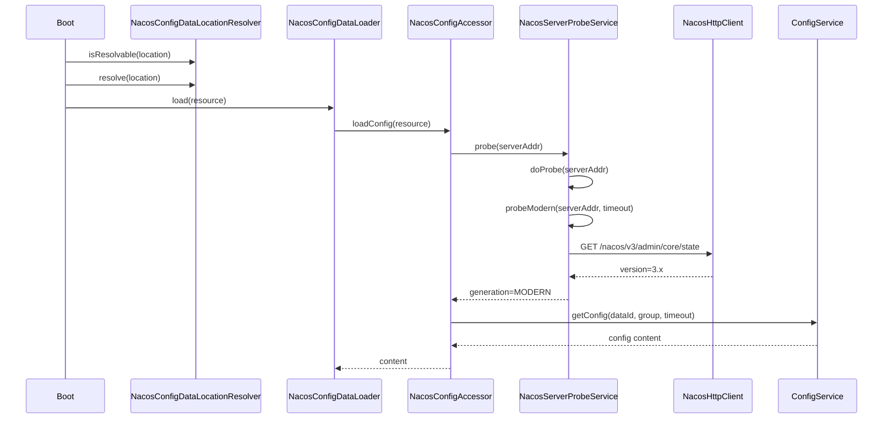

读图说明：这是 modern 正常直达路径，`NacosConfigAccessor` 直接转入 `ConfigService`。

## 时序图 4：服务启动注册，`LEGACY`

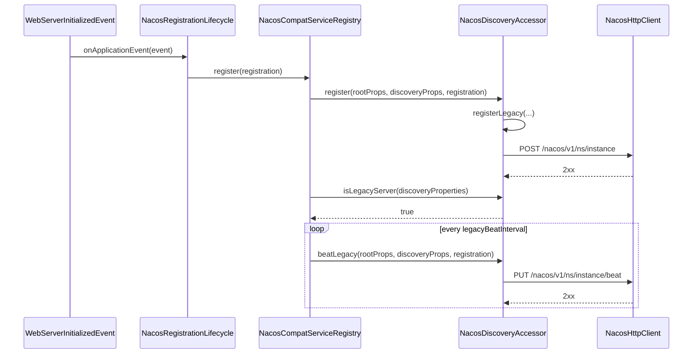

读图说明：legacy 注册不是一次性操作，`ephemeral=true` 时还会启动本地心跳线程。

## 时序图 5：服务启动注册，`MODERN`

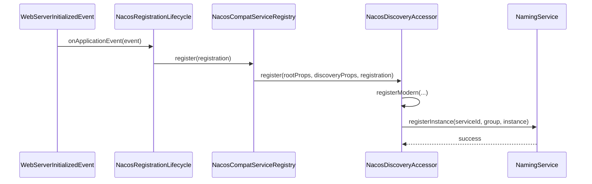

读图说明：modern 注册完全走 SDK，不启动本地 legacy 心跳线程。

## 时序图 6：运行期配置刷新

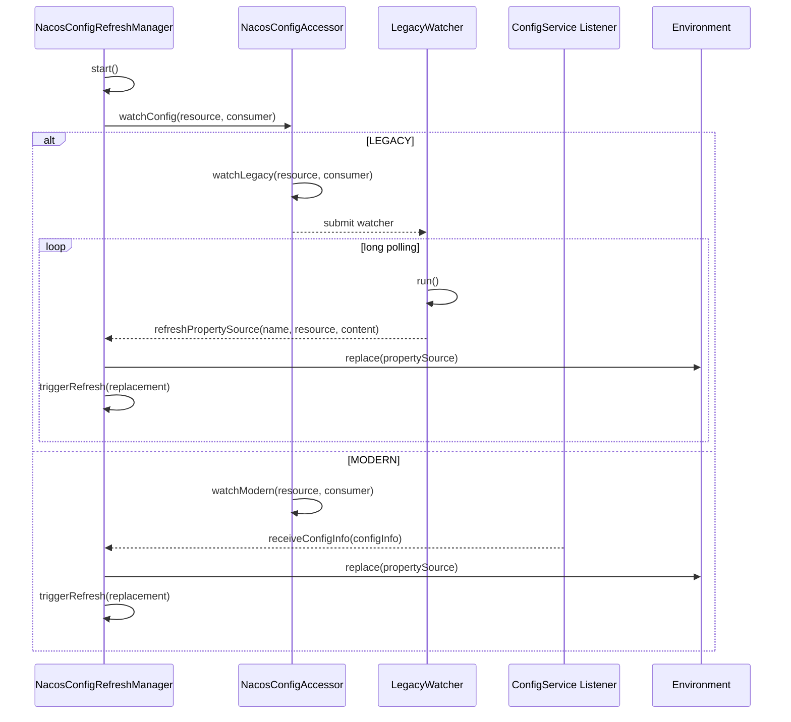

读图说明：refresh 入口统一在 `NacosConfigRefreshManager`，差别只在于 `watchConfig()` 内部使用的监听机制不同。

## 时序图 7：gateway 请求选实例与路由刷新

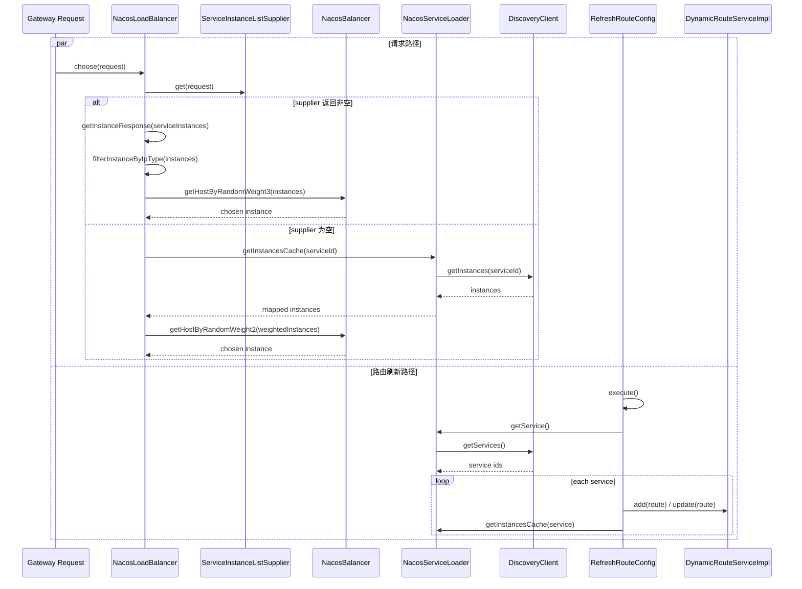

读图说明：gateway 的两条核心链路分别是“请求时选实例”和“后台定时同步路由”，两者都依赖 `NacosServiceLoader`。

## 生效时机矩阵

| 类/模块 | 角色 | 触发时机 | 激活条件 | 核心方法 | 上下游依赖 |
| --- | --- | --- | --- | --- | --- |
| `platform-starter-config` | 空 façade | 依赖收敛阶段 | 只要业务模块引入 starter | 无 | 下游到 `studio-nacos-compat-core` |
| `NacosConfigDataLocationResolver` | `nacos:` 位置解析器 | 启动前配置解析 | `spring.config.import` 存在 `nacos:` | `isResolvable()` `resolve()` | 上游 `spring.config.import`；下游 `NacosConfigDataLoader` |
| `NacosConfigDataLoader` | ConfigData 加载器 | 启动前配置解析 | Resolver 产出 `NacosConfigDataResource` | `load()` | 上游 Resolver；下游 `NacosConfigAccessor` |
| `NacosConfigRefreshAutoConfiguration` | 配置刷新 Bean 装配入口 | 自动装配阶段 | compat core 在类路径 | `nacosConfigAccessor()` `nacosConfigRefreshManager()` | 下游 `NacosConfigRefreshManager` |
| `NacosConfigRefreshManager` | 运行期配置监听与刷新 | Bean 初始化后 | `spring.cloud.nacos.config.enabled=true` | `start()` `refreshPropertySource()` `triggerRefresh()` | 上游 `NacosConfigAccessor`；下游 `Environment` / `ContextRefresher` |
| `NacosCompatDiscoveryAutoConfiguration` | 服务发现 Bean 装配入口 | 自动装配阶段 | `spring.cloud.nacos.discovery.enabled=true` | `nacosDiscoveryAccessor()` `nacosCompatServiceRegistry()` | 下游 `ServiceRegistry` / `DiscoveryClient` |
| `NacosRegistrationLifecycle` | 应用启动注册触发器 | Web 容器端口就绪 | Web 应用 + discovery enabled + registerEnabled | `onApplicationEvent()` `stop()` | 上游 `WebServerInitializedEvent`；下游 `ServiceRegistry` |
| `NacosCompatServiceRegistry` | Spring Cloud 注册适配器 | 注册 / 注销阶段 | discovery 自动装配完成 | `register()` `deregister()` `close()` | 上游 `NacosRegistrationLifecycle`；下游 `NacosDiscoveryAccessor` |
| `NacosCompatDiscoveryClient` | 同步发现客户端 | 请求服务目录 / 实例时 | discovery 自动装配完成 | `getInstances()` `getServices()` | 下游 `NacosDiscoveryAccessor` |
| `NacosCompatReactiveDiscoveryClient` | 响应式发现客户端 | Reactive 发现时 | discovery 自动装配完成 | `getInstances()` `getServices()` | 包装 `NacosCompatDiscoveryClient` |
| `platform-starter-discovery` | 可选自定义增强 | 依赖收敛阶段 | 业务模块引入 starter | 无自动装配入口 | 下游 `CustomerLoadBalancer*` / `ClusterFeignClient` |
| `EnableCustomerLoadBalancer` | 显式启用开关 | 应用主类解析注解时 | 应用类显式声明注解 | `@Import(CustomerLoadBalancerConfig.class)` | 下游 `CustomerLoadBalancerConfig` |
| `CustomerLoadBalancerConfig` | 自定义 LB 总装配 | Spring 配置类解析 | 显式加注解 | 配置类本身 | 下游 `CustomerLoadBalancerLazyConfig` |
| `CustomerLoadBalancer` | 项目自定义负载均衡器 | Feign / LB 选实例时 | 显式加注解且命中 Spring Cloud LoadBalancer | `choose()` `resolveClusterInstance()` `resolveConfiguredInstance()` | 上游 `LoadBalancerClientFactory`；下游 `ClusterFeignClient` |
| `ClusterFeignClient` | 远程查询集群实例信息 | 自定义 LB 命中 `clusterName` 头时 | 被 Feign 扫描到 | `getClusterInfoByName()` | 上游 `CustomerLoadBalancer`；下游 `data-base-api` |
| `NacosLoadBalancerConfig` | gateway 专用 LB 配置 | gateway Bean 装配 | `gateway-service` 启动 | `reactorServiceInstanceLoadBalancer()` | 下游 `NacosLoadBalancer` |
| `NacosLoadBalancer` | gateway 实例选择器 | 请求转发时 | gateway 启动 | `choose()` `getInstanceResponse()` `filterInstanceByIpType()` | 上游 `ServiceInstanceListSupplier`；下游 `NacosBalancer` / `NacosServiceLoader` |
| `NacosServiceLoader` | gateway 服务目录与实例目录适配器 | 路由构建 / 路由刷新 / 选实例兜底 | gateway 启动 | `getService()` `getInstancesCache()` `getInstances()` | 上游 `DiscoveryClient`；下游 `RouteConfig` / `RefreshRouteConfig` / `NacosLoadBalancer` |
| `RouteConfig` | gateway 初始动态路由构建 | `RouteLocator` 创建时 | gateway 启动 | `routeLocator()` | 上游 `NacosServiceLoader`；下游 Spring Gateway |
| `RefreshRouteConfig` | gateway 周期性动态路由刷新 | 定时任务触发 | gateway 启动 + `@Scheduled` 生效 | `execute()` | 上游 `NacosServiceLoader`；下游 `DynamicRouteServiceImpl` |

## 类职责总表

### `studio-nacos-compat-core/config`

| 类 | 角色 | 关键方法/字段 | 备注 |
| --- | --- | --- | --- |
| `NacosCompatConfigPropertySource` | 保存 Nacos 原始配置内容和解析后的属性 | `getResource()` `getRawContent()` `getMd5()` | 被 `Environment` 持有，供刷新替换 |
| `NacosConfigAccessor` | 配置读取与监听统一入口 | `loadConfig()` `watchConfig()` `loadModernConfig()` `loadLegacyConfig()` `watchModern()` `watchLegacy()` | 先判代，再切换 legacy HTTP / modern SDK |
| `NacosConfigContentSupport` | 文本配置转 Spring 属性映射 | `load()` | 支持 `yaml/yml/properties` |
| `NacosConfigDataLoader` | Boot ConfigData 加载器 | `load()` | 启动前临时创建 HTTP / probe / accessor 组件 |
| `NacosConfigDataLocationResolver` | 解析 `nacos:` 导入项 | `isResolvable()` `resolve()` `addResource()` | 负责合并 import、sharedConfigs、extensionConfigs |
| `NacosConfigDataResource` | 单个 Nacos 配置项的运行时描述 | `serverAddr` `dataId` `group` `compatMode` `refreshEnabled` | 既用于启动加载，也用于刷新监听 |
| `NacosConfigRefreshAutoConfiguration` | 刷新链自动装配入口 | `nacosCompatHttpClient()` `nacosLegacyAuthService()` `nacosServerProbeService()` `nacosConfigAccessor()` | 不负责 Resolver / Loader 注册 |
| `NacosConfigRefreshManager` | 配置变更监听与触发刷新 | `start()` `refreshPropertySource()` `triggerRefresh()` `destroy()` | legacy 走长轮询线程，modern 走 SDK Listener |

### `studio-nacos-compat-core/discovery`

| 类 | 角色 | 关键方法/字段 | 备注 |
| --- | --- | --- | --- |
| `NacosCompatDiscoveryAutoConfiguration` | 发现链自动装配入口 | `nacosDiscoveryAccessor()` `nacosCompatServiceRegistry()` `nacosCompatDiscoveryClient()` `nacosRegistrationLifecycle()` | discovery 主装配点 |
| `NacosCompatDiscoveryClient` | 同步服务发现客户端 | `description()` `getInstances()` `getServices()` | 供 `DiscoveryClient` 调用方使用 |
| `NacosCompatReactiveDiscoveryClient` | 响应式服务发现客户端 | `description()` `getInstances()` `getServices()` | 包装同步客户端 |
| `NacosCompatServiceRegistry` | Spring Cloud 注册器适配 | `register()` `deregister()` `close()` | legacy 临时心跳线程由这里维护 |
| `NacosDiscoveryAccessor` | 发现、注册、注销统一访问层 | `getInstances()` `getServices()` `register()` `deregister()` `beatLegacy()` | 发现链核心内核 |
| `NacosRegistration` | 注册信息载体 | `namespace` `group` `clusterName` `weight` `ephemeral` | 继承 `DefaultServiceInstance` |
| `NacosRegistrationLifecycle` | 监听端口就绪并注册 | `onApplicationEvent()` `getRegistration()` `stop()` | 负责把 `Environment` 和端口组装成 `NacosRegistration` |

### `studio-nacos-compat-core/http`

| 类 | 角色 | 关键方法/字段 | 备注 |
| --- | --- | --- | --- |
| `NacosHttpClient` | legacy HTTP 访问器 | `get()` `postForm()` `putForm()` `delete()` | 基于 JDK `HttpClient` |
| `NacosHttpResponse` | HTTP 响应值对象 | `statusCode` `body` `is2xxSuccessful()` | 给 probe、legacy config、legacy discovery 共用 |
| `NacosLegacyAuthService` | legacy 登录令牌缓存 | `getAccessToken()` | 调用 `/nacos/v1/auth/login` |

### `studio-nacos-compat-core/model`

| 类 | 角色 | 关键方法/字段 | 备注 |
| --- | --- | --- | --- |
| `NacosCompatMode` | 兼容模式枚举 | `AUTO` `LEGACY` `MODERN` | 来源于 `platform.nacos.compat.mode` |
| `NacosConfigDescriptor` | 配置描述值对象 | `dataId` `group` `namespace` `fileExtension` `refreshEnabled` `optional` | 当前主链路未直接引用 |
| `NacosServerGeneration` | 服务端代际枚举 | `LEGACY` `MODERN` | probe 结果归一化 |
| `NacosServerInfo` | 探测结果值对象 | `generation` `version` `stateEndpoint` `baseServerAddress` | 给配置链和发现链共用 |

### `studio-nacos-compat-core/props`

| 类 | 角色 | 关键方法/字段 | 备注 |
| --- | --- | --- | --- |
| `NacosCompatProperties` | compat 自定义配置属性 | `mode` `probeTimeout` `logProbeDetail` `configReadTimeout` `legacyLongPollingTimeout` `legacyBeatInterval` | 当前默认 `AUTO + 3s + true + 30s + 5s` |
| `NacosConfigProperties` | `spring.cloud.nacos.config.*` 属性绑定 | `enabled` `serverAddr` `namespace` `group` `sharedConfigs` `extensionConfigs` | 供 Resolver、Loader、Refresh 使用 |
| `NacosConfigProperties.ConfigItem` | 共享 / 扩展配置项 | `dataId` `group` `namespace` `refresh` | 被 `sharedConfigs` / `extensionConfigs` 使用 |
| `NacosConfigProperties.ImportCheck` | import-check 子属性 | `enabled` | 保留和业务配置面一致 |
| `NacosDiscoveryProperties` | `spring.cloud.nacos.discovery.*` 属性绑定 | `serverAddr` `namespace` `group` `clusterName` `service` `ip` `metadata` | 供注册和发现链使用 |
| `NacosRootProperties` | `spring.cloud.nacos.*` 根认证属性 | `username` `password` | 供 config / discovery 共用 |

### `studio-nacos-compat-core/support`

| 类 | 角色 | 关键方法/字段 | 备注 |
| --- | --- | --- | --- |
| `NacosClientManager` | modern SDK 客户端缓存工厂 | `getNamingService()` `getConfigService()` | 按 `serverAddr + namespace + username` 缓存 |
| `NacosJsonSupport` | JSON 解析工具 | `readTree()` `findText()` | 给 probe、legacy auth、legacy discovery 共用 |
| `NacosMd5Support` | MD5 工具 | `md5()` | legacy 配置监听对比使用 |
| `NacosServerProbeService` | 服务端代际探测器 | `probe()` `doProbe()` `probeModern()` `probeLegacy()` `describe()` | `AUTO` 判代核心 |
| `NacosUrlSupport` | 地址归一化与 URL 构造 | `normalizeServerAddress()` `build()` `urlEncode()` | legacy HTTP 调用共用 |
| `NacosVersionSupport` | 版本比较工具 | `compare()` `isModern()` | 当前 `>= 2.5.1` 视为 modern |

### `platform-starter-discovery/com.alibaba.cloud.nacos.customer.*`

| 类 | 角色 | 关键方法/字段 | 备注 |
| --- | --- | --- | --- |
| `EnableCustomerLoadBalancer` | 显式启用注解 | `@Import(CustomerLoadBalancerConfig.class)` | 不自动生效 |
| `CustomerLoadBalancer` | 项目自定义 LB 实现 | `choose()` `resolveClusterInstance()` `resolveConfiguredInstance()` | 优先按请求头 `clusterName` 或静态配置选实例 |
| `CustomerLoadBalancerConfig` | 自定义 LB 主配置类 | `@LoadBalancerClients(defaultConfiguration=...)` | 通过注解导入 |
| `CustomerLoadBalancerLazyConfig` | 延迟创建 LB Bean | `reactorServiceInstanceLoadBalancer()` | 为每个服务名创建 `CustomerLoadBalancer` |
| `CustomerLoadBalancerProperties` | 自定义 LB 静态实例配置 | `services` | 绑定 `load-balancer.*` |
| `CustomerLoadBalancerProperties.CustomerServiceInstance` | 静态实例对象 | `getUri()` | 支持 `path` 拼接 |

### `platform-starter-discovery/com.syy.datacenter.feign.platform.dfs.ClusterFeignClient`

| 类 | 角色 | 关键方法/字段 | 备注 |
| --- | --- | --- | --- |
| `ClusterFeignClient` | 查询集群实例的 Feign 接口 | `getClusterInfoByName()` | 自定义 LB 的上游依赖，不属于 compat core 协议兼容职责 |

### `gateway-service` Nacos 适配相关类

| 类 | 角色 | 关键方法/字段 | 备注 |
| --- | --- | --- | --- |
| `NacosServiceLoader` | 把 `DiscoveryClient` 结果转成 gateway 需要的服务目录 / 实例目录 | `getService()` `getInstancesCache()` `getInstances()` `toMap()` | 有 10 秒 Caffeine 缓存 |
| `RefreshRouteConfig` | 周期性刷新动态路由 | `execute()` | 每 10 秒同步一次服务目录 |
| `DynamicRouteServiceImpl` | 动态路由写入器 | `add()` `update()` `delete()` | 给 `RefreshRouteConfig` 调用 |
| `NacosLoadBalancer` | gateway 运行时选实例 | `init()` `choose()` `getInstanceResponse()` `filterInstanceByIpType()` | 优先用 supplier，空时回退 `NacosServiceLoader` |
| `NacosBalancer` | 权重 + IPv6 选择算法工具 | `getHostByRandomWeight2()` `getHostByRandomWeight3()` | 被 `NacosLoadBalancer` 调用 |
| `NacosLoadBalancerConfig` | gateway 专用 LoadBalancer Bean 配置 | `reactorServiceInstanceLoadBalancer()` | 默认生效，不依赖 `@EnableCustomerLoadBalancer` |
| `RouteConfig` | 初始动态路由构建 | `routeLocator()` `normalizePath()` | 首次启动时按服务目录建路由 |

## 当前最终代码结论

1. `platform-starter-config` 当前没有运行时代码。  
   它只是依赖名 façade，真正逻辑全部在 `studio-nacos-compat-core`。

2. `platform-starter-discovery` 当前不承载 Nacos discovery 主逻辑。  
   它只承载可选的 `CustomerLoadBalancer` 增强和 `ClusterFeignClient`。

3. `EnableCustomerLoadBalancer` 不是自动生效。  
   只有应用主类显式加注解才会生效。当前仓库内已显式启用它的应用有：
   - `platform-data-base-info-service`
   - `platform-data-fusion-service`

4. `gateway-service` 默认并不依赖 `@EnableCustomerLoadBalancer`。  
   它走的是自己的 `NacosLoadBalancerConfig -> NacosLoadBalancer -> NacosServiceLoader -> DiscoveryClient` 链路。

5. `ClusterFeignClient` 是项目自定义扩展，不属于 compat core 的协议兼容职责。  
   它只服务于 `CustomerLoadBalancer` 的集群实例定向能力。

6. compat core 的两个真正入口是分开的：  
   - 启动前配置解析：`spring.factories`
   - Bean 自动装配：`AutoConfiguration.imports`

7. 当前仓库未检索到显式 `platform.nacos.compat.*` 或 `load-balancer.services.*` 配置。  
   实际运行使用的是代码默认值；自定义 LB 是否生效，只取决于应用是否显式加了 `@EnableCustomerLoadBalancer`。
