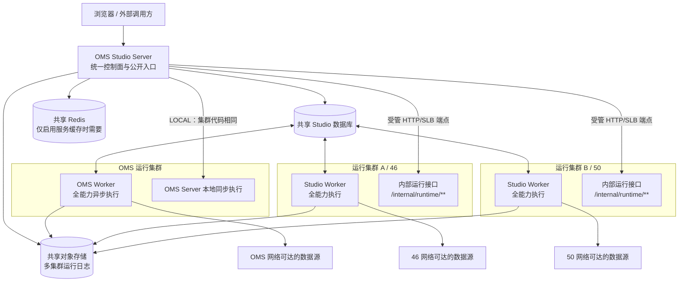
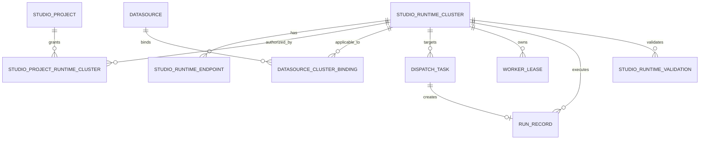
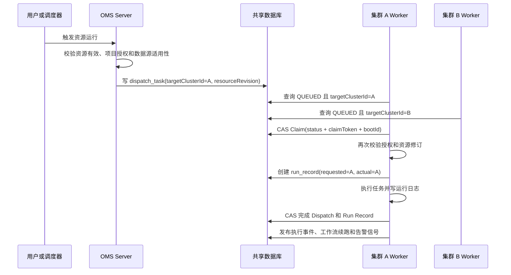
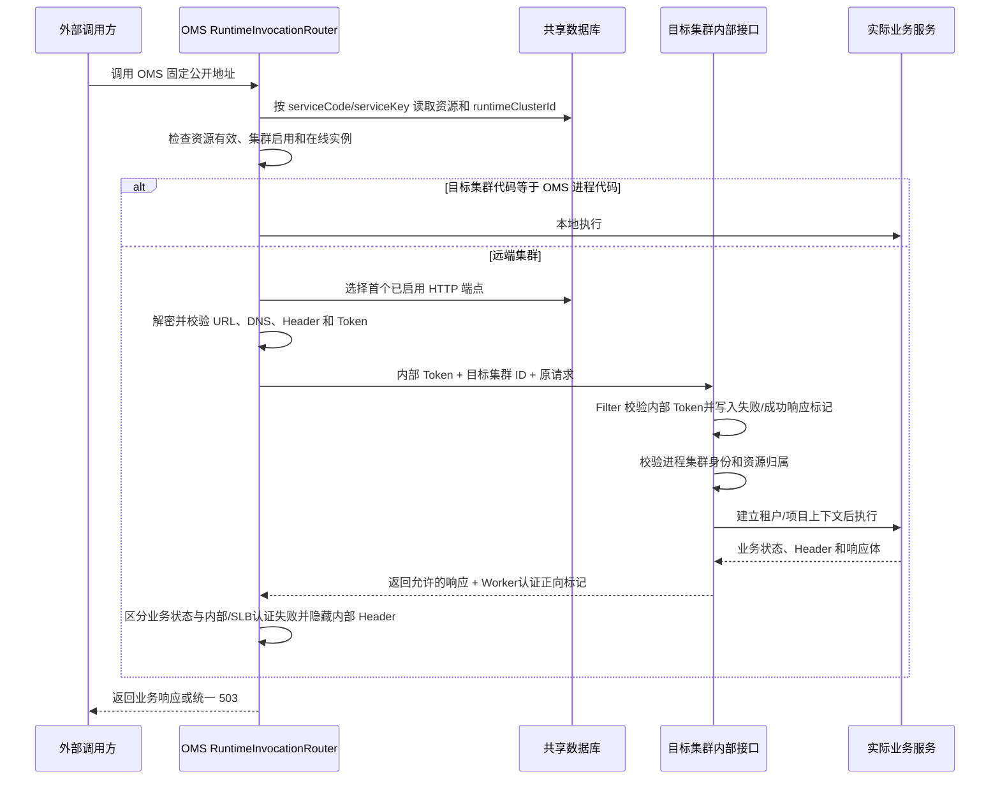

# Studio 可配置多集群运行架构

> **注意：本文件是 P0-MC-01 的历史架构基线，仅用于还原当时的实现与验收状态。** 当前架构以 [P0-MC-02 统一 Worker 执行面与纯控制面计划](../规划/studio-worker-only-execution-plane-plan-20260721.md)为准：Server 不再本地执行、不加载插件，所有运行集群统一通过 Worker HTTP/SLB 端点承担数据面能力，正常部署不再使用 `LOCAL` 执行端点或 `LEGACY/ENFORCED` 模式。本文后续出现的“当前”、`LOCAL`、自动启动回填和模式切换均指 2026-07-21 的历史快照，尤其第 15、20、21 节不能作为现行部署、升级或验收步骤执行。

- **对应计划：** `P0-MC-01`
- **架构状态：** 已完成主体实现，仍处于“实现中（待最终验证）”
- **整理日期：** 2026-07-21
- **适用对象：** 产品、架构、后端、前端、测试、部署和运维人员

## 0. P0-MC-02 现行收口状态

截至 2026-07-23，现行架构已完成本地代码和验收收口：Server 公开数据面入口无本地回退，最终可执行包不携带 DataAggregation Core、插件加载器、数据源处理器或 `studio-flink`；Worker 包保留完整执行构件。缺少项目授权、数据源绑定或运行失效状态依赖时，运行守门统一失败关闭。

- 最新根 POM 默认 Surefire 全量为 `1123/1123`，失败 `0`、错误 `0`、跳过 `0`。
- 一次性 MySQL 8.0.21 环境中的完整 `RealWebServiceOpenApiIT` 为 `5/5`、跳过 `0`，数据服务真实查询和数据接入真实写入均已通过。
- 本地单集群、多 Worker SLB、多运行集群、停机恢复、真实 MinIO、浏览器大型编辑器和日志/统计/告警单写均已验证。
- Codex Goal 仍为 `active`，仅等待目标生产网络/SLB、生产对象存储和 Desktop 登录后交互验收。

本文件后续的 `880` 项测试、外部数据库待恢复、Server 本地执行、`LOCAL` 端点和 `LEGACY/ENFORCED` 等表述均是 P0-MC-01 历史快照，不代表现行状态。

## 1. 架构结论

当前 Studio 的多集群方案不是把系统拆成能力不同的“采集集群、服务集群、质量集群”，而是采用：

> **OMS 统一控制面 + 若干全能力执行集群 + 共享元数据与运行状态。**

所有执行集群部署相同的 Studio Worker 和 DataAggregation 执行能力。集群之间的业务差异只代表网络位置，以及该集群能够连接哪些数据源。OMS 所在集群也是普通运行集群，可以执行异步任务和同步服务。

当前方案的核心路由依据是 `runtimeClusterId`：

- 数据源保存“适用集群”多选集合。
- 任务、脚本、工作流和服务保存一个“运行集群”。
- 异步任务把运行集群固化为 `dispatch_task.target_cluster_id`。
- Worker 只领取目标为自身集群的任务。
- 同步服务始终从 OMS 对外暴露，再由 OMS 本地执行或代理到目标集群。
- 运行记录、访问日志、告警证据同时记录请求集群和实际集群。

## 2. 设计目标与边界

### 2.1 已实现的目标

1. 浏览器、开放 API、配置管理、调度入口、统计查询仍只访问 OMS。
2. OMS、46、50 以及后续新增集群均可作为完整执行集群。
3. 集群、内部端点和项目授权由运行集群管理模块维护，不写死在配置文件中。
4. 数据源由管理员人工维护适用集群，不根据健康探测自动增删。
5. 资源先选择运行集群，再选择该集群可用的数据源、模型和关联资源。
6. 异步执行通过共享数据库定向 Claim，不需要 OMS 主动调用 Worker 执行任务。
7. 数据服务、数据接入和协议转换通过 OMS 的统一同步路由器执行本地或 HTTP/SLB 转发。
8. 保持单集群安装兼容，允许从历史无集群字段的数据平滑升级。

### 2.2 首版明确不做

- 不配置“某集群只能执行某类任务”的能力矩阵。
- 不实现自动故障转移、按比例流量、跨集群并行或多活调度。
- 不实现工作流节点级跨集群；一个工作流运行只属于一个运行集群。
- 不根据数据源探测结果自动改变适用集群。
- 不把 `workerGroupCode` 继续作为跨集群路由条件，它只保留为集群内部技术池。
- 不实现跨 Nacos 集群服务发现；首版只支持 `LOCAL` 和受管 `HTTP/SLB` 端点。

## 3. 总体拓扑

## 4. 三个逻辑平面

| 平面 | 主要组件 | 当前职责 |
|---|---|---|
| 控制面 | OMS Server、Web、Controller、调度入口 | 登录与权限、集群管理、项目授权、数据源和资源配置、公开 API、调度触发、统计与运维查询。 |
| 执行面 | 各集群 Studio Worker、OMS 本地同步服务、内部运行接口 | 异步任务领取与执行，数据源探测，数据服务/接入/协议转换的实际同步执行。 |
| 共享状态面 | MySQL/SQLite、对象存储、可选 Redis | 保存配置、Dispatch、Lease、Run Record、访问日志、健康状态和校验结果；保存跨集群可读取的运行日志和共享缓存。 |

OMS 是唯一控制面，但不是唯一执行位置。运行集群的定义来自数据库，进程配置只保留最小身份 `STUDIO_CLUSTER_CODE`。

## 5. 核心身份与路由维度

| 维度 | 含义 | 主要用途 |
|---|---|---|
| `tenantId` | 租户边界 | 集群、端点、授权、绑定、资源和运行数据的第一层隔离。 |
| `projectId` | 项目边界 | 决定项目可以使用哪些集群，以及用户能否查看和操作资源。 |
| `runtimeClusterId` | 控制面中的运行集群主键 | 资源保存、数据源过滤、同步路由和运维展示的统一标识。 |
| `runtimeClusterCode` | 部署进程身份 | 与 `STUDIO_CLUSTER_CODE` 比较，确认进程是否属于目标集群。 |
| `targetClusterId` | Dispatch 目标集群 | 异步 Worker Claim 的硬路由条件。 |
| `requestedClusterId` | 本次运行或调用期望的集群 | 运行记录、访问日志、告警和排障。 |
| `actualClusterId` | 真正执行的集群 | 检查误路由、统计集群负载和定位执行环境。 |
| `instanceId + bootId` | Worker 实例和启动批次 | 防止旧进程或重启前实例覆盖新执行结果。 |

## 6. 数据模型

### 6.1 新增核心表

| 表 | 关键字段 | 职责 |
|---|---|---|
| `studio_runtime_cluster` | `tenant_id/code/name/enabled/status/version/last_heartbeat_at/instances_json` | 运行集群登记、启停、状态和实例摘要。租户内集群编码唯一，创建后编码不可修改。 |
| `studio_runtime_endpoint` | `runtime_cluster_id/mode/endpoint_ciphertext/headers_ciphertext/token_ciphertext/timeout/enabled` | 保存 `LOCAL/HTTP` 端点。URL、Header 值和 Token 加密保存，查询只返回脱敏摘要。 |
| `studio_project_runtime_cluster` | `project_id/runtime_cluster_id/enabled/preferred/allow_manual_override` | 项目集群授权、首选集群和手动运行覆盖许可。 |
| `datasource_cluster_binding` | `datasource_id/runtime_cluster_id/enabled` | 数据源和适用集群的多对多人工绑定。 |
| `studio_runtime_validation` | `resource_type/resource_id/runtime_cluster_id/valid/issue_code/issue_message/details_json` | 保存资源因集群、授权或数据源绑定变化产生的运行配置失效状态。 |

### 6.2 扩展的原有表

| 数据对象 | 新增或强化字段 | 说明 |
|---|---|---|
| 数据源健康、测试历史 | `runtime_cluster_id` | 同一连接指纹允许在 A 集群可用、B 集群不可用。 |
| 模型同步任务 | `runtime_cluster_id` | 模型发现和同步必须明确在哪个集群访问数据源。 |
| 采集、质量、工作流、工作流版本、数据脚本 | `runtime_cluster_id` | 异步资源保存固定运行集群。 |
| 数据服务、数据接入、协议转换 | `runtime_cluster_id` | 同步资源保存固定运行集群。 |
| `dispatch_task` | `target_cluster_id/resource_revision/claim_token/worker_boot_id` | 固化路由和资源版本，并支撑并发 Claim 与重启防覆盖。 |
| `worker_lease` | `runtime_cluster_id/runtime_cluster_code/instance_id/boot_id` | 标识 Worker 属于哪个运行集群和哪个启动批次。 |
| `run_record` | `requested_cluster_id/actual_cluster_id/actual_cluster_code/worker_instance_id/worker_boot_id` | 保存目标与实际执行位置。 |
| 三类访问日志 | `requested_cluster_id/actual_cluster_id` | 数据服务、接入和协议转换的集群归属。 |
| 告警实例 | `requested_cluster_id/actual_cluster_id` | 告警详情和证据关联目标、实际集群。 |

### 6.3 数据完整性边界

多集群新增关系没有数据库外键，和 Studio 现有分布式 ID、逻辑删除及滚动升级策略保持一致。引用完整性依赖领域 Service、统一校验和 `RuntimeClusterReferenceRepository`；直接修改数据库不会自动触发资源重新校验。

项目首选集群由 `RuntimeClusterService` 在事务内先清除其它首选再保存，但数据库没有“每项目最多一个首选集群”的唯一约束。正常管理接口可以维持单首选，并发管理员同时写入时仍存在理论竞争，需要后续通过锁、版本或约束进一步收紧。

## 7. 运行集群管理

### 7.1 集群登记

`RuntimeClusterService` 负责集群、端点和项目授权：

- 集群代码保存时统一规范化，租户内唯一，创建后不可修改。
- 集群可以启用、停用；停用后不能继续作为资源运行目标。
- 删除前必须停用，并确认没有在线心跳、启用端点、启用项目授权、数据源绑定、活动 Dispatch 或其它阻塞引用。
- OMS 也需要登记为一条普通运行集群记录，才能和其它集群使用同一套授权与校验逻辑。

### 7.2 实例与心跳

Worker 每 5 秒维护 `worker_lease` 和运行集群心跳：

1. 用进程的 `STUDIO_CLUSTER_CODE` 查找租户下已登记且启用的集群。
2. 写入 `runtimeClusterId/runtimeClusterCode/instanceId/bootId`。
3. 上报版本、插件指纹、主机、Pod、Node、Worker API 地址等摘要。
4. OMS 的状态刷新任务根据心跳时间汇总 `ONLINE/OFFLINE/UNKNOWN` 和实例列表。

在 `ENFORCED` 模式下，进程身份未登记、集群已禁用或编码不匹配时，Worker 会停止领取任务并把当前 Lease 标为离线。

### 7.3 管理权限

运行集群、实例、端点和项目授权管理只允许 `SUPER_ADMIN` 或 `TENANT_ADMIN`。Web 路由和后端 `RuntimeClusterService.requireManage()` 同时校验，项目管理员和普通成员不能维护集群或读取端点秘密摘要。

普通业务资源仍按现有项目角色使用已授权集群选项；集群管理权限和资源运行权限是两套不同边界。

## 8. 项目授权

项目是否可使用某个集群由 `studio_project_runtime_cluster` 决定：

- `enabled`：项目是否允许使用该集群。
- `preferred`：资源新建时建议选中的集群，一个项目应只有一个首选。
- `allow_manual_override`：手动执行时是否允许临时覆盖资源保存的集群。

授权不是只用于前端展示。保存资源、数据源选项、手动覆盖、Worker Claim 和实际执行前都会再次检查授权。

授权被撤销后的语义：

- 已完成历史运行保留。
- 资源会被重新校验并可能显示运行配置失效。
- 新的发布、调度、触发和同步调用被拒绝。
- 已经排队的定向任务被目标 Worker 扫描到时会转为失败，避免永远占据队头。

## 9. 数据源适用集群

### 9.1 人工适用范围

数据源创建时必须选择至少一个项目已授权集群，保存为 `datasource_cluster_binding`。这一绑定代表管理员确认的网络边界，而不是健康检查结论。

健康状态和适用绑定彼此独立：

- 绑定回答“允许在哪些集群使用”。
- 健康状态回答“最近一次在该集群是否连接成功”。
- `UNAVAILABLE` 不会自动移除绑定。
- 没有在线实例执行探测时记录 `UNKNOWN`，不等同于连接失败。

### 9.2 集群维度的数据源能力执行

以下操作都要求显式 `runtimeClusterId`：

- 连接测试与定时探测。
- 模型发现、发现选项和模型同步。
- 数据预览和 SQL 查询。
- 运行时连接信息补全和物理定位解析。

目标不是 OMS 时，OMS 通过 `InternalDatasourceProbeController` 调用目标 Worker 的：

- `/internal/runtime/datasource/probe`
- `/internal/runtime/datasource/discover`
- `/internal/runtime/datasource/discover-options`
- `/internal/runtime/datasource/hydrate`
- `/internal/runtime/datasource/preview`
- `/internal/runtime/datasource/query`

Worker 同时校验内部 Token 和目标集群代码，不能代替其它集群执行探测。

### 9.3 绑定移除和资源失效

移除数据源适用集群前，`RuntimeValidationService` 会扫描受影响的：

- 采集任务的来源和目标绑定。
- 质量任务数据源。
- 工作流当前版本引用的采集、质量、脚本及其数据源。
- SQL/Flink SQL 脚本引用的数据源或模型底层数据源。
- 数据服务、数据接入和协议转换。

用户确认移除后：

1. 数据源绑定被软停用。
2. 受影响资源写入 `studio_runtime_validation`。
3. 列表和详情返回 `runtimeValid=false` 与原因。
4. 资源仍可编辑，但不能发布、启用调度、手动运行或接受新的同步调用。
5. 重新绑定数据源或修改资源运行集群后重新校验，满足条件时恢复有效。

## 10. 资源编辑与统一校验

### 10.1 前端级联逻辑

Web 编辑器统一复用 `useRuntimeClusterOptions` 和 `useRuntimeClusterChangeGuard`：

1. 加载当前项目已授权、启用的集群。
2. 优先选择资源原集群，其次选择首选集群，只有一个集群时自动选中并隐藏或只读。
3. 未选择集群前，数据源、模型和关联任务选择器禁用。
4. 选择集群后，通过带 `runtimeClusterId` 的 options 接口加载可选数据。
5. 切换集群必须确认；取消时恢复原集群，不清理原表单。
6. 确认切换后，只清空与集群相关的数据源、模型、字段映射、SQL 预览和运行参数缓存，保留名称、说明和调度等字段。
7. 已绑定但后来失效的集群仍显示“已停用或未授权”，允许用户从表单中移除，但不能重新选择。

### 10.2 后端统一守卫

`RuntimeClusterSelectionService` 是保存和运行时的统一入口：

- 新资源即使在 `LEGACY` 模式也不能无集群保存。
- 历史未分配资源在 `LEGACY` 中可继续编辑，但不能借此创建新的空集群资源。
- 一旦资源已经选择集群，后续不能把集群清空。
- 校验项目授权，以及所有引用数据源是否适用于同一集群。
- 手动覆盖额外校验 `allow_manual_override`。
- 运行前检查 `studio_runtime_validation`，失效资源直接拒绝。

### 10.3 不同资源的约束

| 资源 | 当前集群规则 |
|---|---|
| 采集任务 | 全部来源和目标数据源必须适用于同一运行集群。 |
| 质量任务 | 质量数据源必须适用于运行集群。 |
| 数据脚本 | SQL 按集群过滤数据源；Flink SQL 校验模型底层数据源；Java/Python 无数据源时也必须保存集群。 |
| 工作流 | 整个工作流只有一个集群，只能绑定同集群采集、质量和脚本资源；下游节点继承 Workflow Run 的集群。 |
| 数据服务 | 服务数据源必须适用于服务运行集群。 |
| 数据接入 | 主数据源和来源绑定均必须适用于运行集群。 |
| 协议转换 | 目标数据源必须适用于运行集群。 |

## 11. 异步任务定向执行

适用于采集、质量、工作流节点和数据开发脚本等异步任务。

### 11.1 Dispatch 固化内容

- `target_cluster_id`：任务必须由哪个集群执行。
- `resource_revision`：触发时资源的稳定修订摘要。
- `claim_token`：本次 Claim 的随机令牌。
- `worker_instance_id/worker_boot_id`：执行实例和启动批次。
- Payload 只保存业务引用和运行参数，不保存解密后的数据源秘密。

### 11.2 Worker 领取规则

`WorkerLifecycleRunner`：

- 每 3 秒扫描队列，每次最多读取一小批最早任务。
- `ENFORCED` 只查询 `target_cluster_id` 属于自身集群的任务。
- `LEGACY` 还允许历史 `target_cluster_id IS NULL` 任务由兼容 Worker 处理。
- Claim 前检查项目授权；Claim 后、实际执行前再次检查。
- 资源修订或运行集群在触发过程中变化时拒绝静默执行最新配置。

### 11.3 并发和故障恢复

Claim、续租、运行记录关联、完成和失败使用状态、Claim Token、实例 ID 和 Boot ID 做 CAS。其目的包括：

- 两个同集群 Worker 不会同时成功领取同一任务。
- Worker 重启后，旧进程不能覆盖新进程结果。
- Dispatch 与 Run Record 关联失败时关闭孤立运行记录。
- Lease 超时后，恢复服务使用 Claim Token、Boot ID、实例和状态做 CAS，将过期 Dispatch 和关联的运行记录关闭为失败。
- 工作流后续节点使用原执行事件的 `requestedClusterId`，不会重新计算或漂移到其它集群。

`dispatch_task.attempts/max_retries` 当前已经保存，但尚没有通用的自动 requeue/retry 实现。普通执行失败和 stale recovery 都直接进入终态 `FAILED`；因此当前架构不应被理解为具备自动重试能力。

### 11.4 离线语义

- 目标集群离线时，异步任务继续保留在队列，不自动转移。
- 不再因为“任意 Worker 在线”才允许入队。
- 集群恢复后，由目标集群 Worker 继续领取。
- 如果集群被永久停用且没有 Worker 继续扫描，其已有 `QUEUED` 任务不会自动失败；停用和删除集群前必须先排空或人工终止活动队列。

## 12. 同步服务远端执行

适用于数据服务、数据接入和协议转换的 REST、XML、SOAP、WSDL 和调试调用。

### 12.1 路由判断

`RuntimeInvocationRouter` 按以下顺序判断：

1. 根据服务编码和服务密钥找到资源及 `runtimeClusterId`。
2. `ENFORCED` 下资源没有集群则返回不可用；`LEGACY` 下历史空值暂按本地兼容。
3. 检查资源是否被 `studio_runtime_validation` 标记失效。
4. 检查集群存在、属于同租户且已启用。
5. 目标集群代码与 OMS 的 `STUDIO_CLUSTER_CODE` 相同则本地执行。
6. 远端集群必须存在在线实例。
7. 按 ID 升序选择第一条已启用 `HTTP` 端点。
8. 没有端点、内部认证缺失或网络不可达时返回 `503`。

首版不会在多端点之间做负载均衡、自动切换或重试。

### 12.2 内部执行接口

Worker 暴露的私有接口包括：

- `/internal/runtime/health`
- `/internal/runtime/{kind}/{serviceCode}/{serviceKey}`
- `/internal/runtime/debug/{kind}/{resourceId}`
- `/internal/runtime/datasource/**`

内部 Controller 会校验：

- `X-Studio-Internal-Token` 与部署 Token 一致。
- `X-Studio-Target-Cluster-Id` 对应的集群编码与当前进程 `STUDIO_CLUSTER_CODE` 一致。
- 服务资源本身保存的 `runtimeClusterId` 与目标集群一致。
- 资源租户与集群租户一致。

通过后才建立目标资源的租户和项目上下文，执行完成后恢复原线程上下文。

### 12.3 状态和日志语义

- 业务 JSON、XML、SOAP 状态和响应体尽量保持原样。
- 集群缺失、禁用、配置失效、无在线实例、无端点、连接失败和超时返回 `503`，不重试、不重定向，也不回退 OMS。
- 请求体超过上限返回 `413`。
- 远端响应超过上限返回 `502`。
- 访问日志只由实际执行集群写一次，OMS 代理层不重复写。
- 日志保存 `requestedClusterId` 和 `actualClusterId`。

内部认证与业务认证现在通过双向标记区分：Worker Filter 在内部 Token 校验失败时返回 `X-Studio-Internal-Error: INTERNAL_AUTHENTICATION`，通过校验后为 Worker 原生响应增加 `X-Studio-Runtime-Response: AUTHENTICATED`。OMS 将显式内部错误以及 SLB/网关返回的无正向标记 `401/403` 转换为 `503`，只对带 Worker 正向标记的数据服务、数据接入和协议转换业务 `401/403` 保留原状态和响应体；两类内部 Header 均不会向外部调用方透传。代码与定向测试已完成，仍待真实 HTTP 和生产切换验收。

## 13. 内部端点安全

### 13.1 秘密管理

- URL、Header 值和 Token 使用现有 `EncryptionService` 加密。
- 查询只返回脱敏 URL、Header 名称和是否存在 Token。
- 编辑时空值表示保留原秘密，显式 `clearToken` 才清除 Token。
- OMS 与需要解密配置的 Worker 必须使用相同 `STUDIO_ENCRYPTION_SECRET`。

### 13.2 SSRF 与网络限制

默认规则：

- 只允许 HTTPS。
- 拒绝回环、链路本地、私网、本机地址、组播、IPv6 过渡地址和云元数据地址。
- 内网 Worker 或 SLB 必须通过 `STUDIO_RUNTIME_ENDPOINT_ALLOWED_HOSTS` 精确放行。
- 白名单不支持通配符，也不能放行云元数据目标。
- 保存端点和每次调用都会重新解析地址。
- HTTP 客户端使用固定后的 DNS 结果，防止校验后 DNS 漂移。
- 禁止重定向和自动重试。

### 13.3 Header 隔离

代理层区分三类 Header：

1. Studio 内部认证 Header。
2. 端点或 SLB 的传输认证 Header/Token。
3. 原始业务请求 Header。

传输层 `Authorization`、Cookie 等不会作为业务 Header 再传给实际服务。共享 `RuntimeEndpointHeaderPolicy` 已用于 OMS 请求/响应转发、数据源 probe/discover/hydrate/preview/query、端点健康测试和 Worker 最终业务 Header 提取，统一过滤固定 hop-by-hop Header、`Connection` 动态声明的 Header、Host、长度 Header、任意 `X-Studio-*` 保留 Header，以及响应中的 `Set-Cookie` 和认证挑战。端点 Header 密文或 JSON 损坏时，健康测试与正式调用均失败关闭，不会静默丢弃 SLB 认证或路由 Header 后继续请求；端点测试只有收到 Worker 正向认证标记的 `2xx` 才记为成功，因此也会提前发现 SLB 剥离响应 Header 或返回默认页面的问题。

远端 `Location` 采用明确边界：指向 `/internal/**`、scheme-relative 地址、私网/本机/链路本地/元数据地址、受管端点同主机或解析到同一地址的别名，以及格式非法或无法解析的绝对地址均不向外返回；解析后仅包含公网地址的 HTTP/HTTPS 绝对地址和非内部相对地址继续保留。动态 hop-by-hop、端点测试策略一致性和 `Location` 边界均已补定向测试，仍需在重新部署的 OMS/Worker 上完成真实 HTTP 验收。

## 14. 观测、告警和排障

当前已把目标/实际集群扩展到：

- 运行记录和运行详情。
- Dispatch 队列。
- Worker Lease 和集群实例。
- 数据服务、接入、协议转换访问日志。
- 运维中心运行、队列、服务事件和日志事件。
- 告警实例、周期评估证据和规则目标。
- AI operation catalog 的查询和触发参数。

推荐排障顺序：

1. 查看资源保存的运行集群和 `runtimeValid`。
2. 查看项目对该集群的授权。
3. 查看所有依赖数据源是否仍绑定该集群。
4. 查看 `requestedClusterId/actualClusterId` 是否一致。
5. 异步任务查看目标集群 Worker Lease、Dispatch 状态、Claim Token 和 Boot ID。
6. 同步服务查看目标集群在线实例、HTTP 端点测试和内部认证。
7. 查看该集群维度的数据源健康，而不是只看数据源全局状态。

## 15. LEGACY 与 ENFORCED

> **已废弃验收路径：** 本节只解释 P0-MC-01 当时的双模式兼容设计。P0-MC-02 已删除正常运行模式分叉，现行版本只接受显式运行集群；不要在 Nacos、环境变量或发布脚本中重新配置这些模式。

| 行为 | `LEGACY` | `ENFORCED` |
|---|---|---|
| 历史资源 `runtimeClusterId=NULL` | 允许继续兼容运行或编辑。 | 保存、运行和同步服务拒绝。 |
| 新资源无运行集群 | 已拒绝。 | 已拒绝。 |
| Dispatch 无 `targetClusterId` | 兼容 Worker 可以领取历史任务。 | Worker 不查询、不领取。 |
| Worker 集群未登记 | 可保留有限历史兼容。 | 停止领取任务并标记离线。 |
| 默认内部 Token/加密密钥 | 可以启动，仅用于升级期。 | 启动安全校验直接拒绝。 |
| 单集群自动回填 | 仅 `DEFAULT-LOCAL` 且满足保护条件时执行。 | 不执行。 |

`RuntimeClusterSecurityValidator` 要求 `ENFORCED` 模式必须使用非默认的 `STUDIO_INTERNAL_API_TOKEN` 和 `STUDIO_ENCRYPTION_SECRET`。

## 16. 单集群兼容

单集群部署不要求用户理解多集群概念：

- 缺省集群使用 `DEFAULT-LOCAL`。
- 当项目只有一个已授权集群时，前端自动选中并隐藏或只读集群选择器。
- `LEGACY + DEFAULT-LOCAL` 可以为历史项目、数据源和空集群资源做幂等回填。
- 租户只要存在多个集群，或唯一集群不是有效的 `DEFAULT-LOCAL`，自动回填整体跳过。
- 自动回填不恢复管理员已经停用或逻辑删除的授权与绑定。

## 17. 主要公共接口

### 17.1 集群管理

- `GET/POST/DELETE /api/v1/runtime-clusters`
- `POST /api/v1/runtime-clusters/{id}/enable|disable`
- `GET /api/v1/runtime-clusters/{id}/instances`
- `GET /api/v1/runtime-clusters/{id}/endpoints`
- `POST /api/v1/runtime-clusters/endpoints`
- `POST /api/v1/runtime-clusters/endpoints/{id}/test`
- `GET/POST /api/v1/runtime-clusters/project-authorizations`
- `GET /api/v1/runtime-clusters/options`
- `POST /api/v1/runtime-clusters/validations/query`

### 17.2 数据源

- `DataSourceSaveRequest.applicableClusterIds`
- `GET /api/v1/datasources/options?runtimeClusterId=...`
- 数据源测试、探测、发现、预览、同步和查询接口均携带 `runtimeClusterId`
- 绑定移除前使用影响预览接口，并由用户确认后保存

### 17.3 资源与运行

采集、质量、工作流、脚本、数据服务、数据接入、协议转换的保存 DTO、列表和详情均增加运行集群字段；手动触发 DTO 支持受控覆盖集群。

## 18. 关键代码位置

| 领域 | 关键实现 |
|---|---|
| 集群、端点和授权 | `RuntimeClusterService`、`RuntimeClusterController`、`RuntimeClustersView.vue` |
| 数据源绑定 | `DatasourceClusterBindingService`、`DataSourceService` |
| 统一选择校验 | `RuntimeClusterSelectionService` |
| 资源失效与影响分析 | `RuntimeValidationService` |
| 异步 Dispatch | `DispatchService`、`WorkerLifecycleRunner` |
| Worker 权限 | `WorkerAuthorizationService` |
| 资源修订 | `RuntimeResourceRevisionService` |
| 故障恢复 | `StaleExecutionRecoveryService` |
| 同步路由 | `RuntimeInvocationRouter` |
| 内部 HTTP 安全 | `RuntimeEndpointSecurityService`、`RuntimeEndpointHttpClient`、`RuntimeEndpointHeaderPolicy`、`RuntimeInternalHeaders` |
| Worker 同步执行 | `InternalRuntimeInvocationController` |
| 数据源远端能力 | `InternalDatasourceProbeController`、`RuntimeDatasourceProbeExecutor` |
| 心跳和身份 | `ClusterInstanceIdentity`、`RuntimeClusterHeartbeatService` |
| 单集群回填 | `LegacyRuntimeClusterBackfillService`、`LegacyRuntimeClusterBackfillRunner` |
| 前端集群级联 | `useRuntimeClusterOptions.ts`、`useRuntimeClusterChangeGuard.ts` |

## 19. 当前已经验证的内容

截至 2026-07-21：

- 后端最终全量复验已通过：`880` 项测试、`0` 失败、`0` 错误、`0` 跳过（`174` 个测试套件）；同步代理安全修正的定向测试及 Filter + Controller 组合测试也已通过。
- Web 和 Desktop 类型检查、生产构建通过。
- MySQL 应用启动升级和 SQLite 结构测试通过。
- 验收期间默认本地、C46、C50 三个集群共享数据库并同时心跳。
- C46/C50 Python 脚本只由目标集群领取，请求集群和实际集群一致。
- 同一数据源在 C46 为 `AVAILABLE / HTTP 200`，在 C50 为 `UNAVAILABLE / ConnectException`。
- JSON `BODY_BRIDGE` 和 XML 协议转换由 OMS 代理到 C46 成功。
- 协议转换访问日志只写一次，目标和实际集群均正确。
- C46 停止后同步调用返回 `503`，没有误走 OMS、其它集群或自动重试。
- 390x844 下已验证失效集群绑定可显示、可移除，取消编辑不落库，恢复授权后绑定保持。
- 验收结束后临时数据源、脚本、服务、端点、授权、Worker、HTTP mock 和临时集群均已清理。

## 20. 尚未完成的事项

> 本节保留 P0-MC-01 截止时点的未完成清单。与 `LEGACY/ENFORCED`、Server 本地执行或 `LOCAL` 端点有关的条目已经被 P0-MC-02 取代；仍有价值的真实 HTTP、SOAP、对象存储、权限和页面验收应按 P0-MC-02 阶段 7 重新执行和记录。

### 20.1 P0：人工审计代码修正状态（代码完成，待真实验收）

| 优先级 | 修正项 | 当前状态 | 待验收内容 |
|---:|---|---|---|
| 1 | 全链路过滤 `Connection` 动态 hop-by-hop Header | 代码与定向测试完成。共享 `RuntimeEndpointHeaderPolicy` 会解析全部 `Connection` 值，并覆盖正式服务请求/响应、数据源远端调用和端点健康测试。 | 通过真实 OMS -> Worker HTTP 调用确认动态 Header 不到达目标服务，也不回传调用方。 |
| 2 | 内部认证失败统一转换为 `503` | 代码与定向测试完成。Worker Filter 返回失败标记或认证成功正向标记；OMS 仅保留带正向标记的业务 `401/403`，内部 Token 和无标记 SLB/网关认证失败统一转换为 `503`。 | 使用错误内部 Token、错误 SLB凭证和真实业务 Token失败分别调用 REST/SOAP/debug，确认三类状态不会混淆，并确认 SLB 保留 Worker 正向响应 Header。 |
| 3 | 端点测试与正式调用使用同一 Header 安全策略 | 代码与定向测试完成。端点健康测试、正式 Router 和数据源远端 Router 已复用 `RuntimeEndpointHeaderPolicy`；Header 密文或 JSON 损坏时统一失败关闭。 | 在带 SLB Header、Cookie、Authorization 和 Connection声明的真实端点上同时验证 health、数据源探测与业务调用。 |
| 4 | 远端 `Location` 响应边界 | 代码与定向测试完成。内部路径、scheme-relative、私网/本机/元数据地址、受管端点主机及地址别名和非法值被过滤；经解析确认的公网绝对地址及非内部相对地址保留。 | 用真实 3xx HTTP端点验证内部地址和别名不泄露、允许的公网跳转仍保持响应保真。 |

### 20.2 P0：生产切换阻塞项

| 优先级 | 未完成项 | 当前状态 | 完成标准 |
|---:|---|---|---|
| 5 | **已废弃：正式 `LEGACY -> ENFORCED` 演练** | 这是 P0-MC-01 历史状态，现行版本已删除该模式开关。 | 不再执行模式切换；改为按 P0-MC-02 验证一次性资源回填、空目标 Dispatch 处置、非默认秘密、统一 Worker 版本切换和应用回滚。 |
| 6 | 生产数据库变更闭环 | 已验证应用升级路径，但没有独立 SQL 的 DBA 手工执行证据。 | 在维护窗口备份、执行或正式登记 `20260720-runtime-cluster.sql`，核对表、列、索引、空值、回填数量和回滚记录。 |
| 7 | 三类同步服务真实远端闭环 | 当前真实三集群只完整验证了协议转换 JSON/XML。 | 数据服务和数据接入分别完成 REST 远端调用、状态/响应保真、日志单写、requested/actual 集群一致和目标停机 `503`。 |
| 8 | SOAP/WSDL 远端闭环 | 代码已支持，SOAP 尚未做真实远端验收。 | 数据服务、数据接入、协议转换至少各验证一次 SOAP 1.1/必要的 SOAP 1.2、WSDL 地址、Fault、状态与响应保真、日志单写和目标停机 `503`。 |
| 9 | 共享对象存储 | 文档和代码路径已具备，尚未做真实多集群对象存储验收。 | A 集群产生运行日志，OMS 和 B 集群均能通过共享存储读取；Worker 停止后历史日志仍可用；秘密和本地绝对路径不泄露。 |
| 10 | 共享 Redis 场景 | 仅在启用数据服务响应缓存时需要，尚未实机验收。 | 多集群使用同一 Redis，缓存命中与失效一致；Redis 不可用时不得回退实例本地缓存，也不得产生跨 Worker缓存分叉。 |

### 20.3 P0：功能与交互验收缺口

| 优先级 | 未完成项 | 完成标准 |
|---:|---|---|
| 11 | 全部大型编辑器真实联调 | 在 1440x900 和 390x844 验证采集、质量、工作流、数据脚本、数据服务、接入、协议转换的“先集群后数据源”、切换确认、字段清理和失效恢复。 |
| 12 | Desktop 实机 | 验证 Desktop 的单集群无感模式、集群入口权限、共享 Web 页面行为、SQLite 升级和运行入口。 |
| 13 | 权限矩阵 | 用超级管理员、租户管理员、项目管理员和普通成员验证集群管理、端点秘密、项目授权、资源查看、手动运行和跨项目拒绝。 |
| 14 | 运维、日志和告警完整筛选 | 在运行、队列、三类访问日志、告警详情和摘要中验证目标/实际集群筛选、跳转和证据一致性。 |
| 15 | 共享数据源和复杂依赖 | 实机验证跨项目共享交集、复合采集数据源、工作流间接依赖、移除绑定影响预览和重新绑定自动恢复。 |

### 20.4 P1：生产质量增强

| 优先级 | 未完成项 | 说明 |
|---:|---|---|
| 16 | 代理失败可观测性 | 连接、DNS 和超时异常目前只向调用方返回通用 `503`，缺少结构化代理失败事件、日志和告警信号。 |
| 17 | 实际 Worker 实例观测 | 同步访问日志的 `actualClusterId` 由资源集群和身份校验保证，但尚未记录具体实际 Worker instance。 |
| 18 | Dispatch 重试语义 | `attempts/max_retries` 尚未形成通用自动重试，需明确哪些执行类型可重试、幂等条件、退避和死信语义。 |
| 19 | 首选集群并发约束 | Service 会清除其它首选，但数据库没有单首选唯一约束；需要锁、版本或等价一致性方案。 |
| 20 | 生产索引和容量评估 | 按真实数据量对资源重新校验、队列、运行记录和访问日志集群筛选执行 `EXPLAIN`，再决定组合索引。 |
| 21 | 大报文和超时边界 | 验证请求体上限、响应体上限、连接/读取超时、慢响应和客户端中断的统一行为。 |
| 22 | 加密密钥轮换操作化 | 当前可通过统一停机和重新保存秘密完成迁移，尚无在线双密钥轮换工具和自动重加密流程。 |
| 23 | 多端点治理 | 当前每集群选择首个已启用 HTTP 端点，没有优先级、主备、负载均衡或健康切换。 |
| 24 | 集群容量观测 | 已上报实例和插件摘要，但尚未基于 CPU、内存、并发、队列容量做调度或配额。 |

### 20.5 后续版本能力，不属于 P0-MC-01 首版

- 跨 Nacos 集群服务发现适配器。
- 自动故障转移和按比例流量。
- 多集群并行运行和工作流节点级跨集群。
- 基于健康、延迟或容量自动选择集群。
- 按任务类型划分集群能力。

## 21. 推荐后续顺序

> **历史顺序，禁止照此执行。** 下列第 2 项模式切换已经废弃；当前收尾顺序以 P0-MC-02 计划的阶段 7 和未来路线图为准。

1. 使用重新构建的 OMS/Worker 对动态 hop-by-hop、内部认证标记与业务 `401/403` 保真、端点 Header策略和 `Location` 边界完成真实 HTTP 验收。
2. **已废弃：** 原计划的 `LEGACY -> ENFORCED -> 回滚` 演练不再执行；现行版本改验一次性回填、空目标 Dispatch 处置、统一 Worker 版本切换和应用回滚。
3. 在同一环境补齐数据服务、数据接入、协议转换三类远端调用、SOAP/WSDL 和共享对象存储闭环。
4. 执行全部 Web 大型编辑器、权限矩阵、运维告警和 Desktop 实机验收。
5. 使用生产数据分布做索引、容量和大报文压测。
6. 上述 P0 项全部通过后，才把路线图中的 P0-MC-01 更新为“已完成”。

## 22. 关联文档

- [实施计划](../规划/studio-configurable-runtime-cluster-plan-20260720.md)
- [部署说明](../运维/部署/studio-runtime-cluster-deployment.md)
- [接口说明](../使用/接口/12-runtime-clusters.md)
- [数据库升级说明](../数据库/runtime-cluster-upgrade.md)
- [验收执行记录](../测试/长期跟踪/records/20260720-P0-MC-01多集群运行验收执行记录.md)
