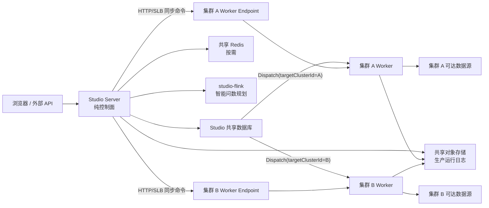
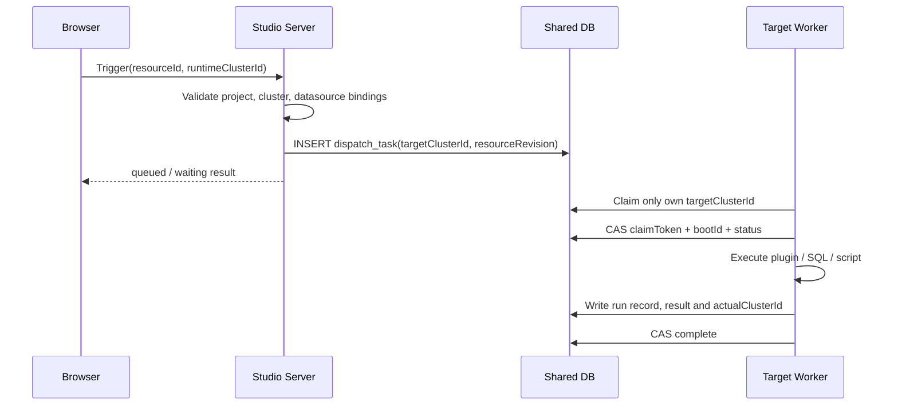
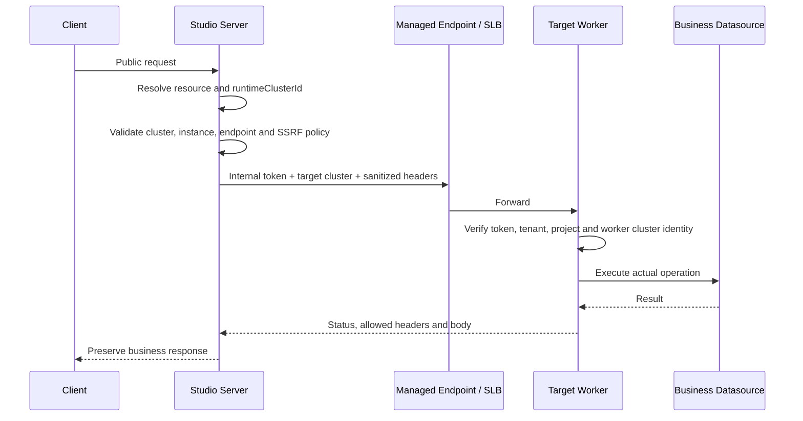

# Studio 统一 Worker 执行面架构交接

更新时间：2026-07-24

当前状态：本地实施与本地应用级回滚演练已完成（待生产环境验收；Codex Goal 保持 `active`）

关联目标：[P0-MC-02 统一 Worker 执行面与纯控制面架构](../规划/studio-worker-only-execution-plane-plan-20260721.md)

## 1. 架构定位

Studio 采用一套稳定运行模型：**OMS 统一控制面 + 数据库管理的若干全能力运行集群 + 每个运行集群中的 Studio Worker**。

单集群不是另一种应用模式，而是当前系统只登记一个运行集群。`DEFAULT-LOCAL` 只是一条普通集群记录和 Worker 集群编码，不再代表 Server 进程内执行。

核心边界：

- `studio-server` 负责用户入口、配置、调度、路由、统计和告警。
- `studio-worker` 是唯一加载 DataAggregation 插件、访问业务数据源和执行用户工作负载的进程。
- `studio-flink` 是智能问数规划服务；真实 Flink SQL 在目标 Worker 执行。它不携带 Worker 集群身份或插件目录，不启用可信网关，并与 Server/Worker 使用相同的外部秘密。
- `studio-desktop-runtime` 在一个进程内同时装配控制面和一个 Worker，但内部仍通过回环 HTTP 走相同运行协议。
- 所有运行位置由数据库中的 `runtimeClusterId` 决定，不读取 Server 本地集群身份，也不使用长期模式开关。

## 2. 总体拓扑



## 3. 模块职责

### 3.1 studio-server

保留：

- 登录、租户、项目、成员、权限和审计。
- 数据源、模型、任务、工作流、脚本、数据服务、接入和协议转换配置。
- 运行集群、HTTP/SLB 端点、项目授权、数据源适用范围和失效校验。
- 定时调度、Dispatch 创建、资源修订快照和控制面集群锁。
- 同步请求鉴权、目标解析、SSRF 校验、内部认证和响应转发。
- 字段映射与响应转换规则的配置组装和静态校验；真实数据行转换不在 Server 执行。
- 模型同步编排；实际数据源 Hydrate/Preview/Query 由 Worker 完成。
- 智能问数计划请求；最终 Flink SQL 由 Worker 完成。
- 运维聚合、运行记录、统计、告警、站内信、Webhook 和 eLink 投递。

禁止：

- 加载 source/reader/writer 插件。
- 创建 `JobContainer`。
- 连接业务数据库、消息队列、文件或对象数据源。
- 执行 SQL、Flink SQL、Java、Python 或用户任务。
- 直接执行数据服务、数据接入、协议转换的真实业务调用。
- Worker 不可用时回退本地或切换到其他集群。

Server 的 `application.yml` 不再配置 `STUDIO_CLUSTER_CODE`、Worker 组、插件指纹或插件目录。开放服务和管理调试接口均先进入 Worker 路由，不存在 Server 本地执行回退。

### 3.2 studio-worker

Worker 统一承担：

- 数据源连接测试、发现、发现选项、Hydrate、预览和参数化查询。
- 模型元数据读取和模型同步所需的数据源访问。
- 采集、质量、工作流节点和数据开发脚本执行。
- SQL、Flink SQL、Java 和 Python 执行。
- Java 脚本环境依赖下载、隔离类加载以及 import/member hints 生成。
- 数据服务、数据接入、协议转换及 REST/JSON/XML/SOAP 调试。
- 数据服务响应转换器的实际初始化和逐行执行。
- DataAggregation 插件加载和 `JobContainer` 生命周期。
- 实际执行集群、Worker 实例、运行日志、访问日志和告警信号写入。

Worker 同时提供：

- 共享数据库中的定向 Dispatch 消费。
- `/internal/runtime/**` 同步 HTTP 接口。
- 实例心跳和 Worker Lease。

Servlet 请求线程与 Dispatch 调度线程池相互独立，慢同步调用不会占用 Worker 的 Dispatch 调度线程。

每个发布版本必须交付插件 manifest 和整体 fingerprint。所有宣称“全能力”的 Worker 应使用相同版本和 manifest；实例上报的 `STUDIO_PLUGIN_FINGERPRINT` 与发布记录不一致时，只能视为待排查实例，不能通过生产能力验收。首版该检查属于发布与验收流程，不表示应用已经自动阻止不一致 Worker 启动。

### 3.3 studio-flink

`studio-flink` 的边界已经收敛为规划和 Flink 公共组件：

- `/question/plan` 根据问题、模型元数据和 LLM 配置生成受约束 SQL 计划。
- 不再通过面向用户的接口执行真实 Flink SQL。
- Server 收到 `/question/ask` 后先获取计划，再把最终 SQL 按 `runtimeClusterId` 路由到 Worker。
- Worker 内嵌 Flink 执行组件，并通过 `/internal/runtime/flink/sql/execute` 执行。
- Gateway 模式的运行时回调地址来自 Worker 的 `studio.worker-api-base-url`。
- Worker 依赖的是不含 DataAggregation 插件资源的轻量 `studio-flink` 主制品，运行插件统一来自 Worker 的 `STUDIO_AGGREGATION_HOME`。Flink 集群默认使用 `flink-connector-remote` profile 生成的轻量 connector，通过任务级 capability 从 Worker 获取固定 identity 的 source 插件；只有完全离线部署才使用 `flink-connector-bundle` 将全部插件 ZIP 打入兼容制品。日常 Server/Worker 构建不读取 Reactor 外部 `target` 目录。

### 3.4 studio-desktop-runtime

Desktop 是单进程组合部署，不是本地快速路径：

- 同时扫描 Server 控制面和 Worker config/runtime/internal controller。
- `/internal/**` 使用独立内部 Token 安全链；用户 API 仍使用控制面 JWT 安全链。
- Desktop bootstrap 是本地打包形态的受限初始化例外：首次初始化创建 `DEFAULT-LOCAL` 集群、回环 HTTP 端点、项目授权和数据源绑定，后续启动会幂等校验并修复这套 Desktop 固定运行面。
- Desktop 管理的默认集群、回环端点、授权和绑定用于保证单进程可运行，不应被理解为在线 Server/Worker 的自动推断逻辑；历史空资源集群仅在 Desktop 本地单集群数据库中显式回填。
- Server 路由调用 `http://127.0.0.1:<desktop-port>/internal/runtime/**`，执行仍经过 Worker 控制器和身份校验。
- Desktop 不注册 Nacos。
- Electron renderer 的生产默认控制面地址为 `http://127.0.0.1:18180/api/v1`；异机或网关部署使用构建期 `VITE_API_BASE_URL` 显式覆盖，值中不得携带认证秘密。
- Electron 窗口启用沙箱、上下文隔离、Web 安全和 CSP，禁用 Node 集成与不安全混合内容。生产构建使用 Vue runtime-only 和 vue-i18n 无动态代码生成路径，不为第三方依赖开放 `unsafe-eval`。

因此 Desktop、单 Worker 服务端和多集群部署共享同一执行协议。

## 4. 运行集群模型

| 表 | 作用 |
| --- | --- |
| `studio_runtime_cluster` | 租户内运行集群编码、名称、启停、状态和实例摘要。 |
| `studio_runtime_endpoint` | Worker HTTP/SLB 基础地址、Header、Token、超时和测试结果。 |
| `studio_project_runtime_cluster` | 项目可用集群、首选集群和手动覆盖权限。 |
| `datasource_cluster_binding` | 数据源与人工确认可达集群的多对多关系。 |
| `studio_runtime_validation` | 资源运行配置有效性及问题详情。 |

关键语义：

- 集群编码创建后不可修改。
- 新端点只允许 `HTTP`；旧 `LOCAL` 记录没有执行能力。
- 每个集群只选择一个启用端点，多 Worker 由 Service/SLB 负载均衡。
- Server 不具有集群代码，不能把任何集群识别为“本地”。
- 数据源健康按“租户 + 集群 + connectionFingerprint”隔离。
- 数据源适用关系由管理员配置，不根据健康探测自动增删。

## 5. 资源选择与校验

所有可执行资源保存 `runtimeClusterId`：

- 采集任务
- 质量任务
- 工作流及发布版本
- SQL/Java/Python/Flink 数据脚本
- 数据服务
- 数据接入
- 协议转换
- 模型同步任务

统一校验链：

1. 当前用户能访问项目。
2. 目标集群已启用且项目已授权。
3. 资源引用的全部数据源均绑定到目标集群。
4. 工作流节点资源与工作流属于同一运行集群。
5. 资源不存在未解决的 `studio_runtime_validation` 记录。
6. 手动覆盖还需项目允许覆盖。

项目只有一个授权集群时，前端可自动选择或只读显示，但 DTO 仍提交真实 ID。运行时不会从“唯一集群”“Server 集群代码”或 Worker 组推断目标。

## 6. 异步执行链

适用能力：采集、质量、工作流、已保存脚本、即席脚本等待式执行等。



可靠性约束：

- Worker 查询条件要求非空目标集群并等于自身集群。
- 领取、续租、完成和故障恢复使用 `claimToken + workerBootId + status` CAS。
- 旧 Worker 不能覆盖新 Worker 结果。
- 资源修订变化后拒绝静默执行最新配置。
- Dispatch Payload 只保存执行类型、工作流运行、项目、目标集群和计划时间等定位信息，不复制工作流节点 `config`、字段映射、HTTP Header 或 Body。Worker Claim 后按 `workflowDefinitionId + workflowVersionId + nodeCode` 从不可变版本表加载节点快照，并复核租户、项目和版本归属。
- Dispatch Payload 不保存解密后的数据源秘密、Token 或完整请求体。
- 即席脚本正文、运行参数、执行覆盖配置和 `maxRows` 不进入 `payload_json`，只以 `STUDIO_ENCRYPTION_SECRET` 加密后写入 `protected_payload_ciphertext`。Worker Claim 后先解密到当前执行内存，再通过 `claimToken + workerBootId + status` CAS 清空数据库密文，清空成功后才调用执行器。
- 领取后授权撤销、Worker 重启恢复、stale recovery、成功和失败等终态路径均会清空短期密文；实体字段使用 `JsonIgnore`，运维和工作流查询只选择展示所需列。离线密钥轮换工具覆盖仍在排队或执行中的该列。
- 目标集群离线时任务保留排队，恢复后继续执行。

## 7. 同步执行链

适用能力：

- 数据源 test/discover/hydrate/preview/query
- 数据服务、接入和协议转换公开调用与调试
- Flink SQL



失败语义：

- 没有运行集群：`400`。
- 资源不存在：`404`。
- 集群禁用、无在线 Worker、无端点、端点不可达或内部认证失败：`503`。
- 请求体超限：`413`。
- Worker 响应体超限或无效内部响应：`502/500`。
- 业务 `401/403` 只有在 Worker 返回已认证标记时才按业务状态保真；否则保守映射为内部不可用。
- 不跟随重定向，不自动重试写入类请求。

## 8. 数据源与模型访问

Server 的数据源服务只负责加密配置、权限、绑定和控制面元数据。所有需要真实连接的动作进入 `RuntimeDatasourceProbeRouter`：

| 操作 | Worker 内部入口 |
| --- | --- |
| 连接测试 | `/internal/runtime/datasource/probe` |
| 模型发现 | `/internal/runtime/datasource/discover` |
| 发现选项 | `/internal/runtime/datasource/discover-options` |
| 元数据 Hydrate | `/internal/runtime/datasource/hydrate` |
| 模型预览 | `/internal/runtime/datasource/preview` |
| 参数化查询 | `/internal/runtime/datasource/query` |

Java 编辑器的 import/member hints 同样属于执行面能力。公开接口必须携带 `runtimeClusterId`；Server 的 `ScriptEnvironmentHintRuntimeRouter` 只做项目授权、端点安全校验和响应解析，Worker 的 `/internal/runtime/script-environments/java/**` 才能下载依赖 JAR、创建环境类加载器并生成提示。`ScriptEnvironmentRuntimeService` 仅由 Worker 显式注册，Server 上不存在该 Bean。新部署优先使用受管 `oss://` 制品；HTTP/HTTPS 下载固定 DNS、禁止重定向和自动重试，并受连接超时、读取超时和 64 MiB 硬上限约束；对象存储、本地文件以及 ZIP 解压后的 JAR 总量使用相同上限。本地文件默认关闭，开启时只允许 `toRealPath()` 后位于显式根目录内的普通文件。

目标没有在线实例或端点时，周期健康探测记录 `UNKNOWN`，不会把人工适用绑定改成 `UNAVAILABLE` 或自动移除。

## 9. 开放服务执行

数据服务、数据接入和协议转换的用户地址始终属于 OMS Server。Server 只做代理：

- 根据 service code/key 找到资源和目标集群。
- 校验运行配置失效状态。
- 过滤 hop-by-hop、Host、Content-Length 和 Studio 保留 Header。
- 隔离 SLB/端点认证与用户业务认证。
- 限制请求体、响应体和超时。
- 把请求发送到 Worker 的 `/internal/runtime/{kind}/...`。

Worker 执行真实 SQL、`JobContainer` 或协议转换，并写一次访问日志和告警信号。Server 不再保留公开接口的本地执行回退。

## 10. 安全边界

- `STUDIO_INTERNAL_API_TOKEN`：Server 与所有 Worker一致，内部接口必填。
- `STUDIO_ENCRYPTION_SECRET`：所有需要读写数据源、端点秘密和短期 Dispatch 执行输入的进程一致。
- `STUDIO_RUNTIME_ENDPOINT_ALLOWED_HOSTS`：Server 精确放行内网 Worker/SLB；Worker 读取历史私网 HTTP/HTTPS 脚本制品时复用该精确主机列表。
- `STUDIO_SCRIPT_ARTIFACT_CONNECT_TIMEOUT_SECONDS` / `STUDIO_SCRIPT_ARTIFACT_READ_TIMEOUT_SECONDS`：Worker 脚本制品 HTTP 超时。
- `STUDIO_SCRIPT_ARTIFACT_MAX_BYTES`：单制品及 ZIP 解压后 JAR 总量上限，最大 64 MiB。
- `STUDIO_SCRIPT_ARTIFACT_ALLOW_LOCAL_FILES` / `STUDIO_SCRIPT_ARTIFACT_ALLOWED_LOCAL_ROOTS`：默认关闭的 Worker 本地制品兼容边界。
- Worker 校验请求目标集群 ID、集群编码、租户和资源保存的集群。
- URL 在发送前和每次请求时重新解析，拒绝 DNS rebinding 到未允许地址。
- 云元数据地址始终拒绝，即使主机出现在 allowed-hosts。
- 端点 Header 值、Token、Cookie、数据源密码和完整业务体不进入日志。
- Server 可以通过网络策略完全禁止访问业务数据源网段。

## 11. 配置边界

### Server

必需：数据库、内部 Token、加密密钥、allowed-hosts、共享日志/缓存配置，以及显式的可信网关开关。未接入可信网关时设置 `STUDIO_GATEWAY_TRUST_ENABLED=false`；启用时必须使用非默认共享密钥。启用智能问数时还需配置 `studio-flink` 的固定地址或 Nacos 服务发现。

Server 启动守门会拒绝绑定 `STUDIO_CLUSTER_CODE`、`STUDIO_AGGREGATION_HOME` 或旧 JVM `-Daggregation.home=...`，避免共享 Nacos或历史 IDEA 参数把 Worker 身份和插件目录重新带回控制面。部署预检还会拒绝 `STUDIO_WORKER_GROUP_CODE`、`STUDIO_WORKER_CODE`、`STUDIO_WORKER_API_BASE_URL`、`STUDIO_RUNTIME_VERSION` 和 `STUDIO_PLUGIN_FINGERPRINT` 等 Worker 专属变量。

不使用：

```text
STUDIO_CLUSTER_CODE
STUDIO_AGGREGATION_HOME
STUDIO_WORKER_GROUP_CODE
STUDIO_PLUGIN_FINGERPRINT
STUDIO_RUNTIME_CLUSTER_MODE
```

### Worker

必需：数据库、内部 Token、加密密钥、`STUDIO_CLUSTER_CODE`、`STUDIO_AGGREGATION_HOME`、Worker 实例身份、发布插件 fingerprint，并显式关闭不属于 Worker 的可信网关身份兑换。

Worker 不再有隐式 `STUDIO_AGGREGATION_HOME` 默认值。启动守门要求目录真实存在并包含 `conf/core.json`、`plugin/source`、`plugin/reader`、`plugin/writer` 和 `plugin/transformer`；部署前还可运行 `backend/scripts/check-studio-deployment.ps1` 对最终进程环境和挂载做相同的静态预检。

### studio-flink

仅在启用智能问数时部署。它连接 Studio 元数据库和 LLM Provider，负责 `/question/plan`；Server 使用 `STUDIO_FLINK_BASE_URL` 或 `STUDIO_FLINK_SERVICE_NAME` 调用。规划服务不可用时智能问数明确失败，真实 SQL不会回退到 Server，并且普通任务与开放服务不受影响。

## 12. 历史迁移

在线部署的 `studio-server` 和 `studio-worker` 正常启动不再执行自动回填。Desktop 为保证本地单进程首次初始化和固定回环运行面，保留上一节所述的受限 bootstrap；该例外不能复制到服务端部署。在线单集群历史库使用：

```powershell
backend\scripts\backfill-runtime-cluster.ps1 -DryRun
backend\scripts\backfill-runtime-cluster.ps1
```

工具只处理无歧义的 `DEFAULT-LOCAL` 租户，不覆盖非空集群，不恢复已删除绑定。多集群或存在歧义的租户必须由管理员确认。

## 13. 当前验证状态

已具备的自动化和构建证据：

- Server 可执行包已经与 DataAggregation/Flink 运行依赖物理隔离：不包含 `JobContainer`、插件加载器、数据源处理器或 `studio-flink`；Worker 可执行包仍完整包含这些执行构件。Server 保留的 MinIO/OSS SDK只用于共享运行日志和脚本制品对象存储。
- 数据源和同步服务路由定向测试。
- Worker 非空目标领取、CAS 和恢复测试。
- Flink 规划与 Worker 执行路由测试。
- Server 无插件目录启动测试。
- Server 中不存在采集 `JobContainer` 和数据服务响应转换执行 Bean，Worker 中两者均显式注册。
- Server 中不存在 `ScriptEnvironmentRuntimeService`；`DEFAULT-LOCAL` 与远端 Java import/member hints 均通过 Worker HTTP 路由。
- Desktop 回环 Worker 平面启动与内部 Token 测试。
- Runtime endpoint SSRF、Header、内部认证、响应上限和秘密更新测试。
- 2026-07-24 最新根 POM 全量为 `1136/1136`，11 个 Reactor 模块全部 `BUILD SUCCESS`；其中 Commons `4/4`、Nacos Compat `27/27`、Infra `355/355`、Flink `108/108`、Server `61/61`、Worker `78/78`、Desktop Runtime `1/1`、`studio-test` `502/502`，失败、错误和跳过均为 `0`，总耗时 7 分 24 秒。
- 角色启动守门定向测试 `20/20`；pluginless Server 和 Desktop Worker 平面启动测试各 `1/1`。PowerShell 部署预检 `10/10`，覆盖正常 Server/Worker/Flink、跨角色身份和插件目录污染、默认秘密、可信网关以及共享对象存储必填项。
- 使用 IDEA `StudioWorkerApplication` 的阿里云 OSS 配置再次执行显式协议 IT `1/1`，失败、错误和跳过均为 `0`，随机对象与临时脱敏报告已清理；四项生产人工证据仍为 `PENDING`，本地报告总体保持 `INCOMPLETE`。
- `scripts/dev-services.ps1` 已按本机约定分别读取 IDEA `StudioServerApplication` 和 `StudioWorkerApplication` 环境变量，并通过子进程环境继承而非命令行赋值传递秘密。真实启动后 Server/Worker health 均为 `UP`，Server Java 命令行不含 aggregation home 或插件目录，启动包装命令中的 IDEA 敏感值命中数为 `0`；本机 IDEA Server 的历史 `-Daggregation.home` 已移除。
- Worker 定向 `7/7`、助手 HTTP/工具链路 `83/83`、助手路由与异常映射 `5/5`、网关安全 `8/8`。
- Worker 模块在 JDK 17 下 `78/78`，包含普通调度器绑定、独立心跳、同步写入幂等、请求体上限、脚本环境提示和资源修订保护回归。
- Web 与 Desktop 类型检查和生产构建通过。
- 工作流采集/质量任务选项强制携带 `runtimeClusterId`，Controller 契约 `3/3`、执行面 Bean 与数据服务回归 `23/23` 均通过。
- Java 环境提示路由、Worker 身份/项目校验、未认证响应失败关闭、Server pluginless 装配和 Desktop Worker 装配定向测试 `17/17` 通过；Web 类型检查和生产构建复验通过。

已具备的本地真实运行证据：

- Server 从空临时目录用可执行 JAR 启动，健康为 `UP`；启动参数和工作目录均不包含 aggregation/plugin/conf，证明控制面启动不依赖插件目录。
- 助手脚本请求到达 Worker；未配置 Python 时 Worker 的 HTTP `500` 错误经 Server 保真，Worker 停机时返回 `503`，没有 Server fallback；配置受管 Python 3.11 后，临时 Python 脚本真实执行成功，结果、日志及请求/实际集群均正确。
- 默认集群 Worker 停机期间 Java Dispatch 保持 `QUEUED`，恢复后进入 `SUCCESS`，请求集群与实际集群一致。
- JSON `BODY_BRIDGE` 单次调用只请求下游一次、只新增一条访问日志；Worker 停机后返回 `503`，下游计数和访问日志均不增加。
- 同一集群两个 Worker 经本地轮询 SLB 接收同步请求，多次请求在两个实例间交替且请求 ID 唯一，请求集群与实际集群一致。
- 慢请求的 TCP 连接证据显示 Server 只连接 SLB，实际 Worker 才连接业务 mock；该结论不替代生产网络策略验收。
- 临时第二运行集群的同步和 Java 异步定向均正确；目标停机时同步 `503`、异步排队，恢复后成功，未跨集群 fallback。
- 协议转换下游 `500` 样本形成一条访问日志、一个告警实例、一个 `TRIGGERED` 事件和一条成功站内信投递，没有重复触发。
- 一次性回填工具 Dry Run 成功，结果为 `eligibleTenants=1`、`skippedTenants=1`，无数据变更。
- Worker 已补齐 Calcite JDBC 连接池所需 DBCP/Pool2 运行时依赖，MySQL 当前探测和周期探测均成功。
- 仓库开发脚本已真实启动 Server/Worker，JDK 17 自动选择、环境参数、Base64 子命令、PID 指纹和进程树生命周期均通过。
- `STUDIO_WORKER_SCHEDULER_POOL_SIZE=1` 时线程转储只有一条普通调度线程和一条独立心跳线程；约 30 秒真实长任务阻塞普通调度线程期间，心跳持续推进且任务最终成功。
- 同步写入幂等真实 HTTP 验证通过：首次和相同请求回放均为 `200` 且响应一致，相同 Key 的不同请求为 `409`，访问日志只写一次，MySQL 幂等记录为唯一 `COMPLETED` 行。
- 三类隔离 MySQL 数据库验证通过：新部署完整 Schema 和初始化数据可直接建立运行集群、项目授权及 HTTP 端点；历史单集群回填可正式执行且重复执行幂等，九类资源空集群清零、显式值保留、空目标 Dispatch 被处置；历史多集群歧义租户不会被自动回填或猜测目标。
- 隔离新部署的 Server 和单 Worker 均健康，集群心跳为 `ONLINE`、端点测试返回 `HTTP 200`；保存的 Python 脚本经 Server 定向到 Worker 后真实执行成功，请求/实际集群一致，日志为 `AVAILABLE`。隔离进程、数据库和临时验证程序已在验收后清理。
- 使用 IDEA `StudioWorkerApplication` 中的真实阿里云 OSS 配置，已验证 Worker A 归档、独立 Server/Worker B 跨节点读取、对象存储中断失败记录和恢复上传；项目 SDK Java 17 下协议 IT 为 `1/1`，测试对象已清理且凭据未进入报告。此前临时 MinIO 包装器、容器和报告已删除，不再作为当前验收依据。
- Desktop 已补齐数据开发、运行集群和运行环境路由。真实 Electron 登录后可见新增菜单和数据开发页；同一 Desktop renderer 与组合 Runtime 已完成唯一 `DEFAULT-LOCAL` 自动选择、Python Worker 执行成功、请求/实际集群一致、集群停用后的运行配置失效提示和重新启用恢复在线。路由修正后的生产构建再次通过，Vite 转换 `3592` 个模块。

仍需在标记目标完成前补齐：

- 按[生产运行面验收手册](../运维/部署/studio-production-runtime-acceptance.md)验证每个同步集群的真实 SLB Header、内部认证标记和秘密脱敏；生产单报告验收脚本离线测试 `7/7`、最终证据汇总器 `15/15`、真实阿里云 OSS 协议 IT `1/1` 已完成，证据 URL 会被失败关闭且不会落入脱敏报告，但生产 SLB、Pod 网络和生产等价回滚报告尚未生成。
- 分别在 OMS Pod 和各数据源网络范围的 Worker Pod 对同一代表性数据源执行 `Network + Denied/Allowed`，证明 Server 禁止访问、Worker 可以访问。
- 从生产 Pod 使用最终 OSS endpoint 验证网络 ACL，并确认 Bucket 容量、生命周期和高可用策略；静态 AK/SK 的真实 OSS 协议路径已通过，不再使用临时 MinIO 结果替代。
- 结合上述生产环境场景完成最终发布 Review，确认部署参数、网络 ACL和对象存储策略与已验收代码边界一致。

详细验收状态以 P0-MC-02 计划中的 Goal 跟踪台账和[20260722 P0-MC-02 统一 Worker 执行面验收执行记录](../测试/长期跟踪/records/20260722-P0-MC-02统一Worker执行面验收执行记录.md)为准。在上述待办完成前，状态保持“实现中（待最终环境验收）”，不得把 Goal 标记为 `complete`。
