# Data Aggregation Studio 使用说明白皮书

版本：2026-05-30  
适用系统：Data Aggregation Studio 在线 Web 控制台  
适用读者：业务使用者、项目管理员、数据集成实施人员

## 1. 产品定位与适用场景

Data Aggregation Studio 是围绕 DataAggregation 引擎构建的一体化数据集成与治理工作台。它把数据源管理、模型同步、数据采集、脚本开发、工作流编排、数据服务发布、数据接入服务、质量治理和运行监控集中到一个 Web 控制台中，帮助团队用可配置的方式完成“数据从哪里来、写到哪里去、如何调度、如何对外服务、如何监控”的全流程管理。

典型使用场景如下：

| 场景 | Studio 能力 | 适用用户 |
|---|---|---|
| 数据源统一管理 | 维护 MySQL、FTP/SFTP、MinIO、消息队列、HTTP 等连接信息，测试可用性并纳入管理 | 数据平台管理员 |
| 数据模型同步 | 从数据源发现表、文件、主题等模型，形成可选择、可治理的数据资产 | 数据资产管理员 |
| 数据采集与写入 | 配置 Reader、Transformer、Writer，按字段映射把数据从源端同步到目标端 | 数据集成实施人员 |
| 任务编排 | 用 DAG 工作流串联采集任务、质量任务、脚本、HTTP 和 Shell 节点 | 调度管理员 |
| 数据服务发布 | 把数据库表或 SQL 查询发布成可调用 REST/SOAP 服务 | API 服务维护人 |
| 数据接入服务 | 暴露接收数据的 REST/SOAP 接口，把外部提交的数据写入数据库表或文件模型 | 数据接入维护人 |
| 质量治理 | 维护质量规则和质量任务，查看质量指标、问题和运行结果 | 数据治理人员 |
| 运行监控 | 查看任务日志、服务调用日志、接入运行日志、调用趋势和异常聚合 | 运维与值班人员 |

## 2. 核心概念

| 概念 | 说明 |
|---|---|
| 租户 | 平台最高隔离单元。不同租户之间的数据源、任务、服务和用户权限相互隔离。 |
| 项目 | 租户下的工作空间。绝大多数业务资产都归属到项目，页面菜单通常要求先进入项目。 |
| 角色 | 控制用户可见菜单和可操作范围。常见角色包括系统管理员、租户管理员、项目管理员和普通成员。 |
| 数据源 | 对外部系统连接的抽象，例如 MySQL、FTP、SFTP、MinIO、Kafka、HTTP API。 |
| 模型 | 数据源中的可操作对象，例如数据库表、文件路径、消息主题或 HTTP 返回结构。 |
| 采集任务 | 一条从源端读取、经过字段映射或转换、写入目标端的同步配置。 |
| 工作流 | 由多个节点组成的 DAG 编排，可手动触发或配置定时调度。 |
| 数据服务 | 读向 API，把数据库表或 SQL 查询发布为 REST/SOAP 查询服务。 |
| 数据接入服务 | 写向 API，接收外部 JSON、Form 或 SOAP 数据，并写入数据库表或文件模型。 |
| 订阅方 | 调用开放服务的业务方标识。启用 Token 时每个订阅方对应一个 Token；免 Token 时使用默认订阅方记录日志。 |

## 3. 登录与工作台导航

### 3.1 登录入口

访问 Studio Web 控制台后进入登录页。初始化环境默认管理员账号为：

| 项目 | 默认值 |
|---|---|
| 用户名 | `admin` |
| 密码 | `admin123` |

生产环境建议由统一网关或平台账号体系接入，不建议长期使用默认账号。登录成功后，系统会根据当前用户解析租户、项目和角色，并加载可见菜单。

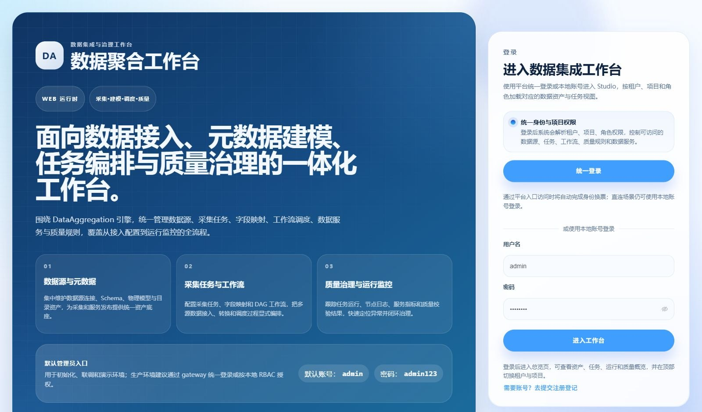

### 3.2 项目上下文

大部分业务页面都需要当前项目上下文。如果登录后未加入任何项目，系统会进入“访问申请中心”，用户可申请加入项目，管理员审批后刷新权限进入工作台。

常见处理方式：

1. 当前账号有项目权限：进入总览页，在顶部确认租户和项目。
2. 当前账号没有项目：进入访问申请中心，选择可申请项目并提交说明。
3. 项目刚审批通过但仍不可见：点击刷新权限或重新登录。

### 3.3 菜单分组

当前 Web 控制台主菜单按业务域组织：

| 分组 | 页面 | 用途 |
|---|---|---|
| 工作空间 | 总览、能力矩阵、访问申请中心 | 查看平台概览、数据源能力、项目申请 |
| 数据资产 | 元模型中心、数据源中心、模型中心、模型统计 | 管理数据源、模型和资产统计 |
| 数据采集 | 字段映射规则、采集任务、采集运行、运行指标 | 配置同步任务并查看运行状态 |
| 数据开发 | 数据开发、工作流、运行实例 | 编写脚本、编排任务、查看 DAG 运行 |
| 数据服务 | 数据服务、数据接入服务、接入服务监控、数据服务监控 | 发布读向 API、写向 API 并监控调用 |
| 数据质量 | 质量规则、质量任务、质量运行、质量指标 | 配置质量检查并查看治理结果 |
| 系统管理 | 系统管理 | 管理租户、项目、成员、角色和权限 |

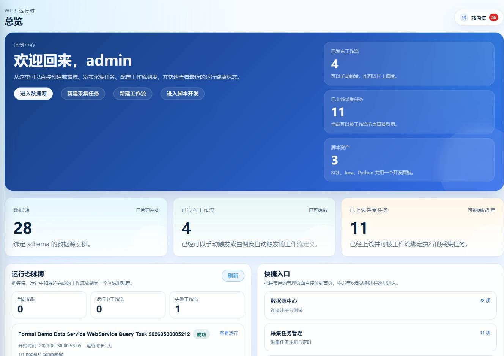

## 4. 数据资产管理

### 4.1 元模型中心

元模型中心用于维护动态表单和模型元数据结构。业务使用者通常不需要频繁修改元模型，但需要理解它决定了数据源、模型和运行参数页面展示哪些字段。

使用建议：

- 技术元模型按数据源类型分组，例如 MySQL 表、FTP 文件、MinIO 对象。
- 业务元模型用于补充业务域、负责人、数据分级等治理字段。
- 采集参数模型用于驱动 Reader、Writer、Transformer 的运行参数表单。
- 元模型变更会影响后续创建数据源、模型和采集任务时的表单结构，建议由管理员维护。

### 4.2 数据源中心

数据源是所有采集、模型、服务和接入能力的基础。创建数据源时先选择插件类型，页面会根据元模型展示对应连接表单。

基础流程：

1. 进入“数据资产 / 数据源中心”。
2. 点击新建数据源。
3. 填写数据源名称，选择插件类型。
4. 填写技术元数据，例如主机、端口、数据库、账号、路径或连接参数。
5. 选择是否启用、是否纳入平台管理。
6. 点击连接测试，确认可访问。
7. 保存数据源。

注意事项：

- 敏感字段在页面和接口返回中会做掩码，保存时以表单提交值为准。
- “启用”表示数据源可被页面和任务使用；“纳入管理”表示该类型进入模型同步、采集任务等运行配置范围。
- 文件类数据源需要确认目录权限，避免任务运行时因为无写权限等待或失败。

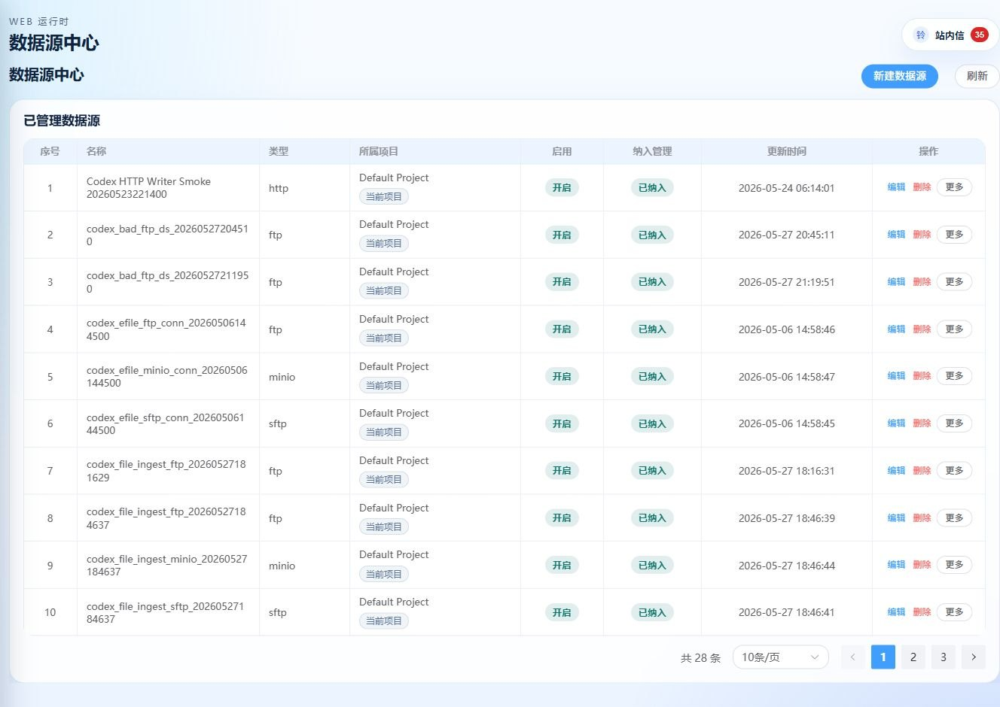

### 4.3 模型中心

模型中心用于管理数据源中的表、文件、主题等对象。采集任务、数据服务和数据接入服务都依赖模型选择。

常见操作：

| 操作 | 说明 |
|---|---|
| 同步全部模型 | 从指定数据源发现全部可识别模型，适合首次接入。 |
| 同步选中模型 | 只同步指定表或对象，适合生产环境降低扫描范围。 |
| 查看模型详情 | 查看物理定位、字段、技术元数据和业务元数据。 |
| 预览模型数据 | 对可读模型抽样查看数据。 |
| 维护血缘 | 在模型间手工补充上下游关系。 |

使用建议：

- 新建采集任务或服务前，先确认源端和目标端模型已同步。
- 如果数据库表结构变更，应重新同步对应模型，避免字段映射仍使用旧字段。
- 文件模型要关注文件格式、路径、字段分隔符和追加写能力。

### 4.4 模型统计

模型统计页用于按数据源类型、模型类型、业务元数据等条件统计资产分布。它主要帮助管理员评估哪些数据源和模型已纳入治理范围。

## 5. 数据采集

### 5.1 字段映射规则

字段映射规则用于复用字段命名、类型转换或字段对齐经验。创建采集任务时可参考规则，但最终以任务内字段映射配置为准。

建议按业务域维护规则，例如客户、订单、商品、组织机构等常见模型，降低重复配置。

### 5.2 采集任务流程

采集任务用于定义一次从源端到目标端的数据同步。典型配置流程如下：

```text
选择源数据源与模型
        ↓
选择目标数据源与模型
        ↓
配置 Reader / Writer 运行参数
        ↓
配置字段映射与转换
        ↓
配置调度或保存为可编排任务
        ↓
发布上线并触发运行
```

关键配置项：

| 配置 | 说明 |
|---|---|
| 源端绑定 | 选择源数据源、源模型和 Reader 参数。 |
| 目标端绑定 | 选择目标数据源、目标模型和 Writer 参数。 |
| 字段映射 | 把源字段映射到目标字段，可补充类型和默认值。 |
| 运行参数 | 由插件元模型渲染，控制批大小、写入模式、文件格式、HTTP 参数等。 |
| 调度配置 | 可配置 Cron、时区和启停状态，也可交给工作流统一调度。 |
| 预览配置 | 保存前查看生成的任务配置，确认 Reader、Writer 和字段映射正确。 |

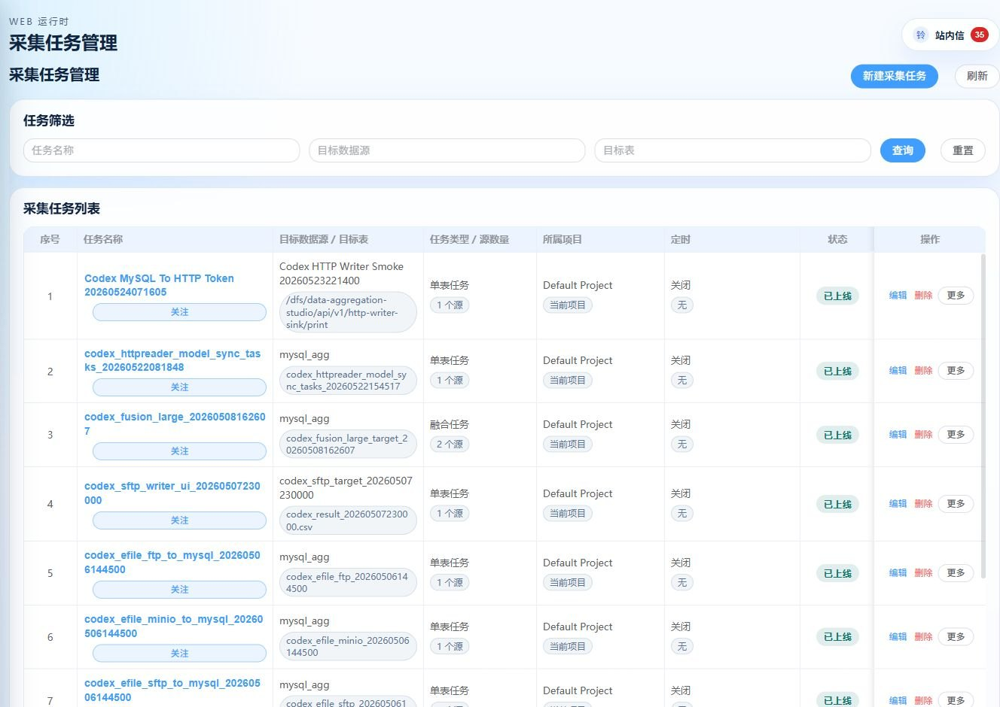

### 5.3 Writer 参数

Writer 参数作用于写入插件，即目标端如何落库、落文件或写消息。它不是源端读取参数，也不是字段映射本身。

常见例子：

- 数据库 Writer：写入模式、批量大小、目标列、主键或冲突策略。
- 文件 Writer：文件格式、分隔符、是否追加、输出路径、文件名策略。
- HTTP Writer：请求方法、请求头、Body 格式、响应成功判定。

如果页面提供表单渲染，优先使用表单；只有高级场景才直接编辑 JSON 配置。

### 5.4 运行记录与指标

采集任务上线后可以手动触发或由调度触发。运行完成后应查看：

- 任务状态：成功、失败、运行中、排队中。
- 日志：Reader、Transformer、Writer 的关键日志。
- 指标：读取成功数、写入成功数、失败数、过滤数。
- 错误摘要：连接失败、权限不足、字段不存在、类型转换失败等。

## 6. 数据开发与工作流

### 6.1 数据开发

数据开发页提供脚本目录和脚本编辑能力。当前主要面向 SQL 和 Java 脚本。

| 脚本类型 | 典型用途 |
|---|---|
| SQL | 查询数据、验证模型、准备测试数据、排查任务问题。 |
| Java | 编写复杂调用逻辑，例如调用 WebService、解析 XML、组合多个接口。 |
| Python | 如果运行环境支持，可用于轻量处理和验证。 |

使用建议：

- SQL 脚本应选择正确的数据源后执行。
- Java 脚本可通过上下文读取运行参数和写日志，适合封装复杂接口调用。
- 脚本保存后可以被工作流的“数据脚本”节点引用。

### 6.2 工作流

工作流用于把多个任务和脚本编排成 DAG。一个工作流可以包含采集任务、质量任务、数据脚本、HTTP 节点和 Shell 节点。

配置流程：

1. 进入“数据开发 / 工作流”。
2. 新建工作流，填写编码、名称和调度配置。
3. 在画布上添加节点。
4. 选择节点类型并绑定资源，例如采集任务、质量任务或脚本。
5. 连接节点边，形成执行顺序。
6. 保存草稿并发布。
7. 手动触发或等待调度触发。

节点说明：

| 节点类型 | 用途 |
|---|---|
| 采集任务 | 执行已上线的数据采集任务。 |
| 质量任务 | 执行已上线的数据质量检查。 |
| 数据脚本 | 执行已保存的 SQL/Java 等脚本。 |
| HTTP | 调用外部 HTTP 或 Studio 开放接口，可用于接口链路编排。 |
| SHELL | 执行命令行脚本，通常用于运维集成场景。 |

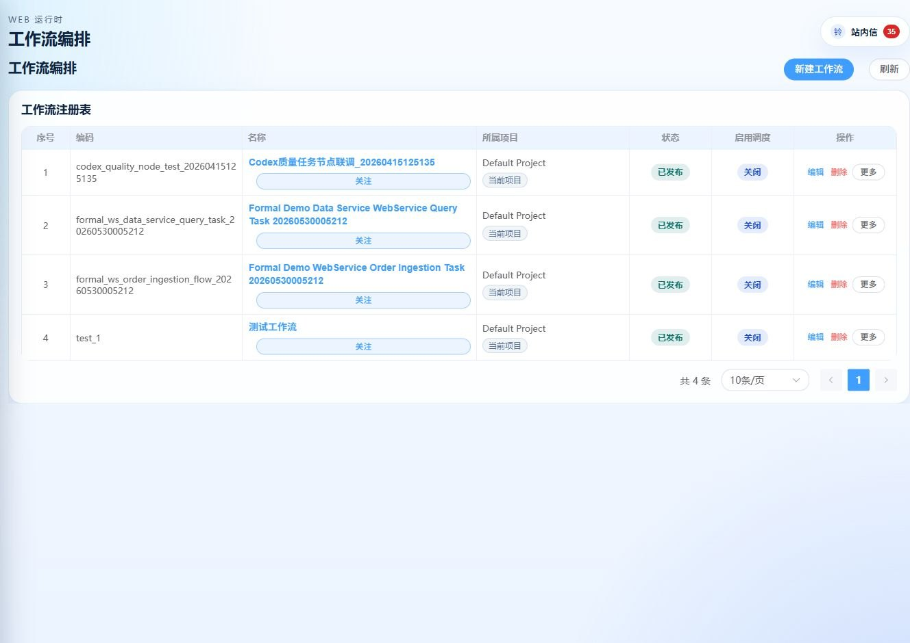

### 6.3 运行实例

运行实例页展示工作流和节点运行情况。排障时建议按以下顺序查看：

1. 运行状态和错误消息。
2. 节点运行日志。
3. 节点输入配置和输出结果。
4. 指标摘要。
5. Worker 是否在线。

## 7. 数据服务

数据服务是读向 API 发布能力，用于把数据库表或 SQL 查询开放给外部系统调用。

### 7.1 创建数据服务

基础流程：

```text
基础信息
  ↓
选择数据源和模型，或填写 SQL
  ↓
解析字段
  ↓
配置请求参数、返回参数和发布参数
  ↓
配置 Token 策略与 WebService 设置
  ↓
调试
  ↓
发布
```

关键配置：

| 配置 | 说明 |
|---|---|
| 服务编码 | 开放接口路径的一部分，建议使用英文、数字和下划线。 |
| 服务名称 | 页面展示名称。 |
| 来源类型 | 数据表模式或 SQL 模式。 |
| 请求参数 | 内部查询条件，绑定数据库字段和查询操作符。 |
| 返回参数 | 控制对外返回哪些字段、字段别名和说明。 |
| 发布参数 | 控制对外调用时参数从 Body、Query 或 Header 读取。 |
| Token 策略 | 可要求订阅 Token，也可配置免 Token。 |
| WebService 设置 | 可选启用 SOAP/WSDL 访问方式。 |

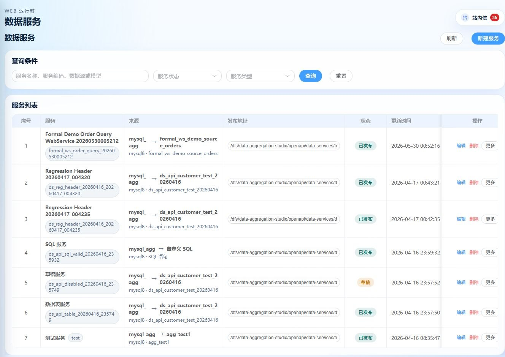

### 7.2 REST 调用

数据服务发布后会生成开放路径：

```text
/openapi/data-services/{serviceCode}/{serviceKey}
```

如果启用 Token，调用方需要在 Header 中传：

```text
X-Data-Service-Token: <token>
```

如果配置为免 Token，系统会使用默认订阅方记录访问日志。

### 7.3 Token 与默认订阅方

| 模式 | 调用要求 | 日志归属 |
|---|---|---|
| 需要 Token | 调用必须携带有效 `X-Data-Service-Token` | 对应订阅方 |
| 免 Token | 不需要携带 Token | 默认订阅方 |

建议生产环境优先启用 Token。免 Token 适合内网可信系统、临时演示或网关已做鉴权的场景。

### 7.4 调试与监控

管理端调试用于验证配置是否正确。开放调用日志和监控用于观察真实调用情况。

应重点关注：

- 调用次数、成功率、失败率。
- 平均耗时和慢调用。
- 订阅方分布。
- 错误码和错误摘要。
- 最近访问日志。

## 8. 数据接入服务

数据接入服务是写向 API 接收能力，与数据服务方向相反。它接收外部系统提交的数据，并按字段映射写入数据库表或文件模型。

### 8.1 创建数据接入服务

页面按三个阶段配置：

1. 基础信息和写入目标配置。
2. 字段映射配置。
3. 发布调试。

基础流程：

```text
填写服务编码和名称
        ↓
选择目标类型、数据源类型、数据源和模型
        ↓
配置 Writer 运行参数
        ↓
配置字段来源和目标字段映射
        ↓
配置 Token 策略与 WebService 设置
        ↓
调试并发布
```

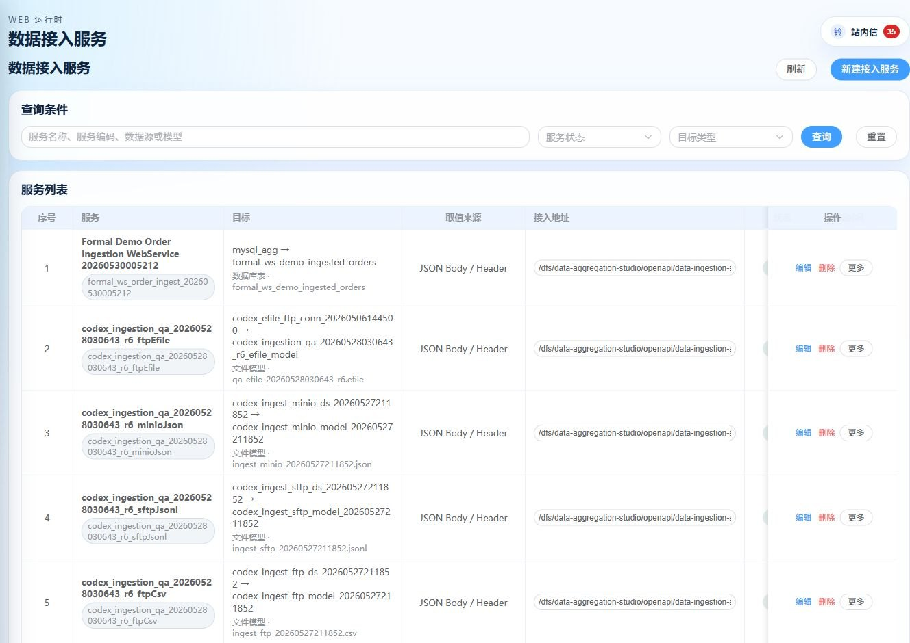

### 8.2 请求格式

首版主要支持：

| 格式 | 说明 |
|---|---|
| JSON | 支持根对象、根数组或通过数据节点路径定位数组。 |
| Form / Query | 按单行记录解析，适合表单提交或简单接口。 |
| SOAP | 通过 WebService SOAP Body 解析字段，适合传统系统对接。 |

### 8.3 字段映射

字段映射决定“从请求哪里取值”和“写入目标哪个字段”。

| 来源位置 | 说明 |
|---|---|
| Body | 从 JSON Body 或 SOAP Body 中读取字段路径。 |
| Form | 从表单字段读取。 |
| Query | 从 URL 查询参数读取。 |
| Header | 从请求头或 SOAP Header 中读取。 |

字段映射建议：

- 目标字段应来自目标模型，避免手工输入不存在字段。
- 必填字段要谨慎配置，缺失会导致本次请求失败。
- 默认值只适合静态值，例如固定来源渠道；动态时间建议由调用方传入。
- 混合模式可同时从 Body、Query 和 Header 取值。

### 8.4 写入目标配置

数据接入服务复用 DataAggregation Writer 插件完成写入。

| 目标类型 | 说明 |
|---|---|
| 数据库 | 写入数据库表，常见目标为 MySQL 表。 |
| 文件 | 写入文件模型，例如 CSV、JSONL、JSON、EFILE 等，能力取决于数据源和 Writer 参数。 |

注意事项：

- 选择 FTP/SFTP/MinIO 数据源时，应选择对应文件模型；选择数据库数据源时，应选择数据库表模型。
- 追加写通常更适合 CSV 和 JSONL；JSON 或 EFILE 更适合动态文件名或避免覆盖的写入策略。
- Writer 参数表单由运行参数模型渲染，优先使用页面表单而不是手写 JSON。

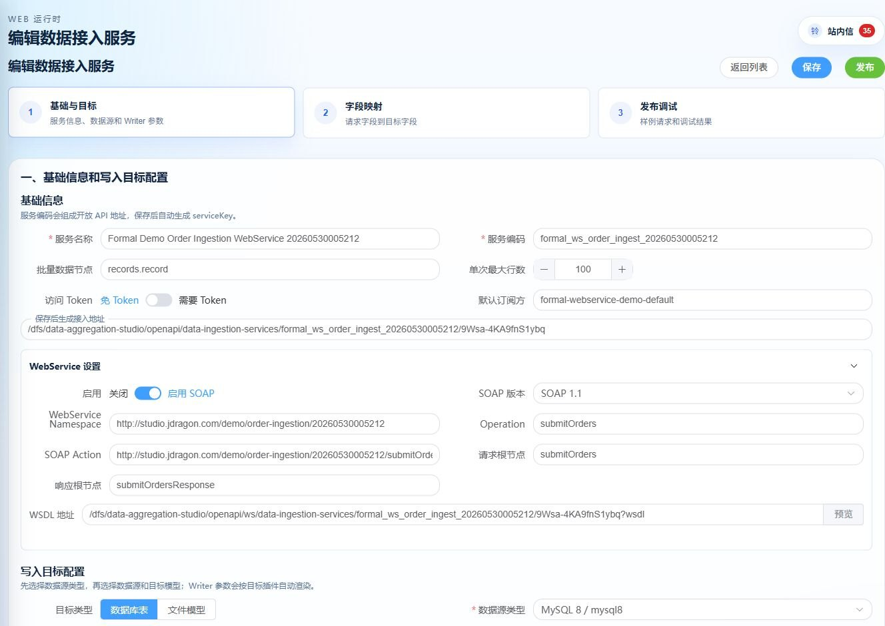

### 8.5 运行日志与监控

每次开放调用都会生成接入访问日志。对于写入执行，系统会记录 JobContainer 线程内的关键日志，用于隔离查看本次请求的系统日志。

排障时关注：

- 请求 ID。
- 服务编码和订阅方。
- 接收行数、成功行数、失败行数。
- HTTP 状态和错误摘要。
- Writer 插件日志和 JobContainer 日志。
- 目标表或目标文件是否实际产生数据。

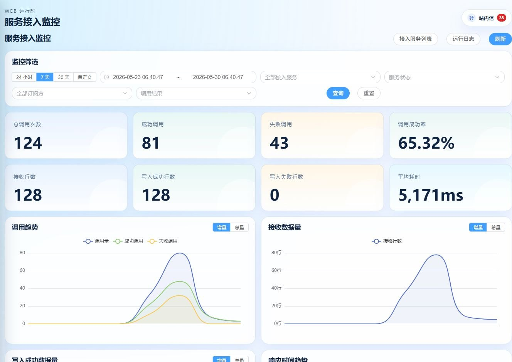

## 9. WebService 使用指南

Studio 的 WebService 是可选协议适配层，REST 接口仍保持可用。WebService 适合传统系统、ESB、SOAP 客户端和只支持 WSDL 的集成平台。

### 9.1 WSDL 与 SOAP 地址

| 类型 | 结构地址 | 调用地址 |
|---|---|---|
| 数据服务 | `/openapi/ws/data-services/{serviceCode}/{serviceKey}?wsdl` | `/openapi/ws/data-services/{serviceCode}/{serviceKey}` |
| 数据接入服务 | `/openapi/ws/data-ingestion-services/{serviceCode}/{serviceKey}?wsdl` | `/openapi/ws/data-ingestion-services/{serviceCode}/{serviceKey}` |

使用规则：

- 获取结构：浏览器或 SOAP 工具访问 `?wsdl`。
- 获取数据或提交数据：去掉 `?wsdl`，使用 `POST` 发送 SOAP Envelope。
- 当前示例环境中建议使用小写 `?wsdl`。
- 不要用前端页面地址导入 WSDL，应使用后端开放接口地址。

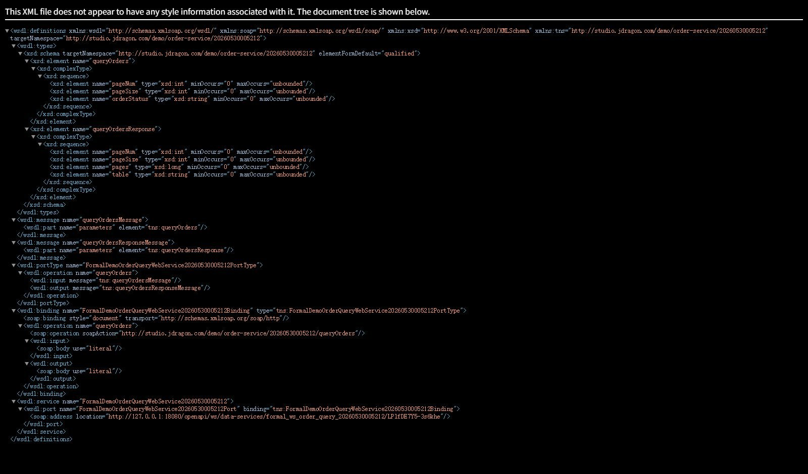

### 9.2 数据服务 SOAP 查询示例

示例数据服务：

| 项目 | 值 |
|---|---|
| 服务编码 | `formal_ws_order_query_20260530005212` |
| 结构地址 | `http://127.0.0.1:18080/openapi/ws/data-services/formal_ws_order_query_20260530005212/LPlfDE7Y5-3s6khe?wsdl` |
| 调用地址 | `http://127.0.0.1:18080/openapi/ws/data-services/formal_ws_order_query_20260530005212/LPlfDE7Y5-3s6khe` |
| Token 策略 | 免 Token |

请求示例：

```xml
<?xml version="1.0" encoding="UTF-8"?>
<soapenv:Envelope xmlns:soapenv="http://schemas.xmlsoap.org/soap/envelope/"
                  xmlns:tns="http://studio.jdragon.com/demo/order-service/20260530005212">
  <soapenv:Body>
    <tns:queryOrders>
      <pageNum>1</pageNum>
      <pageSize>10</pageSize>
      <orderStatus>READY</orderStatus>
    </tns:queryOrders>
  </soapenv:Body>
</soapenv:Envelope>
```

PowerShell 调用示例：

```powershell
$body = @'
<?xml version="1.0" encoding="UTF-8"?>
<soapenv:Envelope xmlns:soapenv="http://schemas.xmlsoap.org/soap/envelope/"
                  xmlns:tns="http://studio.jdragon.com/demo/order-service/20260530005212">
  <soapenv:Body>
    <tns:queryOrders>
      <pageNum>1</pageNum>
      <pageSize>10</pageSize>
      <orderStatus>READY</orderStatus>
    </tns:queryOrders>
  </soapenv:Body>
</soapenv:Envelope>
'@

Invoke-WebRequest `
  -Method Post `
  -Uri "http://127.0.0.1:18080/openapi/ws/data-services/formal_ws_order_query_20260530005212/LPlfDE7Y5-3s6khe" `
  -ContentType "text/xml; charset=utf-8" `
  -Headers @{ SOAPAction = "http://studio.jdragon.com/demo/order-service/20260530005212/queryOrders" } `
  -Body $body
```

### 9.3 数据接入 SOAP 写入示例

示例接入服务：

| 项目 | 值 |
|---|---|
| 服务编码 | `formal_ws_order_ingest_20260530005212` |
| 结构地址 | `http://127.0.0.1:18080/openapi/ws/data-ingestion-services/formal_ws_order_ingest_20260530005212/9Wsa-4KA9fnS1ybq?wsdl` |
| 调用地址 | `http://127.0.0.1:18080/openapi/ws/data-ingestion-services/formal_ws_order_ingest_20260530005212/9Wsa-4KA9fnS1ybq` |
| Token 策略 | 免 Token |

请求示例：

```xml
<?xml version="1.0" encoding="UTF-8"?>
<soapenv:Envelope xmlns:soapenv="http://schemas.xmlsoap.org/soap/envelope/"
                  xmlns:tns="http://studio.jdragon.com/demo/order-ingestion/20260530005212">
  <soapenv:Header>
    <sourceChannel>FORMAL_WS_TASK</sourceChannel>
  </soapenv:Header>
  <soapenv:Body>
    <tns:submitOrders>
      <records>
        <record>
          <orderId>1001</orderId>
          <customerName>Alice Formal WS</customerName>
          <amount>125.50</amount>
          <ingestedAt>2026-05-30 00:52:20</ingestedAt>
        </record>
      </records>
    </tns:submitOrders>
  </soapenv:Body>
</soapenv:Envelope>
```

### 9.4 SOAP 工具常见问题

| 现象 | 常见原因 | 处理方式 |
|---|---|---|
| WSDL 能在浏览器打开，但工具提示为空 | 工具使用了大写 `?WSDL` 或导入了调用地址 | 使用小写 `?wsdl` 的结构地址。 |
| 调用返回 SOAP Fault | Token 缺失、服务未发布、服务下线、字段必填失败或请求体不符合配置 | 查看 faultstring 和服务调用日志。 |
| 数据服务没有返回数据 | 查询参数默认值、分页、状态过滤或源表无匹配数据 | 用管理端调试或 SQL 验证源数据。 |
| 接入服务成功但目标没数据 | 目标模型、Writer 参数或字段映射不正确 | 查看接入运行日志和目标表/文件。 |
| SOAP Header 中 Token 不生效 | Header 名称不符合约定 | 数据服务支持 `token` 或 `dataServiceToken`；接入服务支持 `token` 或 `dataIngestionToken`。 |

## 10. 数据质量

### 10.1 质量规则

质量规则定义检查逻辑，例如空值、唯一性、范围、枚举、SQL 条件等。规则可以被质量任务引用。

建议：

- 规则命名包含业务对象和检查点，例如“订单金额非空”。
- 对关键字段启用必填、范围和枚举检查。
- SQL 类规则应先在数据开发页验证 SQL 可执行。

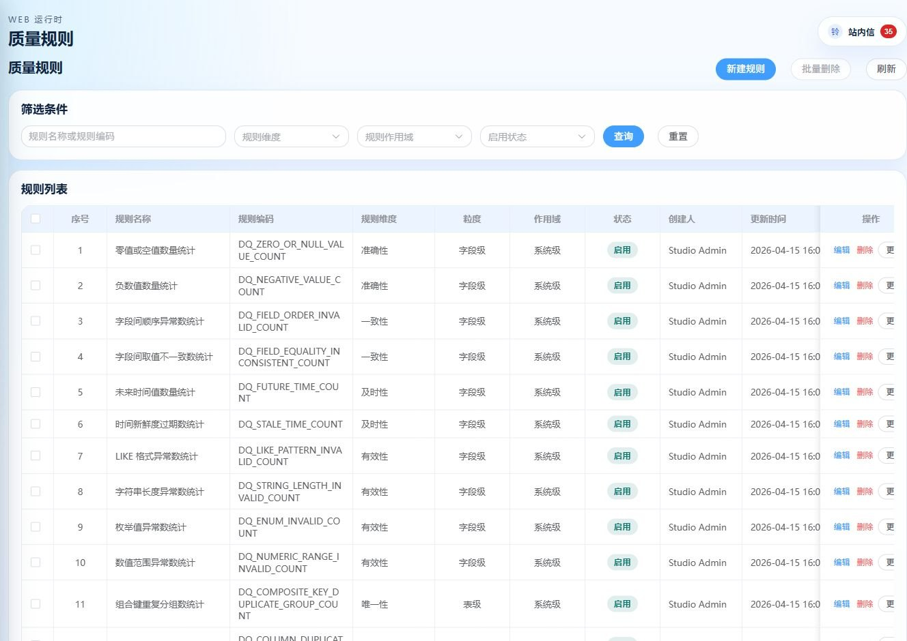

### 10.2 质量任务

质量任务把规则绑定到数据源和模型，并定义执行方式。发布后可手动运行，也可被工作流节点引用。

配置流程：

1. 选择数据源和模型。
2. 选择或创建质量规则。
3. 配置规则参数。
4. 预览和校验。
5. 发布任务。
6. 手动触发或加入工作流。

### 10.3 质量指标

质量指标页用于查看质量任务的结果分布、问题聚合和趋势。使用时重点关注失败规则、影响模型、问题严重程度和处理状态。

## 11. 系统管理

系统管理用于维护租户、项目、成员、角色、权限和工作空间申请。

| 功能 | 说明 |
|---|---|
| 租户管理 | 创建和启停租户。 |
| 项目管理 | 创建项目、设置默认项目、启停项目。 |
| 租户成员 | 管理用户在租户内的角色。 |
| 项目成员 | 管理用户在项目内的角色。 |
| 项目申请 | 审批用户加入项目的申请。 |
| 项目 Worker | 管理项目可用 Worker，影响任务派发。 |
| 资源共享 | 按项目或资源类型管理共享关系。 |

权限排障建议：

- 用户看不到菜单：检查角色是否满足菜单要求。
- 用户登录后没有项目：检查项目成员关系或审批状态。
- 任务无法触发：检查项目是否有可用 Worker。
- 资源不可见：检查租户、项目和资源归属。

## 12. 常见问题与排障

### 12.1 登录和项目

| 问题 | 排查方向 |
|---|---|
| 登录失败 | 检查账号密码、后端服务、认证配置。 |
| 登录后无项目 | 到访问申请中心申请加入项目，或让管理员分配项目成员。 |
| 项目切换后数据为空 | 确认资源是否属于当前项目。 |

### 12.2 数据源和模型

| 问题 | 排查方向 |
|---|---|
| 连接测试失败 | 检查主机、端口、账号、密码、网络、防火墙和驱动能力。 |
| 模型同步不到表 | 检查数据源权限、Schema、表名大小写和同步范围。 |
| 字段映射缺字段 | 重新同步模型，确认目标模型字段已更新。 |

### 12.3 采集任务和工作流

| 问题 | 排查方向 |
|---|---|
| 任务发布失败 | 检查源端、目标端、字段映射和必填运行参数。 |
| 任务运行失败 | 查看运行日志中 Reader、Writer 或转换错误。 |
| 工作流无法触发 | 检查是否发布、是否已有运行中实例、项目 Worker 是否在线。 |
| HTTP 节点失败 | 查看请求 URL、Header、Body、状态码和响应摘要。 |

### 12.4 数据服务和数据接入服务

| 问题 | 排查方向 |
|---|---|
| 开放接口 401 | 检查 Token 是否缺失、错误、停用，或服务是否配置免 Token。 |
| 开放接口 404 | 检查服务编码、serviceKey、服务状态是否在线。 |
| 调试成功但外部调用失败 | 对比管理端调试参数和开放调用的 Header、Query、Body。 |
| 接入服务字段必填失败 | 检查字段来源位置、字段路径、默认值和请求体结构。 |
| 写入超时或失败 | 查看接入运行日志、Writer 参数、目标权限和目标模型。 |

### 12.5 日志定位

建议按请求链路定位：

1. 页面提示或接口返回。
2. 服务调用日志或接入访问日志。
3. 运行日志详情。
4. Worker 节点日志。
5. 数据库或文件目标侧验证。

## 13. 附录：正式 WebService 示例任务

当前系统已创建一组正式 WebService 示例，用于展示“数据服务查询”和“数据接入服务写入”的组合用法。

### 13.1 示例数据

| 项目 | 值 |
|---|---|
| 源表 | `formal_ws_demo_source_orders` |
| 目标表 | `formal_ws_demo_ingested_orders` |
| 数据源 | `mysql_agg` |
| 项目 ID | `2041806351881003009` |

### 13.2 示例服务

| 服务 | 编码 | 用途 |
|---|---|---|
| 数据服务 WebService | `formal_ws_order_query_20260530005212` | 查询 `READY` 状态订单。 |
| 数据接入 WebService | `formal_ws_order_ingest_20260530005212` | 接收订单数据并写入目标表。 |

### 13.3 示例任务

| 任务 | 编码 | 运行结果 |
|---|---|---|
| 数据服务 WebService 查询任务 | `formal_ws_data_service_query_task_20260530005212` | 已成功调用数据服务 SOAP 查询。 |
| 数据接入 WebService 写入任务 | `formal_ws_order_ingestion_flow_20260530005212` | 已成功调用数据服务 SOAP 作为源，再调用接入服务 SOAP 写入目标表。 |

### 13.4 使用说明

- 浏览器打开 WSDL 地址只表示能获取结构，不等于已经调用业务数据。
- 调用数据必须使用不带 `?wsdl` 的 SOAP 地址，并发送 `POST` 请求。
- 示例服务配置为免 Token；如果后续改为需要 Token，调用方需要携带对应 Header 或 SOAP Header。
- 示例数据会保留在目标表中，用于后续联调和演示。

## 14. 使用建议

1. 先建数据源，再同步模型，最后配置采集、服务或接入。
2. 对外开放服务前，先在管理端调试，再用真实开放地址验证。
3. 生产服务优先启用 Token，并按订阅方管理调用方。
4. 对接 WebService 时，先导入 `?wsdl`，再使用不带 `?wsdl` 的地址调用。
5. 任务失败时优先看运行日志和访问日志，不要只看页面状态。
6. 涉及文件写入时，提前确认路径、格式、追加策略和目标权限。
7. 重要工作流发布后先手动触发一次，确认 Worker、日志和指标链路正常。
