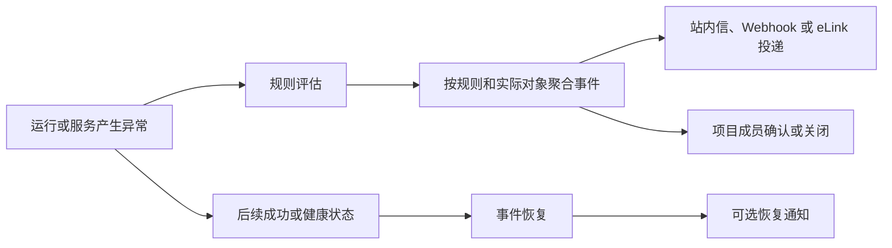
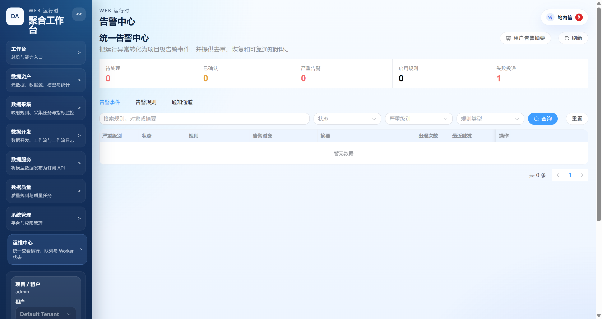
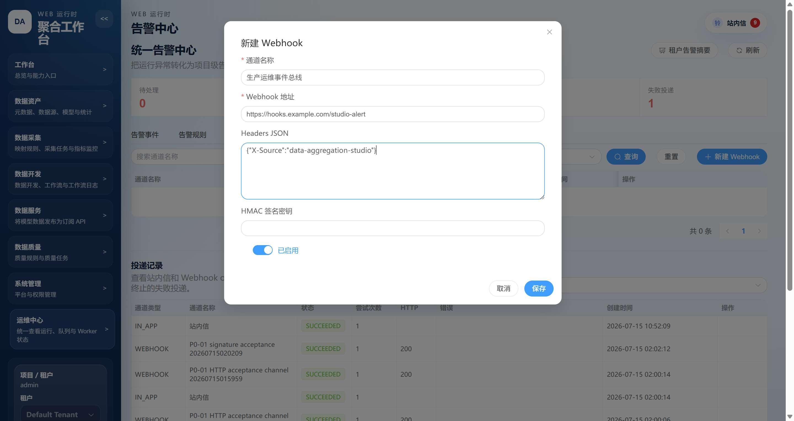
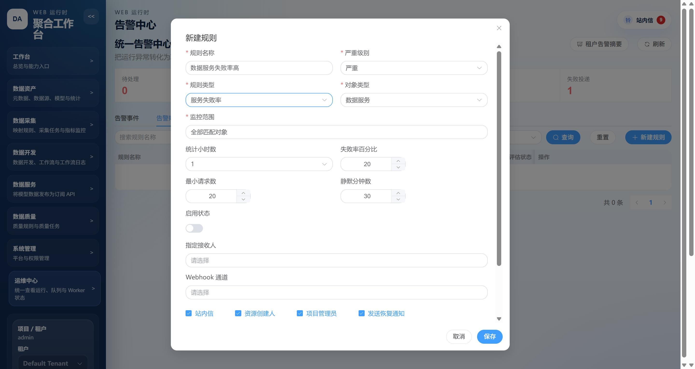
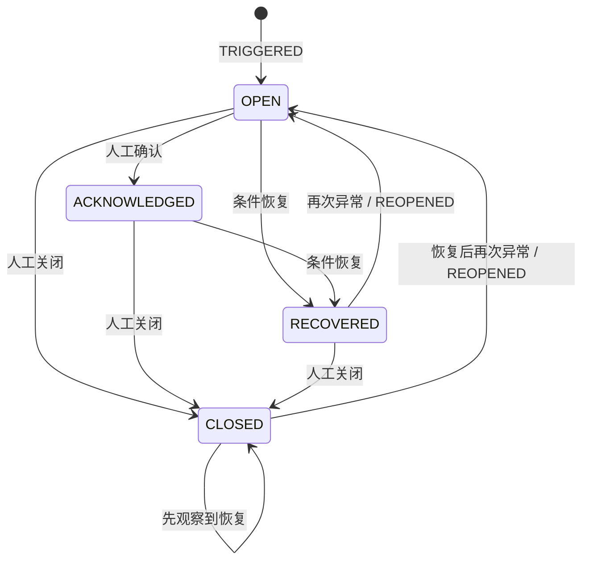
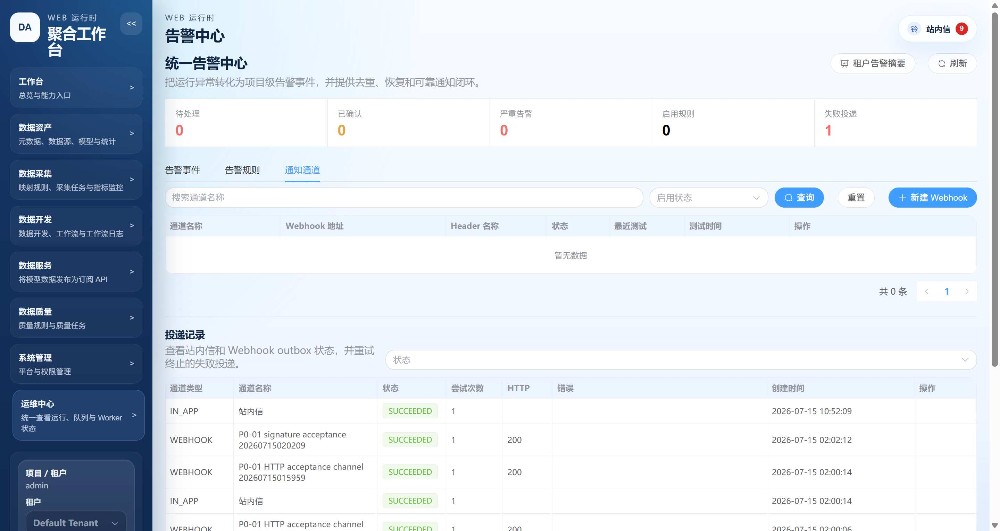

# 统一告警中心使用指南

## 1. 模块定位

统一告警中心把采集任务、质量任务、工作流、开放服务、Worker、调度队列和日志存储中的异常，转换为可确认、可恢复、可关闭、可追踪投递结果的项目级告警事件。

页面入口：`运维中心 / 告警中心`，路由为 `/alerts`。

它解决的不是“再展示一张异常列表”，而是形成下面这条处置闭环：



> 首次升级不会自动创建规则，也不会把历史失败记录补成告警。管理员需要按项目创建并启用规则。

## 2. 谁可以做什么

| 角色 | 查看事件、规则、通道和投递 | 确认、关闭事件 | 新建、编辑、启停、测试、删除规则 | 维护和测试通知通道 | 人工重试投递 | 查看租户项目摘要 |
|---|---:|---:|---:|---:|---:|---:|
| 项目成员 | 是 | 是 | 否 | 否 | 否 | 否 |
| 项目管理员 | 是 | 是 | 是 | 是 | 是 | 否 |
| 租户管理员 | 是 | 是 | 是 | 是 | 是 | 是，仅当前租户 |
| 超级管理员 | 是 | 是 | 是 | 是 | 是 | 是，仅当前租户上下文 |

权限边界例子：

- 项目成员小王可以打开“订单同步失败”事件，填写“已联系源系统负责人”并确认，但页面不会显示“新建规则”和“新建通知通道”。
- 项目管理员可以维护当前项目的规则和通知通道，但看不到另一个项目的规则、事件证据或通知通道。
- 租户管理员可以看到本租户各项目的启用规则数、活跃告警数、严重告警数和失败投递数，但摘要不返回事件证据和通道秘密。

## 3. 页面导览

告警中心顶部显示五项汇总：待处理、已确认、严重告警、启用规则和失败投递。点击汇总项会自动切换到对应页签并应用筛选。



页面包含三个页签：

| 页签 | 主要用途 |
|---|---|
| 告警事件 | 按状态、级别、规则类型和关键词筛选事件；查看证据、时间线和投递；确认、关闭或跳转到业务对象。 |
| 告警规则 | 创建九类规则，选择对象范围、阈值、接收人、通知通道、静默时间和恢复通知。 |
| 通知通道 | 维护项目级 Webhook 或 eLink 通道，查看站内信、Webhook 和 eLink 投递状态，人工重试失败投递。 |

## 4. 推荐的首次配置顺序

生产项目建议按以下顺序上线，避免规则一启用就产生不必要的通知：

1. 确认当前租户和项目上下文正确。
2. 只使用站内信时可跳过通道创建；需要推送外部系统时先创建 Webhook 或 eLink 通道。
3. 新建规则时先保持“启用状态”关闭。
4. 保存规则后点击“测试”，确认接收人和投递记录正确。
5. 需要外部通道时，先单独测试通道，再测试规则；eLink 当前环境使用“同 Nacos 的 Manager + 独立上游 mock”验收。
6. 确认无误后启用规则。
7. 触发一次可控的测试异常，并验证触发、确认、恢复和投递全流程。

示例：先创建“订单采集连续失败”规则，阈值为 3，站内信接收项目管理员，规则保持停用；测试消息成功后再启用。这样测试不会创建真实告警实例，也不会影响生产事件状态。

## 5. 创建通知通道

Webhook 和 eLink 都是可选能力。只需要站内信时，规则可以不绑定任何外部通知通道。

### 5.1 使用站内信

站内信不需要单独创建通道。创建规则时保持“站内信”勾选，并至少选择指定成员、资源创建人或项目管理员中的一个有效来源即可。

收到消息后，页面右上角“站内信”会显示未读数。点击后可在“最近消息”中直接查看告警级别、规则名称、摘要和时间，也可以“进入消息中心”查看完整列表或标记全部已读。

例子：规则“订单采集执行失败”选择项目管理员并启用站内信。任务失败后，所有有效项目管理员各自收到一条站内信；某位管理员把消息标为已读，不会影响其他人的未读状态，也不会自动确认告警事件。

边界：站内信投递成功只表示消息已写入接收人的消息中心，不等于事件已经确认。接收人仍需进入告警事件执行“确认”或“关闭”。目标用户被禁用时，本次站内信投递进入 `SKIPPED`。

### 5.2 Webhook 页面操作

1. 打开“通知通道”页签。
2. 点击“新建通知通道”，通道类型选择 `Webhook`。
3. 填写通道名称和 HTTPS 地址。
4. 按需填写 Headers JSON 和 HMAC 签名密钥。
5. 保存后点击“测试”，再到投递记录查看结果。



### 5.3 Webhook 配置例子

| 配置项 | 示例 | 说明 |
|---|---|---|
| 通道名称 | `生产运维事件总线` | 建议包含环境和接收系统。 |
| Webhook 地址 | `https://hooks.example.com/studio-alert` | 默认只允许 HTTPS。 |
| Headers JSON | `{"X-Source":"data-aggregation-studio"}` | 页面后续只展示 Header 名，不回显值。 |
| HMAC 签名密钥 | 由接收方单独生成 | 不要写入文档、工单、截图或聊天记录。 |
| 启用状态 | 开启 | 禁用后正常投递会进入 `SKIPPED`。 |

### 5.4 编辑秘密时的边界

- 编辑通道时，Webhook 地址和签名密钥留空表示保留已加密的旧值，不是清空。
- 只有勾选“清除已保存的签名密钥”才会清除密钥；清除和提交新密钥不能同时进行。
- 查询接口只返回脱敏地址、Header 名称和“是否已配置密钥”，不会返回明文值。
- 删除仍被规则引用的通道会被拒绝。应先从规则中移除该通道，再删除。

### 5.5 网络安全边界例子

| 地址例子 | 默认结果 | 原因或处理方式 |
|---|---|---|
| `https://hooks.example.com/studio-alert` | 允许，仍需通过 DNS 和地址校验 | 公网 HTTPS 目标。 |
| `http://hooks.example.com/studio-alert` | 拒绝 | 默认禁止 HTTP，仅本地测试环境可单独放开。 |
| `http://127.0.0.1:9000/hook` | 拒绝 | 回环地址属于 SSRF 高风险目标。 |
| `https://10.10.20.30/hook` | 拒绝 | 私网地址默认禁止。 |
| `https://alert-gateway.example.internal/hook` | 默认拒绝 | 必须由运维在 `allowed-hosts` 中最小范围显式放行。 |
| 带 `#fragment` 的地址 | 拒绝 | Webhook URL 不允许 fragment。 |

更多部署配置见 [告警 Webhook 安全与运维说明](../../运维/监控/alert-webhook-security.md)。

### 5.6 创建 eLink 通道

eLink 通道只负责在告警产生投递时，把 Studio 自动组装的文本消息交给现有 eLink Manager。规则触发、静默期后的重复通知、恢复后重开都会发送；规则启用“恢复通知”时，`RECOVERED` 也会发送；通道测试和规则测试会发送 `TEST`。当前范围不修改 eLink Manager 生产发送代码，也不让 Studio 直接请求真实 eLink。

该选项只在服务端开启 `studio.alert.elink.enabled` 时显示。Desktop 运行时默认关闭且不提供 Nacos 服务发现，因此不会展示新建 eLink 通道入口；同 Nacos 的 Server 运行形态默认开启。

1. 打开“通知通道”页签，点击“新建通知通道”。
2. 通道类型选择 `eLink`。
3. 接收模式选择“固定目标”或“跟随规则接收人”。
4. 固定目标下再选择“个人账号”或“群组”；候选项由 Studio 通过同 Nacos 的 eLink Manager 获取，页面不允许手工输入账号或整数群组 ID。
5. 跟随规则接收人不配置固定目标，而是使用规则中的指定成员、资源创建人和项目管理员逐人投递；优先使用 Studio 用户绑定的 eLink 账号，未绑定时尝试使用用户手机号码。
6. 固定目标通道可直接点击“测试”；跟随规则接收人的通道必须通过“规则测试”提供接收人上下文。
7. 在告警规则的“通知通道”中选择该 eLink 通道，再启用规则。

个人账号与群组配置互斥：

| 接收模式/类型 | 需要配置 | Manager 接口 |
|---|---|---|
| 固定个人账号 `FIXED + PERSONAL` | 从 Manager 应用可见成员中选择一个或多个账号 | 查询 `GET /elink/app/allow-users`，发送 `POST /elink/messages` |
| 固定群组 `FIXED + GROUP` | 从 Manager 本地群组中选择一个群组 | 查询 `GET /elink/groups`，发送 `POST /elink/groups/{groupId}/messages` |
| 跟随规则接收人 `RULE_RECIPIENTS` | 规则接收来源；eLink 账号绑定优先，用户手机号兜底 | 查询成员后逐人调用 `POST /elink/messages` |

Studio 只通过当前应用所在的同一 Nacos `namespace` 和 `group` 发现 Manager。服务名由服务端统一配置，默认 `elink-message-integration`；页面不配置 SLB 地址、固定 URL 或每通道服务名。

### 5.7 eLink 消息与范围边界

eLink 消息固定为 `text`，内容由告警级别、规则名称、对象名称、告警摘要和发生时间自动组装。通道页面不能编辑消息正文。

当前范围明确不支持：

- SLB 地址或绕过 Nacos 的直连地址。
- 自定义 Header、认证 Header 或签名密钥。
- 固定通道手工录入手机号；手机号只作为“跟随规则接收人”在未绑定 eLink 账号时的服务端兜底目标。
- 自定义模板、变量模板或自定义消息体。
- `markdown`、`textcard` 等其他消息类型。
- 修改 eLink Manager 生产发送程序。

### 5.8 eLink mock 验收

当前环境无法连通真实 eLink 时，不以真实发送成功作为本轮阻塞条件。验收环境在 eLink 工程中运行不连接数据库、也不注册 Nacos 的 `elink-mock-server-boot`，模拟 `/cgi-bin/gettoken`、`/cgi-bin/agent/get`、`/cgi-bin/user/get`、`/cgi-bin/message/send`、`/cgi-bin/appchat/create` 和 `/cgi-bin/appchat/send`。其中 `agent/get` 为 Manager 的应用可见成员选择提供固定候选。消息响应参考 [eLink 消息发送文档](https://app.csg.cn:8801/api/doc#10167)，个人账号校验参考 [读取成员文档](https://app.csg.cn:8801/api/doc#10019)，并以用户补充的 [部门成员详情文档](https://app.csg.cn:8801/api/doc#10063) 作为响应结构补充。

联调链路为 `Studio -> eLink Manager -> eLink mock`。只有 Manager 以 `elink-message-integration` 注册到 Studio 所在的 Nacos `namespace/group`，并通过 `ELINK_BASE_URL` 指向 mock。Studio 不区分 Manager 后面连接的是真实 eLink 还是 mock；通道测试、规则测试和实际告警都通过服务发现调用 Manager，并依据 Manager 响应更新本次投递记录。

## 6. 创建告警规则

### 6.1 通用操作

1. 打开“告警规则”页签，点击“新建规则”。
2. 填写项目内唯一的规则名称。
3. 选择规则类型，页面会从后端加载对应对象类型、默认级别和条件字段。
4. 选择单个对象或“全部匹配对象”。
5. 设置静默时间、接收人来源、Webhook 和恢复通知。
6. 建议先停用保存，完成测试后再启用。



### 6.2 单个对象与全部对象

- 选择单个对象：只监控该资源。例如只监控“订单同步”采集任务。
- 选择“全部匹配对象”：监控项目内该类型的所有实际资源，但每个资源分别形成事件。

例子：项目有“订单同步”和“客户同步”两个采集任务。一个“全部采集任务执行失败”规则不会把两者合成同一事件，而是分别生成“规则 + 订单同步”和“规则 + 客户同步”两个事件。

`PROJECT_QUEUE` 和 `LOG_STORAGE` 是项目级对象，不需要选择资源 ID。Worker 组规则可以选择一个已绑定组，也可以监控全部已绑定组。

### 6.3 接收人组合

规则接收人可以组合以下来源：

- 指定项目成员。
- 资源创建人，仅任务、工作流和服务类对象支持。
- 项目管理员。

规则必须至少有一个有效目的地：有效站内信接收来源，或已启用的通知通道。通知通道可以是 Webhook 或 eLink。“跟随规则接收人”的 eLink 通道会复用上述来源；固定账号或固定群组通道与这些来源相互独立。

Studio 超级管理员在“系统管理 -> 用户管理”中为用户选择 eLink 账号，也可以维护用户手机号码。网关用户登录 Studio 时，会从网关签名保护的用户信息中同步 `mobilePhone`，并在其无效时尝试使用符合手机格式的 `phoneNumber`。两个字段都未提供时保留原号码；上游明确返回空值或无效号码且没有有效备用号码时会清除原号码，避免向已解绑号码继续发送。账号候选来自 Manager，不允许自由输入，也不使用 Studio 用户名自动猜测。Studio 用户和 eLink 账号是一对一绑定。

告警触发时，每个接收人按“eLink 账号绑定 -> 有效手机号码”解析目标并保存内部快照。手机号由 eLink Manager 反查成 eLink `userId` 后发送；Studio 不直接调用真实 eLink。只有绑定和有效手机号都不存在时，该接收人的投递才进入 `DEAD`。其他接收人的投递继续执行，不会因为一个缺失目标而整体放弃。自动重试和已有快照的人工重试继续使用原目标，避免投递对象在重试过程中漂移。

规则编辑器会在每个通知通道名称旁标明实际目标模式。指定接收人、资源创建人和项目管理员只作用于站内信及“eLink 跟随规则接收人”通道，不会改变 Webhook、eLink 固定账号或固定群组。当前没有启用任何使用规则接收人的投递方式时，这三类接收人控件会停用，保存时也会将对应请求字段归一化为空；已选通道后来被停用时，页面会明确提示该通道不会产生投递。这样可以避免保存了字段却误以为它会影响固定目标通道。

边界例子：关闭“站内信”，又没有选择任何已启用通知通道时，保存会被拒绝。只勾选“资源创建人”但对象类型是项目队列时也无效，因为项目队列没有资源创建人。

### 6.4 静默时间

静默时间默认 30 分钟，范围为 0 到 10080 分钟。

例子：规则在 10:00 首次触发并通知；10:05 和 10:20 仍异常时，事件次数和证据继续更新，但不重复投递；10:30 后仍异常，才会产生新的重复通知。设置为 0 表示每次可通知的重复事件都不做静默抑制，生产环境应谨慎使用。

## 7. 九类规则及完整例子

### 7.1 执行失败 `EXECUTION_FAILED`

适用对象：采集任务、质量任务、工作流。一次 `FAILED` 或 `ERROR` 即触发，不需要额外阈值。

配置例子：

| 项目 | 示例值 |
|---|---|
| 规则名称 | 订单采集执行失败 |
| 对象类型 | 采集任务 |
| 监控范围 | 订单同步 |
| 严重级别 | 警告 |
| 静默时间 | 30 分钟 |

触发例子：订单同步在 10:05 结束为 `FAILED`，立即生成 `OPEN` 事件并发送通知。

恢复例子：订单同步下一次运行在 10:20 成功，事件进入 `RECOVERED`；如果启用了恢复通知，接收人会收到恢复消息。

边界：规则启用前已经失败的历史运行不会补触发。恢复后的下一次失败会产生 `REOPENED`，而不是创建第二条同对象事件。

### 7.2 连续失败 `CONSECUTIVE_FAILURES`

适用对象：采集任务、质量任务、工作流。连续失败次数可配置 2 到 20，默认 3。

配置例子：订单质量检查连续失败 3 次才告警，避免单次数据波动直接升级为严重事件。

触发例子：9:00、9:10、9:20 三次运行均失败，第 3 次失败时触发；前两次只累计计数。

恢复例子：9:30 运行成功，连续失败计数归零，事件恢复。之后要重新连续失败 3 次才再次触发。

边界：工作流按已完成的 `workflow_run_id` 统计，一次工作流内多个节点失败只算一次工作流失败；仍在运行中的工作流不参与连续失败计数。

### 7.3 运行超时 `RUN_TIMEOUT`

适用对象：采集任务、质量任务、工作流。阈值范围 1 到 10080 分钟，默认 30 分钟。

配置例子：日终对账工作流通常 20 分钟完成，将阈值设置为 45 分钟、级别设置为严重。

触发例子：工作流 01:00 开始，到 01:45 仍处于运行状态，周期评估器发现超时并触发。

恢复例子：工作流在 01:52 进入成功、失败或其他终态，超时条件消失，超时事件恢复。若最终状态为失败，可以由另一条“执行失败”规则独立产生失败事件。

边界：超时判断只针对仍在运行的实例；把阈值从 45 分钟改为 30 分钟后，当前运行中的实例会按新阈值在后续评估中判断。

### 7.4 服务失败率 `SERVICE_FAILURE_RATE`

适用对象：数据服务、数据接入服务、协议转换服务。

可配置项：统计窗口 1、6 或 24 小时；失败率 1% 到 100%；最小请求数 1 到 1000000。默认值为 1 小时、20%、20 次。

配置例子：监控全部数据服务，1 小时内至少 20 次请求且失败率达到 20% 时告警。

触发例子：最近 1 小时共 100 次请求，其中 25 次失败，失败率 25%，达到阈值并触发。

不触发例子：最近 1 小时只有 10 次请求，其中 5 次失败。虽然失败率为 50%，但未达到 20 次最小样本，不触发。

恢复例子：下一轮统计为 100 次请求中 10 次失败，失败率降到 10%；或者窗口内请求量降到最小样本以下，事件恢复。

边界：数据服务、数据接入和协议转换分别按实际服务对象形成事件，不会把三个子域的请求量混在一起。

### 7.5 接入或转换调用失败 `INVOCATION_WRITE_FAILED`

适用对象：数据接入服务、协议转换服务。单次调用出现 `success=false` 或 `failedCount>0` 即触发。

配置例子：监控“订单入库接口”，只要一次请求存在写入失败行就告警。

触发例子：一次请求接收 100 行，成功 99 行、失败 1 行，即使 HTTP 请求已返回，也会按写入失败触发。

恢复例子：同一服务下一次调用 100 行全部成功，事件恢复。

边界：该规则关注单次调用写入结果；需要观察一段时间的整体调用稳定性时，应另外配置“服务失败率”规则。

### 7.6 Worker 离线 `WORKER_OFFLINE`

适用对象：当前项目已绑定的 Worker 组。离线阈值范围 30 到 3600 秒，默认 120 秒。

配置例子：监控项目绑定的 `default` Worker 组，连续 120 秒没有有效 lease 或心跳时告警。

触发例子：Worker 进程在 14:00 停止，14:02 后仍没有有效 lease，触发严重告警。

恢复例子：Worker 在 14:05 重启并重新上报有效 lease，事件恢复。

边界：租户内能够发现但没有绑定到当前项目的 Worker 组，不属于当前项目的监控对象。先在项目 Worker 配置中完成绑定，再创建或启用规则。

### 7.7 队列积压 `QUEUE_BACKLOG`

适用对象：项目队列或 Worker 组。默认要求“待执行数不少于 20”并且“最老任务等待不少于 5 分钟”同时成立。

配置例子：项目队列阈值为 20 条、5 分钟。

触发例子：队列中有 25 条待执行任务，最老任务已等待 8 分钟，两个条件同时成立，触发。

恢复例子：队列仍有 25 条，但最老等待降到 3 分钟；或者最老等待仍为 8 分钟，但待执行数降到 12 条。任一指标回到阈值以下，事件恢复。

边界：只有数量高但等待时间很短，通常代表短时突发，不触发；只有一条任务等待很久但未达到数量阈值，也不触发。

### 7.8 调度延迟 `SCHEDULE_DELAY`

适用对象：采集任务、质量任务、工作流。延迟阈值范围 1 到 10080 分钟，默认 10 分钟。

配置例子：订单小时同步计划 10:00 触发，延迟阈值设置为 10 分钟。

触发例子：到 10:10 仍未开始执行，且仍存在超时排队实例，触发。

恢复例子：10:12 任务开始执行，或超时排队实例被正常处理后，不再存在延迟对象，事件恢复。

边界：该规则关注“计划时间已到但没有执行”的调度问题，不等同于运行超时。任务已经开始但执行过久，应由“运行超时”规则处理。

### 7.9 日志上传失败 `LOG_UPLOAD_FAILED`

适用对象：日志存储。可选择任务运行日志、数据服务日志、数据接入日志和协议转换日志四个子域。

配置例子：选择全部四个子域，任一子域最近一次归档结果失败时告警。

触发例子：12:00 的协议转换调用日志上传对象存储失败，生成“协议转换日志”事件。

恢复例子：12:03 同一子域出现一条晚于失败记录的 `AVAILABLE` 结果，事件恢复。

边界：恢复必须来自同一日志子域。数据服务日志上传成功，不能恢复协议转换日志的失败事件。只选择“任务运行日志”时，其他三个子域不会被该规则评估。

## 8. 告警事件状态与处置

### 8.1 状态含义

| 状态 | 含义 | 常用操作 |
|---|---|---|
| `OPEN` | 条件成立，尚未确认 | 查看证据、打开对象、确认或关闭 |
| `ACKNOWLEDGED` | 已有人接手，但条件可能仍成立 | 继续处理、等待恢复或关闭 |
| `RECOVERED` | 系统已观察到恢复条件 | 复盘时间线，必要时关闭归档 |
| `CLOSED` | 人工结束处置 | 保留历史；是否可重开取决于后续恢复和异常 |



### 8.2 查看详情

在事件列表点击“详情”或双击一行，可查看：

- 当前严重级别和状态。
- 规则、对象、首次和最近触发时间、出现次数。
- 当前证据 JSON。
- `TRIGGERED / REPEATED / ACKNOWLEDGED / RECOVERED / CLOSED / REOPENED / TEST` 时间线。
- 最近站内信、Webhook 和 eLink 投递记录。
- “打开对象”按钮，跳转到对应任务、运行、服务日志或运维页面。

### 8.3 确认例子

事件“订单同步连续失败”处于 `OPEN`。值班人确认后填写“已联系上游，正在恢复数据库连接”，事件进入 `ACKNOWLEDGED`。确认表示已接手，不会让异常条件消失，也不会停止系统继续更新证据。

只有 `OPEN` 事件可以确认。对已确认、已恢复或已关闭事件再次确认会被拒绝。

### 8.4 关闭后重开的特殊边界

例子一：异常已经恢复后关闭。

1. 10:00 告警触发。
2. 10:10 条件恢复，状态变为 `RECOVERED`。
3. 10:20 人工关闭。
4. 11:00 再次异常，事件直接 `REOPENED`。

例子二：异常仍然存在时强制关闭。

1. 10:00 Worker 离线，告警触发。
2. 10:05 Worker 仍离线，但值班人因维护窗口人工关闭。
3. 10:10、10:20 仍离线，事件保持 `CLOSED`，只更新次数和证据，不重开、不重复投递。
4. 10:30 Worker 恢复，系统记录一次恢复观察，但事件仍保持 `CLOSED`。
5. 11:00 Worker 再次离线，此时才产生 `REOPENED` 并重新通知。

这个边界避免“刚被人工关闭，下一轮 30 秒评估又立即打开”的告警抖动。

## 9. 投递记录与人工重试



投递记录不是只面向开发人员的 outbox 状态表。列表会直接展示告警规则、触发事件、告警对象、消息摘要、通知通道、接收目标、投递状态和时间。点击“详情”后分为三部分：

1. **告警来源**：规则名称和类型、严重级别、触发/重复/恢复/测试事件、告警对象、摘要和事件时间。
2. **发送内容**：站内信标题与正文、eLink 实际文本，或格式化后的 Webhook JSON envelope。
3. **投递结果**：接收目标、尝试次数、HTTP 状态、最近尝试、下次重试、响应摘要和原始脱敏错误。

这些字段优先来自创建投递时保存的审计快照，不会使用后来修改的规则或通道名称冒充历史内容。升级前已经存在且没有接收目标快照的记录会明确显示“历史目标未快照”，不会根据当前通道配置猜测历史接收人。

| 状态 | 含义 | 是否可人工重试 |
|---|---|---:|
| `PENDING` | 已进入 outbox，等待发送 | 否 |
| `PROCESSING` | 调度器正在处理 | 否 |
| `RETRY` | 临时失败，等待退避重试 | 是，管理员可提前重试 |
| `SUCCEEDED` | 投递成功 | 否 |
| `DEAD` | 不可重试错误或达到最大次数 | 是 |
| `SKIPPED` | 通道或接收用户不可用，本次跳过 | 是 |

`SUCCEEDED` 表示下游通知通道已经受理，不表示告警已经恢复，也不表示用户已经查看消息。站内信成功表示消息已写入接收人的消息中心；eLink 成功表示 Manager 返回成功；Webhook 成功表示远端返回 HTTP 2xx。

自动重试规则：Studio 调用 Manager/Webhook 时发生网络异常、没有可用 Nacos 服务实例，或收到 HTTP 408、429 和 5xx，按 1、5、15、60 分钟退避，最多尝试 5 次；其他 4xx 直接进入 `DEAD`。

例子：Webhook 第一次返回 500，记录进入 `RETRY`；1 分钟后返回 200，状态变为 `SUCCEEDED`，尝试次数为 2。

例子：Webhook 返回 400，说明请求不被接收方接受，系统直接标记 `DEAD`。管理员修正接收方或通道配置后点击“重试”，投递会清空旧错误并从第一次尝试重新开始。

eLink 的 HTTP 2xx 响应中，官方格式 `errcode=0` 或 Manager 格式 `success=true` 会把本次投递标记为 `SUCCEEDED`；明确失败响应进入 `DEAD`，投递记录保留 Manager 返回的 `errmsg` 或 `errorMessage`。该结果只决定本次投递状态，不会自动确认、恢复或关闭告警事件。

现有 Manager 不会在消息历史响应中透传 eLink 上游的 `invaliduser`。当上游整体 `errcode=0` 但只有部分账号无效时，Studio 只能按 Manager 返回的 `success=true` 记录成功；需要逐账号结果时应由 Manager 后续扩展响应，本轮不修改其生产代码。

Manager 若已把其下游网络错误转换为 HTTP 200、`success=false`，Studio 会尊重该响应并把投递记为 `DEAD`，不会再推断 Manager 内部错误类型。只有 Studio 到 Manager 的传输失败，或 Manager 直接返回可重试 HTTP 状态时，才由 outbox 自动重试。

边界：原投递关联的通知通道已被删除时，人工重试会被拒绝，因为系统不会把必然失败的记录重新放回队列。全局关闭对应通道发送开关时，待处理记录保持原状态，重新开启后继续处理。

eLink Manager 当前没有幂等发送接口，因此 Studio 的 outbox 重试属于至少一次投递。连接或响应超时发生在 Manager 已接收消息之后时，后续自动重试可能产生重复消息；当前实现不生成额外的幂等代次或消息模板标识。

## 10. 租户和项目隔离

- 所有规则、事件、通道和投递都绑定当前租户、当前项目。
- 切换项目后，告警中心会重新加载新项目的数据。
- 通过修改 URL、请求参数或事件 ID，不能读取另一个项目的详情。
- 租户管理员和超级管理员的“租户告警摘要”只展示当前租户内的项目汇总，不跨租户返回数据。

例子：项目 A 和项目 B 都有名为“订单同步”的任务。项目 A 的全量执行失败规则只会产生项目 A 的事件；项目 B 必须单独创建自己的规则和通道。

## 11. 启用、停用、测试和删除的边界

- 启用状态型规则后会在后续周期评估中立即检查当前状态，例如 Worker 离线、队列积压和服务失败率。
- 事件型规则只处理启用时间之后的新事件，例如启用前已结束的任务失败不会追溯。
- 停用规则不会自动关闭历史事件，历史证据和时间线继续保留。
- 删除规则前，必须先关闭该规则下的 `OPEN` 和 `ACKNOWLEDGED` 事件。
- 编辑规则的类型、对象类型或具体对象时，如果规则仍有活跃事件，系统会拒绝重定向，避免历史事件含义被改写。
- “测试规则”生成 `TEST` 事件和投递，但不会创建真实告警实例。
- “测试通道”用于验证 Webhook 或固定目标 eLink Manager 连通性，即使通道当前已停用也可以测试；跟随规则接收人的 eLink 通道必须使用“测试规则”。

## 12. 使用 AI 助手操作告警

AI 助手支持查询告警摘要、规则、事件、通道和投递，也支持启停规则、测试规则、确认、关闭、测试通道和重试投递。

查询例子：

```text
查看当前项目待处理的严重告警
列出失败的告警投递
查看告警事件 123 的时间线
```

写操作例子：

```text
确认告警事件 123，备注：已联系上游负责人
停用告警规则 45
重试告警投递 678
```

所有写操作都要求用户明确确认。助手不提供创建或修改通知通道的动作；Webhook 秘密以及 eLink 账号、群组和 Studio 用户绑定都必须在页面中由管理员从 Manager 候选中选择。

## 13. 常见问题

| 现象 | 排查方式 |
|---|---|
| 页面没有任何规则 | 首次升级不会创建默认规则，由管理员按项目新建。 |
| 规则保存失败，提示没有目的地 | 检查站内信是否启用且存在有效接收来源，或选择一个已启用的 Webhook/eLink 通道。 |
| 规则已启用但历史失败没有告警 | 事件型规则不追溯启用前的历史终态失败。 |
| Worker 离线规则没有对象 | 检查 Worker 组是否已绑定到当前项目。 |
| 队列很多但没有告警 | 数量阈值和最老等待时间必须同时达到。 |
| 服务失败率很高但没有告警 | 检查窗口内请求数是否达到最小样本。 |
| 点击确认失败 | 只有 `OPEN` 状态可以确认，先刷新查看是否已被他人处理。 |
| 关闭后告警没有立即重开 | 如果关闭时条件仍成立，系统会等待先恢复一次，再次异常才重开。 |
| Webhook 地址保存失败 | 检查是否为 HTTPS、是否命中私网或回环限制、是否需要运维配置 `allowed-hosts`。 |
| Webhook 一直 `RETRY` | 查看 HTTP 状态、尝试次数和脱敏错误，重点检查 429、5xx、超时和网络连通性。 |
| 通知通道进入 `SKIPPED` | 检查 Webhook/eLink 通道是否停用；站内信则检查目标用户是否仍启用。 |
| eLink 提示没有可用实例 | 确认 Manager 以 `elink-message-integration` 注册在 Studio 相同的 Nacos `namespace/group`。mock 不注册 Nacos，只作为 Manager 的 eLink 上游。该错误会进入 outbox 重试。 |
| eLink Manager 返回失败 | 查看投递记录中的 `errmsg` 或 `errorMessage`；Manager 明确失败时本次投递进入 `DEAD`，修正后可人工重试。 |
| 动态 eLink 投递提示没有可用目标 | 在“系统管理 -> 用户管理”中为对应 Studio 用户选择 eLink 账号或填写有效手机号码，再人工重试。原本已有账号或手机号快照的历史投递仍使用原目标；只有此前没有目标快照的投递会在人工重试时按“绑定优先、手机号兜底”重新解析。 |
| eLink 消息偶尔重复 | Manager 没有幂等接口，超时后的至少一次重试可能重复发送，这是当前最小接入的已知边界。 |
| 无法删除规则 | 先关闭该规则的 `OPEN`、`ACKNOWLEDGED` 事件。 |
| 无法删除通道 | 先从引用该通道的规则中移除。 |
| 切换项目后数据消失 | 告警按项目隔离，这是预期行为。 |

## 14. 相关文档

- [统一告警中心接口](../接口/11-alert-center.md)
- [告警 Webhook 安全与运维说明](../../运维/监控/alert-webhook-security.md)
- [统一告警中心数据库升级说明](../../数据库/alert-center-upgrade.md)
- [eLink 消息发送文档](https://app.csg.cn:8801/api/doc#10167)
- [eLink 读取成员文档](https://app.csg.cn:8801/api/doc#10019)
- [eLink 部门成员详情文档](https://app.csg.cn:8801/api/doc#10063)
- [运维中心与日志](./12-运维中心与日志.md)
