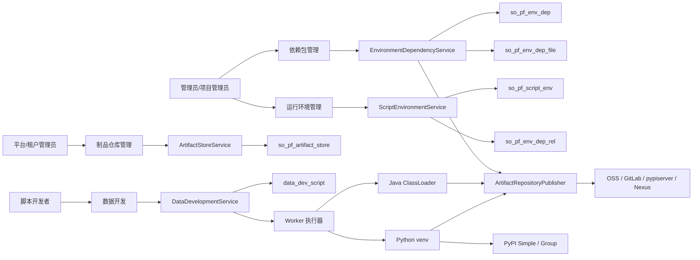
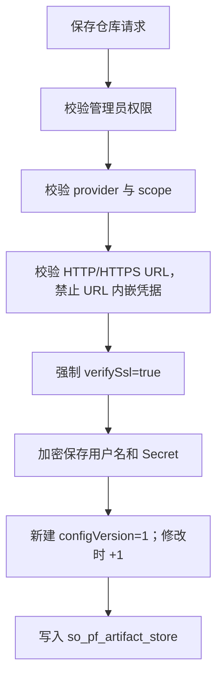
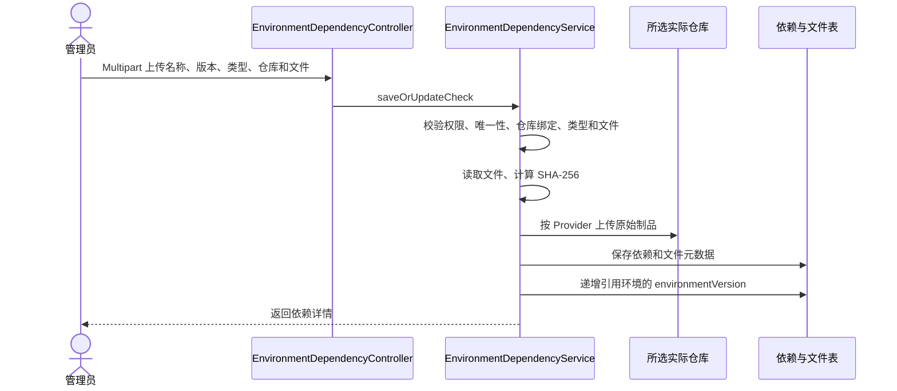
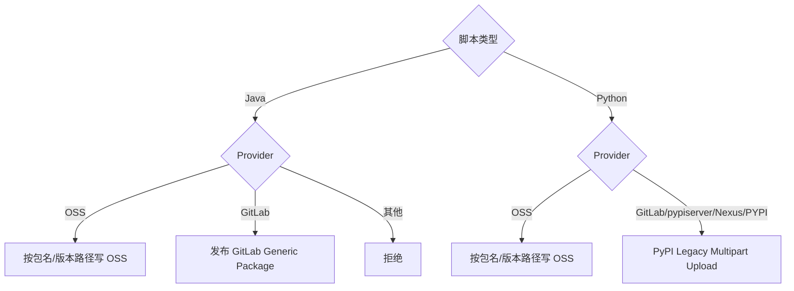
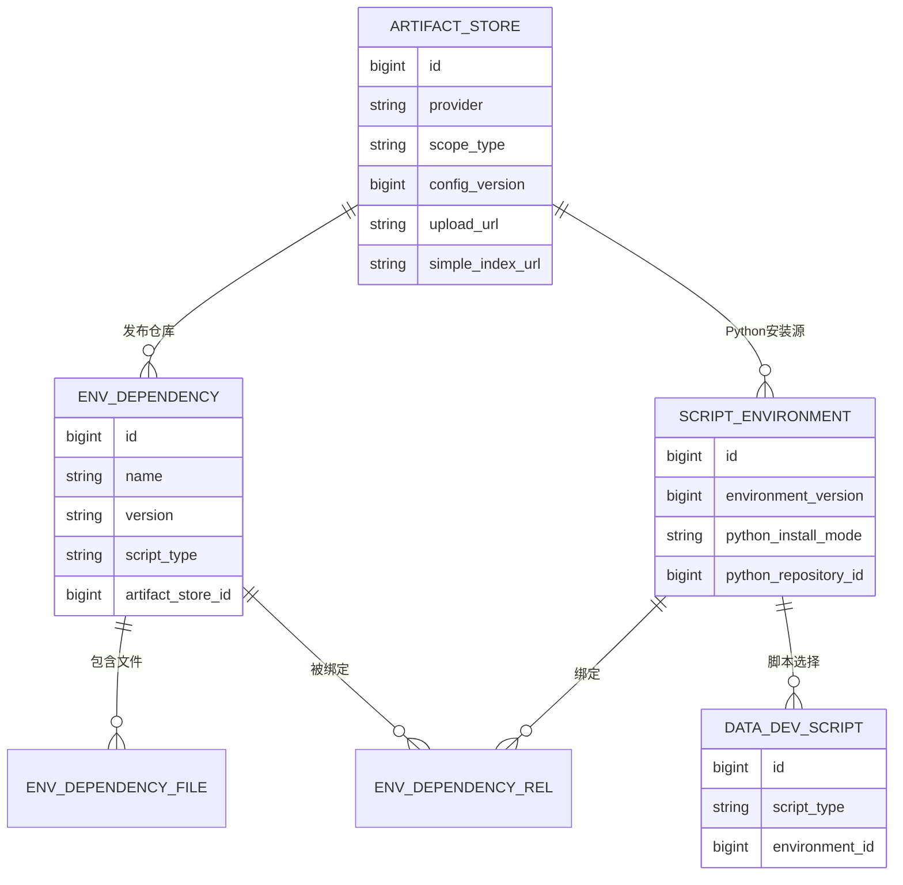
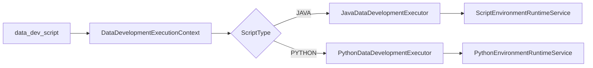
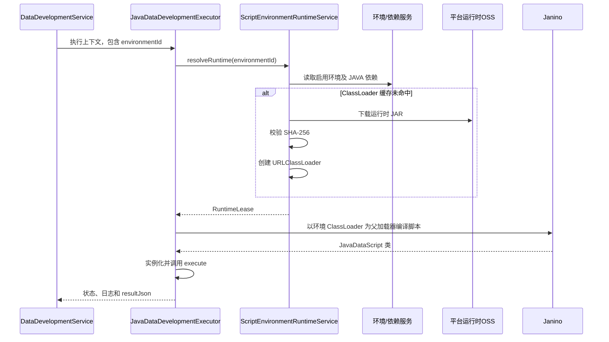
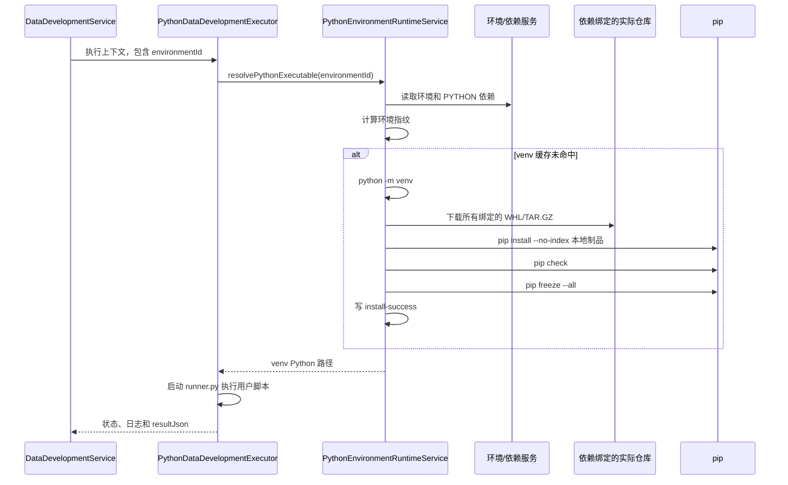
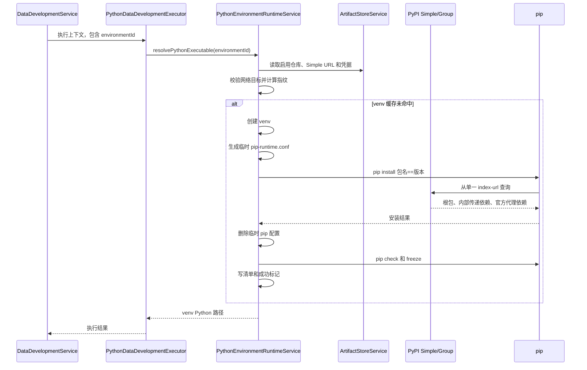

# Java 与 Python 依赖管理全链路逻辑说明

## 1. 文档目的

本文整理依赖管理从“仓库 → 依赖 → 环境 → 执行”的完整逻辑，覆盖：

- 公共平台如何维护 OSS、GitLab、pypiserver、Nexus 和通用 PyPI。
- Java JAR/ZIP 与 Python WHL/TAR.GZ 如何上传、保存和发布。
- 依赖版本如何组成可执行环境。
- Java ClassLoader 与 Python venv 如何在 Worker 上构建。
- 环境版本、仓库版本和运行时缓存如何联动。
- 当前代码已经实现的部分、尚未闭环的部分及后续调整点。

本文描述基于当前代码实现，不把目标设计误写成已经上线的能力。

## 2. 结论先行

整个模型可以概括为四层：

```text
仓库：保存“物理制品库在哪里、怎么认证”
  ↓
依赖：保存“具体包名、版本和制品文件是什么”
  ↓
环境：保存“某次脚本运行允许使用哪些依赖”
  ↓
执行：根据环境版本在 Worker 构建 ClassLoader 或 venv 后运行脚本
```

Java 与 Python 的主要区别：

| 项目 | Java | Python LOCAL_ARTIFACT | Python PYPI_LIVE |
| --- | --- | --- | --- |
| 根依赖 | 环境绑定的 Java 依赖 | 环境绑定的 Python 制品 | 环境绑定的 `包名==版本` |
| 传递依赖 | 不自动解析 | 不访问索引，需全部绑定 | 由 pip 从统一 Simple/Group 解析 |
| Worker 载体 | URLClassLoader | Python venv | Python venv |
| 制品来源 | 依赖绑定的 OSS/GitLab | 依赖绑定的实际仓库 | 环境选择的 Simple/Group |
| 缓存主键 | 环境 ID + 环境版本 | 环境、Python、根依赖指纹 | 环境、仓库、Python、根依赖指纹 |
| 执行入口状态 | 已闭环 | 已闭环 | 已闭环 |

Python 数据开发执行入口已经闭环：

1. 数据开发前端对 Java、Python 都显示并提交运行环境。
2. 后端 `DataDevelopmentService.resolveScriptEnvironmentId` 对 Java、Python 都校验并保留环境 ID。
3. Python 脚本强制绑定启用的环境，Worker 使用该环境构建或复用 venv，不再静默使用基础 Python。

在 `PYPI_LIVE` 模式下，pip 仍然只看到环境配置的一个 Simple Index。纯内网 pypiserver 必须关闭
公网 fallback，并提前同步根包及完整传递依赖；缺少任一分发文件时安装应明确失败。

## 3. 总体架构



## 4. 必须区分的两个“仓库”概念

这是全链路中最容易混淆的部分。

### 4.1 依赖制品仓库（唯一事实源）

字段位置：

```text
so_pf_env_dep.artifact_store_id
```

它表示依赖版本唯一绑定的物理仓库。平台不再额外生成运行时 OSS 备份：

- 选择 OSS：上传、页面下载、Worker 运行时下载和删除都直接操作该 OSS Bucket/Prefix。
- 选择 GitLab：Java 使用 Generic Package，Python 使用 PyPI Package/Simple。
- 选择 pypiserver、Nexus 或通用 PyPI：Python 上传到对应仓库，下载通过该仓库的 Simple Index。
- 文件元数据用 `artifact_store_id + name + version + original_file_name` 定位实际制品。
- 已上传文件的依赖不允许直接改绑仓库；如需迁移，应创建新版本并重新上传。

仓库不可用、文件不存在或校验和不一致时，页面下载和运行时构建都必须失败，不能回退到隐藏副本。

### 4.2 Python 安装源

字段位置：

```text
so_pf_script_env.python_repository_id
```

它只在 `PYPI_LIVE` 模式使用，表示 Worker 执行 `pip install` 时访问的 Simple/Group。

它与 `artifact_store_id` 的职责不同：

```text
artifact_store_id
  = 上传一个内部包时发布到哪里

python_repository_id
  = 构建整个 Python 环境时从哪里解析根依赖和传递依赖
```

Nexus 的典型配置：

```text
upload_url       → PyPI Hosted 上传地址
simple_index_url → PyPI Group /simple 地址
```

Hosted 保存内部包；Group 聚合 Hosted 和官方 PyPI Proxy。

## 5. 仓库层逻辑

### 5.1 数据模型

表：`so_pf_artifact_store`

| 字段 | 作用 |
| --- | --- |
| `store_name` | 仓库显示名称 |
| `store_code` | 租户内唯一编码 |
| `provider` | OSS、GITLAB、PYPISERVER、NEXUS、PYPI |
| `scope_type` | TENANT 或 PLATFORM |
| `config_version` | 仓库配置版本，用于 Python 缓存失效 |
| `endpoint` | 仓库基础地址 |
| `upload_url` | 上传地址 |
| `simple_index_url` | pip 使用的 Simple/Group 地址 |
| `bucket/region/root_prefix` | OSS 参数 |
| `username_ciphertext` | 加密用户名 |
| `secret_ciphertext` | 加密密码或 Token |
| `verify_ssl` | TLS 校验，公共平台强制开启 |
| `enabled` | 是否启用 |

### 5.2 范围与权限

仓库管理权限：

- 超级管理员。
- 租户管理员。

范围规则：

- `TENANT`：仅当前租户可见和使用。
- `PLATFORM`：所有租户可见，只有超级管理员可以创建和修改。

启用仓库列表会返回“当前租户仓库 + PLATFORM 仓库”。

### 5.3 保存逻辑



Nexus、通用 PyPI 必须提供 `simple_index_url`。

### 5.4 连接测试

- OSS：创建 OSS Client 并检查 Bucket 是否存在。
- 非 OSS：优先访问 `simple_index_url`，否则访问 `endpoint`。
- 存在凭据时使用 Basic Authorization。
- 网络目标经过运行时地址安全校验。

### 5.5 启停和删除

- 启停会递增 `config_version`。
- 停用后不能用于新上传或 PYPI_LIVE 环境构建。
- 删除前必须先停用。
- 仓库仍被依赖版本或脚本环境引用时禁止删除。

## 6. 仓库提供方能力矩阵

| Provider | Java 上传 | Python 上传 | Simple 安装 | 说明 |
| --- | --- | --- | --- | --- |
| OSS | 支持 | 支持保存文件 | 不支持 | 适合制品副本，不是标准 PyPI |
| GITLAB | Generic Package | GitLab PyPI | 支持 | 官方依赖需另外镜像或准备 |
| PYPISERVER | 不支持 | Legacy Upload | 支持 | 是否能获取官方依赖取决于服务端配置 |
| NEXUS | 当前 Java 不支持 | PyPI Hosted | 推荐使用 Group | 可聚合内部 Hosted 与官方 Proxy |
| PYPI | 不支持 | 标准/兼容上传 | 支持 | 泛化的 PyPI 兼容服务 |

Java 目前仅允许 OSS 和 GitLab。

## 7. 依赖层逻辑

### 7.1 数据模型

主表：`so_pf_env_dep`

| 字段 | 作用 |
| --- | --- |
| `name` | 依赖或包名 |
| `version` | 依赖版本；Python 必填 |
| `script_type` | JAVA 或 PYTHON |
| `artifact_store_id` | 上传时选择的发布仓库 |
| `artifact_url` | 旧版本兼容字段；新上传固定为空，不参与下载和运行时 |
| `artifact_type` | JAR、ZIP、WHEEL、SDIST |
| `checksum` | 主制品 SHA-256 |
| `enabled` | 是否可进入环境 |

文件表：`so_pf_env_dep_file`

| 字段 | 作用 |
| --- | --- |
| `dependency_id` | 所属依赖版本 |
| `original_file_name` | 原始文件名 |
| `artifact_type` | 文件类型 |
| `object_key/object_url` | 旧备份层兼容字段；新上传记录固定为空，不参与下载和运行时 |
| `checksum/size_bytes` | 完整性和大小 |
| `visible` | 是否在页面显示 |
| `runtime_artifact` | 是否直接进入运行时 |
| `source_file_id` | ZIP 提取 JAR 的来源文件 |
| `enabled` | 文件是否启用 |

一个依赖版本可以有多个文件，例如同版本 Python 包的多个平台 Wheel。

### 7.2 上传主流程



### 7.3 Java 文件处理

允许格式：

- `.jar`
- `.zip`

JAR：

- 原文件标记为 `runtime_artifact=1`。
- Worker 直接下载并加入 ClassLoader。

ZIP：

- 上传时遍历 ZIP 条目。
- 拒绝非法路径、空 JAR、无 JAR 的 ZIP。
- 仅把原 ZIP 上传到所选仓库，不生成提取 JAR 的持久化副本。
- Worker 构建 ClassLoader 时从所选仓库下载 ZIP，在自身版本缓存目录中安全解压 JAR。

Java 不解析 Maven POM，也不会自动从 Maven Central 拉取传递依赖。主 JAR 所需的其他 JAR 必须：

1. 作为单独依赖上传并绑定；或
2. 放在同一个 ZIP 中上传。

### 7.4 Python 文件处理

允许格式：

- `.whl` → WHEEL
- `.tar.gz` → SDIST

校验：

- Python 依赖必须有版本。
- 从 Wheel/sdist 文件名解析 distribution 与版本。
- 包名按 PEP 503 风格将 `-`、`_`、`.` 统一处理。
- 文件名中的包名和版本必须与依赖记录一致。
- 空文件和不支持的扩展名被拒绝。

### 7.5 外部发布逻辑



### 7.6 依赖变更对环境的影响

以下操作会查找引用该依赖的环境：

- 修改依赖。
- 上传或覆盖文件。
- 启用或停用依赖。
- 删除依赖。

对每个引用环境：

1. `environment_version + 1`。
2. 清理 Java ClassLoader 和编译缓存。
3. Python 下次构建因环境版本变化使用新指纹目录。

## 8. 环境层逻辑

### 8.1 环境的定位

环境不是物理文件目录的永久定义，而是一个“可执行依赖集合及版本快照”。

主表：`so_pf_script_env`

| 字段 | 作用 |
| --- | --- |
| `environment_name/code` | 名称和唯一编码 |
| `enabled` | 是否允许执行 |
| `use_application_parent` | Java 是否使用应用 ClassLoader 作为父加载器 |
| `environment_version` | 环境版本和 Java 缓存主键 |
| `python_install_mode` | LOCAL_ARTIFACT 或 PYPI_LIVE |
| `python_repository_id` | PYPI_LIVE 的 Simple/Group |

关系表：`so_pf_env_dep_rel`

```text
environment_id + dependency_id + sort_order
```

环境可以同时绑定 Java 和 Python 依赖。执行时按 `script_type` 过滤：

- Java 只读取 JAVA。
- Python 只读取 PYTHON。

### 8.2 数据关系



### 8.3 保存环境

保存步骤：

1. 校验环境名称、编码及唯一性。
2. 规范化并去重依赖 ID。
3. 检查所有依赖均属于当前租户且已启用。
4. 校验 Python 安装模式。
5. 如果是 `PYPI_LIVE`：
   - 必须选择启用的仓库。
   - 仓库不能是 OSS。
   - 仓库必须有 `simple_index_url`。
   - Python 根依赖必须同时有名称和版本。
   - 同一规范化包名不能选择多个根版本。
6. 新建环境版本为 1；修改时版本 +1。
7. 修改时删除旧关系并重建新关系。
8. 清理该环境的 Java 运行时缓存。

### 8.4 默认环境

默认编码：

```text
default-application
```

特性：

- 默认启用。
- 使用应用 ClassLoader 作为父加载器。
- Python 模式默认 `LOCAL_ARTIFACT`。
- 不允许改编码或停用。

## 9. 从脚本到执行器

脚本表 `data_dev_script` 保存：

```text
script_type
environment_id
content
datasource_id
execution_config_json
```

执行时：

1. `DataDevelopmentService` 读取脚本。
2. 构建 `DataDevelopmentExecutionContext`。
3. 按 `ScriptType` 从 `scriptExecutors` 中选择执行器。
4. Java 交给 `JavaDataDevelopmentExecutor`。
5. Python 交给 `PythonDataDevelopmentExecutor`。



## 10. Java 执行逻辑

### 10.1 时序



### 10.2 Java 运行时缓存

ClassLoader 缓存键：

```text
environmentId:environmentVersion
```

目录：

```text
runtime/script-environments/{workerInstanceId}/{environmentId}/{environmentVersion}
```

脚本编译缓存键：

```text
scriptId:environmentId:environmentVersion:sourceSha256
```

环境版本变化后：

- 新执行使用新 ClassLoader。
- 旧 Runtime 被标记为 retired。
- 已持有的 `RuntimeLease` 完成后再关闭，避免执行中途关闭 ClassLoader。
- 定时任务清理旧 Runtime 和孤立目录。

### 10.3 父加载器

`use_application_parent=true`：

- 环境 ClassLoader 可以看到 Studio 应用类路径。

`use_application_parent=false`：

- 使用受限父加载器，只暴露脚本 API 等允许能力。

## 11. Python LOCAL_ARTIFACT 执行逻辑

### 11.1 目标时序



### 11.2 特性

- 不访问任何 Python 索引。
- 所有根依赖和传递依赖都必须作为本地制品绑定到环境。
- 多个制品一次性交给 pip，使 pip 可以在本地文件集合中解析依赖。
- 缺少传递依赖时构建失败，不写成功标记。

## 12. Python PYPI_LIVE 执行逻辑

### 12.1 根依赖生成

环境绑定的 Python 依赖只作为根依赖元数据：

```text
corp-root==1.0.0
numpy==1.26.4
```

Worker 不直接使用这些依赖记录的 OSS 文件，而是从环境选择的 Simple/Group 安装。

### 12.2 时序



### 12.3 单一源策略

临时 pip 配置会：

- 设置一个 `index-url`。
- 清空 `extra-index-url`。
- 清空 `find-links`。
- 覆盖继承的 pip 环境变量。
- HTTPS 情况下不设置 trusted-host。
- 设置超时和重试。
- 禁用 pip 下载缓存，venv 本身作为平台缓存。

这样可以减少依赖混淆，不允许 Worker 同时在私有源和公网源中按“最高版本”混选。

要获取官方依赖，应在仓库侧预同步或聚合，Worker 不增加第二个索引。允许访问受控代理的环境
可构建 Group：

```text
Nexus Group
├── Internal Hosted
└── Official PyPI Proxy
```

纯内网 pypiserver 必须预先准备根包及完整传递依赖，并且不配置 `--fallback-url`：

```powershell
D:\pypiserver\.venv\Scripts\pypi-server.exe run `
  -i 127.0.0.1 -p 8080 -a . -P . -o `
  --disable-fallback `
  D:\pypiserver\packages
```

这条链路是 `pip → http://127.0.0.1:8080/simple/` 单一内网源。缺少任何根包、传递依赖或
兼容平台 Wheel 时安装应直接失败，不能由运行节点访问公网补齐。外部依赖必须在联网同步区完成
下载、校验、审批后再导入内网仓库。

注意：当前 pypiserver 版本在省略 `--fallback-url` 时仍会默认重定向到 PyPI，纯内网模式必须
显式传入 `--disable-fallback`；仅删除 `--fallback-url` 参数不足以阻断公网回退。

### 12.4 凭据处理

1. 数据库只保存加密凭据。
2. 接口只返回 `hasUsername/hasSecret`。
3. Worker 解密后把凭据写入临时 `pip-runtime.conf`。
4. 凭据不出现在 pip 命令行参数中。
5. 成功或失败都会删除临时配置。
6. 错误输出对明文和 URL 编码后的凭据进行替换。

### 12.5 Python 环境指纹

指纹包含：

```text
environmentId
environmentVersion
pythonInstallMode
Python implementation/version/OS/architecture
repositoryId
repositoryConfigVersion
simpleIndexUrl
rootRequirements
```

运行目录默认值：

```text
runtime/python-environments/
  {environmentId}/
    {environmentVersion}/
      {fingerprint}/
        .venv/
        root-requirements.txt
        installed-packages.txt
        install-success
```

可通过 `STUDIO_PYTHON_ENV_CACHE_DIR` 配置缓存根目录。Windows 必须优先使用较短的绝对路径；
环境 ID、版本、64 位指纹和 pip 自带的深层包路径叠加后，默认深目录可能超过 `MAX_PATH`，
导致 `python -m venv` 的 `ensurepip` 阶段失败。

只有 Python 可执行文件存在且 `install-success` 内容与指纹一致时才算缓存命中。

## 13. Python 脚本进程

环境准备完成后，`PythonDataDevelopmentExecutor`：

1. 创建临时工作目录。
2. 写入：
   - `user_script.py`
   - `studio_runtime.py`
   - `runner.py`
   - `context.json`
3. 启动本地 Bridge，为 Python 脚本提供数据源、模型和 SQL 等平台服务。
4. 使用环境 venv 的 Python 启动 runner。
5. 读取 `result.json`。
6. 返回成功状态、日志、耗时和业务结果。
7. 最终删除脚本临时工作目录。

venv 缓存目录与单次脚本工作目录是两个概念：

- venv 缓存可以跨执行复用。
- 单次脚本工作目录执行结束后删除。

## 14. Python 数据开发执行入口闭环

### 14.1 前端

`DataDevelopmentView.vue` 当前逻辑：

```text
Java 或 Python 时展示运行环境选择器
保存 Java/Python 脚本时提交 environmentId
未选择环境时禁用保存与执行
```

### 14.2 后端

`DataDevelopmentService.resolveScriptEnvironmentId` 当前逻辑等价于：

```java
if (scriptType != JAVA && scriptType != PYTHON) {
    return null;
}
if (scriptType == PYTHON && environmentId == null) {
    throw badRequest("Python script environment is required");
}
return requireEnabledEnvironment(environmentId).getId();
```

列表、树、详情、保存、直接执行和保存后执行均保留 Python `environmentId` 与环境名称。

### 14.3 运行时

`PythonDataDevelopmentExecutor` 调用：

```text
resolvePythonExecutable(context.environmentId)
```

Python 采用强制选择环境策略。首次执行按环境模式创建 `.venv` 并安装依赖，后续按环境、仓库、
Python 和根依赖指纹复用；环境 ID 缺失或环境被禁用时在派发前明确失败。

## 15. 版本与缓存失效逻辑

| 变更 | environmentVersion | store configVersion | Java 重建 | Python 重建 |
| --- | ---: | ---: | --- | --- |
| 新建环境 | 1 | 不变 | 首次构建 | 首次构建 |
| 修改环境依赖 | +1 | 不变 | 是 | 是 |
| 刷新环境 | +1 | 不变 | 是 | 是 |
| 启停环境 | +1 | 不变 | 是 | 是 |
| 修改被引用依赖 | +1 | 不变 | 是 | 是 |
| 上传/覆盖依赖文件 | +1 | 不变 | 是 | LOCAL 是；LIVE 根版本不变时也因环境版本重建 |
| 启停被引用依赖 | +1 | 不变 | 是 | 是 |
| 修改 Python 仓库配置 | 不变 | +1 | 无影响 | PYPI_LIVE 是 |
| 启停 Python 仓库 | 不变 | +1 | 无影响 | PYPI_LIVE 拒绝或重建 |
| 更换 Python 解释器 | 不变 | 不变 | 无影响 | 指纹变化，重建 |

## 16. 启用、停用与删除

### 16.1 仓库

- 停用后不可用于发布和 PYPI_LIVE。
- 删除前必须停用。
- 依赖或环境仍引用时禁止删除。

### 16.2 依赖

- 只有启用依赖会进入运行时。
- 启停和修改会递增引用环境版本。
- Python 外部包版本删除：
  - OSS：删除对应对象。
  - GitLab：查询并删除包版本。
  - pypiserver/Nexus/通用 PyPI：当前没有统一删除实现，会失败关闭。
- Python 非 OSS 仓库不支持单文件删除，避免破坏远端版本完整性。

当前需要补强：

- 删除仍被环境关系引用的依赖前，应明确拒绝或事务内解除关系。
- 当前依赖删除逻辑会删除依赖和文件并递增环境版本，但没有在删除前显式拒绝引用，也没有明确删除关系记录，可能留下悬挂关系。
- Java 删除依赖时尚未同步清理外部 OSS/GitLab 发布物。

建议采用：

```text
存在环境引用 → 拒绝删除并返回引用环境
解除所有环境绑定 → 再删除依赖和远端制品
```

### 16.3 环境

- 默认环境不允许停用或改编码。
- 普通环境停用后执行时被拒绝。
- 环境刷新只递增版本并清理缓存，不改变依赖关系。

## 17. 权限与多租户

| 资源 | 管理角色 | 数据范围 |
| --- | --- | --- |
| 制品仓库 | 超级管理员、租户管理员 | 当前租户 + PLATFORM 可读 |
| 依赖 | 超级管理员、租户管理员、管理员、项目管理员 | 当前租户 |
| 环境 | 超级管理员、租户管理员、管理员、项目管理员 | 当前租户 |
| 脚本 | 项目资源权限 | 当前租户和当前项目 |

主要隔离规则：

- 仓库、依赖、环境查询均校验 `tenant_id`。
- PLATFORM 仓库是唯一跨租户共享的物理配置。
- 租户不能修改其他租户或 PLATFORM 仓库。
- 依赖文件下载也必须先校验依赖所属租户。
- Worker 执行上下文携带租户、用户、项目和运行集群信息。

## 18. 安全逻辑

### 18.1 文件安全

- 文件名去除目录部分，阻止直接路径穿越。
- Java ZIP 条目校验绝对路径、`..` 和非法路径。
- 文件计算 SHA-256。
- Worker 下载后再次校验 Java 制品 checksum。
- ArtifactLoader 限制最大制品大小。
- 本地文件默认禁用；启用后必须位于允许根目录。

### 18.2 网络安全

- 运行时 URL 仅允许 HTTP/HTTPS。
- 拒绝 URL 内嵌 userinfo。
- 拒绝云元数据地址。
- 私网/本地地址必须显式加入允许列表。
- HTTP 仅允许给明确允许的主机。
- 响应体有大小上限，连接和读取有超时。

### 18.3 供应链安全

当前已经具备：

- 单一 PyPI index。
- 禁止继承 extra-index/find-links。
- 根依赖精确版本。
- 安装结果记录。
- 临时凭据和日志脱敏。

尚未具备：

- 传递依赖 lock。
- `--require-hashes`。
- 包签名校验。
- SBOM。
- 漏洞和许可证扫描。
- Python 包审批、冻结和撤回流程。

## 19. 前端页面与后端服务映射

| 页面 | 主要服务 | 作用 |
| --- | --- | --- |
| 制品仓库管理 | `ArtifactStoreController/Service` | 维护物理仓库和凭据 |
| Python 包管理 | `PythonPackageController` | 按规范化包名查看版本 |
| 运行环境管理-依赖 | `EnvironmentDependencyController/Service` | 上传 Java/Python 制品 |
| 运行环境管理-环境 | `ScriptEnvironmentController/Service` | 绑定依赖和 Python 安装源 |
| 数据开发 | `DataDevelopmentService` | 脚本绑定环境并派发执行 |

关键接口：

```text
/api/v1/artifact-stores
/api/v1/environment-dependencies
/api/v1/python-packages
/api/v1/script-environments
```

## 20. 推荐使用流程

### 20.1 Java

```text
1. 超级管理员/租户管理员维护 OSS 或 GitLab
2. 管理员上传 JAR/ZIP，填写依赖名称和版本
3. 如有传递 JAR，全部上传或放入 ZIP
4. 新建 Java 运行环境并绑定依赖
5. Java 脚本选择该环境
6. 保存并执行
7. 更新依赖后确认环境版本递增
```

### 20.2 Python LOCAL_ARTIFACT

```text
1. 上传根包和全部传递依赖 WHL/TAR.GZ
2. 新建环境，选择 LOCAL_ARTIFACT
3. 绑定全部 Python 制品
4. Python 脚本选择该环境
5. Worker 离线构建 venv 并执行
```

第 14 节的环境 ID 传递已闭环，可直接按上述流程执行。

### 20.3 Python PYPI_LIVE

```text
1. 平台管理员维护 Nexus：
   - uploadUrl = Hosted
   - simpleIndexUrl = Group /simple
2. Group 聚合内部 Hosted 和官方 PyPI Proxy
3. 上传内部 Python 包到 Hosted
4. 新建环境并选择 PYPI_LIVE
5. 选择 Group 作为 Python 源
6. 环境只绑定业务根依赖
7. Python 脚本选择该环境
8. Worker 执行 pip install 根包==版本
9. pip 从 Group 自动解析内部和官方传递依赖
10. 执行脚本并保留安装清单
```

第 14 节的环境 ID 传递已闭环，可直接按上述流程执行。

## 21. 当前实现状态

| 模块 | 状态 | 说明 |
| --- | --- | --- |
| 仓库管理 | 已实现 | OSS/GitLab/pypiserver/Nexus/PYPI |
| 平台/租户范围 | 已实现 | PLATFORM 仅超级管理员可修改 |
| 凭据加密与脱敏 | 已实现 | API 不返回原文 |
| Java 上传 | 已实现 | JAR/ZIP，OSS/GitLab |
| Python 上传 | 已实现 | WHL/TAR.GZ，多种 PyPI 提供方 |
| Python 包版本列表 | 已实现 | 按规范化名称聚合 |
| 环境绑定混合依赖 | 已实现 | 执行时按语言过滤 |
| Java 环境执行 | 已闭环 | 脚本可选择环境 |
| Python LOCAL runtime | 已实现 | venv 与离线安装逻辑存在 |
| Python PYPI_LIVE runtime | 已实现 | 单一源、传递依赖、缓存、脱敏 |
| Python 脚本选择环境 | 已闭环 | 前端选择、保存、展示、后端校验和 Worker 执行均保留环境 ID |
| pypiserver 纯内网依赖 | 已闭环（本地） | pip 使用单一 Simple；pypiserver 显式禁用回退，根包和全部传递依赖必须预先同步 |
| Windows Python venv | 已闭环 | 缓存根可配置为短路径，避免 `ensurepip` 因 `MAX_PATH` 失败 |
| Python 可重复锁定 | 未实现 | 当前是实时解析并记录 freeze |
| Java 外部制品删除 | 未完整实现 | 删除依赖不会统一清理外部发布物 |
| 依赖引用删除保护 | 需补强 | 应阻止删除仍被环境引用的依赖 |

## 22. 代码位置索引

### 仓库

```text
backend/studio-infra/.../service/ArtifactStoreService.java
backend/studio-infra/.../service/ArtifactRepositoryPublisher.java
backend/studio-server/.../controller/ArtifactStoreController.java
frontend/apps/web/src/views/ArtifactStoresView.vue
```

### 依赖

```text
backend/studio-infra/.../service/EnvironmentDependencyService.java
backend/studio-server/.../controller/EnvironmentDependencyController.java
backend/studio-server/.../controller/PythonPackageController.java
frontend/apps/web/src/views/ScriptEnvironmentsView.vue
frontend/apps/web/src/views/PythonPackagesView.vue
```

### 环境

```text
backend/studio-infra/.../service/ScriptEnvironmentService.java
backend/studio-infra/.../service/ScriptEnvironmentRuntimeService.java
backend/studio-infra/.../service/PythonEnvironmentRuntimeService.java
backend/studio-server/.../controller/ScriptEnvironmentController.java
```

### 执行

```text
backend/studio-infra/.../service/DataDevelopmentService.java
backend/studio-infra/.../service/JavaDataDevelopmentExecutor.java
backend/studio-infra/.../service/PythonDataDevelopmentExecutor.java
backend/studio-worker/.../config/WorkerDatasourceExecutionConfiguration.java
frontend/apps/web/src/views/DataDevelopmentView.vue
```

### 数据库

```text
backend/studio-server/src/main/resources/schema-mysql.sql
backend/studio-desktop-runtime/src/main/resources/schema-sqlite.sql
backend/studio-infra/.../service/StudioSchemaUpgradeService.java
```

## 23. 后续实施优先级

### P0：Python 执行闭环回归

1. 持续执行页面 → 保存 → Worker → venv → Python import 的端到端回归。
2. 覆盖 pypiserver 中根包和全部传递依赖均已预同步的纯内网安装用例。
3. Worker 的版本化工作流节点解析器已恢复，并通过针对性单元测试。

### P1：数据完整性

1. 禁止删除仍被环境引用的依赖。
2. 补全 Java 外部制品删除策略。
3. 增加仓库、依赖、环境变更审计。
4. 增加 venv/JAR 缓存配额和清理。

### P2：可重复构建和供应链治理

1. 解析并保存 lock。
2. 使用哈希锁定安装。
3. 漏洞、许可证和 SBOM。
4. 包审批、冻结、撤回和归档。
5. Java Maven Hosted/Proxy/Group。

## 24. 配套文档

测试范围和用例见：

```text
docs/测试/Java与Python依赖管理测试计划.md
```

## 25. 2026-07-29 本地闭环实测

本地按完整 Studio 入口完成了以下验证：

1. 启动 pypiserver，pip 仅配置 `http://127.0.0.1:8080/simple/`。
2. Simple Index 提供根包 `studio-pypiserver-smoke==0.2.0`。
3. 根包声明本地不存在的传递依赖 `packaging==25.0`，由 pypiserver 服务端回退获取。
4. Studio 新建 `PYPI_LIVE` 环境，并在数据开发中保存绑定该环境的 Python 脚本。
5. 在线 Worker 创建独立 venv、执行 `pip check`、保存 `pip freeze --all` 和成功标记。
6. Python 脚本执行成功，结果同时返回根包结果、`packaging=25.0` 和该 venv 的解释器路径。
7. 第二次执行命中同一环境缓存并继续成功。

实测安装清单：

```text
packaging==25.0
pip==26.1.2
studio-pypiserver-smoke==0.2.0
```

## 26. 2026-07-30 NumPy 大 Wheel 上传与执行实测

在第 25 节链路基础上，继续完成了二进制科学计算包的真实上传、环境更新和执行验证：

1. pip 仅使用 `http://127.0.0.1:8080/simple/`，由 pypiserver 的受控上游回退下载与
   Python 3.13/Windows AMD64 兼容的
   `numpy-2.5.1-cp313-cp313-win_amd64.whl`。
2. 通过 Studio `saveOrUpdateCheck` 上传 12,425,674 字节的 Wheel。为支持这类正常的大型
   二进制包，Server 和 Desktop Runtime 的 multipart 默认上限分别调整为单文件 `64MB`、
   请求总大小 `70MB`，并可由环境变量覆盖。
3. 上传成功后，`/simple/numpy/` 返回 `200` 且包含该 Wheel；Studio 保存的 SHA-256 为
   `6c3fe51bc6a16453d452997053454f309e8e0ed7b42d6b361ce4ac8c32913d74`。
4. 更新既有环境时发现关系表使用逻辑删除，但唯一键为
   `(environment_id, dependency_id)`，原实现“逻辑删除后重新插入”会触发重复键。
   当前实现改为先将现有关系标记为删除，再按请求恢复并更新已有关系，仅插入真正新增的关系；
   环境更新回归测试已覆盖该场景。
5. `python-pypiserver-live-smoke` 环境成功从版本 `1` 升级到 `2`，同时绑定
   `studio-pypiserver-smoke==0.2.0` 和 `numpy==2.5.1`。
6. 保存的数据开发 Python 脚本成功执行 NumPy 数组求和、矩阵向量乘法与均值计算：

```text
numpyVersion=2.5.1
shape=[2, 3]
columnSums=[5.0, 7.0, 9.0]
matrixVectorProduct=[14.0, 32.0]
mean=3.5
rootPackageResult=pypiserver
transitivePackagingVersion=25.0
```

实际虚拟环境：

```text
D:\javaProject\DataAggregation\runtime\pyenvs\2082405486937264129\2\
9736f7a1449f85fdcbdccbd7ccab81bf1f5c45583ab65248a14ef93c78178ebb\.venv
```

虚拟环境内 `python -m pip check` 返回 `No broken requirements found.`，关键安装清单为：

```text
numpy==2.5.1
packaging==25.0
studio-pypiserver-smoke==0.2.0
```

首次运行包含 venv 构建和安装，Worker 记录的脚本执行耗时约 `23.9s`；第二次执行复用相同
Python 路径和环境指纹，脚本执行耗时约 `1.1s`。因此，Studio 上传 → pypiserver Simple
可见 → 环境绑定/升版 → Worker 创建 venv → NumPy import/计算 → 缓存复用的入口已闭环。
