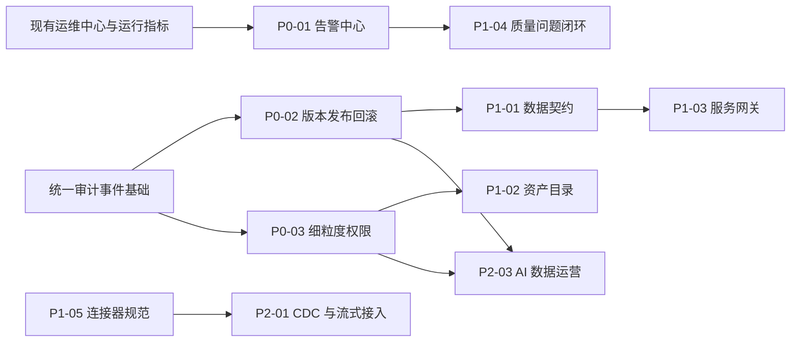

# Data Aggregation Studio 未来规划路线图

更新时间：2026-07-14

规划依据：当前 Web 系统实机浏览、现有代码与项目文档、当前测试数据基线，以及 DataWorks、Apache SeaTunnel、OpenMetadata、Apache APISIX 等同类产品能力边界。

## 1. 产品定位

Data Aggregation Studio 的目标定位是：

> 面向私有化部署和复杂异构系统场景的一体化数据集成、数据服务交付与 DataOps 运营平台。

系统以 DataAggregation 插件与执行能力为底座，围绕数据源、模型、采集、开发、工作流、数据服务、质量和运维形成统一控制面。它不是单一 ETL 工具，也不是纯数据目录或通用 API 网关，而是以“数据集成与数据服务交付”为核心、以元数据治理和生产运营为支撑的数据平台。

### 1.1 目标用户

| 用户 | 核心诉求 |
| --- | --- |
| 数据工程师 | 配置数据源、模型、批量采集、数据开发、工作流和质量任务。 |
| 平台管理员 | 管理租户、项目、权限、Worker、运行环境和资源共享。 |
| 运维人员 | 统一查看任务、队列、Worker、服务调用、日志和告警。 |
| 业务系统开发者 | 发布或订阅 REST、SOAP、数据接入和协议转换服务。 |
| 数据治理人员 | 管理业务目录、字段口径、质量问题、血缘和变更影响。 |

### 1.2 重点适用场景

- 政企、制造、金融等需要私有化部署和内网运行的环境。
- 数据库、文件、消息队列、HTTP、SOAP 等异构系统的数据交换。
- 国产数据库、传统 WebService 和存量系统较多的企业集成场景。
- 既需要数据同步，又需要把数据快速交付为 API 的数据团队。
- 需要 Web 在线运行和桌面离线运行两种形态的项目。

### 1.3 产品边界

- 不自建通用大数据计算引擎，复杂批流计算继续复用 Flink、Spark 或 DataAggregation 执行能力。
- 不自研完整企业 API 网关，流量治理优先与 Apache APISIX 等成熟网关集成。
- 不把统计分析扩展成通用 BI 产品，统计能力服务于模型验证、资产洞察和运行分析。
- 不直接复制大型数据治理套件，先围绕本平台真实任务、模型、服务和质量数据建立闭环。

## 2. 当前能力与成熟度

### 2.1 已形成的主链路

当前系统已经具备以下端到端能力：

1. 数据源注册、元模型驱动配置、连接检测和模型发现。
2. 模型同步、模型详情、样例预览、统计分析和表级/字段级血缘。
3. 单表采集、全量/增量配置、字段映射、Transformer、调度和运行指标。
4. SQL、模型 Flink SQL、Java、Python 脚本开发及依赖环境管理。
5. 采集任务、质量任务、脚本、HTTP 和 Shell 节点的工作流编排。
6. 数据查询服务、数据接入服务、REST/SOAP 协议转换和订阅 Token。
7. 质量规则、质量任务、质量运行记录、质量指标和风险分析。
8. 租户、项目、成员、访问申请、Worker 下发、资源共享和站内信。
9. 统一运维中心、运行日志、开放调用日志、服务指标和 Worker 心跳。
10. 支持 Chat、Plan、Goal 模式和受控操作目录的 Studio AI 助手。

### 2.2 当前环境基线

以下数据仅用于描述 2026-07-13 当前环境状态，不代表产品容量上限：

| 指标 | 当前值 | 说明 |
| --- | ---: | --- |
| 数据源 | 43 | 默认项目中已注册的数据源。 |
| 模型 | 63 | 包含数据库、HTTP 和文件类模型。 |
| 纳管数据源类型 | 18 | 其中 13 种具备 Reader，11 种具备 Writer。 |
| 已上线采集任务 | 2 | 当前首页可编排任务数。 |
| 采集运行记录 | 19 | 18 成功、1 失败。 |
| 脚本资产 | 4 | 模型 Flink SQL 1 个、Java 3 个。 |
| 已发布工作流 | 0 | 工作流能力已实现，但当前缺少真实业务样例。 |
| 数据接入服务 | 0 | 编辑与监控能力已实现，当前缺少有效业务实例。 |
| 质量任务 | 0 | 规则和指标能力已实现，质量执行闭环尚未被实际使用。 |
| 在线 Worker | 1 | 当前项目已下发且在线。 |
| 已发布数据服务调用 | 70 | 最近 7 天 4 个已发布服务的调用量。 |

### 2.3 当前成熟度判断

| 维度 | 判断 | 主要依据 |
| --- | --- | --- |
| 功能广度 | 较高 | 已覆盖集成、开发、编排、服务、质量、权限和运维。 |
| 执行深度 | 中高 | 采集、HTTP/SOAP、服务调用和日志已有真实运行记录。 |
| 生产闭环 | 中高 | 统一告警已形成首版闭环，仍缺配置版本回滚、统一审计和资源级权限。 |
| 资产治理 | 中低 | 有模型和血缘，但缺少业务目录、口径、负责人和影响分析。 |
| 服务运营 | 中等 | 有 Token、日志和指标，缺少限流、配额、白名单和开发者门户。 |
| 产品化程度 | 中等 | 默认项目存在较多回归测试数据，部分页面加载状态和首屏性能仍需治理。 |

当前阶段定义为：

> 已超过 MVP，正在从“功能型数据平台”进入“生产级数据运营平台”建设阶段。

## 3. 建设原则

| 原则 | 说明 |
| --- | --- |
| 生产风险优先 | 优先解决告警、版本、回滚、权限、审计、凭据和高可用问题。 |
| 闭环优先 | 已有功能先形成发现、处理、验证和追溯闭环，再横向增加菜单。 |
| 标准优先 | 优先采用 OpenAPI、AsyncAPI、OpenLineage、OIDC、OpenTelemetry 等标准。 |
| 集成优先 | API 网关、密钥管理和外部通知优先集成成熟组件，不重复建设通用基础设施。 |
| 兼容优先 | 新治理能力不得破坏现有采集、REST、SOAP、Token 和 Worker 调度链路。 |
| 数据最小化 | 日志、审计和 AI 上下文不得持久化明文密码、Token 或完整敏感请求体。 |
| 可验收 | 每个规划项必须有明确交付物、验收标准、测试计划和回滚策略。 |

## 4. 优先级定义

| 优先级 | 定义 | 是否阻塞生产交付 |
| --- | --- | --- |
| P0 | 生产可运营、安全和发布基础。 | 是。 |
| P1 | 资产、服务和质量治理闭环。 | 不阻塞小规模试用，但阻塞企业级推广。 |
| P2 | 实时、生态、成本和智能化扩展。 | 否。 |

状态定义：

| 状态 | 含义 |
| --- | --- |
| 已完成 | 首版已实现并完成构建、测试或页面验证。 |
| 部分完成 | 已有基础能力，但关键闭环未完成。 |
| 未开始 | 尚未形成可验收功能。 |

## 5. 具体实现优先级

以下顺序是实际建议的实施顺序。同一优先级内也必须按编号推进，不建议同时开启多个高风险基础改造。

| 顺序 | 编号 | 规划项 | 当前状态 | 首版核心交付 | 实施复杂度 |
| ---: | --- | --- | --- | --- | --- |
| 1 | P0-01 | 统一告警规则中心 | 已完成 | 告警规则、事件、站内信/Webhook、去重和静默。 | 中 |
| 2 | P0-02 | 配置版本、发布与回滚 | 未开始 | 配置快照、版本差异、发布检查、历史版本和回滚。 | 高 |
| 3 | P0-03 | 审计、细粒度权限与凭据安全 | 部分完成 | 统一审计、资源级授权、敏感日志权限、凭据托管接口。 | 高 |
| 4 | P0-04 | 首屏性能、状态可信度与数据环境治理 | 部分完成 | 加载态治理、慢查询优化、远程分页、测试数据隔离。 | 中 |
| 5 | P0-05 | 高可用、备份恢复与外部可观测性 | 部分完成 | Server/Worker 高可用基线、备份恢复、Prometheus/OpenTelemetry。 | 高 |
| 6 | P1-01 | 数据契约与 Schema 演进 | 未开始 | 契约版本、兼容性检查、废弃计划和订阅方影响分析。 | 高 |
| 7 | P1-02 | 智能资产目录 | 部分完成 | 业务目录、主题域、负责人、术语、标签、全局搜索和影响分析。 | 中 |
| 8 | P1-03 | 服务网关与开发者门户 | 部分完成 | 限流、配额、白名单、自动文档、订阅审批和 SLA。 | 中 |
| 9 | P1-04 | 数据质量问题闭环 | 部分完成 | 问题单、责任人、SLA、评论、关闭/重开和重复问题合并。 | 中 |
| 10 | P1-05 | 连接器能力一致性与插件生态 | 部分完成 | 能力分级、插件 SDK、兼容测试和优先连接器补齐。 | 中高 |
| 11 | P2-01 | CDC 与持续流式接入 | 未开始 | CDC、持续消费、Checkpoint、位点、重试、死信和幂等。 | 高 |
| 12 | P2-02 | 多租户配额、容量和成本治理 | 部分完成 | 并发配额、Worker 容量、日志容量、服务配额和租户报表。 | 高 |
| 13 | P2-03 | AI 数据运营与智能问数 | 部分完成 | 故障分析、发布检查、影响分析、Text-to-Flink SQL 和审批执行。 | 中高 |

## 6. P0：生产可交付

### 6.1 P0-01 统一告警规则中心

#### 建设目标

让运维中心发现的问题可以主动通知责任人，而不是依赖人工刷新页面。

#### 首版范围

- 告警对象：采集任务、质量任务、工作流、数据服务、数据接入服务、协议转换服务、Worker 组、调度队列和日志存储。
- 告警条件：执行失败、连续失败、运行超时、服务失败率、接入写入失败、Worker 离线、队列积压、调度延迟和日志上传失败。
- 通知通道：站内信和通用 Webhook。邮件、企业微信、钉钉作为后续通道扩展。
- 告警治理：去重、静默时间、恢复通知、最近触发记录和手动关闭。
- 权限范围：规则按项目隔离，租户管理员可查看租户内规则摘要。

#### 依赖

- 现有站内信、运行指标、服务指标、Worker lease、运维中心和日志异常数据。

#### 验收标准

1. 可以按项目创建、启用、停用和测试告警规则。
2. 同一对象的重复异常不会在短时间内产生通知风暴。
3. 恢复后产生恢复通知，并保留触发和恢复时间。
4. 通知可跳转到具体任务、服务、Worker 或运行日志。
5. 告警内容不包含明文密码、Token 和完整敏感请求体。

#### 阶段完成记录（2026-07-15）

- 已交付九类规则、五张告警表、项目隔离、租户摘要、事件状态机、静默/恢复/重开和乐观锁并发控制。
- 已交付站内信 outbox、加密 Webhook、固定消息协议、HMAC-SHA256、SSRF 防护、失败重试和人工重试。
- 已接入任务执行、三类开放服务调用、Worker、队列、调度延迟和日志归档信号，并补齐协议转换失败率与单次调用失败监控。
- 已交付 `/api/v1/alerts`、AI operation catalog、SDK、`/alerts` 页面、中英文文案、桌面端路由入口和联调/安全/升级文档。
- 已完成 MySQL 升级、SQLite/桌面运行时后端验证、103 项告警专项测试和 13 项跨模块回归测试（5 项权限 API、4 项执行事件、4 项索引队列生命周期）；474 项后端全量测试作为既有回归基线保留。
- `npm run build:web` 与 `npm run build:desktop` 均通过；Desktop 已修复 Web 源码复用别名和 SSE API 边界，不再阻塞告警中心发布。
- 最终人工审查补齐了投递批次与事件型规则单条隔离、任务资源租户/项目约束、禁用通道 `SKIPPED` 语义、已删除通道的无效重试拦截、旧规则评估结果并发覆盖保护，以及 Webhook 总开关下站内信批次不被阻塞。
- 状态型规则启用后会在事务提交后立即评估；Worker 离线证据仅统计有效 lease 并保留上报在线数；告警恢复后重开会清理旧确认状态，历史确认仍保留在事件时间线中。
- 索引队列改为有限、按需排空的工作线程，并通过生命周期回归测试；本轮告警专项与跨模块测试未产生 Surefire JVM dump。
- Webhook 响应摘要会脱敏完整地址、短路径、查询参数、自定义 Header、动态签名和签名密钥；证据中的 API Key、Access Key、Private Key 和 Credential 等敏感键也统一脱敏。
- 已使用最新后端完成真实登录与 HTTP 闭环，验证九类规则元数据、规则创建/启停/测试、站内信投递、租户摘要、固定协议、HMAC 签名、`500` 后人工重试成功、`429` 退避、`400` 终止、超时重试和安全默认配置拒绝本地 HTTP。
- 已完成 1440×900、390×844 浏览器页面检查，验证规则创建/测试/启停/删除、Webhook 表单、汇总钻取和移动端无横向溢出；控制台无新增错误。
- P0-01 首版状态更新为“已完成”。现有前端 chunk 体积和 Desktop circular chunk 构建警告不影响功能验收，后续并入 P0-04 性能与工程治理处理。

### 6.2 P0-02 配置版本、发布与回滚

#### 建设目标

把“保存/发布即生效”升级为可审查、可追溯、可回滚的配置生命周期。

#### 首版范围

- 覆盖采集任务、工作流、质量任务、数据服务和数据接入服务。
- 统一配置快照、版本号、发布说明、发布人和发布时间。
- 支持当前草稿与已发布版本差异查看。
- 发布前检查数据源可用性、模型字段、映射、调度、Token 策略和依赖资源。
- 支持回滚到任意历史发布版本。
- 保存草稿、发布、下线和回滚事件写入统一审计。

#### 首版不包含

- 跨环境自动发布流水线。
- 外部审批系统深度集成。
- Git 仓库双向同步。

#### 验收标准

1. 任一已发布对象可追溯完整版本内容和发布人。
2. 错误发布可以在不手工重填表单的情况下回滚。
3. 发布前检查失败时不能进入已发布状态。
4. 旧版本回滚后，运行端读取到的配置与回滚版本一致。
5. 版本快照不保存明文凭据和一次性 Token。

### 6.3 P0-03 审计、细粒度权限与凭据安全

#### 建设目标

满足生产环境最小授权和安全追溯要求。

#### 首版范围

- 统一审计：保存、发布、下线、回滚、触发、Token 操作、Worker 绑定、成员和权限变更。
- 资源权限：数据源、模型、服务、访问日志、运行日志、Token 和 Worker 组。
- 敏感权限：查看连接信息、查看敏感日志、管理 Token、发布服务和绑定 Worker。
- 登录集成：预留 OIDC/LDAP/AD 接口，生产部署必须支持关闭默认账号或强制修改默认密码。
- 凭据安全：建立凭据引用接口，为后续 Vault/KMS 集成预留 provider。

#### 验收标准

1. 普通项目成员无法查看未授权数据源连接信息和敏感日志。
2. 只有授权人员可以发布服务、轮换 Token 和绑定 Worker 组。
3. 管理员可按用户、项目、资源类型、动作和时间查询审计记录。
4. 审计记录不保存明文密码、Token 和完整请求体。
5. 权限拒绝在前端和 API 上保持一致。

### 6.4 P0-04 首屏性能、状态可信度与数据环境治理

#### 当前问题

- 部分页面首屏需要约 3 至 7 秒，加载期间先显示“0”或“暂无数据”，随后才出现真实结果。
- 默认项目中存在较多 `assistant_coverage_*`、`codex_*` 和长期回归数据。
- 部分筛选下拉仍会一次加载较多候选项。
- 18 种纳管类型中仅 13 种可读、11 种可写，用户容易把“已纳管”误解为“可执行”。

#### 首版范围

- 所有统计卡片和表格在数据返回前使用明确骨架态，不展示伪 0 和伪空态。
- 建立页面首屏、接口 P95、慢查询和超时基线。
- 大列表、模型选择、用户选择和项目选择统一采用服务端分页或远程搜索。
- 测试、演示和生产租户分离，提供可重复初始化的演示空间。
- 能力矩阵增加“仅配置、可读取、可写入、可持续运行”等明确状态。

#### 验收标准

1. 首屏加载期间不再短暂显示错误的 0 或空列表。
2. 核心列表在当前数据量下首屏目标不超过 2 秒，复杂监控页目标不超过 3 秒。
3. 默认生产租户不存在自动化回归测试对象。
4. 数据源能力矩阵能够明确说明每种类型可执行的实际能力。

### 6.5 P0-05 高可用、备份恢复与外部可观测性

#### 首版范围

- Server 多实例部署、调度锁和幂等性基线验证。
- Worker 多实例、心跳、失联恢复和任务重新分配验证。
- MySQL、SQLite、对象日志和配置数据备份恢复流程。
- Schema 升级前检查、升级失败回滚和版本兼容说明。
- 输出 Prometheus 指标，并接入 OpenTelemetry trace 上下文。
- 运维中心补充 Server 实例、跨项目汇总、队列容量趋势和调度延迟趋势。

#### 验收标准

1. 单个 Server 或 Worker 实例退出不会造成配置丢失或重复执行。
2. 完成一次可复现的备份恢复演练。
3. 外部监控可以采集服务、队列、Worker、任务和开放 API 指标。
4. 升级失败时有明确的数据库和应用回滚步骤。

## 7. P1：治理与服务运营闭环

### 7.1 P1-01 数据契约与 Schema 演进

#### 首版范围

- 模型字段、数据服务入参出参、数据接入字段映射的契约版本。
- 新增字段、删除字段、类型变更、可空性变更和枚举变更检查。
- `BACKWARD`、`FORWARD`、`FULL` 和 `NONE` 兼容策略。
- 废弃字段标记、计划下线时间和订阅方影响清单。
- 发布服务前展示破坏性变更并阻止未确认发布。

#### 验收标准

1. 发布前能识别破坏性变更。
2. 能列出受影响的采集任务、工作流、服务和订阅方。
3. 订阅方能够查看当前契约版本和废弃计划。

### 7.2 P1-02 智能资产目录

#### 当前判断

现有 `/catalog` 页面是连接器能力矩阵，不是面向业务用户的数据资产目录。

#### 首版范围

- 业务目录、主题域、数据负责人、数据管理员和业务术语。
- 模型和字段标签、敏感等级、字段口径和说明完整度。
- 跨数据源、模型、任务、服务和质量问题的统一搜索。
- 模型详情展示上游来源、下游任务、开放服务、质量状态和使用热度。
- 变更影响分析和血缘导出。

#### 验收标准

1. 业务用户可以通过名称、术语、标签和负责人找到数据资产。
2. 模型详情能回答“数据从哪里来、被谁使用、质量如何、谁负责”。
3. 字段变更能够给出下游影响范围。

### 7.3 P1-03 服务网关与开发者门户

#### 技术策略

Studio 继续负责数据服务定义、契约、订阅和运营控制面；路由、认证、限流和流量治理优先接入 Apache APISIX 等成熟网关。

#### 首版范围

- 服务级和订阅方级限流、日配额和并发限制。
- IP 白名单、JWT/OAuth2 扩展接口和可选 mTLS。
- 自动生成 OpenAPI、调用示例和 SOAP/WSDL 使用说明。
- 订阅申请、审批、启停、Token 轮换和到期时间。
- 服务 SLA、慢调用、错误聚合和订阅方维度统计。

#### 验收标准

1. 每个订阅方可以配置独立配额和限流策略。
2. 开发者无需查看后台配置即可获得完整调用文档。
3. 网关策略变更与 Studio 服务状态保持一致。

### 7.4 P1-04 数据质量问题闭环

#### 首版范围

- 质量任务失败或告警自动生成质量问题。
- 责任人、优先级、SLA、评论、处理记录、关闭和重开。
- 同一资产和规则的重复问题合并。
- 资产页展示活跃问题、最近失败证据、健康分和风险指数。
- 支持 Webhook 对接外部工单系统，但首版不做深度双向同步。

#### 验收标准

1. 质量异常能够自动进入可跟踪的问题流程。
2. 问题关闭后保留完整处理证据。
3. 同一异常反复出现时不会无限生成重复问题。

### 7.5 P1-05 连接器能力一致性与插件生态

#### 首版范围

- 统一定义 `CONFIG_ONLY`、`BATCH_READ`、`BATCH_WRITE`、`STREAM_READ`、`STREAM_WRITE`、`CDC` 能力级别。
- 插件元数据、版本、兼容范围、运行参数 schema 和健康检查规范。
- Reader、Transformer、Writer 插件契约测试套件。
- 优先补齐当前已纳管但不可执行的数据源类型。
- 新增插件安装、升级、停用和兼容性检查入口。

#### 优先连接器方向

1. 主流数据库写能力和 CDC：Oracle、SQL Server、PostgreSQL、MySQL。
2. 湖仓和查询引擎：Hive、Iceberg、Paimon、Hudi、Doris、StarRocks、ClickHouse、Trino。
3. 云存储和对象存储：S3、OSS、COS、OBS。
4. 企业系统和 SaaS：REST、SOAP、SAP、Salesforce 等按项目需求扩展。

## 8. P2：实时、资源治理与智能化

### 8.1 P2-01 CDC 与持续流式接入

#### 首版范围

- MySQL 和 PostgreSQL CDC 首批接入。
- Kafka、RocketMQ 持续消费任务。
- Checkpoint、消费位点、失败重试、死信队列和手动重放。
- 幂等写入、重复数据检测和基础背压指标。
- 流式任务的持续运行状态、吞吐、延迟和积压监控。

#### 边界

- 不建设通用流计算 IDE。
- 复杂窗口计算、Join 和 CEP 继续交给 Flink。

### 8.2 P2-02 多租户配额、容量和成本治理

#### 首版范围

- 项目任务并发、Worker 组容量和队列长度限制。
- 服务调用配额、日志容量和对象存储使用量。
- 租户和项目维度任务量、失败量、调用量、运行时长和资源消耗报表。
- 超配额告警和管理员临时扩容。

### 8.3 P2-03 AI 数据运营与智能问数

#### 建设原则

AI 能力必须建立在权限、审计、版本和回滚基础上，高风险动作默认生成计划并等待确认。

#### 首版增强方向

- 根据运行日志、指标和配置生成故障摘要及排查建议。
- 发布前自动检查字段映射、契约、权限、Token 和下游影响。
- 通过 Studio 模型上下文生成、审查并执行 Flink SQL。
- 根据自然语言生成采集、质量和工作流草稿，不直接发布。
- 所有 AI 工具调用写入审计，并支持查看输入摘要、工具结果和最终动作。

## 9. 实施依赖与推荐顺序

推荐推进节奏：

1. 第一轮只启动 P0-01，复用现有通知、指标和运维中心数据，形成第一个生产闭环。
2. 第二轮启动 P0-02，同时抽取统一审计事件模型，为 P0-03 提供基础。
3. 第三轮完成 P0-03，并并行处理 P0-04 中不影响数据结构的前端加载态和数据隔离问题。
4. 第四轮完成 P0-05，形成生产部署、备份恢复和外部监控基线。
5. P1 按“数据契约 → 资产目录 → 服务网关 → 质量闭环”的顺序推进。
6. P2 不阻塞当前生产化交付，在 P0/P1 稳定后进入。

## 10. 里程碑

| 里程碑 | 完成条件 | 对外成熟度判断 |
| --- | --- | --- |
| M0：当前基线 | 核心功能模块和运维中心首版可用。 | 内部试用和功能验证。 |
| M1：生产试点 | P0-01 至 P0-04 完成。 | 可进入受控生产试点。 |
| M2：生产交付 | P0 全部完成，并完成备份恢复和故障演练。 | 可作为企业内部生产平台交付。 |
| M3：治理闭环 | P1-01 至 P1-04 完成。 | 可面向多团队推广并承载治理流程。 |
| M4：平台生态 | P1-05 和主要 P2 能力完成。 | 形成连接器、实时和 AI 差异化能力。 |

## 11. 下一项代码落地建议

下一项建议进入代码方案设计的是：

> P0-02 配置版本、发布与回滚。

选择它作为下一项的原因：

- P0-01 已提供运行异常发现和通知闭环，但错误配置仍只能依赖人工修正，缺少快速回退能力。
- 采集任务、工作流、质量任务和开放服务已有保存、发布、下线链路，适合先抽取统一版本模型再逐域接入。
- 版本快照与发布事件可以直接复用到 P0-03 的统一审计，并为数据契约和 AI 发布检查提供稳定基础。

具体实现优先级：

1. 定义版本对象、发布状态机、资源适配器接口和敏感字段剔除规范。
2. 交付版本表、发布事件表、MySQL/SQLite schema、增量 SQL 和升级校验。
3. 先接入采集任务与工作流，完成保存草稿、发布、版本列表、差异和回滚闭环。
4. 再接入质量任务、数据服务和数据接入服务，统一发布前检查与运行端配置读取。
5. 补齐权限、幂等、并发控制、统一审计事件和 AI operation catalog。
6. 完成 SDK、页面、差异视图、中英文文案、接口文档和升级/回滚文档。
7. 完成单元、数据库、集成、真实 HTTP、浏览器与 Desktop 验收后更新路线图状态。

## 12. 行业参考

- Alibaba Cloud DataWorks：端到端数据集成、开发、治理、服务和分析的一体化产品定位。
  - <https://www.alibabacloud.com/help/en/dataworks/user-guide/what-is-dataworks>
- Apache SeaTunnel：连接器生态、批流一体、CDC、执行监控和插件化数据集成。
  - <https://seatunnel.apache.org/docs/2.3.13/introduction/about>
- OpenMetadata：数据发现、血缘、质量、可观测性、数据契约和治理。
  - <https://docs.open-metadata.org/v1.13.x>
- Apache APISIX：路由、认证、限流、可观测性和插件化 API 网关能力。
  - <https://apisix.apache.org/docs/apisix/getting-started/README/>

## 13. 规划维护规则

- 本文档是产品与技术路线图，不是当前已实现功能清单。
- 每个规划项进入实施前，必须单独形成需求规约、技术设计、接口文档、测试计划和上线/回滚方案。
- 每完成一个规划项，应同步更新状态、完成度、验收证据和后续增强项。
- 当前环境中的数量仅作为基线快照，后续更新时必须注明采样日期和上下文。
- 路线图不得记录真实密码、Token、密钥、连接串或生产敏感数据。
