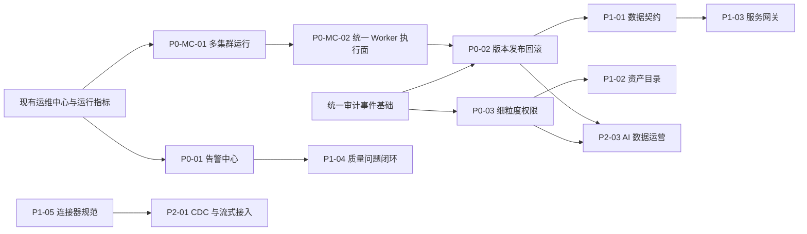

# Data Aggregation Studio 未来规划路线图

更新时间：2026-07-24

规划依据：当前 Web 系统实机浏览、现有代码与项目文档、当前测试数据基线，以及 DataWorks、Apache SeaTunnel、OpenMetadata、Apache APISIX 等同类产品能力边界。

## 1. 产品定位

Data Aggregation Studio 的目标定位是：

> 面向私有化部署和复杂异构系统场景的一体化数据集成、数据服务交付与 DataOps 运营平台。

系统以 DataAggregation 插件与执行能力为底座，围绕数据源、模型、采集、开发、工作流、数据服务、质量和运维形成统一控制面。它不是单一 ETL 工具，也不是纯数据目录或通用 API 网关，而是以“数据集成与数据服务交付”为核心、以元数据治理和生产运营为支撑的数据平台。

### 1.1 目标用户

| 用户 | 核心诉求 |
| --- | --- |
| 数据工程师 | 配置数据源、模型、批量采集、数据开发、工作流和质量任务。 |
| 平台管理员 | 管理租户、项目、权限、Worker、运行环境和资源共享。 |
| 运维人员 | 统一查看任务、队列、Worker、服务调用、日志和告警。 |
| 业务系统开发者 | 发布或订阅 REST、SOAP、数据接入和协议转换服务。 |
| 数据治理人员 | 管理业务目录、字段口径、质量问题、血缘和变更影响。 |

### 1.2 重点适用场景

- 政企、制造、金融等需要私有化部署和内网运行的环境。
- 数据库、文件、消息队列、HTTP、SOAP 等异构系统的数据交换。
- 国产数据库、传统 WebService 和存量系统较多的企业集成场景。
- 既需要数据同步，又需要把数据快速交付为 API 的数据团队。
- 需要 Web 在线运行和桌面离线运行两种形态的项目。

### 1.3 产品边界

- 不自建通用大数据计算引擎，复杂批流计算继续复用 Flink、Spark 或 DataAggregation 执行能力。
- 不自研完整企业 API 网关，流量治理优先与 Apache APISIX 等成熟网关集成。
- 不把统计分析扩展成通用 BI 产品，统计能力服务于模型验证、资产洞察和运行分析。
- 不直接复制大型数据治理套件，先围绕本平台真实任务、模型、服务和质量数据建立闭环。

## 2. 当前能力与成熟度

### 2.1 已形成的主链路

当前系统已经具备以下端到端能力：

1. 数据源注册、元模型驱动配置、连接检测和模型发现。
2. 模型同步、模型详情、样例预览、统计分析和表级/字段级血缘。
3. 单表采集、全量/增量配置、字段映射、Transformer、调度和运行指标。
4. SQL、模型 Flink SQL、Java、Python 脚本开发及依赖环境管理。
5. 采集任务、质量任务、脚本、HTTP 和 Shell 节点的工作流编排。
6. 数据查询服务、数据接入服务、REST/SOAP 协议转换和订阅 Token。
7. 质量规则、质量任务、质量运行记录、质量指标和风险分析。
8. 租户、项目、成员、访问申请、Worker 下发、资源共享和站内信。
9. 统一运维中心、运行日志、开放调用日志、服务指标和 Worker 心跳。
10. 支持 Chat、Plan、Goal 模式和受控操作目录的 Studio AI 助手。

### 2.2 当前环境基线

以下数据仅用于描述 2026-07-13 当前环境状态，不代表产品容量上限：

| 指标 | 当前值 | 说明 |
| --- | ---: | --- |
| 数据源 | 43 | 默认项目中已注册的数据源。 |
| 模型 | 63 | 包含数据库、HTTP 和文件类模型。 |
| 纳管数据源类型 | 18 | 其中 13 种具备 Reader，11 种具备 Writer。 |
| 已上线采集任务 | 2 | 当前首页可编排任务数。 |
| 采集运行记录 | 19 | 18 成功、1 失败。 |
| 脚本资产 | 4 | 模型 Flink SQL 1 个、Java 3 个。 |
| 已发布工作流 | 0 | 工作流能力已实现，但当前缺少真实业务样例。 |
| 数据接入服务 | 0 | 编辑与监控能力已实现，当前缺少有效业务实例。 |
| 质量任务 | 0 | 规则和指标能力已实现，质量执行闭环尚未被实际使用。 |
| 在线 Worker | 1 | 当前项目已下发且在线。 |
| 已发布数据服务调用 | 70 | 最近 7 天 4 个已发布服务的调用量。 |

### 2.3 当前成熟度判断

| 维度 | 判断 | 主要依据 |
| --- | --- | --- |
| 功能广度 | 较高 | 已覆盖集成、开发、编排、服务、质量、权限和运维。 |
| 执行深度 | 中高 | 采集、HTTP/SOAP、服务调用和日志已有真实运行记录。 |
| 生产闭环 | 中高 | 统一告警已形成首版闭环，仍缺配置版本回滚、统一审计和资源级权限。 |
| 资产治理 | 中低 | 有模型和血缘，但缺少业务目录、口径、负责人和影响分析。 |
| 服务运营 | 中等 | 有 Token、日志和指标，缺少限流、配额、白名单和开发者门户。 |
| 产品化程度 | 中等 | 默认项目存在较多回归测试数据，部分页面加载状态和首屏性能仍需治理。 |

当前阶段定义为：

> 已超过 MVP，正在从“功能型数据平台”进入“生产级数据运营平台”建设阶段。

## 3. 建设原则

| 原则 | 说明 |
| --- | --- |
| 生产风险优先 | 优先解决告警、版本、回滚、权限、审计、凭据和高可用问题。 |
| 闭环优先 | 已有功能先形成发现、处理、验证和追溯闭环，再横向增加菜单。 |
| 标准优先 | 优先采用 OpenAPI、AsyncAPI、OpenLineage、OIDC、OpenTelemetry 等标准。 |
| 集成优先 | API 网关、密钥管理和外部通知优先集成成熟组件，不重复建设通用基础设施。 |
| 兼容优先 | 新治理能力不得破坏现有采集、REST、SOAP、Token 和 Worker 调度链路。 |
| 数据最小化 | 日志、审计和 AI 上下文不得持久化明文密码、Token 或完整敏感请求体。 |
| 可验收 | 每个规划项必须有明确交付物、验收标准、测试计划和回滚策略。 |

## 4. 优先级定义

| 优先级 | 定义 | 是否阻塞生产交付 |
| --- | --- | --- |
| P0 | 生产可运营、安全和发布基础。 | 是。 |
| P1 | 资产、服务和质量治理闭环。 | 不阻塞小规模试用，但阻塞企业级推广。 |
| P2 | 实时、生态、成本和智能化扩展。 | 否。 |

状态定义：

| 状态 | 含义 |
| --- | --- |
| 已完成 | 首版已实现并完成构建、测试或页面验证。 |
| 本地实施已完成（待环境验收） | 代码、自动化和本地真实拓扑已关闭，只剩目标环境才能产生的生产证据。 |
| 实现中（待最终验证） | 已进入实现，但尚未完成全部回归、联调和验收，不能按已完成对外承诺。 |
| 部分完成 | 已有基础能力，但关键闭环未完成。 |
| 未开始 | 尚未形成可验收功能。 |

## 5. 具体实现优先级

以下顺序是实际建议的实施顺序。同一优先级内也必须按编号推进，不建议同时开启多个高风险基础改造。

| 顺序 | 编号 | 规划项 | 当前状态 | 首版核心交付 | 实施复杂度 |
| ---: | --- | --- | --- | --- | --- |
| 1 | P0-01 | 统一告警规则中心 | 已完成（含同 Nacos eLink 增量） | 告警规则、事件、站内信/Webhook、去重和静默；最小 eLink 通道增量。 | 中 |
| 2 | P0-MC-01 | 可配置多集群运行与数据源适用范围 | 实现中（待最终验证） | OMS 控制面、集群管理、数据源适用范围、定向执行、同步代理和集群观测。 | 高 |
| 3 | P0-MC-02 | 统一 Worker 执行面与纯控制面架构 | 本地实施已完成（待环境验收） | Server 纯控制面、全部数据执行统一下沉 Worker、单/多集群统一部署模型。 | 高 |
| 4 | P0-02 | 配置版本、发布与回滚 | 未开始 | 配置快照、版本差异、发布检查、历史版本和回滚。 | 高 |
| 5 | P0-03 | 审计、细粒度权限与凭据安全 | 部分完成 | 统一审计、资源级授权、敏感日志权限、凭据托管接口。 | 高 |
| 6 | P0-04 | 首屏性能、状态可信度与数据环境治理 | 部分完成 | 加载态治理、慢查询优化、远程分页、测试数据隔离。 | 中 |
| 7 | P0-05 | 高可用、备份恢复与外部可观测性 | 部分完成 | Server/Worker 高可用基线、备份恢复、Prometheus/OpenTelemetry。 | 高 |
| 8 | P1-01 | 数据契约与 Schema 演进 | 未开始 | 契约版本、兼容性检查、废弃计划和订阅方影响分析。 | 高 |
| 9 | P1-02 | 智能资产目录 | 部分完成 | 业务目录、主题域、负责人、术语、标签、全局搜索和影响分析。 | 中 |
| 10 | P1-03 | 服务网关与开发者门户 | 部分完成 | 限流、配额、白名单、自动文档、订阅审批和 SLA。 | 中 |
| 11 | P1-04 | 数据质量问题闭环 | 部分完成 | 问题单、责任人、SLA、评论、关闭/重开和重复问题合并。 | 中 |
| 12 | P1-05 | 连接器能力一致性与插件生态 | 部分完成 | 能力分级、插件 SDK、兼容测试和优先连接器补齐。 | 中高 |
| 13 | P2-01 | CDC 与持续流式接入 | 未开始 | CDC、持续消费、Checkpoint、位点、重试、死信和幂等。 | 高 |
| 14 | P2-02 | 多租户配额、容量和成本治理 | 部分完成 | 并发配额、Worker 容量、日志容量、服务配额和租户报表。 | 高 |
| 15 | P2-03 | AI 数据运营与智能问数 | 部分完成 | 故障分析、发布检查、影响分析、Text-to-Flink SQL 和审批执行。 | 中高 |

## 6. P0：生产可交付

### 6.1 P0-01 统一告警规则中心

#### 建设目标

让运维中心发现的问题可以主动通知责任人，而不是依赖人工刷新页面。

#### 首版范围

- 告警对象：采集任务、质量任务、工作流、数据服务、数据接入服务、协议转换服务、Worker 组、调度队列和日志存储。
- 告警条件：执行失败、连续失败、运行超时、服务失败率、接入写入失败、Worker 离线、队列积压、调度延迟和日志上传失败。
- 通知通道：首版为站内信和通用 Webhook；同 Nacos eLink 通道作为后续最小增量。邮件、企业微信、钉钉仍属于其他后续扩展。
- 告警治理：去重、静默时间、恢复通知、最近触发记录和手动关闭。
- 权限范围：规则按项目隔离，租户管理员可查看租户内规则摘要。

#### 依赖

- 现有站内信、运行指标、服务指标、Worker lease、运维中心和日志异常数据。

#### 验收标准

1. 可以按项目创建、启用、停用和测试告警规则。
2. 同一对象的重复异常不会在短时间内产生通知风暴。
3. 恢复后产生恢复通知，并保留触发和恢复时间。
4. 通知可跳转到具体任务、服务、Worker 或运行日志。
5. 告警内容不包含明文密码、Token 和完整敏感请求体。

#### 阶段完成记录（2026-07-15）

- 已交付九类规则、五张告警表、项目隔离、租户摘要、事件状态机、静默/恢复/重开和乐观锁并发控制。
- 已交付站内信 outbox、加密 Webhook、固定消息协议、HMAC-SHA256、SSRF 防护、失败重试和人工重试。
- 已接入任务执行、三类开放服务调用、Worker、队列、调度延迟和日志归档信号，并补齐协议转换失败率与单次调用失败监控。
- 已交付 `/api/v1/alerts`、AI operation catalog、SDK、`/alerts` 页面、中英文文案、桌面端路由入口和联调/安全/升级文档。
- 已完成 MySQL 升级、SQLite/桌面运行时后端验证、103 项告警专项测试和 13 项跨模块回归测试（5 项权限 API、4 项执行事件、4 项索引队列生命周期）；474 项后端全量测试作为既有回归基线保留。
- `npm run build:web` 与 `npm run build:desktop` 均通过；Desktop 已修复 Web 源码复用别名和 SSE API 边界，不再阻塞告警中心发布。
- 最终人工审查补齐了投递批次与事件型规则单条隔离、任务资源租户/项目约束、禁用通道 `SKIPPED` 语义、已删除通道的无效重试拦截、旧规则评估结果并发覆盖保护，以及 Webhook 总开关下站内信批次不被阻塞。
- 状态型规则启用后会在事务提交后立即评估；Worker 离线证据仅统计有效 lease 并保留上报在线数；告警恢复后重开会清理旧确认状态，历史确认仍保留在事件时间线中。
- 索引队列改为有限、按需排空的工作线程，并通过生命周期回归测试；本轮告警专项与跨模块测试未产生 Surefire JVM dump。
- Webhook 响应摘要会脱敏完整地址、短路径、查询参数、自定义 Header、动态签名和签名密钥；证据中的 API Key、Access Key、Private Key 和 Credential 等敏感键也统一脱敏。
- 已使用最新后端完成真实登录与 HTTP 闭环，验证九类规则元数据、规则创建/启停/测试、站内信投递、租户摘要、固定协议、HMAC 签名、`500` 后人工重试成功、`429` 退避、`400` 终止、超时重试和安全默认配置拒绝本地 HTTP。
- 已完成 1440×900、390×844 浏览器页面检查，验证规则创建/测试/启停/删除、Webhook 表单、汇总钻取和移动端无横向溢出；控制台无新增错误。
- 2026-07-17 补齐可解释投递审计：投递列表和详情现在展示规则、事件、对象、实际发送内容、脱敏接收目标、响应与重试进度；站内信/eLink 复用实际发送渲染器，新投递保存不可变审计快照，Webhook 发送时剥离内部审计字段。50 项定向后端测试、Server 打包、Web/Desktop 构建和 1440×900、390×844 浏览器验收通过。
- P0-01 站内信/Webhook 首版状态更新为“已完成”。现有前端 chunk 体积和 Desktop circular chunk 构建警告不影响功能验收，后续并入 P0-04 性能与工程治理处理；下述 eLink 增量于 2026-07-17 独立完成验收。

#### 后续增量：同 Nacos eLink 通道（已完成，2026-07-17）

建设目标：告警产生投递时，Studio 通过同一 Nacos 集群发现现有 eLink Manager，并向固定个人账号、固定本地群组或规则动态接收人发送固定文本消息。该增量保持 eLink Manager 生产发送程序不变。

最小范围：

- 服务发现：复用 Studio 当前 Nacos `namespace/group`，服务名由服务端统一配置，默认 `elink-message-integration`。
- Manager 接口：个人账号调用 `POST /elink/messages`；群组调用 `POST /elink/groups/{groupId}/messages`。
- 候选查询：个人账号来自 Manager `GET /elink/app/allow-users`，群组来自 `GET /elink/groups`；页面只允许选择，不允许手工输入账号或整数群组 ID。
- 通道配置：支持 `FIXED` 与 `RULE_RECIPIENTS`。固定模式保存账号/群组标识及名称快照；动态模式复用指定成员、资源创建人和项目管理员。
- 用户目标：复用 `studio_external_user_binding` 保存 Studio 用户到 eLink `userId` 的映射，并增加可空的 `sys_user.mobile_phone`。网关登录同步可信用户信息中的手机号，本地用户由超级管理员维护。
- 动态投递：每个规则接收人形成独立 outbox，按“eLink 绑定优先、手机号兜底”保存目标快照；两种目标都缺失时才使对应投递进入 `DEAD`。
- 消息格式：固定 `text`，由告警级别、规则、对象、摘要和时间自动组装；覆盖触发、静默期后重复、重开、规则配置的恢复通知和测试事件。
- 状态判定：兼容官方 `errcode=0, errmsg=ok` 和现有 Manager `success` 字段；投递记录保留 `errmsg/errorMessage` 用于排查。
- 可靠性：网络异常和无可用实例进入 outbox 重试。Manager 没有幂等发送接口，采用至少一次投递语义，响应超时窗口可能出现重复消息。
- 验收环境：真实 eLink 当前不可达不阻塞验收；在 eLink 工程中增加不连接数据库、不注册 Nacos 的 `elink-mock-server-boot`，模拟 Manager 使用的 `/cgi-bin/*` 上游接口和响应。

明确不包含：SLB 地址、固定 URL、自定义 Header、固定通道手工手机号、自定义模板、`markdown`、`textcard`、幂等 generation，以及 eLink Manager 生产代码改造。手机号只作为规则动态接收人的服务端兜底来源。

完成记录：

1. 已在相同 Nacos `namespace/group` 下完成 `Studio -> eLink Manager -> eLink mock` 真实联调，Manager 保持现有生产代码不变。
2. 个人账号成功响应和群组成功响应均映射为 `SUCCEEDED`；`success=false, errcode=40003` 映射为 `DEAD`，并保真展示 Manager 的 `errmsg/errorMessage`。
3. Studio 到 Manager 的无实例、网络异常，以及 408、429 和 5xx 的 outbox 重试由专项测试覆盖；文档已明确至少一次投递和超时后可能重复发送的边界。
4. 已执行 MySQL schema 升级并验证 `config_json`；MySQL/SQLite schema、2026-07-16 通道配置、2026-07-17 手机号兜底和 2026-07-18 用户绑定唯一索引幂等增量 SQL、Web/Desktop 构建和告警专项测试通过。
5. 已在中文模式下完成 1440×900 与 390×844 页面检查；eLink 表单支持“指定个人账号或群组”和“使用告警规则接收人”两种模式，固定目标通过 eLink Manager 目录下拉选择，不需要手工输入整数 ID；不包含 SLB、Header、模板和其他已取消能力，移动端无页面级横向溢出。
6. 已增加规则接收人的手机号兜底：不修改 Manager 接口和通道表单，绑定账号优先；未绑定时向 Manager 的 `mobiles` 字段发送 Studio 用户手机号码，Manager 响应继续决定该条 outbox 状态。

### 6.2 P0-MC-01 可配置多集群运行与数据源适用范围

#### 建设目标

将 Studio 调整为“OMS 统一控制面 + 可配置的若干全能力执行集群”。集群只表达网络位置和数据源可达范围，不按任务类型拆分能力；OMS 也可以作为普通执行集群。

#### 当前完成度（2026-07-21）

- 已落地运行集群、端点、项目授权、数据源适用绑定和运行配置校验模型，并同步 MySQL、SQLite、启动升级和独立增量 SQL。
- 已覆盖采集、质量、工作流、数据开发、数据服务、数据接入和协议转换的 `runtimeClusterId`，编辑器采用“先选运行集群，再选数据源/模型/关联资源”。
- 已实现数据源按集群连接测试、健康状态隔离、绑定移除影响确认，以及失效资源的发布、调度和触发拦截。
- 已实现 Dispatch 目标集群固化、Worker 按集群 Claim、claim token 与 boot ID CAS、工作流版本和资源修订固定。
- 已实现 OMS 对数据服务、数据接入和协议转换的本地/HTTP 路由，目标不可达返回 `503`，并补齐运维、告警和 AI 操作的目标/实际集群信息。
- 已完成后端最终全量复验（`880` 项、`0` 失败、`0` 错误、`0` 跳过）、前端类型检查、Web/Desktop 生产构建和真实 MySQL 应用升级；默认本地、`C46`、`C50` 三集群共库心跳以及 `C46/C50` Python 定向执行已通过。`C46/C50` HTTP 端点测试、同一数据源的 A/B 集群健康隔离、JSON `BODY_BRIDGE`、XML 协议转换、访问日志单写，以及目标集群停机返回 `503` 且不请求下游均已通过，1440x900 与 390x844 已复验运行集群、数据源和数据开发相关页面。人工审计发现的动态 hop-by-hop Header、内部/SLB认证与业务 `401/403` 区分、端点测试与数据源远端 Header一致性、损坏 Header配置失败关闭和 `Location` 地址泄漏边界均已完成代码修正、定向测试和全量回归。上述内容是 P0-MC-01 历史基线；当前版本已经移除 `LEGACY/ENFORCED` 模式，不再以模式切换作为验收门槛。真实 HTTP/SLB Header透传、数据服务/数据接入真实远端调用、SOAP、共享对象存储、Web 大型编辑器和 Desktop 实机统一纳入 P0-MC-02 阶段 7 验收；其中 Web 大型编辑器以及数据服务、数据接入、协议转换三类 SOAP/WSDL 独立 Worker 路由已于 2026-07-22 完成，其他环境项仍待关闭，因此状态保持“实现中（待最终验证）”。

专项范围、部署步骤、回滚和验收清单见 [P0-MC-01 实施计划](./studio-configurable-runtime-cluster-plan-20260720.md)。

P0-MC-01 文档保留当时的 Server 本地执行、插件目录和模式分叉只用于追溯；现行代码、部署和验收均以 [P0-MC-02 统一 Worker 执行面计划](./studio-worker-only-execution-plane-plan-20260721.md)为准，不得再执行历史 `LEGACY -> ENFORCED` 路径。

### 6.3 P0-MC-02 统一 Worker 执行面与纯控制面架构

#### 建设目标

让单集群成为“只有一个运行集群的多集群环境”。所有需要访问业务数据源、加载插件或执行用户工作负载的数据面能力统一进入 Worker；Server 只负责配置、权限、调度、路由、统计、告警和运维聚合。

#### 首版范围

- 取消 `DEFAULT-LOCAL` 与 Server 集群代码相同时的数据源、本地 SQL和同步服务快速路径。
- 数据源测试、模型发现、Hydrate、预览、查询、健康探测、数据服务、数据接入和协议转换统一调用目标 Worker。
- Server 不再配置 `STUDIO_AGGREGATION_HOME` 和运行集群身份，不加载 DataAggregation 插件。
- 每个需要同步执行的集群配置 Worker HTTP/SLB 端点；异步任务继续通过共享数据库定向领取。
- 新部署直接使用显式运行集群语义，历史兼容通过一次性升级完成，不保留长期 `LEGACY/ENFORCED` 部署选择。
- 项目只有一个已授权集群时前端自动选择并隐藏或只读控件，接口仍提交和校验 `runtimeClusterId`。

#### 依赖

- 复用 P0-MC-01 的运行集群、项目授权、数据源绑定、Worker 心跳、Dispatch 定向和安全 HTTP代理。
- `DEFAULT-LOCAL` Worker 必须先具备完整内部执行接口和全量插件，再移除 Server 本地执行。

#### 验收标准

1. Server 在没有插件目录和业务数据源网络权限时可完整启动并提供控制面能力。
2. `DEFAULT-LOCAL` 与远端集群使用相同 Worker 内部协议和失败语义。
3. Worker 离线时同步返回 `503`、健康为 `UNKNOWN`、异步任务排队且不回退 Server。
4. 单集群增加第二个集群时不需要更换部署模式、Server 包或业务代码路径。
5. 运行记录、访问日志、统计和告警信号保持单写。
6. 后端全量测试、Web/Desktop 构建、真实单集群、多 Worker SLB 和多集群验收全部通过。

#### 当前状态

代码主链已完成收口：数据源、同步服务、SQL/Flink 和质量执行统一进入 Worker；开放服务删除 Server 本地回退；插件执行 Bean 仅由 Worker 注册；正常部署中的 `LEGACY/ENFORCED` 配置已移除，并提供独立历史回填命令。

截至 2026-07-23，最新根 POM 全量已 `BUILD SUCCESS`，11 个 Reactor 模块全部成功，默认 Surefire 共 `1074` 项、失败 `0`、错误 `0`、跳过 `0`，总耗时 7 分 26 秒；Web/Desktop 类型检查和生产构建通过。Server 已从空临时目录完成 pluginless 真实启动；本地单集群停机恢复、同集群双 Worker轮询 SLB、临时第二集群定向和禁止 fallback、三类隔离数据库迁移、隔离新部署 Server 到单 Worker 的 Python 定向执行、真实 CPython 成功执行、RDBMS 当前与周期探测、仓库开发脚本生命周期、30 秒长任务期间独立心跳、同步写入幂等、JSON 协议转换访问日志单写以及失败告警单写样本均已通过。历史单集群回填已验证正式执行和重复执行幂等，历史多集群歧义数据不会被自动猜测目标；隔离数据库和进程均已清理。助手脚本已证明只路由 Worker，未配置 Python 的 `500`、Worker 停机的 `503` 以及配置受管 Python 后的成功执行语义均保真。本轮人工 Review 进一步将工作流资源选项改为强制显式集群，把采集 `JobContainer` 与数据服务响应转换执行支持收敛为 Worker-only Bean，并关闭 Flink 本地运行引用和远端短期能力 Token 进入线程名、异常文本、解析响应和审计载荷的观测面泄漏；相关 Flink 脱敏定向回归 `12/12`、请求契约 `3/3`、执行面 Bean 与数据服务回归 `23/23` 均通过。数据服务查询、数据接入写入和协议转换三类 SOAP/WSDL 已通过独立 Worker HTTP 路由定向测试 `3/3`，三类访问日志的目标/实际集群一致且精确单写；协议转换 HTTP XML 成功、下游 `422`、连接中断和响应过大均保持单次下游调用与访问日志单写，协议转换告警实例、时间线和站内信 outbox 精确单写。数据服务连接失败已验证访问日志和统计各写一次；数据接入连接失败已验证访问日志、统计、告警实例、`TRIGGERED` 事件和站内信 outbox 各写一次。协议转换目标客户端已显式禁止自动重试和重定向，下游响应改为按 `STUDIO_RUNTIME_ENDPOINT_MAX_RESPONSE_BYTES` 有界读取；OMS 和 Worker 现按 `STUDIO_RUNTIME_INVOCATION_MAX_BODY_BYTES` 双重限制请求，Server、Worker 与 Desktop 均关闭 Spring 表单预解析，OMS 路由和 Worker 内部入口会依次有界读取声明长度或分块正文，JSON、XML/SOAP 与 `application/x-www-form-urlencoded` 均受限，超限返回 `413` 且不调用业务或目标 Worker。OMS 路由定向回归 `30/30`、Worker 请求体定向回归 `18/18`、Flink 模块 `107/107`、Server 模块 `48/48`、Worker 模块 `63/63` 均通过。完整显式集成类为 `5` 项、失败 `0`、错误 `0`、跳过 `2`；可本地执行的 `3` 项全部通过。两个真实 RDBMS 成功用例因本轮外部测试数据库网络不可达而跳过，数据服务 REST 成功查询和数据接入 REST 成功写入尚不能记为通过。真实数据库参数改为显式环境/JVM 属性注入，临时外部表自动清理。数据源、模型同步、采集、质量、工作流、数据开发、数据服务、数据接入和协议转换已经完成 `1440x900` 与 `390x844` 真实浏览器验收；单集群自动选择、多集群切换确认及旧候选立即清空均通过，临时授权和本地进程已恢复清理。

发布审计补齐了历史密钥离线轮换能力：工具覆盖数据源、模型和采集配置中的 `ENC(...)`，以及运行端点、告警通道和幂等响应密文；默认 Dry Run，Apply 使用双确认、单事务、分页和原值 CAS，损坏或未闭合标记失败关闭。专项测试、真实临时 SQLite Dry Run 与缺少确认参数的失败关闭均已通过，临时文件已清理。该能力关闭了“历史默认密钥无法迁移”的代码阻塞，但不代表存量生产库已执行换钥；实际切换仍属于目标环境维护窗口验收。

最新人工 Review 继续关闭了 Java 脚本环境提示的执行面残留：`ScriptEnvironmentRuntimeService` 不再由 Server 组件扫描创建，只在 Worker 配置中显式注册；Java import/member hints 新增必填 `runtimeClusterId`，`DEFAULT-LOCAL` 和远端集群都通过受管 HTTP 端点进入 Worker，由 Worker 校验集群身份、项目授权和租户环境归属。Server 不再下载依赖 JAR、创建用户环境 `URLClassLoader`，并删除了无生产调用方的 `RestTemplate` Bean。相关后端定向测试 `17/17`、模块编译和 Web 类型检查/生产构建均通过。

2026-07-23 后续收口将最新根 POM 全量提升为 `1112/1112`，失败 `0`、错误 `0`、跳过 `0`，11 个 Reactor 模块全部成功，总耗时 7 分 01 秒；当时的临时 MinIO 仅用于验证跨 Worker 归档、独立 Server/Worker 读取和存储故障恢复，相关环境现已删除，当前有效对象存储证据以后续真实阿里云 OSS `1/1` 为准。Desktop 生产构建已修复 X6 独立分包初始化失败、无效 `file:///api/v1` 默认地址、内置验收密码及缺少沙箱/CSP 的问题，Web/Desktop 生产构建复验通过，Electron 真实启动到登录窗口且控制台无渲染或安全错误；登录后的交互验收仍受当前 Windows 输入权限限制。

同日最新人工 Review 又关闭了三条跨集群旁路：Java/Python `context.services` 只允许访问运行集群适用的数据源，缺少 `runtimeClusterId` 时失败关闭；跨集群 SQL 在进入底层执行器前拒绝；Flink 问数在读取内部数据源定义和构造 LLM prompt 前强制校验项目权限及数据源集群绑定。Java/Python 执行级回归 `4/4`、脚本服务失败关闭回归 `5/5`、Flink 问数上下文隔离回归 `2/2` 均通过。最新根 POM 默认 Surefire 全量提升为 `1122/1122`，失败 `0`、错误 `0`、跳过 `0`，11 个 Reactor 模块全部成功，总耗时 6 分 41 秒；Web 类型检查和生产构建通过，Vite 转换 `4294` 个模块。

同日继续完成 Server 运行依赖物理隔离：DataAggregation Core、插件加载器、数据源处理器和 `studio-flink` 不再通过 Infra 进入 Server 可执行包，只由 Worker 显式携带；Server 为读取共享运行日志保留的对象存储 SDK 不具备业务插件执行语义。最终包检查中 Server 执行运行库命中为 `0`，Worker 保留完整执行构件；pluginless 类路径守门为 `1/1`。隔离后的根 POM 全量仍为 `1122/1122`，失败 `0`、错误 `0`、跳过 `0`；对象存储的当前有效协议证据以后续阿里云 OSS `1/1` 为准。

最终本地收口继续把缺少项目授权、数据源绑定或运行失效状态依赖时的宽松放行改为失败关闭，生产装配保持必需依赖。相关定向复验 `54/54`；一次性 MySQL 8.0.21 环境中的完整 `RealWebServiceOpenApiIT` 为 `5/5`、跳过 `0`，数据服务真实查询和数据接入真实写入已补齐。最新根 POM 默认 Surefire 全量为 `1123/1123`，失败 `0`、错误 `0`、跳过 `0`，11 个 Reactor 模块全部成功，总耗时 7 分 56 秒。

Desktop 登录后验收已补齐：Desktop Router 增加数据开发、运行集群和运行环境入口；真实 Electron 已完成登录和页面核对，同一 Desktop renderer 与临时组合 Runtime 完成唯一集群自动选择、Python Worker 执行、请求/实际集群一致、集群停用后的运行配置失效提示和恢复在线。路由修正后的 Desktop 生产构建再次通过，Vite 转换 `3592` 个模块。

同日部署边界继续收口：应用启动守门在 readiness 放行前拒绝 Server 携带 Worker 集群身份、`STUDIO_AGGREGATION_HOME` 或旧 JVM `aggregation.home`，并要求独立 Worker/Desktop Worker 显式配置集群编码和完整插件目录；部署预检覆盖废弃模式变量、默认秘密、Server 误带 Worker/Python/脚本制品变量、Worker 插件挂载及共享对象存储必填项。守门定向测试再次通过 `14/14`，pluginless Server 启动为 `1/1`，部署预检自动化为 `7/7`。`scripts/dev-services.ps1` 已分别读取 IDEA Server/Worker 环境，通过子进程环境而非命令行赋值传递秘密，并在 Server 启动前清除全部 Worker 专属执行变量；补齐 IDEA XML 显式 UTF-8 读取后再次真实启动二者，health 均为 `UP`，受管命令行中的 Worker 专属配置和 IDEA 敏感值命中均为 `0`，验收后服务已停止。在临时 MinIO 包装器删除并统一改用 IDEA 阿里云 OSS 配置后，根 POM 默认 Surefire 全量为 `1129/1129`，失败 `0`、错误 `0`、跳过 `0`，11 个 Reactor 模块全部成功，总耗时 6 分 55 秒。此轮同时修复两个回归测试泄漏 JVM/静态全局状态的问题，定向复验 `17/17`；Web/Desktop 生产构建和运行集群选择契约测试再次通过。2026-07-24 继续把 Worker心跳控制器的内部认证配置从可选 Setter收紧为构造器必需依赖，错误 Token拒绝、正确 Token放行和 pluginless启动定向测试 `3/3`，Server模块 `61/61`，根 POM全量提升为 `1130/1130`，总耗时 6 分 09 秒。随后将独立 `studio-flink` 纳入同一角色安全守门：拒绝 Worker身份、插件目录和可信网关，移除默认内部 Token、加密密钥及隐式插件目录；角色守门定向测试提升为 `20/20`，部署预检提升为 `10/10`。最新根 POM默认全量为 `1136/1136`，失败、错误和跳过均为 `0`，11个 Reactor全部成功，总耗时7分24秒；使用 IDEA阿里云 OSS配置重跑显式协议 IT仍为`1/1`，临时对象和报告已清理。

目标环境验收也已工具化：`test-studio-production-runtime.ps1` 支持真实 SLB 正向/错误 Token 双探测、秘密回显扫描、OMS/Worker 数据源端口一拒一通、HTTP 跳转延迟基线和显式对象存储 IT；对象存储 provider 可显式选择 `MINIO/OSS`，生产默认禁止自动建 bucket。报告升级为固定节点角色和运行集群 ID，OSS 四项人工确认必须携带非秘密证据编号；`RuntimeEndpoint` 默认采集 20 个成功样本并报告 p50/p95/p99/max，默认 p95 门槛为 `1000 ms`。单报告离线测试为 `7/7`，新增人工证据 URL 失败关闭和不落报告验证。`confirm-studio-production-acceptance.ps1` 按全部生产集群校验 HTTPS SLB、Worker Allowed 与相同目标 OMS Denied配对、性能阈值、报告时效、去重、完整 OSS 证据和生产等价回滚演练证据；汇总 Schema 升级为 v2，同时拒绝 p95 超阈值、重复来源/结果、状态不一致、未知检查、缺字段、非脱敏字段、对象未清理，以及回滚证据缺失、过期或证据编号非法的伪 PASS，离线测试为 `15/15`。当前已直接读取 IDEA `StudioWorkerApplication` 的阿里云 OSS 环境变量，在项目 SDK Java 17 下完成真实 OSS 协议 IT `1/1`，凭据未进入报告、随机测试对象已清理；同一 IDEA Worker 的本地真实 HTTP 基线为 20 样本、错误 `0`、p95 `57.589 ms`。此前临时 MinIO 包装器、容器和报告已删除，不再作为当前进度证据。生产执行步骤和自动汇总方法见[生产运行面验收手册](../运维/部署/studio-production-runtime-acceptance.md)。

状态更新为“本地实施已完成（待环境验收）”。本地代码、完整自动化、人工 Review、真实同步服务成功/失败矩阵、日志/统计/告警单写、Desktop 单集群闭环、目标环境验收工具、真实阿里云 OSS 协议、本地 HTTP 跳转基线和本地应用级回滚冒烟已经关闭。2026-07-24 最新复验为部署预检 `10/10`、生产单报告工具 `7/7`、最终证据汇总器 `15/15`、回滚失败关闭 `1/1`和真实 OSS 协议 `1/1`；本地 OSS 报告因生产人工证据仍为 `PENDING`而正确保持 `INCOMPLETE`。上一版本 Server在当前增量 Schema及旧插件挂载下 health为 `UP`，集群/Dispatch定向指纹保持不变并完成资源清理。生产汇总现已强制要求回滚状态、可追溯证据编号和新鲜的 UTC 完成时间，缺少任一项或把 URL 当作编号均无法得到最终 `PASS`。尚需在生产环境实际执行 SLB Header及其 p95、OMS/Worker 网络边界，补齐从生产 Pod 使用最终 endpoint 的 OSS 网络 ACL/容量/生命周期/高可用证据，并在生产等价预发或发布窗口完成真实镜像回滚演练。完整证据见 [P0-MC-02 实施计划](./studio-worker-only-execution-plane-plan-20260721.md)、[统一 Worker 执行面架构交接](../交接/studio-worker-only-execution-architecture-20260721.md)和[20260722 验收执行记录](../测试/长期跟踪/records/20260722-P0-MC-02统一Worker执行面验收执行记录.md)。Goal 仍未达到完成条件。

### 6.4 P0-02 配置版本、发布与回滚

#### 建设目标

把“保存/发布即生效”升级为可审查、可追溯、可回滚的配置生命周期。

#### 首版范围

- 覆盖采集任务、工作流、质量任务、数据服务和数据接入服务。
- 统一配置快照、版本号、发布说明、发布人和发布时间。
- 支持当前草稿与已发布版本差异查看。
- 发布前检查数据源可用性、模型字段、映射、调度、Token 策略和依赖资源。
- 支持回滚到任意历史发布版本。
- 保存草稿、发布、下线和回滚事件写入统一审计。

#### 首版不包含

- 跨环境自动发布流水线。
- 外部审批系统深度集成。
- Git 仓库双向同步。

#### 验收标准

1. 任一已发布对象可追溯完整版本内容和发布人。
2. 错误发布可以在不手工重填表单的情况下回滚。
3. 发布前检查失败时不能进入已发布状态。
4. 旧版本回滚后，运行端读取到的配置与回滚版本一致。
5. 版本快照不保存明文凭据和一次性 Token。

### 6.5 P0-03 审计、细粒度权限与凭据安全

#### 建设目标

满足生产环境最小授权和安全追溯要求。

#### 首版范围

- 统一审计：保存、发布、下线、回滚、触发、Token 操作、Worker 绑定、成员和权限变更。
- 资源权限：数据源、模型、服务、访问日志、运行日志、Token 和 Worker 组。
- 敏感权限：查看连接信息、查看敏感日志、管理 Token、发布服务和绑定 Worker。
- 登录集成：预留 OIDC/LDAP/AD 接口，生产部署必须支持关闭默认账号或强制修改默认密码。
- 凭据安全：建立凭据引用接口，为后续 Vault/KMS 集成预留 provider。

#### 验收标准

1. 普通项目成员无法查看未授权数据源连接信息和敏感日志。
2. 只有授权人员可以发布服务、轮换 Token 和绑定 Worker 组。
3. 管理员可按用户、项目、资源类型、动作和时间查询审计记录。
4. 审计记录不保存明文密码、Token 和完整请求体。
5. 权限拒绝在前端和 API 上保持一致。

### 6.6 P0-04 首屏性能、状态可信度与数据环境治理

#### 当前问题

- 部分页面首屏需要约 3 至 7 秒，加载期间先显示“0”或“暂无数据”，随后才出现真实结果。
- 默认项目中存在较多 `assistant_coverage_*`、`codex_*` 和长期回归数据。
- 部分筛选下拉仍会一次加载较多候选项。
- 18 种纳管类型中仅 13 种可读、11 种可写，用户容易把“已纳管”误解为“可执行”。

#### 首版范围

- 所有统计卡片和表格在数据返回前使用明确骨架态，不展示伪 0 和伪空态。
- 建立页面首屏、接口 P95、慢查询和超时基线。
- 大列表、模型选择、用户选择和项目选择统一采用服务端分页或远程搜索。
- 测试、演示和生产租户分离，提供可重复初始化的演示空间。
- 能力矩阵增加“仅配置、可读取、可写入、可持续运行”等明确状态。

#### 验收标准

1. 首屏加载期间不再短暂显示错误的 0 或空列表。
2. 核心列表在当前数据量下首屏目标不超过 2 秒，复杂监控页目标不超过 3 秒。
3. 默认生产租户不存在自动化回归测试对象。
4. 数据源能力矩阵能够明确说明每种类型可执行的实际能力。

### 6.7 P0-05 高可用、备份恢复与外部可观测性

#### 首版范围

- Server 多实例部署、调度锁和幂等性基线验证。
- Worker 多实例、心跳、失联恢复和任务重新分配验证。
- MySQL、SQLite、对象日志和配置数据备份恢复流程。
- Schema 升级前检查、升级失败回滚和版本兼容说明。
- 输出 Prometheus 指标，并接入 OpenTelemetry trace 上下文。
- 运维中心补充 Server 实例、跨项目汇总、队列容量趋势和调度延迟趋势。

#### 验收标准

1. 单个 Server 或 Worker 实例退出不会造成配置丢失或重复执行。
2. 完成一次可复现的备份恢复演练。
3. 外部监控可以采集服务、队列、Worker、任务和开放 API 指标。
4. 升级失败时有明确的数据库和应用回滚步骤。

## 7. P1：治理与服务运营闭环

### 7.1 P1-01 数据契约与 Schema 演进

#### 首版范围

- 模型字段、数据服务入参出参、数据接入字段映射的契约版本。
- 新增字段、删除字段、类型变更、可空性变更和枚举变更检查。
- `BACKWARD`、`FORWARD`、`FULL` 和 `NONE` 兼容策略。
- 废弃字段标记、计划下线时间和订阅方影响清单。
- 发布服务前展示破坏性变更并阻止未确认发布。

#### 验收标准

1. 发布前能识别破坏性变更。
2. 能列出受影响的采集任务、工作流、服务和订阅方。
3. 订阅方能够查看当前契约版本和废弃计划。

### 7.2 P1-02 智能资产目录

#### 当前判断

现有 `/catalog` 页面是连接器能力矩阵，不是面向业务用户的数据资产目录。

#### 首版范围

- 业务目录、主题域、数据负责人、数据管理员和业务术语。
- 模型和字段标签、敏感等级、字段口径和说明完整度。
- 跨数据源、模型、任务、服务和质量问题的统一搜索。
- 模型详情展示上游来源、下游任务、开放服务、质量状态和使用热度。
- 变更影响分析和血缘导出。

#### 验收标准

1. 业务用户可以通过名称、术语、标签和负责人找到数据资产。
2. 模型详情能回答“数据从哪里来、被谁使用、质量如何、谁负责”。
3. 字段变更能够给出下游影响范围。

### 7.3 P1-03 服务网关与开发者门户

#### 技术策略

Studio 继续负责数据服务定义、契约、订阅和运营控制面；路由、认证、限流和流量治理优先接入 Apache APISIX 等成熟网关。

#### 首版范围

- 服务级和订阅方级限流、日配额和并发限制。
- IP 白名单、JWT/OAuth2 扩展接口和可选 mTLS。
- 自动生成 OpenAPI、调用示例和 SOAP/WSDL 使用说明。
- 订阅申请、审批、启停、Token 轮换和到期时间。
- 服务 SLA、慢调用、错误聚合和订阅方维度统计。

#### 验收标准

1. 每个订阅方可以配置独立配额和限流策略。
2. 开发者无需查看后台配置即可获得完整调用文档。
3. 网关策略变更与 Studio 服务状态保持一致。

### 7.4 P1-04 数据质量问题闭环

#### 首版范围

- 质量任务失败或告警自动生成质量问题。
- 责任人、优先级、SLA、评论、处理记录、关闭和重开。
- 同一资产和规则的重复问题合并。
- 资产页展示活跃问题、最近失败证据、健康分和风险指数。
- 支持 Webhook 对接外部工单系统，但首版不做深度双向同步。

#### 验收标准

1. 质量异常能够自动进入可跟踪的问题流程。
2. 问题关闭后保留完整处理证据。
3. 同一异常反复出现时不会无限生成重复问题。

### 7.5 P1-05 连接器能力一致性与插件生态

#### 首版范围

- 统一定义 `CONFIG_ONLY`、`BATCH_READ`、`BATCH_WRITE`、`STREAM_READ`、`STREAM_WRITE`、`CDC` 能力级别。
- 插件元数据、版本、兼容范围、运行参数 schema 和健康检查规范。
- Reader、Transformer、Writer 插件契约测试套件。
- 优先补齐当前已纳管但不可执行的数据源类型。
- 新增插件安装、升级、停用和兼容性检查入口。

#### 优先连接器方向

1. 主流数据库写能力和 CDC：Oracle、SQL Server、PostgreSQL、MySQL。
2. 湖仓和查询引擎：Hive、Iceberg、Paimon、Hudi、Doris、StarRocks、ClickHouse、Trino。
3. 云存储和对象存储：S3、OSS、COS、OBS。
4. 企业系统和 SaaS：REST、SOAP、SAP、Salesforce 等按项目需求扩展。

## 8. P2：实时、资源治理与智能化

### 8.1 P2-01 CDC 与持续流式接入

#### 首版范围

- MySQL 和 PostgreSQL CDC 首批接入。
- Kafka、RocketMQ 持续消费任务。
- Checkpoint、消费位点、失败重试、死信队列和手动重放。
- 幂等写入、重复数据检测和基础背压指标。
- 流式任务的持续运行状态、吞吐、延迟和积压监控。

#### 边界

- 不建设通用流计算 IDE。
- 复杂窗口计算、Join 和 CEP 继续交给 Flink。

### 8.2 P2-02 多租户配额、容量和成本治理

#### 首版范围

- 项目任务并发、Worker 组容量和队列长度限制。
- 服务调用配额、日志容量和对象存储使用量。
- 租户和项目维度任务量、失败量、调用量、运行时长和资源消耗报表。
- 超配额告警和管理员临时扩容。

### 8.3 P2-03 AI 数据运营与智能问数

#### 建设原则

AI 能力必须建立在权限、审计、版本和回滚基础上，高风险动作默认生成计划并等待确认。

#### 首版增强方向

- 根据运行日志、指标和配置生成故障摘要及排查建议。
- 发布前自动检查字段映射、契约、权限、Token 和下游影响。
- 通过 Studio 模型上下文生成、审查并执行 Flink SQL。
- 根据自然语言生成采集、质量和工作流草稿，不直接发布。
- 所有 AI 工具调用写入审计，并支持查看输入摘要、工具结果和最终动作。

## 9. 实施依赖与推荐顺序

推荐推进节奏：

1. P0-01 已完成；P0-MC-02 的人工 Review、全量回归、本地单/多集群验收和本地应用级回滚冒烟已关闭，当前补齐生产 SLB及其 p95、Pod 网络边界、OSS 环境证据和生产等价回滚演练，不再重复启动已经收口的执行面代码主链。
2. P0-MC-02 完成后启动 P0-02，同时抽取统一审计事件模型，为 P0-03 提供基础。
3. 第三轮完成 P0-03，并并行处理 P0-04 中不影响数据结构的前端加载态和数据隔离问题。
4. 第四轮完成 P0-05，形成生产部署、备份恢复和外部监控基线。
5. P1 按“数据契约 → 资产目录 → 服务网关 → 质量闭环”的顺序推进。
6. P2 不阻塞当前生产化交付，在 P0/P1 稳定后进入。

## 10. 里程碑

| 里程碑 | 完成条件 | 对外成熟度判断 |
| --- | --- | --- |
| M0：当前基线 | 核心功能模块和运维中心首版可用。 | 内部试用和功能验证。 |
| M1：生产试点 | P0-01、P0-MC-01、P0-MC-02、P0-02 至 P0-04 完成。 | 可进入受控生产试点。 |
| M2：生产交付 | P0 全部完成，并完成备份恢复和故障演练。 | 可作为企业内部生产平台交付。 |
| M3：治理闭环 | P1-01 至 P1-04 完成。 | 可面向多团队推广并承载治理流程。 |
| M4：平台生态 | P1-05 和主要 P2 能力完成。 | 形成连接器、实时和 AI 差异化能力。 |

## 11. 当前收尾与下一项建议

当前优先事项不是开启新的架构代码目标，而是关闭 P0-MC-02 阶段 7：

1. 使用生产运行面验收脚本验证每个同步集群的真实 SLB Header、内部认证隔离和生产 p95 基线，并在 OMS/Worker Pod 对同一代表性数据源完成 `Denied/Allowed` 一拒一通。
2. IDEA Configuration 中静态 AK/SK 的真实阿里云 OSS 协议 IT 已 `1/1`；继续从生产 Pod 使用最终 endpoint 验证网络 ACL，并补齐容量、生命周期和高可用人工证据。
3. 需要切换历史加密密钥的环境按离线手册完成备份、Dry Run、Apply、全部进程统一换钥和逐集群验证；新部署必须在首次写入秘密前直接使用最终非默认密钥。
4. 本地上一版本 Server加当前 Schema的回滚冒烟已通过；继续在生产等价预发或发布窗口完成真实镜像、插件卷挂载及 Worker接口兼容的应用级回滚演练，不以本地 JAR演练或停启 Worker替代发布证据。
5. 同步上述目标环境证据后，才能把 P0-MC-02 标记为已完成并结束 Goal。

P0-MC-02 完成后的下一项代码方案是：

> P0-02 配置版本、发布与回滚。

届时应基于唯一 Worker 执行路径定义配置快照、发布检查、版本差异和回滚，不在未完成真实验收的执行面上继续叠加发布状态机。

## 12. 行业参考

- Alibaba Cloud DataWorks：端到端数据集成、开发、治理、服务和分析的一体化产品定位。
  - <https://www.alibabacloud.com/help/en/dataworks/user-guide/what-is-dataworks>
- Apache SeaTunnel：连接器生态、批流一体、CDC、执行监控和插件化数据集成。
  - <https://seatunnel.apache.org/docs/2.3.13/introduction/about>
- OpenMetadata：数据发现、血缘、质量、可观测性、数据契约和治理。
  - <https://docs.open-metadata.org/v1.13.x>
- Apache APISIX：路由、认证、限流、可观测性和插件化 API 网关能力。
  - <https://apisix.apache.org/docs/apisix/getting-started/README/>

## 13. 规划维护规则

- 本文档是产品与技术路线图，不是当前已实现功能清单。
- 每个规划项进入实施前，必须单独形成需求规约、技术设计、接口文档、测试计划和上线/回滚方案。
- 每完成一个规划项，应同步更新状态、完成度、验收证据和后续增强项。
- 当前环境中的数量仅作为基线快照，后续更新时必须注明采样日期和上下文。
- 路线图不得记录真实密码、Token、密钥、连接串或生产敏感数据。
