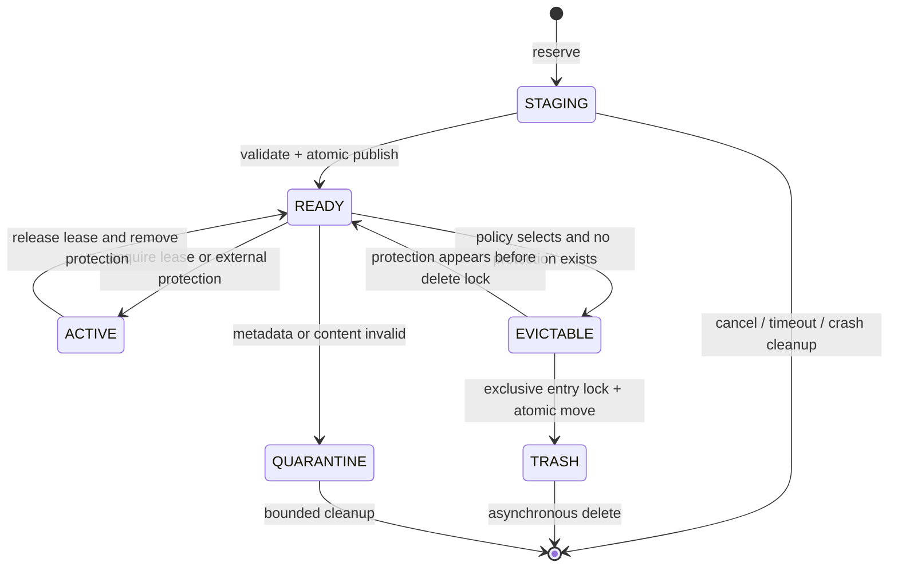

# Studio 插件运行时统一缓存淘汰设计

> 状态：已规划，延期实施
> 决策日期：2026-08-02
> 路线图编号：P2-04
> 当前约束：现阶段不修改 Worker/Flink 缓存代码、配置和部署行为；只有在路线图重新排期并明确批准后才进入实施。

## 1. 背景与结论

当前插件制品在两个执行面落盘：

- Worker 的 `ObjectStoragePluginRuntimeResolver` 将对象存储制品放到
  `<aggregation-home>/cache/<type>/<name>/<release>-<sha256>`。
- Flink TaskManager 中的 `ConnectorPluginRuntimeBootstrap` 将 Worker 返回的制品放到
  `<java.io.tmpdir>/dataaggregation-flink-plugin-runtime/remote/<identity>`。

Worker 已有版本数和总字节数淘汰，并保护 active、pending 以及
`JarLoaderCenter` 正在使用的目录；Flink 目前只清理单次下载的 staging 目录，没有正式缓存的
容量、TTL、LRU 或跨进程保护。因此，不应在 Flink 中再复制一套清理逻辑，而应在
`plugins-loader-center` 中提供统一的 `PluginArtifactCache`，由 Worker 与 Flink TaskManager
共同使用。

本设计的核心约束是：**淘汰只能删除没有任何活动引用的制品；容量不足时宁可拒绝新制品，
也不能删除当前可用版本或运行中任务使用的旧版本。**

本方案已登记为未来路线图 P2-04，只保留设计和迁移边界，不纳入现阶段开发与验收范围。

## 2. 现状差异

| 能力 | Worker | Flink TaskManager |
| --- | --- | --- |
| 缓存键 | `type/name/release-sha256` | 仅 `identity` |
| 启动清理 | 有 | 无 |
| staging 失败清理 | 有 | 有，仅当前操作 |
| 每插件保留版本数 | 默认 2 | 无 |
| 总容量 | 默认 10 GiB | 无 |
| active 保护 | `activeReleases` 和 `.state` | 无持久 active 指针 |
| 下载中保护 | `pendingReleases` | 仅 JVM 内同步锁 |
| 运行任务保护 | `JarLoaderCenter.isDirectoryInUse` | 未作为淘汰前置条件 |
| TTL/LRU | 以目录修改时间近似版本新旧，无 TTL | 无 |
| 跨 JVM 协调 | 无 | 无 |
| 容量无法满足 | 拒绝新版本，保留最后有效版本并进入 `DEGRADED` | 不限制 |

Flink 现有目录只使用 `identity`，存在额外正确性问题：两个不同 coordinate 可能具有相同
identity，不能因此共享一个插件目录。统一缓存键必须是：

```text
CacheKey = coordinate + identity
coordinate = pluginType + "/" + pluginName
```

identity 仍是不可解释的版本标识，不允许把 identity 自身当作全局唯一 coordinate。

## 3. 目标与非目标

### 3.1 目标

1. Worker 与 Flink 复用同一套准入、保护、TTL、LRU、版本数和容量淘汰逻辑。
2. 下载、校验、发布和淘汰在并发及进程崩溃后保持可恢复。
3. 运行中任务、正在发布的版本和 Worker 当前 active 版本绝不被淘汰。
4. 多 task slot、多 TaskManager JVM 共享一个本地目录时仍能正确保护制品。
5. 缓存达到上限且无法回收时，失败发生在新制品准入阶段，旧的可用制品保持不变。
6. 给出可观测指标、告警和可自动化验证的验收矩阵。

### 3.2 非目标

- 不淘汰部署目录下的 `EAGER_LOCAL` 插件；其生命周期属于部署系统。
- 不改变对象存储 `current.json` 的版本选择和 SHA-256 校验语义。
- 不通过缓存淘汰主动中止作业，也不强制运行中的作业升级插件。
- 第一阶段不处理 connector JAR 内置 runtime 的临时解压目录；它在最后一个迁移阶段接入同一组件。

## 4. 共享组件位置与职责

新增包：

```text
plugins-loader-center
└─ com.jdragon.aggregation.pluginloader.runtime.cache
   ├─ PluginArtifactCache
   ├─ PluginArtifactCaches
   ├─ PluginCacheKey
   ├─ PluginCachePolicy
   ├─ PluginCacheEntry
   ├─ PluginCacheLease
   ├─ PluginCacheReservation
   ├─ PluginCacheProtectionSource
   ├─ PluginCacheEvictionResult
   └─ PluginCacheObserver
```

`plugins-loader-center` 已同时被 Worker 和 `studio-flink` 依赖，放在这里不会引入反向依赖。
共享组件只负责本地制品目录生命周期，不依赖 Spring、Flink、OSS SDK 或 Studio DTO。
下载协议、指针读取和插件业务校验继续由接入方负责。

### 4.1 建议 API

```java
PluginArtifactCache cache = PluginArtifactCaches.open(
        cacheRoot,
        policy,
        protectionSource,
        observer);

try (PluginCacheLease lease = cache.acquireIfReady(key, validator).orElseGet(() -> {
    try (PluginCacheReservation reservation = cache.reserve(key, declaredBytes)) {
        Path staging = reservation.stagingDirectory();
        materializeAndValidate(staging);
        reservation.growTo(actualExtractedBytes);
        return reservation.commit(actualExtractedBytes, integrityDigest, validator);
    }
})) {
    use(lease.directory());
}

PluginCacheEvictionResult result = cache.evict(EvictionTrigger.PERIODIC);
PluginCacheSnapshot snapshot = cache.snapshot();
```

API 必须满足以下语义：

- `PluginArtifactCaches.open(root, ...)` 在单 JVM 内按规范化 root 返回共享实例，避免 Java
  `OverlappingFileLockException` 和两个清理线程互相竞争。
- `acquireIfReady` 的“查找、校验、增加本地引用、获取跨进程共享锁”是一个完整操作。
- 同一 `CacheKey` 在 JVM 内 single-flight；跨 JVM 在发布锁内二次检查，避免重复覆盖。
- `PluginCacheLease.close()` 只释放使用权，不直接触发同步删除。
- `reserve` 将未完成制品计入容量，`commit` 只能发布经过调用方 validator 验证的目录。
- observer 只接收事件和数值，接入方可映射到 Micrometer 或 Worker 状态，不反向依赖监控库。

## 5. 磁盘布局和元数据

建议使用带 schema 版本的新目录，避免把现有 Worker/Flink 目录误判成统一缓存条目：

```text
<cache-root>/v2/
├─ artifacts/
│  └─ <coordinate-sha256>/
│     └─ <identity-sha256>/
│        ├─ content/
│        ├─ manifest.properties
│        ├─ access.timestamp
│        └─ READY
├─ staging/<operation-id>/
├─ trash/<operation-id>/
├─ quarantine/<operation-id>/
├─ reservations/<operation-id>.properties
└─ locks/
   ├─ mutation.lock
   └─ entries/<cache-key-sha256>.lock
```

路径使用摘要而不是原始 coordinate/identity，避免路径穿越、Windows 非法字符和超长路径。
`manifest.properties` 至少记录：

| 字段 | 含义 |
| --- | --- |
| `schemaVersion` | 元数据版本 |
| `coordinate` | `type/name` |
| `identity` | 接入方给出的不可变版本标识 |
| `contentBytes` | 已发布 content 的实际字节数 |
| `createdAt` | 首次完成发布时间 |
| `lastAccessAt` | 最近一次合并写入的访问时间 |
| `integrityAlgorithm` | 例如 `SHA-256`，可为空 |
| `integrityDigest` | 已验证制品摘要，可为空 |
| `origin` | `WORKER_OBJECT_STORAGE`、`FLINK_WORKER_HTTP` 或 `BUNDLED` |

`READY` 必须最后创建。没有 `READY`、元数据不完整、目录越界或 validator 不通过的目录不能命中。
访问时间最多每 60 秒合并落盘一次，避免 lookup 高频访问持续写磁盘；进程内仍更新更精确的访问时间。

## 6. 状态机



其中 `ACTIVE` 和 `EVICTABLE` 是扫描时的派生状态，不写入 manifest。active 位一旦持久化，进程
崩溃后容易永久阻止淘汰；真实保护状态必须来自 lease、Worker active/pending 状态和外部保护源。

## 7. 保护模型

条目只要命中任一条件，就属于硬保护对象：

1. 当前 JVM 的 `PluginCacheLease` 引用数大于 0。
2. 其他 JVM 持有该条目的跨进程共享文件锁。
3. `JarLoaderCenter.isDirectoryInUse(contentDirectory)` 为 true。
4. Worker `activeReleases` 或有效 `.state` 指向该条目。
5. 条目处于 reservation、下载、校验或原子发布阶段。
6. 接入方提供的额外 `PluginCacheProtectionSource` 返回 protected。

淘汰前必须在全局 mutation lock 内重新检查上述条件，并尝试获得条目的排他锁。检查与删除之间
不能有无锁窗口。删除分两步：先将条目原子移动到 `trash`，再异步递归删除；获得新 lease 的
操作只查 `artifacts`，不会重新打开已选中的条目。

### 7.1 跨进程 lease

- 每个 JVM 对同一条目只持有一个共享 `FileLock`，JVM 内用引用计数复用。
- 每个 lease 对应 `locks/entries/<cache-key-sha256>.lock`，锁文件位于制品目录之外。
- 淘汰器必须先取得同一文件的排他锁；`tryLock` 失败即跳过，不能等待并阻塞作业。
- Windows 上不能依赖“删除已打开 JAR 会失败”作为保护机制；文件锁和
  `JarLoaderCenter` 引用才是协议。删除仍失败时移入重试队列，不循环强删。
- 若底层文件系统不提供可靠的进程间文件锁，必须为每个 TaskManager JVM 配置独占 cache root；
  NFS 等共享目录默认不受支持。

## 8. 淘汰策略

### 8.1 策略顺序

清理按以下顺序执行：

1. 删除超过 `stagingTtl` 且未持有 reservation 锁的 staging/reservation。
2. 清理超过隔离保留期的 quarantine 和删除失败的 trash。
3. 对每个 coordinate 按 `lastAccessAt`、`createdAt` 从新到旧排序。
4. 先选超过 `retainedReleases` 的未保护版本。
5. 再选超过 `expireAfterAccess` 的未保护版本。
6. 若为容量准入清理且仍不足，继续按全局 LRU 选择其余未保护版本，包括保留窗口内版本。
7. 每删除一个候选项都重新检查保护并重新计算可用容量。
8. 仍无法满足 `currentBytes + reservations + incomingBytes <= maxBytes` 时拒绝本次准入。

`retainedReleases` 是空闲时的热缓存目标，不是硬保护；active 和 lease 才是硬保护。容量压力下可以
删除保留窗口内的旧版本，但不能删除 Worker 当前 active 版本。这样既保持现有 Worker 的回滚
命中率，也不会让版本数策略突破磁盘上限。

同一时间戳的稳定排序键依次为 `lastAccessAt`、`createdAt`、cache-key 摘要，保证测试和多次扫描
结果确定。

### 8.2 准入伪代码

```text
admit(key, declaredBytes):
  acquire mutation lock
  if READY(key) is valid:
      return acquireLease(key)
  remove invalid READY(key) through quarantine
  create durable reservation(declaredBytes, expiresAt)
  evictUntilFits(declaredBytes)
  if capacity still insufficient:
      remove reservation
      throw CacheCapacityExceededException
  release mutation lock

  stream download and extraction into staging
  grow reservation in bounded increments while extracting
  validate coordinate, plugin.json, entry count, expanded bytes and digest

  acquire mutation lock
  if another process already published valid READY(key):
      discard staging and return acquireLease(key)
  evictUntilFits(actualContentBytes - currentReservationBytes)
  if capacity still insufficient:
      keep existing READY entries, discard staging, reject admission
  write manifest, atomically move content to artifacts, create READY last
  remove reservation
  return acquireLease(key)
```

下载流和解压后的内容都要计入 reservation。解压期间按固定增量增长 reservation；无法增长时立即
终止解压，从而避免 zip bomb 在正式提交前耗尽磁盘。`maxArtifactBytes`、`maxExtractedBytes` 和
`maxEntryCount` 仍由现有安全校验负责，不能用 cache max 替代。

## 9. Worker 接入

Worker 保留以下业务职责：

- 读取和校验 `current.json`、repository、runtimeVersion、release 与 SHA-256。
- 下载对象存储制品，并决定哪个 release 成为 coordinate 的 active。
- 维护 `.state` 和刷新失败的 `DEGRADED` 状态。

以下职责迁入共享缓存：

- staging/reservation 生命周期、容量统计、版本保留、TTL/LRU、目录发布和删除。
- pending、进程内 lease 和跨进程 lease 的基础保护。
- 通用缓存指标。

接入流程：

1. 使用 `coordinate=type/name`、`identity=sha256:<sha256>` 构造 key。
2. `ObjectStoragePluginRuntimeResolver.materialize` 改为调用 cache 的 reserve/commit，不再自行
   `cleanupCacheLocked` 和 `requireCacheCapacityLocked`。
3. `PluginCacheProtectionSource` 同时读取 `activeReleases` 和已恢复的有效 `.state`，确保 Worker
   启动清理也不会删除最后有效版本。
4. `withResolvedPlugin` 在持有短 cache lease 时执行回调；回调内
   `PluginRuntimeSession.acquire` 获得 `JarLoaderCenter` lease 后，短 lease 才可释放，保持
   resolve-to-acquire 原子性。
5. 刷新失败继续返回 previous active；容量拒绝记为 `DEGRADED`，不能先改 `.state`。
6. `statusSnapshot` 保留现有字段，并追加统一缓存的 bytes、protectedBytes、evictions 和
   admissionRejected 统计。

## 10. Flink TaskManager 接入

1. `ConnectorPluginRuntimeBootstrap` 不再用 `remoteCacheRoot().resolve(identity)`，而是用 Worker
   响应头中的 `coordinate + identity` 访问共享缓存。
2. HTTP body 下载、ZIP 安全解压和 `plugin.json` 校验作为 materializer/validator 传给共享组件。
3. `runWithReady` 在获取 `PluginCacheLease` 后才绑定 `REMOTE_RESOLVER`，并在整个
   `PluginOperation` 完成后关闭 lease。
4. 当前 file、queue、structured source 的 `readRows` 都在 `PluginOperation` 内同步完成，因此
   lease 覆盖实际读取生命周期；lookup 每次 `eval` 同样由本次 operation 保护。
5. 未来若 connector 在 `PluginOperation` 返回后继续异步类加载或持有插件对象，lease 必须转交
   Flink operator/function 的 `open/close` 生命周期，不能只保护初始化方法。
6. 同一 TaskManager JVM 的 task slots 复用一个 cache 实例；同主机多个 TaskManager JVM 可在
   本地文件锁可靠时共享 root，否则为每个 JVM 配置独占 root。
7. TaskManager 启动时执行恢复扫描，后台定时清理；关闭 hook 只停止线程并释放本进程锁，不删除
   仍可复用的 READY 条目。

Worker 上的 capability pin 只保护 Worker 原始目录和下载响应期间的读取，不能替代 TaskManager
本地目录的 cache lease。两端必须各自保护自己的物理制品。

## 11. 配置建议

统一组件使用相同语义，接入方负责映射自己的配置来源：

| 语义 | Worker 配置 | Flink JVM 属性/环境变量 | 默认值 |
| --- | --- | --- | --- |
| root | `<aggregation-home>/cache` | `dataaggregation.plugin.cache.root` / `DATAAGGREGATION_FLINK_PLUGIN_CACHE_ROOT` | 当前 Flink remote root |
| 最大字节数 | `studio.plugin-runtime.cache-max-bytes` | `dataaggregation.plugin.cache.max-bytes` / `DATAAGGREGATION_FLINK_PLUGIN_CACHE_MAX_BYTES` | 10 GiB |
| 每 coordinate 热版本数 | `studio.plugin-runtime.retained-releases` | `dataaggregation.plugin.cache.retained-releases` / `DATAAGGREGATION_FLINK_PLUGIN_CACHE_RETAINED_RELEASES` | 2 |
| 最后访问 TTL | `studio.plugin-runtime.cache-expire-after-access-seconds` | `dataaggregation.plugin.cache.expire-after-access-seconds` | 604800（7 天） |
| 周期清理间隔 | `studio.plugin-runtime.cache-cleanup-interval-seconds` | `dataaggregation.plugin.cache.cleanup-interval-seconds` | 600 |
| staging 超时 | `studio.plugin-runtime.cache-staging-ttl-seconds` | `dataaggregation.plugin.cache.staging-ttl-seconds` | 3600 |
| 访问时间落盘间隔 | `studio.plugin-runtime.cache-access-flush-seconds` | `dataaggregation.plugin.cache.access-flush-seconds` | 60 |
| mutation lock 超时 | `studio.plugin-runtime.cache-lock-timeout-seconds` | `dataaggregation.plugin.cache.lock-timeout-seconds` | 30 |

Worker 现有 `STUDIO_PLUGIN_CACHE_MAX_BYTES` 和 `STUDIO_PLUGIN_RETAINED_RELEASES` 环境变量保持兼容，
只映射到新 policy。所有大小必须大于 0，版本数至少为 1，TTL/间隔为 0 时只能表示显式关闭对应
定时策略，不能落入忙循环。

这里的 10 GiB 是准入上限，不承诺缓存始终低于该值：运维在运行中把上限调低到 protected
bytes 以下时，现有任务继续运行，但新制品准入被拒绝并产生告警。

## 12. 崩溃恢复与异常边界

- 启动扫描只信任 `READY + manifest + validator`；其他 artifacts 条目移入 quarantine。
- 过期 reservation/staging 在拿到其操作锁后删除，拿不到锁视为另一个进程仍在工作。
- commit 顺序为“完整 content -> manifest -> 原子移动 -> READY”，崩溃最多留下可识别的 staging
  或无 READY 条目。
- trash 删除失败采用有上限的退避重试。Windows 上 JarFile 未关闭、杀毒软件短时占用均不能导致
  启动失败。
- 任何递归删除都必须校验规范化路径位于 v2 root 内，拒绝删除 root 本身，并且不跟随符号链接。
- manifest 的 `contentBytes` 在启动抽样校验或发现不一致时重新计算；容量计算发生溢出时按
  `Long.MAX_VALUE` 处理并拒绝新准入。
- 时钟回拨时将未来的 `lastAccessAt` 截断到当前时间；LRU 仍以稳定排序键兜底。

## 13. 指标与告警

建议通过 `PluginCacheObserver` 暴露下列低基数指标，不把 coordinate/identity 放入 metric label：

```text
plugin_cache_bytes{runtime,kind=ready|reserved|protected|trash|quarantine}
plugin_cache_entries{runtime,state=ready|active|staging|trash|quarantine}
plugin_cache_leases{runtime}
plugin_cache_evictions_total{runtime,reason=retention|ttl|capacity|invalid}
plugin_cache_eviction_failures_total{runtime,reason}
plugin_cache_admission_rejected_total{runtime,reason=capacity|lock|validation}
plugin_cache_materializations_total{runtime,result=hit|downloaded|failed}
plugin_cache_cleanup_duration_seconds{runtime,trigger}
plugin_cache_oldest_staging_age_seconds{runtime}
```

推荐告警：

- ready + reserved 使用率持续 15 分钟超过 85%。
- 5 分钟内出现任何 capacity admission rejection。
- protected bytes 已超过 maxBytes。
- eviction failure 连续三个清理周期不归零。
- oldest staging age 超过 `2 * stagingTtl`。
- quarantine bytes 持续增长或启动恢复反复发现同一损坏 key。

日志可以记录 coordinate、identity 摘要、候选原因和受保护原因，但必须避免输出 capability token、
对象存储凭据或带签名 URL。

## 14. 测试矩阵

### 14.1 共享组件单元测试

| 场景 | 预期 |
| --- | --- |
| 相同 identity、不同 coordinate | 生成两个独立条目，互不覆盖 |
| 相同 key 并发下载 | 单 JVM single-flight，只发布一次 |
| retained + LRU + TTL | 按稳定顺序删除正确候选项 |
| active/cache lease/loader lease | 任一保护存在时均不删除 |
| 容量不足且全受保护 | 拒绝准入，已有目录完全不变 |
| 容量不足且有冷版本 | 先删除冷版本，再提交新版本 |
| reservation 并发增长 | 总 reservation 不突破上限 |
| commit 前崩溃 | 重启删除过期 staging，不出现 READY 命中 |
| manifest/READY/content 损坏 | 隔离并重新物化 |
| 路径穿越和符号链接 | 拒绝越界读写及删除 |
| 时间相同或时钟回拨 | 淘汰顺序仍确定 |

### 14.2 Worker 回归测试

- 迁移现有“使用中版本保留”“保留两个版本”“容量拒绝”“冷版本让位”测试到统一组件接入路径。
- active `.state` 在 Worker 重启后的第一次 cleanup 中仍受保护。
- resolve 和 `JarLoaderCenter.acquire` 并发切换版本时无删除窗口。
- v1 任务持续运行、active 更新到 v2 后，v1 直到任务 lease 释放才可删除。
- 新版本校验、下载或容量准入失败时，active 和 `.state` 仍指向最后有效版本，状态为 `DEGRADED`。

### 14.3 Flink 回归测试

- 相同 identity 的两个 source coordinate 不串用目录。
- source/lookup operation 未结束时，定时和容量清理都不能删除本地制品。
- operation 结束且版本超保留/TTL 后能够淘汰。
- 多 task slot 并发命中同一版本只物化一次。
- 使用 forked JVM 验证共享锁：一个 JVM 持 lease，另一个 JVM 不能淘汰；释放后可以淘汰。
- TaskManager 在下载、解压、commit 各阶段被终止后，重启扫描可恢复。
- Windows 下模拟 Jar 文件占用，删除失败进入重试且不影响作业线程。
- 容量拒绝能关闭 HTTP body、清理 staging，并保留其他可用条目。

### 14.4 端到端验收

1. Worker 连续发布 v1-v4，旧 Flink 作业固定使用 v1，新作业使用 v4。
2. 同时触发 Worker 和 TaskManager 清理，v1/v4 在各自被使用期间均存在。
3. 停止旧作业后，v1 在达到策略条件时从两端删除。
4. 将上限调到 protected bytes 以下，新版本发布失败但现有作业不受影响。
5. 重启 Worker 和 TaskManager，缓存状态、指标和后续淘汰行为一致。

## 15. 分阶段迁移

### 阶段 A：共享组件

- 在 `plugins-loader-center` 实现 v2 布局、lease、reservation、evictor 和单元测试。
- 先以 scan-only 模式读取并报告候选项，不执行删除，对照现有 Worker 统计。

### 阶段 B：Worker 等价迁移

- Worker 新下载版本写入 v2；恢复逻辑同时识别旧 cache 和 v2 state schema。
- 旧 cache 只读恢复，active/loader lease 继续保护；coordinate 激活 v2 后，旧目录才进入受控清理。
- 对比统一组件与原 `cleanupCacheLocked` 的决策，测试通过后删除旧清理实现。
- 保持现有环境变量、状态字段和 `DEGRADED` 行为，降低运维切换成本。

### 阶段 C：Flink remote cache

- `ConnectorPluginRuntimeBootstrap` 接入 coordinate + identity key 和 operation lease。
- 旧 `<remote>/<identity>` 不直接复用，因为其 key 缺少 coordinate；启动时只做受限的遗留目录清理，
  不把它当作新缓存命中。
- 在多 slot 和 forked TaskManager JVM 测试通过后开启定时淘汰。

### 阶段 D：内置 runtime 与运维收口

- 将 `extractBundledRuntime()` 产生的临时目录按 connector build identity 接入统一缓存，或在明确的
  operator/JVM 生命周期结束时删除，消除剩余临时目录泄漏。
- 补齐 Flink 部署环境变量、仪表盘、容量告警和故障排查文档。
- 观察至少一个保留周期后删除 legacy cache 兼容扫描代码。

每个阶段都保留 `scan-only/legacy` 回退开关；回退只能停止新淘汰，不能把正在运行的任务切换到
另一个插件 revision。

## 16. 验收准则

统一机制完成的判定条件：

1. Worker 与 Flink 不再各自维护独立的容量/版本淘汰算法。
2. 任意删除都经过统一保护检查和条目排他锁。
3. Worker active、Worker/Flink 运行任务、下载中制品的保护测试全部通过。
4. 相同 identity、不同 coordinate 不发生缓存碰撞。
5. 超限时能够回收未保护 LRU；无法回收时只拒绝新制品。
6. 进程崩溃、Windows 文件占用和多 JVM 共享 root 均有自动化测试。
7. 指标能够区分正常淘汰、删除失败和容量准入拒绝，并有对应告警。
