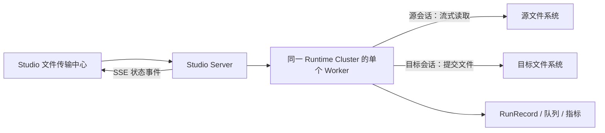

# Studio 非结构化文件传输三阶段实施计划

> 状态：设计基线，单集群改造已实施
>
> 形成日期：2026-08-07
>
> 实施完成日期：原三阶段版本为 2026-08-07；单集群改造为 2026-08-09
>
> 目标版本：待纳入发布版本
>
> 实施顺序：CLI 与插件内核 → Studio/Worker 与指标 → 前端交互
>
> 设计基线：本文档是后续非结构化文件传输建设的设计基线；实施过程中如调整公共接口、表结构、状态机或安全边界，必须同步更新本文档。

## 1. 背景与目标

Studio 现有离线采集任务以结构化记录为基本传输单位，无法直接覆盖任意二进制文件、目录递归、文件级断点续传、目标冲突处理和文件级运行指标。本计划建设一套独立的非结构化文件传输能力，交互形态参考 Xftp：用户可以浏览一个文件数据源，也可以同时打开左右两个数据源，将单个文件、多个文件或目录按任一方向推入传输队列。

在即时传输基础上，系统还需要支持预设传输任务。预设任务保存文件选择规则、目标映射、冲突策略、源端后处理、并发和调度配置；每次运行时重新扫描符合条件的文件，并复用即时传输使用的同一套队列、执行器、运行记录和指标体系。

首期建设目标包括：

- 底层二进制文件传输内核、CLI 和 DataAggregation 插件集成。
- Studio Worker 执行、跨运行集群传输、多文件并行、断点续传和指标收集。
- Xftp 风格双栏文件浏览、传输队列、预设任务、运行记录和指标页面。
- Local、FTP、SFTP、MinIO 和阿里云 OSS 文件源。
- 手工触发、定时调度和工作流节点调用预设传输任务。

首期不实现自动双向目录同步、内容在线编辑、文件内容预览、文件上传和 HDFS 文件传输；单源非结构化管理支持文件直接下载。

## 2. 现有项目扫描结论

### 2.1 `unstructured-transfer` 可借鉴内容

`C:\dev\ideaProject\bm\unstructured-transfer` 是一个 Java 8 CLI 文件传输工具，主链路为：

```text
JSON 配置
→ 源目录枚举
→ 固定线程池
→ 逐文件复制
→ 按目标文件大小尝试续传
→ 写前/读后处理
→ stdout 进度上报
```

其中可以借鉴的设计包括：

- `FileRecord` 与 `FileHelper` 的文件描述和存储访问分层。
- Local、FTP、SFTP 适配器的基本组织方式。
- 目录递归展开为文件传输项。
- 写前处理、读后删除或备份等文件生命周期动作。
- 固定线程池、多文件并行和 stdout 进度事件的基本思路。

### 2.2 不原样移植的原因

旧项目只作为概念参考，不复制其传输循环、配置格式或依赖，主要原因包括：

- CLI 读取根节点 `parameter/reader/writer`，示例模板却使用 `job.content[0]`；`path/regex/username` 等字段也与代码期待的 `readPath/readRegex/userName` 不一致，自带模板无法直接运行。
- 传输失败后仍可能执行源文件读后删除或备份，存在源文件丢失风险。
- 重试耗尽后仍可能返回成功；输入流提前 EOF 且未抛异常时存在无进展循环风险。
- 只按文件大小判断目标是否已完成，同大小但内容变化的文件可能被错误跳过。
- SFTP 空文件、文件不存在和 `isFile` 异常路径存在误判。
- 目录复制绕过单文件的冲突处理、前后置处理和结果记录。
- 本地目录递归删除存在错误递归目标；FTP 流与 `completePendingCommand()` 的生命周期不适合复杂重试。
- 指标通信使用普通 `HashMap/LinkedList` 跨线程访问，不满足并发安全要求。
- Java 8、JSch 0.1.55、commons-net 3.6、Logback 1.0.13、Fastjson 1.2.78 等依赖不符合当前 Java 17 技术基线。

因此，新实现采用“借鉴分层和队列思想，不原样移植旧实现”的原则。

### 2.3 当前仓库可复用基础

- DataAggregation 已有 `FileHelper`、FTP/SFTP/MinIO/OSS source 插件以及插件加载器。
- 现有 `ftpreader/sftpreader/ftpwriter/sftpwriter` 面向 CSV、EFile 等结构化内容，不适合承担任意二进制文件复制。
- `platform-vfs-core` 已有较成熟的 SFTP 临时文件、连接重建、断点续传、无进展检测、大小校验和最终提交实现，可以抽取其可靠性原则。
- Studio 已有 Runtime Cluster、Worker-only 执行面、Dispatch、`run_record`、运行日志归档、任务发布、调度、工作流和指标趋势能力。
- Studio Server 当前是纯控制面，不加载 DataAggregation 插件，也不直接连接业务数据源；文件浏览和真实文件操作必须继续由 Worker 执行。

## 3. 已确认的产品与架构决策

- 数据源访问坚持 Worker-only：Server 负责鉴权和编排，不加载文件数据源插件，也不承担文件传输中继。
- 首期文件源为 Local、FTP、SFTP、MinIO 和阿里云 OSS。
- 源和目标必须属于同一个 Runtime Cluster，由单个 Worker 直接访问两端。
- Server Relay、Worker-to-Worker 直连和跨集群文件传输从新运行路径移除；旧字段和历史记录保留兼容但不可重试、恢复或再次执行。
- 双向传输表示左右两侧都可以发起方向固定的传输项，不表示自动双向目录同步。
- 浏览侧支持单文件、多文件和目录递归；目录在 Worker 侧展开为文件级队列项并保留相对路径。
- 预设任务支持 glob、正则、排除规则、文件大小、修改时间和动态函数等复杂选择条件。
- 多线程首期采用多文件并行；一个文件内部顺序分块传输，不做单文件多分片并行。
- 文件推入即时队列后默认自动开始，并支持暂停、恢复、取消和失败重试。
- 目标正式文件摘要一致时统一跳过；内容不同时由用户选择失败、覆盖或备份后覆盖。
- 源端默认保留，可选删除或备份；源端动作只能在目标校验和正式提交成功之后执行。
- 运行级复用 `run_record`，同时新增独立的文件项、字节指标和传输指标页面。
- 预设任务首期支持手工触发、定时调度和工作流节点引用。
- 数据资产菜单提供单源非结构化管理：浏览、下载、新建目录、移动、重命名和递归删除。
- 非结构化管理由数据源创建者和管理员维护 ACL，支持 BROWSE、DOWNLOAD、EDIT、DELETE 的源级和路径级授权。

## 4. 总体架构

文件传输拆分为三层：

1. 二进制文件传输内核：文件系统能力、文件发现、队列、续传、冲突处理、校验、提交、重试、取消和事件。
2. DataAggregation 插件与 Worker 适配层：插件加载、CLI、运行上下文、源插件会话和单集群执行。
3. Studio 控制面：浏览路由、任务配置、Dispatch、运行记录、指标 API、工作流和前端页面；Server 不加载插件、不读取文件内容。



文件传输运行由同一运行集群中的单个 Worker 持有执行状态、源会话和目标写会话。Server 仅负责鉴权、编排和事件转发，不读取文件内容、不落盘，也不参与跨集群中继。

## 5. 阶段一：CLI、传输内核与插件体系

### 5.1 模块与插件类型

- 新增 `file-transfer-core`：传输领域模型、文件系统能力接口、队列执行器、状态机、摘要、检查点和事件。
- 新增 `file-transfer-plugin`：DataAggregation 文件传输作业插件实现。
- 新增 `file-transfer-cli`：本地验证、浏览、计划生成、运行和恢复入口。
- 在 `PluginType` 中新增 `FILE_TRANSFER("file-transfer")`。
- 插件发行目录固定为 `aggregation/plugin/file-transfer/filetransfer`，包含 `plugin.json`、插件类和依赖。
- 文件传输插件 内部仍通过 `SourcePluginType.SOURCE` 加载 Local、FTP、SFTP、MinIO/OSS source 插件。

文件传输不能包装成结构化 Reader/Writer 的 `Record` 流。Reader/Writer 的通道背压、脏记录和行转换语义不适用于二进制文件、目录树、文件级提交和断点恢复，因此必须使用独立作业类型。

### 5.2 公共能力接口与类型

新增可选接口 `TransferFileSystem`，现有 `FileHelper` 保持兼容。支持文件传输的数据源插件同时实现两个接口。

`TransferFileSystem` 至少提供：

- `stat`：返回类型、大小、修改时间、ETag、摘要能力和路径信息。
- `listPage`：按目录、游标和页大小列出文件与子目录。
- `openRead`：按 offset 和 length 打开 Range 输入流。
- `prepareWrite`：创建或恢复临时写会话，返回已确认写入偏移量。
- `append`：从指定偏移量追加一个有界数据块。
- `checksum`：计算或获取指定算法摘要。
- `commit`：校验后将临时文件或对象提交为正式目标。
- `move/delete`：用于目标备份和源端后处理。
- `capabilities`：声明分页、Range、原子移动、multipart、服务端复制和摘要能力。

核心公共类型固定为：

- `FileEntry`、`FilePage`、`StorageCapabilities`
- `SourceSnapshot`、`TransferSpec`、`TransferSelection`
- `TransferPlan`、`TransferPlanItem`
- `TransferCheckpoint`、`TransferWriteSession`
- `TransferEvent`、`TransferResult`
- `ConflictPolicy`、`SourceSuccessAction`、`TransferItemStatus`

FTP、SFTP 和 MinIO/OSS 现有 source 插件补齐上述能力。Local 新增正式的 `local` source 插件，配置必须包含 Worker 允许根目录，任何规范化后越过根目录的路径都必须拒绝。

### 5.3 CLI 契约

CLI 提供以下命令：

```text
file-transfer validate <job.json>
file-transfer browse <endpoint.json> --path <path> [--cursor <cursor>] [--page-size 200]
file-transfer plan <job.json>
file-transfer run <job.json>
file-transfer resume <checkpoint.json>
```

配置使用 `schemaVersion: 1`，包含：

- `source`、`target`：插件类型和连接配置。
- `selection`：根路径、递归、include globs、include regex、exclude globs、大小和修改时间范围。
- `mapping`：目标根路径、相对路径保留和动态路径模板。
- `policy`：冲突策略、校验算法、源端成功动作和备份路径模板。
- `runtime`：并发度、重试次数、退避、检查点间隔和带宽上限。

stdout 只输出 JSONL `TransferEvent`，普通日志写 stderr。退出码固定为：

- `0`：成功。
- `2`：配置或参数错误。
- `3`：部分成功。
- `4`：运行失败。
- `5`：运行被取消。

CLI 配置允许直接提供连接参数；Studio 中不保存 CLI 明文配置，而是只保存数据源 ID，由 Worker 在安全上下文中加载和解密连接信息。

### 5.4 文件发现与动态规则

- 浏览选择支持单文件、多文件和递归目录。
- 目录选择先进入异步发现阶段，逐步生成持久化文件项，不在内存中构造无限列表。
- 默认最多展开 `100,000` 个文件，达到上限后停止发现并明确报错；上限可由 Worker 配置调整。
- 预设任务支持多个 glob、单个可选正则、多个排除 glob、最小/最大文件大小和修改时间范围。
- 动态函数可用于源根路径、目标根路径、目标相对路径和筛选参数。
- 动态函数在运行开始时只解析一次，使用本次计划时间、时区、运行 ID 和用户参数；解析结果写入运行快照，恢复或重试时不得重新求值。

### 5.5 可靠传输协议

单文件成功链路固定为：

```text
捕获源文件快照
→ 判断正式目标冲突
→ 创建或恢复本次文件项专属临时写会话
→ 顺序分块传输并持久化检查点
→ 校验目标大小和 SHA-256
→ 原子提交或对象存储正式提交
→ 写入文件级结果
→ 执行源端保留/删除/备份动作
```

默认并发度为 `4`，允许范围为 `1-32`。默认重试 `3` 次，退避间隔为 `1/5/15` 秒。检查点按每传输 `8 MiB` 或每 `1` 秒中较早发生者更新。

临时文件或对象使用 `runId + itemId` 唯一标识。只有以下条件全部满足时才允许断点续传：

- 临时对象确实由当前或可恢复的文件项创建。
- 检查点记录的源集群、数据源、规范化路径与当前一致。
- 源大小、修改时间和可用 ETag 与源快照一致。
- 临时目标已确认长度与检查点一致且小于等于源大小。

正式目标文件永远不能作为断点临时文件。源文件在传输中变化、输入流提前 EOF、检查点偏移倒退、临时目标被外部修改或连续无进展都必须失败关闭。

### 5.6 摘要、冲突与提交

- 规范摘要算法使用 SHA-256。
- 对象存储 ETag 只用于快速筛选或源快照，不作为统一内容摘要，因为 multipart ETag 不一定是 MD5。
- 正式目标不存在时，正常进入临时写入。
- 正式目标存在且 SHA-256 一致时，无条件记为 `SKIPPED`。
- 摘要不同时，按用户策略执行 `FAIL`、`OVERWRITE` 或 `BACKUP_THEN_OVERWRITE`。
- `BACKUP_THEN_OVERWRITE` 使用包含时间戳和 item ID 的备份名，文件系统优先移动，对象存储优先服务端复制。
- Local/FTP/SFTP 使用临时文件加 rename 提交；MinIO/OSS 使用 multipart 临时对象或临时 key，校验后复制/提交到正式 key，再清理临时对象。

源端动作默认为 `KEEP`，可选 `DELETE` 或 `BACKUP`。源端动作只能在正式目标提交成功后执行。若目标已成功但源端动作失败，文件项进入 `POST_ACTION_FAILED`，运行进入 `PARTIAL_SUCCESS`；重试只重新执行后处理，不重复传输目标文件。

## 6. 阶段二：Studio、Worker、任务、工作流与指标

### 6.1 浏览与手工传输 API

文件浏览公开接口：

```text
POST /api/v1/file-transfer/browser/list
```

请求包含 `runtimeClusterId`、`datasourceId`、`path`、`cursor` 和 `pageSize`。默认页大小为 `200`，最大为 `1000`。Server 校验租户、项目、运行集群、数据源适用范围和读取权限后，将请求同步路由到对应 Worker；Worker 不可用时返回明确的 `503`，禁止 Server 本地回退。

手工传输接口：

```text
POST /api/v1/file-transfer/runs/manual
POST /api/v1/file-transfer/runs/{runId}/items
POST /api/v1/file-transfer/runs/{runId}/pause
POST /api/v1/file-transfer/runs/{runId}/resume
POST /api/v1/file-transfer/runs/{runId}/cancel
POST /api/v1/file-transfer/runs/{runId}/items/{itemId}/retry
GET  /api/v1/file-transfer/runs/{runId}
GET  /api/v1/file-transfer/runs/{runId}/items
```

创建手工运行后，页面可以连续推入左到右或右到左项目。一个运行只保存一个规范 `runtimeClusterId`，每个项目保存源/目标数据源和路径；左右方向只代表本次文件的来源和去向，不形成独立方向字段。入队默认自动执行；目录项先进入发现阶段，再生成文件项。

### 6.2 预设任务 API 与配置

预设任务提供：

```text
GET/POST/PUT/DELETE /api/v1/file-transfer-tasks
POST /api/v1/file-transfer-tasks/{id}/validate
POST /api/v1/file-transfer-tasks/{id}/preview-selection
POST /api/v1/file-transfer-tasks/{id}/publish
POST /api/v1/file-transfer-tasks/{id}/offline
POST /api/v1/file-transfer-tasks/{id}/trigger
```

任务定义保存：

- 名称、编码、状态、版本、租户和项目。
- 一个 Runtime Cluster 和源/目标数据源 ID。
- 文件选择、目标映射和动态函数表达式。
- 冲突策略、摘要算法和源端成功动作。
- 并发度、重试、带宽和发现上限。
- 调度开关、Cron 和时区。

每次运行重新解析动态函数并扫描文件，不在任务定义中固化上次运行的文件清单。运行开始后保存不可变的解析配置快照，任务后续编辑不影响已经排队或运行中的实例。

### 6.3 运行和工作流集成

- `NodeType` 新增 `FILE_TRANSFER`。
- `DispatchExecutionType` 新增 `FILE_TRANSFER`。
- 预设任务发布后可被工作流节点引用，节点保存任务 ID 和发布版本。
- 工作流运行时仍通过 Dispatch 定向执行，文件传输结果映射为工作流节点成功、部分成功、失败或取消。
- 手工浏览传输不是可引用业务资源，不能直接成为工作流节点。
- 预设任务手工触发、定时触发和工作流触发最终都进入同一文件传输运行和队列执行器。

### 6.4 数据模型

复用 `run_record` 记录统一运行身份、工作流关联、执行类型、Worker 实例、状态、日志、开始和结束时间；`execution_type` 使用 `FILE_TRANSFER`。

新增以下表：

1. `file_transfer_task_definition`
   - 保存任务定义、发布状态、源/目标资源、规则、策略、运行参数和调度信息。
2. `file_transfer_run`
   - 以 `run_record_id` 关联统一运行记录，保存任务 ID、触发类型、规范运行集群、源/目标数据源、解析配置快照、文件和字节聚合值；历史源/目标集群字段只用于兼容。
3. `file_transfer_run_item`
   - 保存文件级规范运行集群、源/目标路径、源快照、临时写会话、状态、字节进度、摘要、重试、错误、时间和后处理结果；历史方向和通道字段不参与新运行决策。
4. `file_transfer_metric_sample`
   - 保存运行中的时间序列字节、文件计数、瞬时速度、并发和重试采样。
5. `file_transfer_event_outbox`
   - 追加式保存文件传输运行和文件项的状态变化事件；只保存租户、项目、运行、文件项引用和少量脱敏补充信息，不保存文件内容、数据源凭据、Token、Worker 地址或完整运行快照。
6. `file_transfer_event_consumer_cursor`
   - 保存每个 Studio Server 实例在每个租户/项目作用域上的 Outbox 扫描位置；它不是浏览器确认位点，也不在多个 Server 间竞争消费。

实施时沿用 Studio 现有实体、Mapper、SQL 迁移、租户/项目隔离、逻辑删除和时间字段规范。任务定义中的复杂规则和运行快照使用 JSON 类型处理器，文件级高频聚合字段使用独立数值列，避免指标页面扫描 JSON。

### 6.5 状态机

文件项状态固定为：

```text
DISCOVERING
QUEUED
TRANSFERRING
VERIFYING
COMMITTING
POST_ACTION
SUCCESS
SKIPPED
CONFLICT
POST_ACTION_FAILED
FAILED
PAUSED
CANCELED
```

运行状态固定为：

```text
QUEUED
RUNNING
PAUSED
SUCCESS
PARTIAL_SUCCESS
FAILED
CANCELED
```

暂停在当前有界数据块结束后生效并保留有效检查点。恢复时重新验证源快照和临时目标。取消停止后续调度并默认清理临时数据；失败项在临时数据仍有效时可以续传重试。重复触发、重复提交块和重复源端动作都必须通过运行/文件项幂等键保护。

### 6.6 单集群 Worker 执行

目标 Worker 是运行的唯一执行拥有者和指标写入者。新请求必须携带一个 `runtimeClusterId`，源和目标数据源必须同时适用于该集群；不满足时返回 `FILE_TRANSFER_CROSS_CLUSTER_DISABLED`。Worker 在进程内加载两端 source 插件并流式复制，保留文件级断点、重试、目标提交和指标单写模型。

旧记录中的 `sourceRuntimeClusterId`、`targetRuntimeClusterId` 和 `SERVER_RELAY` 字段只用于历史查询。若记录属于跨集群或无法证明同集群，重试、恢复、再次执行和工作流重新触发均必须拒绝。新运行路径不创建 Relay ticket，不调用 Server Relay Controller、Client 或 Router。

### 6.7 指标与日志

运行级指标包括：

- 发现文件总数、成功、失败、跳过、冲突、续传和后处理失败文件数。
- 总字节数、已完成字节数、失败字节数和续传字节数。
- 当前速度、平均速度、峰值速度、运行耗时和预计剩余时间。
- 当前并发文件数、累计重试次数和失败原因分类。
- 运行集群、数据源、Worker 和执行线程。

文件级指标包括：

- 文件名、源/目标路径和文件大小。
- 状态、进度、当前速度、已传输字节和断点偏移。
- 源/目标 SHA-256、重试次数、错误码和错误摘要。
- 开始、结束、耗时、冲突处理和源端后处理结果。

活跃进度每秒更新，指标快照每 `5` 秒持久化。`/run-metrics` 接入 `FILE_TRANSFER` 的运行摘要、趋势和 TopN，同时新增 `/file-transfer-metrics` 专属页面展示文件传输的字节、速度和文件明细。日志继续复用 Studio 现有 Worker 日志文件和共享对象存储归档机制。

### 6.8 MySQL Outbox 与多 Server SSE

文件传输事件的可靠存储为 MySQL `file_transfer_event_outbox`，不引入 Redis、Kafka、RabbitMQ 或其他事件中间件。Outbox 使用 MyBatis-Plus `ASSIGN_ID` 生成单调的雪花 ID，事件类型固定为：

```text
RUN_CREATED
RUN_CHANGED
ITEM_CHANGED
RUN_REMOVED
ITEM_REMOVED
```

运行、文件项、检查点和指标状态的每次持久化都由 `FileTransferStateMutationService` 在同一短事务内完成“业务表字段级更新 + Outbox 追加”。整个文件传输过程不能包在数据库事务中。进度更新仍正常写业务表，但同一运行或文件项默认每 `1` 秒至多追加一条进度事件；创建、删除、暂停、恢复、失败和所有终态事件强制立即追加。终态保存必须重新读取数据库最新状态，只更新终态汇总字段，保留已写入的峰值速度，并将当前速度和活动文件数归零。

每个 Server 使用唯一的 `studio.instance-id`，并在 `file_transfer_event_consumer_cursor` 中维护独立的 Server 级游标。因此同一已提交 Outbox 事件可由所有 Server 读取并投递给各自本机的 SSE 连接。浏览器连接另有内存游标 `lastSentEventId`，二者职责严格分离：Server 游标只证明该实例已扫描，浏览器游标才用于断线重放。

默认模式 `OUTBOX` 下，Server 每 `250 ms` 按租户/项目和本实例游标读取最多 `500` 条 Outbox，按运行合并、重新加载最新安全视图后发送给本机连接。一个 SSE 最多包含 `200` 个文件项，超过时按事件 ID 拆分。正常模式不得再通过扫描 `file_transfer_run` 和 `file_transfer_run_item` 生成实时事件；旧扫描逻辑仅保留为显式 `LEGACY_SCAN` 回滚模式，两个模式不得同时启用。

SSE 的 `id:` 和 `FileTransferQueueEventView.eventId` 均为 Outbox 雪花 ID。首次连接没有 `Last-Event-ID` 时，Server 返回 `SNAPSHOT_REQUIRED` 和当前最大 ID；浏览器在完成一次快照加载后保存该 ID。重连携带 `Last-Event-ID` 后，Server 从该 ID 后补发。请求 ID 早于保留窗口、晚于当前最大 ID，或补发超过默认 `5000` 条时，Server 改发快照事件。浏览器按十进制字符串比较 ID，忽略重复或倒序事件；心跳约每 `15` 秒发送一次，不推进业务游标。

Outbox 默认保留 `7` 天。由全局 `ClusterLockService` 锁定的清理任务每小时按批删除最多 `1000` 条：仅删除对应运行已经终态或已逻辑删除、早于保留期、且已被所有活跃 Server 游标扫描的事件。超过 `48` 小时未更新的实例游标不阻塞清理，其浏览器连接以后通过快照恢复。健康检查和 Micrometer 指标必须关注事件写入、合并抑制、轮询、发布、补发、发送失败、清理数量与真实未扫描行数；不得把雪花 ID 的数值差误当作积压数量。

## 7. 阶段三：前端交互

### 7.1 页面信息架构

新增“文件传输”入口，包含四个视图：

1. 传输中心。
2. 预设任务。
3. 运行记录。
4. 传输指标。

页面复用 Studio 的租户、项目、运行集群、数据源、任务状态、发布、调度、运行日志和指标视觉规范。

### 7.2 双栏文件浏览

传输中心使用 Xftp 风格左右双栏。页面顶部只有一个共享 Runtime Cluster 选择器，首次进入不默认选中；选定集群后只加载可用数据源选项，选定具体数据源后才加载目录。每侧包含：

- 文件数据源选择器。
- 当前路径面包屑。
- 返回上级、刷新等图标按钮及 tooltip。
- 文件/目录表格、多选、排序和分页。
- 文件名、类型、大小、修改时间等可扫描字段。

中间提供左传右、右传左的箭头图标。用户可以选择单文件、多文件或目录；目录默认递归，实际执行时展开为文件项并保留相对路径。长路径和文件名使用省略及 tooltip，不允许挤压或覆盖其他控件。

### 7.3 传输队列

页面底部提供稳定高度的传输队列区域，展示：

- 文件名，以及按“从 / 到”组织的源端和目标端；每个端点使用 `[数据源名称] 路径` 表达，不展示集群名称、集群 ID、方向字段或资源 ID。
- 进度条、速度、状态、重试和失败原因。
- 暂停、恢复、取消、重试、移出队列和清理已完成项。

队列使用“传输中”和“已完成”两个 Tab。排队、发现、传输、校验、提交、源端处理和暂停状态显示在“传输中”；成功、摘要跳过、失败、冲突、取消和源端处理失败等终态文件在 SSE 状态更新后自动归入“已完成”，不强制切换用户当前 Tab。

队列持久化在运行和文件项表中，刷新页面或重新登录后可以恢复。入队默认自动开始；暂停和取消均以后端状态为准，前端不通过停止轮询伪造运行状态。

冲突策略在入队前的紧凑弹窗中设置。同摘要统一跳过不可关闭；内容不同时可选失败、覆盖或备份后覆盖。源端动作默认为保留，删除和备份需要用户明确选择。

### 7.4 预设任务编辑器

预设任务编辑器按以下步骤组织：

1. 基本信息。
2. 来源与目标。
3. 文件选择规则。
4. 目标路径映射。
5. 冲突与源端后处理。
6. 并发、重试和带宽。
7. 调度、预览与发布。

文件路径和筛选字段复用现有动态函数目录与插入交互。提供异步“预览本次选中文件”，只展示解析后的有限样本、预计文件数和字节数，不创建正式运行或固化文件列表。

### 7.5 运行与指标页面

运行记录页沿用采集任务运行的状态、Worker、时间、日志和操作模式，并增加按“从 / 到”组织的源/目标数据源名称、路径、文件摘要和字节摘要；列表不展示运行集群。运行展示名称采用 `MM-dd HH:mm · 触发类型` 的简短时间片段，不使用长运行 ID 作为主标题。

运行详情同时展示：

- 运行级状态和指标摘要。
- 实时速度与累计字节趋势。
- 文件项表格和单项重试。
- 日志入口和失败分类。

传输指标页复用现有指标筛选、趋势和 TopN 组件，提供任务、集群、数据源、通道、状态和时间范围筛选。文件级明细放在运行详情或明细抽屉中，不塞入通用指标卡片。

## 8. 测试与验收计划

### 8.1 内核与插件测试

- 路径规范化、根目录越界、Windows/Unix 分隔符和对象 key。
- glob、正则、排除规则、动态函数和运行快照。
- 单/多文件、空文件、中文路径、深层目录和大目录发现。
- 冲突失败、同摘要跳过、覆盖和备份后覆盖。
- 源快照、断点匹配、偏移恢复、摘要和幂等提交。
- 提前 EOF、连续无进展、源文件中途变化、目标临时文件变化和摘要损坏。
- 暂停、恢复、取消、失败重试、目标成功后源端删除/备份和后处理失败重试。
- Local、FTP、SFTP、MinIO 和 OSS 适配器契约测试。

### 8.2 Studio 单集群与非结构化管理测试

- 浏览、手工队列、预设任务 CRUD、校验、预览、发布、下线和触发。
- 租户/项目隔离、运行集群授权、数据源适用范围、读写权限和路径越权。
- 任务手工、定时和工作流触发进入同一执行链路。
- 重复触发、重复数据块、重复提交和重复后处理的幂等性。
- 同集群请求归一化为一个 `runtimeClusterId`；跨集群新请求统一拒绝。
- 历史跨集群或无法证明同集群的记录可查询，但不可重试、恢复或再次执行。
- Server 不注册或调用 Relay Controller、Client、Ticket、Router，也不接受任意 Worker URL。
- ACL 默认权限、目录递归、文件精确范围、最具体路径、DENY、创建者/管理员绕过和项目成员边界。
- Local、FTP、SFTP、MinIO、OSS 的浏览、下载、新建目录、移动、重命名、删除、递归确认、目标冲突和路径穿越拒绝。
- 运行状态、文件状态、指标、日志和工作流结果保持一致，并且只有所选集群的单个 Worker 写入。

### 8.3 性能与资源验收

- 传输大文件时，Server 和 Worker 内存只随并发数和固定缓冲区增长，不随文件大小增长；至少 `10 GiB` 的生产压测单独执行。
- 多文件并发不会阻塞 Worker 健康检查、其他 Dispatch 任务或 Server 普通控制接口。
- Server 不承载传输数据流；下载转发保持固定缓冲区和背压。
- FTP/SFTP 连接数与文件并发匹配，不在线程间共享非线程安全会话。
- 指标采样不会因文件数增长形成逐字节数据库写入。

### 8.4 前端验收

- 执行 TypeScript 类型检查和生产构建。
- 使用 Playwright 在 `1440x900` 和 `390x844` 验证双栏降级、长文件名、面包屑、队列、弹窗和指标页面。
- 验证左右两个方向入队、目录递归、自动开始、暂停恢复、取消、冲突处理和失败重试。
- 页面刷新和重新登录后，队列与运行状态能够从后端恢复。
- 页面无横向溢出、文本遮挡、按钮尺寸漂移和运行状态误导。

### 8.5 验收底线

- 正式目标在校验和提交完成前不可见为成功文件。
- 摘要一致必须跳过；摘要不一致不得被误判为断点续传。
- 目标写入或校验失败时绝不执行源端删除或备份。
- 进程重启后有效检查点可恢复，无效检查点必须拒绝。
- Server、Worker、数据库、日志、指标和错误响应不得泄漏数据源凭据或文件内容。

## 9. 发布与运维

- 使用 `studio.file-transfer.enabled` 控制整体能力。
- 不提供 Server Relay、Worker-to-Worker 或跨集群传输开关；历史 Relay 配置不再被应用读取。
- 数据库迁移采用增量新增，不改变现有采集任务和运行记录行为。
- 初始灰度先开放同集群 Local/FTP/OSS，再按环境验证结果开放 SFTP/MinIO；工作流节点与预设任务复用同一单 Worker 链路。
- Worker 定时清理过期临时文件、multipart 会话和检查点。暂停与可重试失败默认保留 `24` 小时，取消默认清理。
- 增加 Worker 并发、吞吐、失败、活动临时文件、检查点积压、SSE 连接和清理失败等运维指标。
- 部署前评估 Worker 到各文件源的网络带宽、连接数和超时，以及 Server 的 SSE、下载流反向代理和负载均衡空闲超时。
- 文件传输事件部署顺序固定为：备份 MySQL 并执行 Outbox 增量 SQL，先升级所有 Worker 使状态写入同时追加 Outbox，再升级所有 Server 并切换 `event-mode=OUTBOX`，最后部署 Web 和第二个 Server 验证独立游标。切换到 `OUTBOX` 前不得保留旧 Worker 直接写传输状态，否则新 Server 会遗漏事件。
- 回滚时先停止新增文件传输任务，将所有 Server 统一切换为 `event-mode=LEGACY_SCAN` 并重启；保留 Outbox 与游标表、历史运行、文件项、指标和审计记录，禁止在回滚时删除结构。修复后按“Worker 先、Server 后”重新切回 `OUTBOX`。

## 10. 默认假设与范围边界

- 文件传输只在同一个 Runtime Cluster 内运行，由单个 Worker 同时访问源和目标；跨集群传输不再是产品能力。
- 首期数据源范围为 Local、FTP、SFTP、MinIO 和阿里云 OSS，不包含 HDFS。
- 文件浏览展示目录和文件元数据；非结构化管理对文件提供直接下载，不提供在线编辑、内容预览或文件上传。
- 双向表示左右两个方向均可生成队列项，不包含自动双向同步、目标多余文件删除或重命名传播。
- 多线程表示多个文件并行；单个文件顺序分块传输。
- 手工入队默认立即执行。
- 预设任务每次运行重新解析动态函数并扫描文件。
- 默认并发度为 `4`，源端动作默认为保留，目标不同内容时默认失败。
- 暂停和可重试失败保留临时数据 `24` 小时；取消默认清理临时数据。
- Server 只做鉴权、编排和 SSE/下载流式转发，不加载插件、不连接业务文件源、不落盘。

## 11. 设计基线维护

本文档是实施期和后续维护的设计基线。以下变化必须先更新本文档并完成评审，再同步修改代码、SQL、接口文档和测试材料：

- 新增或调整公开 API、CLI 命令或插件 SPI。
- 新增、删除或修改数据库表、字段和索引。
- 修改运行状态、文件项状态、冲突策略或源端后处理语义。
- 修改 Worker-only 边界、单集群约束、认证或权限策略。
- 扩大首期数据源、双向同步、单文件并行或内容预览范围。
- 修改指标口径、工作流结果映射或临时数据清理策略。

实施交付物已补齐公共接口联调、数据库升级、部署与安全边界、测试用例和当前验收记录；这些材料是本文档的配套证据，不替代本设计基线。

## 12. 实施状态与基线偏差

截至 2026-08-07，原三阶段文件传输版本已经完成；2026-08-09 起执行单集群和非结构化管理改造：

- 阶段一：`file-transfer-core`、`file-transfer-plugin`、`file-transfer-cli`，以及 Local、FTP、SFTP、MinIO、OSS 文件系统适配已经落地。
- 阶段二：浏览路由、即时运行、预设任务、定时调度、Dispatch、单 Worker 执行、暂停/恢复/取消、重启恢复、精确文件重试、仅后处理重试、工作流、通用指标和专用指标已经落地；Relay 运行组件、配置和调用链已移除。
- 阶段三：传输中心、预设任务、运行记录、传输指标和工作流 `FILE_TRANSFER` 节点已经落地，并完成桌面/移动端浏览器验收。
- MySQL、SQLite 全量结构、启动时幂等升级和 `20260807-file-transfer.sql` 增量脚本已经交付。

相对原三阶段计划，新的明确调整是取消跨集群文件传输和 Server Relay，统一为单集群单 Worker；同时新增单源非结构化管理、ACL、直接下载和操作审计。历史字段保留用于兼容，不代表继续支持跨集群执行。

2026-08-09 展示与接口补充：运行视图和文件项视图增加源/目标运行集群名称及数据源名称字段；队列、运行列表和运行明细不再展示方向列，统一使用“从 / 到”端点表达。指标时间请求以 `yyyy-MM-dd HH:mm:ss` 为标准，同时兼容 ISO `T` 分隔符；指标 TopN 使用数据源名称。该调整不改变底层双向入队、运行归属、通道计算、表结构或安全边界。

2026-08-09 目录零文件回归补充：目录选择递归展开为叶子文件项并保留相对路径，空目录本身不作为文件项传输。手工选择的路径未发现任何叶子文件时必须以 `FILE_TRANSFER_NO_FILES_DISCOVERED` 失败，禁止将零文件运行标记为成功；预设任务按筛选规则没有匹配文件时仍允许作为正常空运行结束。

2026-08-12 高可用事件基线补充：文件传输状态变化改为使用 MySQL Outbox 原子追加，`file_transfer_event_outbox` 与 `file_transfer_event_consumer_cursor` 是文件传输域的既有表名例外。多 Server 独立扫描相同 Outbox，浏览器以 `Last-Event-ID` 补发；Outbox 是唯一可靠事件存储，不新增 Redis、Kafka、RabbitMQ 等中间件。默认 `OUTBOX` 模式不扫描运行/文件项状态表生成正常 SSE，`LEGACY_SCAN` 仅用于发布切换和回滚。该调整不改变单集群、单 Worker 的文件数据路径和 Worker-only 数据源访问边界。

文件传输相关自动化测试、Web 构建、桌面与 `390x844` 响应式验收、单集群校验、ACL、非结构化管理，以及真实 OSS/FTP 双向传输和文件操作已经完成。当前真实验收覆盖 18,362,156 Byte 文件、SHA-256 一致性、源端保留、递归删除、队列清理、指标和 SSE 断连；至少 10 GiB 的资源压测及 SFTP/MinIO 真实兼容矩阵仍作为发布环境扩展验收，不改变本设计基线的功能完成状态。

配套文档：

- [接口联调指南](../使用/接口/15-file-transfer.md)
- [数据库升级指南](../数据库/studio-file-transfer-upgrade.md)
- [部署与安全边界](../运维/部署/studio-file-transfer-deployment.md)
- [测试用例](../测试/文件传输/studio-file-transfer-test-cases.md)
- [验收记录](../测试/文件传输/studio-file-transfer-acceptance-record-20260807.md)
