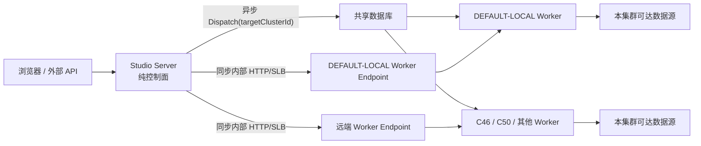

# Studio 统一 Worker 执行面与纯控制面架构

**计划编号：** P0-MC-02

**状态：** 本地实施与本地应用级回滚演练已完成；以单 Server + 单 Worker 作为持续生产等价验收基线（待目标环境证据）

**更新时间：** 2026-07-24

**前置计划：** [P0-MC-01 可配置多集群运行与数据源适用范围](./studio-configurable-runtime-cluster-plan-20260720.md)

**改造前基线：** [Studio 多集群运行当前架构与未完成事项](../交接/studio-multi-cluster-runtime-architecture-20260721.md)

## 1. 目标

Studio 收敛为唯一运行模型：**单集群就是只登记一个运行集群的多集群环境**。运行集群数量只影响可选目标数量，不再改变应用代码路径、部署包、环境模式或执行语义。

所有需要访问业务数据源、加载 DataAggregation 插件或执行用户工作负载的数据面能力统一由 `studio-worker` 承担。`studio-server` 只负责控制面，不再因为目标集群代码与自身配置相同而执行本地快速路径，也不再要求部署插件目录。

目标稳态如下：

- 单集群和多集群使用相同 Server、Worker、数据库模型、接口和路由逻辑。
- `runtimeClusterId` 是所有运行操作的唯一目标依据。
- `DEFAULT-LOCAL` 只是默认 Worker 集群编码，不再表示 Server 进程内执行。
- 异步操作通过共享数据库定向到 Worker；同步操作通过受管 HTTP/SLB 端点调用 Worker。
- Worker 离线时异步任务继续排队，同步请求返回 `503`，禁止回退到 Server。
- Server 不配置 `STUDIO_AGGREGATION_HOME`，不加载 `plugin/**`，也不直接连接业务数据源。
- 长期运行只保留一种强制显式集群语义；历史兼容通过一次性升级完成，不保留部署模式分叉。

## 2. Codex Goal

本计划已建立 Codex Goal，用于跨轮次跟踪实现、验证和收尾状态。

**Goal 目标：**

> 完成 P0-MC-02 统一 Worker 执行面与纯控制面架构：使单集群等价于仅配置一个运行集群的多集群模式；所有数据面执行按 runtimeClusterId 路由到 studio-worker，studio-server 移除本地执行快速路径和插件目录依赖；收敛长期运行模式，完成历史迁移、后端与前端改造、自动化测试、真实部署验收及文档更新。

**Goal 状态：** `paused`（本地实现与回归已完成；平台当前暂停该跨轮次 Goal，本文件继续记录待目标环境补齐的证据）

只有本文件“完成定义”中的全部条件满足、真实部署验收完成且交付文档同步后，才能将 Goal 标记为 `complete`。接近完成、测试部分通过或代码已经合并都不能提前结束 Goal。

### 2.1 当前执行目标（2026-07-24 修订）

本地后续验收不以“缺少真实 SLB 或生产网段”为阻塞条件。统一采用一个可重复的生产等价基线：无执行插件的 `studio-server` 仅作为控制面，独立 `studio-worker` 以 `STUDIO_CLUSTER_CODE=default-local` 提供全部执行能力，`default-local` 的受管 `HTTP` 端点指向该 Worker。所有同步调用必须穿过 HTTP 路由，异步任务必须由该 Worker 从共享数据库按目标集群领取。

该基线用于继续回归 Worker 下线 `503`、恢复、内部认证、受管 Header、目标集群一致性和执行结果单写；真实 SLB、Pod 网络和生产对象存储只作为同一协议的目标环境补充证据，不再作为本地实现或本地验收的前置条件。

## 3. 架构不变量

1. Server 永远不是数据面执行器。
2. Worker 是唯一允许加载运行插件和连接业务数据源的进程。
3. 一个运行集群至少对应一个可用 Worker；多个 Worker 使用同一集群编码。
4. 所有 Worker 使用全量、等价的执行能力，不建立任务类型能力矩阵。
5. 单集群只是当前项目只有一个已授权集群；前端可自动选择，但接口仍携带并校验 `runtimeClusterId`。
6. 同步和异步执行不得在目标不可用时自动切换到其他集群。
7. Server 生成配置、校验权限和聚合统计，但不以“校验”名义访问业务数据源。
8. 运行记录、访问日志、统计和告警只由实际执行路径写入一次。
9. Worker 内部接口必须校验内部认证、租户/项目上下文、资源目标集群和当前 Worker 集群身份。
10. 过渡兼容只能存在于升级窗口，不能成为新的长期部署模式。

## 4. 当前基线与问题

P0-MC-01 已完成异步任务定向和远端同步代理，但当前仍是混合执行模型。

| 能力 | 当前行为 | 目标行为 |
| --- | --- | --- |
| 采集、质量、工作流、已保存脚本 | Worker 按 `targetClusterId` 领取执行 | 保持 Worker 执行。 |
| 数据源测试 | 与 Server 集群代码相同则 Server 本地执行，否则调用 Worker | 无论集群代码是否相同都调用目标 Worker。 |
| 模型发现、Hydrate、预览、查询 | 存在 Server 本地快速路径 | 全部由目标 Worker 执行。 |
| 即席 SQL、Flink SQL | 显式集群时多数已进入 Worker，但仍保留历史本地分支和执行 Bean | 只允许 Worker 执行，删除历史空集群本地分支。 |
| 数据服务 | 同集群在 Server 执行，远端在 Worker 执行 | 全部在目标 Worker 执行。 |
| 数据接入 | 同集群在 Server 内运行 JobContainer | 全部在目标 Worker 执行。 |
| 协议转换 | 同集群在 Server 执行，远端在 Worker 执行 | 全部在目标 Worker 执行。 |
| 数据源健康探测 | Server 调度，并按本地/远端分支执行 | Server 只调度，Worker 执行探测。 |
| 插件和 DataAggregation Home | Server、Worker 都需要配置 | 只允许 Worker 配置和加载。 |
| 集群身份 | Server、Worker 都配置 `STUDIO_CLUSTER_CODE` | 只有 Worker 具有运行集群身份。 |
| 运行模式 | `LEGACY/ENFORCED` 长期配置分叉 | 稳态只保留显式集群语义。 |

当前混合模型带来以下问题：

- 同一项业务能力存在 Server 本地和 Worker 远端两套执行路径。
- 单集群部署和多集群部署需要理解不同运行模式及回填条件。
- Server 需要挂载插件目录并具备业务数据源网络权限，控制面边界不清晰。
- `DEFAULT-LOCAL` 的名称容易被理解为 Server 本地执行，而不是一个普通运行集群。
- 本地快速路径无法复用 Worker 的统一认证、实例观测、插件版本和执行日志边界。
- Server 与 Worker 插件集合不一致时，同一资源可能因目标集群不同产生行为差异。

## 5. 目标拓扑

单集群部署只保留 `DEFAULT-LOCAL` 一条运行集群记录、一个项目授权和一个 Worker 端点。增加集群只增加数据库记录、项目授权、数据源适用关系、Worker 和端点，不改变 Server 的启动方式和业务代码路径。

## 6. 职责边界

### 6.1 Studio Server

Server 保留：

- 登录、租户、项目、成员和权限。
- 数据源、模型、任务、工作流、脚本和服务配置管理。
- 运行集群、项目授权、数据源适用范围和运行配置校验。
- 静态 Schema、运行参数元模型和不访问数据源的配置预览。
- 发布、调度、Dispatch 创建和资源修订固化。
- 同步请求鉴权、目标解析、安全转发和响应保真。
- 运维聚合、统计、告警评估、站内信、Webhook 和 eLink 投递。
- 升级、清理、审计和控制面集群锁。

Server 禁止：

- 加载 `source/reader/writer` 等运行插件。
- 创建 `JobContainer` 执行业务任务。
- 建立到业务数据库、消息队列、文件系统或对象源的连接。
- 执行用户 SQL、Flink SQL、Java 或 Python 代码。
- 直接执行数据服务、数据接入和协议转换业务请求。
- 在 Worker 不可用时回退为本地执行。

### 6.2 Studio Worker

Worker 统一承担：

- 数据源连接测试、模型发现、选项发现、Hydrate、预览和查询。
- 模型同步及需要访问底层数据源的元数据补全。
- 采集、质量、工作流节点、SQL、Flink SQL、Java 和 Python 执行。
- Java 脚本环境依赖下载、类加载以及 import/member hints 生成。
- 数据服务、数据接入和协议转换的 REST、XML 和 SOAP 实际处理。
- 数据源周期健康探测。
- DataAggregation 插件加载、运行上下文和 JobContainer 生命周期。
- 运行日志、访问日志、实际集群、插件指纹和告警信号写入。

Worker 的同步 HTTP 执行与异步 Dispatch 消费必须使用隔离的线程池和并发上限，防止慢同步请求耗尽异步任务执行能力，或长任务阻塞健康探测。

### 6.3 共享基础设施

- MySQL/SQLite 保存控制配置、Dispatch、运行记录和访问日志。
- 多集群生产使用共享对象存储保存运行日志。
- 启用服务缓存时使用共享 Redis。
- Server 只访问控制数据库、Redis、对象存储和 Worker 内部端点；生产网络策略应禁止 Server 访问业务数据源网段。
- Worker 只获得本集群所需的数据源网络权限。

## 7. 首版范围

### 7.1 统一同步执行网关

- 建立统一 `RuntimeExecutionGateway`，所有同步数据面操作必须提交 `tenantId/projectId/runtimeClusterId` 和类型化命令。
- 去除根据 Server `STUDIO_CLUSTER_CODE` 判断本地执行的逻辑。
- `DEFAULT-LOCAL` 与远端集群使用同一端点选择、内部认证、超时、响应上限和 Header 安全策略。
- 同步 Worker 不可用统一返回 `503`；数据源健康探测记录 `UNKNOWN`。
- 禁止重定向和自动业务重试，保持现有 SSRF、认证标记和响应保真边界。

### 7.2 Worker 内部能力补齐

- 复核并补齐数据源 test/discover/discover-options/hydrate/preview/query。
- 复核并补齐数据服务、数据接入、协议转换及其调试接口。
- 将仍可能在 Server 执行的即席 SQL、Flink SQL、模型同步和健康探测统一到 Worker。
- 纯描述性的 WSDL、Schema 和配置装配可以保留在 Server；任何读取或写入真实业务数据的动作必须进入 Worker。
- Worker 建立统一租户/项目上下文，调用结束后可靠清理，避免线程复用造成上下文泄漏。

### 7.3 Server 执行依赖隔离

- Server 不再创建 `RuntimeDatasourceProbeExecutor`、`AggregationSourceCapabilityProvider`、本地 SQL 执行器和同步服务执行 Bean。
- 将控制面共用代码与 Worker 执行代码拆分到明确模块或通过严格条件化装配隔离。
- Server 启动和业务接口不得触发 `PluginClassLoaderCloseable`、`LoadUtil` 或 `SystemConstants.PLUGIN_HOME`。
- Server 部署包不要求外部 `aggregation/conf/core.json` 和 `aggregation/plugin/**`。
- Server 可执行包不得携带 DataAggregation Core、插件加载器、数据源处理器或 `studio-flink`；这些运行依赖只由 Worker 显式引入。Server 为读取共享运行日志而保留 MinIO/OSS 平台 SDK，不视为业务数据源执行能力。
- 控制面运行参数 Schema 继续来自数据库元模型，不从插件目录动态读取。

### 7.4 集群与端点语义收敛

- `STUDIO_CLUSTER_CODE` 仅作为 Worker 集群身份。
- Server 不再具有“本地运行集群身份”，也不保护某个集群为 Server 本地对象。
- 每个需要同步执行的集群必须配置一个启用的 HTTP/SLB Worker 端点。
- `LOCAL` 端点模式停止承担执行语义，迁移后废弃；单 Worker 可使用直接地址，多 Worker 使用集群内部服务或 SLB。
- 异步任务仍不依赖 HTTP 端点，通过共享数据库定向领取。

### 7.5 单一运行语义

- 新部署直接要求资源、数据源操作和 Dispatch 显式携带运行集群。
- 废弃 `STUDIO_RUNTIME_CLUSTER_MODE=LEGACY/ENFORCED` 的长期分支。
- `STUDIO_RUNTIME_CLUSTER_BACKFILL_ENABLED/DRY_RUN` 转为一次性升级工具，不再参与正常应用启动。
- 旧数据中的空 `runtimeClusterId/targetClusterId` 必须在切换前回填或处理，运行时不再推断。
- 项目只有一个可用集群时，前端自动选择并隐藏或只读选择器，但保存 DTO 仍提交真实 ID。

## 8. 配置目标

| 配置 | Server 目标 | Worker 目标 | 处理方式 |
| --- | --- | --- | --- |
| `STUDIO_AGGREGATION_HOME` | 删除 | 必填 | Server 移除插件目录挂载。 |
| `STUDIO_CLUSTER_CODE` | 删除 | 必填 | 仅标识 Worker 所属运行集群。 |
| `STUDIO_RUNTIME_CLUSTER_MODE` | 废弃 | 废弃 | 稳态只保留显式集群语义。 |
| `STUDIO_RUNTIME_CLUSTER_BACKFILL_ENABLED` | 废弃 | 不使用 | 迁移为一次性升级动作。 |
| `STUDIO_RUNTIME_CLUSTER_BACKFILL_DRY_RUN` | 废弃 | 不使用 | 迁移为一次性升级动作。 |
| `STUDIO_INTERNAL_API_TOKEN` | 必填 | 必填 | Server 与全部 Worker 保持一致。 |
| `STUDIO_ENCRYPTION_SECRET` | 必填 | 必填 | 保存端点、数据源秘密和短期 Dispatch 执行输入，全部进程保持一致。 |
| `STUDIO_RUNTIME_ENDPOINT_ALLOWED_HOSTS` | 按需配置 | 按需配置 | Server 放行 Worker/SLB 精确主机；Worker 读取历史私网 HTTP/HTTPS 脚本制品时复用。 |
| `STUDIO_WORKER_API_BASE_URL` | 不使用 | 必填 | Worker 上报实例地址并用于诊断。 |
| `STUDIO_PLUGIN_FINGERPRINT` | 不使用 | 建议必填 | 只描述 Worker 插件集合。 |

过渡版本可以保留受控切换开关用于一次发布窗口，但该开关不得进入最终部署文档，也不得作为 Goal 完成后的长期配置。

## 9. 分阶段实施与优先级

| 阶段 | 范围 | 当前状态 | 完成条件 | 证据 |
| ---: | --- | --- | --- | --- |
| 0 | 目标基线、当前本地执行路径审计和 Goal 建立 | 已完成 | 本计划、Goal 和路线图登记完成。 | 本文件。 |
| 1 | Worker 同步能力与统一执行契约 | 已完成代码实现 | 所有数据面动作都有类型化 Worker 内部入口，租户/项目/集群校验完整。 | 数据源、同步服务、Flink、Java 脚本环境提示 Worker controller 与定向测试。 |
| 2 | 数据源、模型、SQL 和健康探测统一路由 | 代码及 RDBMS 真实探测已通过 | `DEFAULT-LOCAL` 和远端均调用 Worker，Server 无本地数据源访问。 | 路由和定向测试已通过；Worker 已补齐 Calcite JDBC 连接池所需 DBCP/Pool2 运行时依赖，MySQL 当前探测和周期探测均通过。 |
| 3 | 数据服务、接入和协议转换统一路由 | 代码和本地真实 MySQL 成功/失败链路已通过 | 同集群不再走 Server；REST/XML/SOAP、调试和日志单写通过。 | JSON `BODY_BRIDGE`、三类 SOAP/WSDL、协议转换 HTTP XML 成功及失败矩阵、同步写入幂等、停机 `503` 和访问日志/统计/告警单写均已通过；一次性 MySQL 8.0.21 环境中的完整 `RealWebServiceOpenApiIT` 为 `5/5`、跳过 `0`，覆盖数据服务真实查询和数据接入真实写入。 |
| 4 | Server 插件与执行 Bean 解耦 | 代码、真实 pluginless 启动和部署包物理隔离已通过 | Server 无插件目录启动，全量控制面功能可用，运行插件只存在于 Worker。 | Server 已从空临时目录用可执行 JAR 启动且健康为 `UP`；启动参数和工作目录均无 aggregation/plugin/conf；Server 可执行包不含 DataAggregation Core、插件加载器、数据源处理器和 `studio-flink`，Worker 包仍完整携带执行依赖；`DataIngestionExecutionSupport`、`StudioTransformerExecutionSupport` 与 `ScriptEnvironmentRuntimeService` 仅由 Worker 显式注册，Java import/member hints 即使选择 `DEFAULT-LOCAL` 也通过受管 HTTP 进入 Worker。独立 `studio-flink` 只负责智能问数规划，启动时拒绝 Worker 集群身份、插件目录和可信网关，并要求外部注入非默认内部 Token 与加密密钥。 |
| 5 | 模式、配置、端点和历史迁移收敛 | 已完成隔离数据库与离线密钥工具验证 | 新部署无 LEGACY；历史空值清零；所有集群具备 Worker 端点；历史密文可停机轮换。 | 已删除模式配置和运行分支；新部署、历史单集群和历史多集群三个隔离 MySQL 数据库均完成初始化、回填、歧义保护、空目标处置和兼容性验证；`20260723-dispatch-protected-payload.sql` 为即席脚本增加短期密文列；离线密钥轮换覆盖全部 `EncryptionService` 持久化位置，SQLite Dry Run、事务回滚、分页、混合密钥和幂等测试通过。 |
| 6 | 前端、SDK、AI、运维和文档同步 | 已完成 | 单集群无感，多集群行为不变，操作目录不能绕过 Worker 路由。 | Web/Desktop 类型检查和生产构建通过；数据源、模型同步、采集、质量、工作流、数据开发、数据服务、数据接入和协议转换已完成 `1440x900`、`390x844` 浏览器验收；Desktop 已补齐数据开发、运行集群和运行环境入口，并完成登录后单集群脚本执行与失效展示验收。 |
| 7 | 全量回归与真实部署验收 | 本地已完成，环境验收待执行（本地代码、拓扑、迁移、阿里云 OSS 协议、HTTP 跳转基线、Web、Desktop、应用级回滚冒烟和目标环境验收工具已通过） | 单/多集群、停机、回滚、安全、性能和 Desktop 验收全部通过。 | 最新根 POM 默认全量 `1136/1136` 成功；Server/Worker/Flink 角色启动守门和部署预检 `10/10` 通过；本地单集群、多 Worker SLB、第二集群定向、停机恢复、三类隔离数据库迁移、新部署 Server 到单 Worker 的真实 Python 执行、开发脚本生命周期、30 秒长任务期间独立心跳、同步写入幂等、使用 IDEA Configuration 静态 AK/SK 的真实阿里云 OSS 跨节点归档/读取/故障恢复协议 IT `1/1`、真实页面集群切换样本和 Desktop 单集群闭环已通过；本地真实 Worker 20 样本 HTTP 基线 p95 为 `57.589 ms`，低于默认 `1000 ms` 门槛；上一版本 Server 在当前增量 Schema 和旧插件挂载下启动为 `UP`，运行集群与 Dispatch 定向哨兵保持不变且临时资源全部清理；生产单报告验收脚本离线测试 `7/7`、最终证据汇总器离线测试 `15/15`、回滚失败关闭 `1/1`，并强制要求新鲜、可追溯的生产等价回滚 PASS 证据，人工证据 URL 会被失败关闭且不会进入脱敏报告。生产 SLB/Pod 网络、OSS 人工证据和生产等价回滚演练仍待执行。 |

实施优先级必须按阶段推进。阶段 1 至 4 是架构主链，不能以仅修改部署文档替代代码隔离；阶段 5 必须在 Worker 路由真实可用后执行，避免提前移除兼容路径造成服务中断。

## 10. 兼容与迁移

### 10.1 新部署

新部署不进入 `LEGACY`：

1. 创建至少一个运行集群，例如 `DEFAULT-LOCAL`。
2. 为项目授权该集群，并为数据源维护适用关系。
3. 部署至少一个相同集群编码的 Worker并配置完整插件目录。
4. 在集群管理中配置 Worker 直接地址或 SLB HTTP 端点。
5. Server 使用统一模式启动，不配置集群代码和插件目录。
6. 所有资源从创建开始就保存显式 `runtimeClusterId`。

### 10.2 现有单集群

1. 保留现有 `DEFAULT-LOCAL` 集群 ID、项目授权、数据源绑定和资源 `runtimeClusterId`，不重新编号。
2. 先部署具备全部内部执行接口的 `DEFAULT-LOCAL` Worker。
3. 为 `DEFAULT-LOCAL` 配置并测试 HTTP/SLB 端点。
4. 验证数据源探测、SQL、数据服务、接入和协议转换均能通过 Worker。
5. 切断 Server 本地快速路径，观察同步 `503`、异步队列和日志单写。
6. 验收稳定后移除 Server 的插件目录和业务数据源网络权限。

### 10.3 现有多集群

- 每个已启用集群都必须有兼容 Worker；需要同步能力的集群必须有可用 HTTP/SLB 端点。
- `DEFAULT-LOCAL` 按普通集群处理，与 C46、C50 使用相同路由。
- 已经入队的异步 Dispatch 不改变目标集群；本次改造不重新分配历史任务。
- 切换前处理所有空 `targetClusterId/runtimeClusterId`，禁止依赖 Worker Group 猜测目标。
- 迁移过程中保持端点秘密、内部 Token、加密密钥和插件版本一致。

### 10.4 隔离数据库验证结果

- 新部署库从当前完整 MySQL Schema 和三份初始化数据脚本创建成功，运行集群、端点、项目授权、数据源绑定、运行校验和幂等核心表均存在；创建运行集群、项目授权及 Worker HTTP 端点后，单 Worker 心跳为 `ONLINE`，端点测试返回 `HTTP 200`，保存的 Python 脚本经 Server 定向到 Worker 后执行成功，运行记录的请求/实际集群一致且日志为 `AVAILABLE`。
- 历史单集群库以 2026-07-18 历史 Schema 为基线执行两份升级 SQL；Dry Run 与正式回填均只处理唯一无歧义租户，第二次正式执行新增数量全部为零。九类资源空 `runtime_cluster_id` 清零，显式集群值保留，空目标活动 Dispatch 被处置为 `STOPPED`，历史字段读取和旧式新增写入兼容。
- 历史多集群歧义库在 Dry Run 和正式执行中均被跳过，不创建项目授权和数据源绑定，不猜测九类资源目标；显式集群值保留，空目标活动 Dispatch 仍被显式处置，阻塞数归零。
- 三个隔离数据库、隔离 Server/Worker 进程和临时迁移验证程序均已在验收后删除或停止；文档不保留数据库凭据、内部 Token、资源 ID 和端点明文。
- 历史密钥迁移使用独立 `rotate-studio-encryption-key.ps1`：默认 Dry Run，Apply 要求环境变量与参数双确认，在单事务内按主键分页并使用原值 CAS；覆盖数据源、模型、采集配置、运行端点、告警通道、短期 Dispatch 输入和幂等响应密文。工具测试和空 SQLite 包装脚本 Dry Run 已通过；实际存量生产库若需要换密钥，仍必须在维护窗口备份、执行并逐集群验收。

## 11. 测试与验收

### 11.1 单元与模块测试

- 路由器不再根据 Server 集群代码返回本地执行。
- 所有同步命令校验租户、项目、目标集群、资源集群和数据源适用关系。
- Worker 内部认证、保留 Header、动态 hop-by-hop Header 和响应标记继续生效。
- Worker 不可达、超时、响应过大、认证失败及损坏端点秘密均失败关闭。
- Server 不实例化插件执行 Bean，不调用插件类加载器。
- 历史空集群数据在统一模式下被明确拒绝。

### 11.2 集成测试

- Server 在不存在 `aggregation/plugin` 和 `aggregation/conf/core.json` 时正常启动。
- 通过网络策略阻断 Server 到业务数据源后，数据源测试、预览、SQL 和服务调用仍通过 Worker 成功。
- `DEFAULT-LOCAL` 与 C46 对相同命令走相同内部协议。
- 停止 Worker 后，同步调用返回 `503`、数据源健康为 `UNKNOWN`、异步任务保持 `QUEUED`。
- 恢复 Worker 后异步任务继续执行，不产生重复运行记录。
- REST、JSON、XML、SOAP 状态、Header 和响应体保真，日志及告警信号只写一次。
- Worker 同步与异步线程池隔离，慢同步调用不阻塞 Dispatch 心跳和续租。

### 11.3 前端与部署验收

- 单集群环境自动选择唯一集群，用户无需理解“单集群模式”。
- 增加第二个集群后相同页面直接出现可选项，无需重启到另一模式。
- 1440x900、390x844 和 Desktop 验证数据源、模型、任务、工作流、服务及运维页面。
- 单 Worker、同集群多 Worker + SLB、多个运行集群三种拓扑都完成真实 HTTP 验收。
- Server 镜像和部署清单不再包含插件卷；Worker 镜像或挂载包含完整插件集合。
- 核对 Server 运行期间没有到业务数据源网段的连接。

## 12. 安全、性能与可靠性要求

- Worker 内部端点不对用户网络直接暴露。
- Server 到 Worker 的内部认证与 SLB 业务认证继续隔离。
- 数据源密码、端点 Header、Token 和完整请求体不进入公开 `payload_json`、日志和错误摘要。即席脚本正文、运行参数和执行覆盖配置只进入 `protected_payload_ciphertext`，由 `STUDIO_ENCRYPTION_SECRET` 加密。
- Worker Claim 后在内存中解密短期执行输入，并在真正调用执行器前通过 Claim CAS 清空密文；授权撤销、Worker 重启恢复和 stale recovery 等终态路径同样清空。该字段不参与运维 API 序列化。
- 同步代理禁止自动重试，避免写入类服务重复执行。
- Worker 端限制请求体、响应体、连接超时、读取超时和并发数。
- Server 不保留解密后的数据源秘密；Worker 只在实际执行作用域内解密使用。
- 增加一次 HTTP 跳转后的性能必须建立基线，不能通过恢复 Server 本地执行规避性能问题。
- 实际集群、Worker 实例、boot ID、插件指纹和请求 ID必须可观测。

## 13. 回滚策略

- 过渡发布保留上一版本 Server 镜像及其插件挂载配置，作为发布窗口内的应用级回滚手段。
- 回滚不修改集群 ID、数据源绑定、资源 `runtimeClusterId` 或现有 Dispatch 目标。
- Worker 新内部接口保持向前兼容至少一个发布窗口，避免先回滚 Server 时接口不存在。
- 移除 Server 插件卷和网络权限属于最后动作，只有 Worker 路由完成真实验收后执行。
- 任何回滚都不得自动把目标任务迁移到其他集群。

## 14. 明确不包含

- 自动跨集群故障转移、按比例流量分配和多集群并行执行。
- 节点级跨集群工作流。
- 按任务类型配置集群能力矩阵。
- Server 侧执行兜底。
- 多 HTTP 端点负载均衡和自动健康切换；多实例首版继续使用 SLB或内部服务地址。
- 跨 Nacos 集群服务发现适配器。
- 自动分发、在线安装或按租户隔离插件。

## 15. Goal 跟踪台账

| 跟踪项 | 当前值 |
| --- | --- |
| 总体状态 | 本地实施与本地应用级回滚演练已完成（生产环境验收待执行，Goal 尚未达到完成条件） |
| 当前阶段 | 新数据库补充验收持续完成：保留测试项目完成单集群自动选择、三类同步服务日志、Worker 离线 `503`、异步排队、IDEA 配置恢复、单次完成、同步恢复、实例心跳，以及采集/质量任务从保存到 Worker 运行记录的 UI 闭环；采集和质量任务各发现一处运行集群详情/列表回填缺口，均已修复并以定向回归 `7/7`、`9/9` 覆盖。路由与 Worker 安全定向自动化 `55/55` 通过。生产网络/存储及生产等价回滚验收仍待目标环境执行。 |
| 最后更新 | 2026-07-24 |
| 已完成 | Worker-only 路由和执行 Bean、Server 本地回退移除、模式配置移除、pluginless Server 真实启动、Server 可执行包与 DataAggregation/Flink 运行依赖物理隔离、Server/Worker/Flink 角色启动失败关闭、Worker 插件目录完整性守门和部署环境预检、无秘密目标环境验收脚本及离线测试、工作流资源选项强制显式集群、采集接入与数据服务响应转换执行 Bean 的 Worker-only 隔离、Java 脚本环境依赖加载及 import/member hints 的 Worker-only 路由、Java/Python `context.services` 数据源访问按运行集群失败关闭、Flink 问数模型候选与 prompt 构造前的集群隔离、Flink 运行能力凭据在线程名/异常/载荷中的脱敏、即席脚本短期 Dispatch 密文及消费/异常终态清理、全量自动化、Web/Desktop 构建、本地单集群停机恢复、同集群双 Worker SLB、第二集群定向、三类隔离数据库迁移、历史密文离线轮换工具与 SQLite Dry Run、隔离新部署单 Worker 执行、真实 CPython 成功执行、RDBMS 当前与周期探测、开发脚本生命周期、长任务独立心跳、同步写入幂等、真实阿里云 OSS 跨节点日志归档/读取/故障恢复协议 IT、OMS/Worker 请求体双重上限及分块表单有界解析、`FormContentFilter` 关闭后的控制面兼容性与数据服务既有请求契约复核、数据服务/数据接入/协议转换 SOAP/WSDL 独立 Worker 路由及访问日志单写、协议转换 HTTP XML 成功与下游 `422`/连接中断/响应过大失败关闭、协议转换告警单写、数据服务失败日志/统计单写、数据接入失败日志/统计/告警实例/事件/站内信单写、Web 大型编辑器双端验收和真实集群切换清空、Desktop 登录后数据开发入口/单集群自动选择/Python 执行/集群停用失效提示/恢复在线闭环、上一版本 Server对当前增量 Schema及旧插件挂载的本地应用级回滚冒烟 |
| 下一动作 | 按生产验收手册在每个同步集群执行真实 SLB 检查和生产 p95 基线，在 OMS/Worker Pod 对同一数据源执行一拒一通网络检查，并为阿里云 OSS 网络 ACL、容量、生命周期和高可用填写可追溯证据编号；在生产等价预发或发布窗口执行上一版本 Server 镜像与插件挂载的应用级回滚演练；最后用证据汇总器验证全部集群、相同目标配对、报告时效、性能、对象存储和新鲜的回滚证据均为 `PASS`。确需切换存量密钥的环境再按离线手册执行。 |
| 当前阻塞 | IDEA Configuration 中的真实阿里云 OSS 静态 AK/SK 已用于协议 IT并通过 `1/1`，本地真实 Worker HTTP 跳转基线和上一版本 Server 本地回滚冒烟也已通过，不再缺少 OSS 协议凭据、本地性能或本地 Schema 向前兼容证据。仍缺目标生产 SLB及其 p95、OMS/Worker 网络边界、从生产 Pod 使用最终 endpoint 的 OSS 网络 ACL/容量/生命周期/高可用证据，以及生产等价预发或发布窗口回滚证据；因此 Goal 继续保持未完成。 |
| 后端测试证据 | 2026-07-24 最新本地根 POM 全量 `BUILD SUCCESS`，11 个 Reactor 模块全部成功，默认 Surefire 共 `1136` 项、失败 `0`、错误 `0`、跳过 `0`，总耗时 7 分 24 秒；其中 Commons `4/4`、Nacos Compat `27/27`、Infra `355/355`、Flink `108/108`、Server `61/61`、Worker `78/78`、Desktop Runtime `1/1`、`studio-test` `502/502`。角色安全守门 `20/20`、部署预检自动化 `10/10`，覆盖正常 Server/Worker/Flink、跨角色身份或插件目录污染、默认秘密、可信网关和阿里云 OSS 必填项，并验证输出不泄露秘密。新增 `WorkerSlbRoutingIT` 启动两个同集群真实 Worker 和测试 HTTP 反向代理，验证 OMS 对单一受管端点的轮询转发、内部认证与受管 Header、单后端存活、全部离线 `HTTP 503` 和重启恢复，结果 `1/1`；按本轮修订后的单集群生产等价基线已于当日再次定向执行，仍为 `1/1`。生产单报告验收脚本离线测试 `7/7`、最终证据汇总器离线测试 `15/15`、本地回滚失败关闭 `1/1`。使用 IDEA `StudioWorkerApplication` 的 OSS provider、endpoint、bucket及仅注入测试进程的静态 AK/SK，在项目 SDK Java 17 下再次执行 `SharedObjectStorageRuntimeIT` 为 `1/1`，失败 `0`、错误 `0`、跳过 `0`，`createBucket=false`，随机测试对象和临时脱敏报告已清理且未保存秘密；对象存储四项人工证据仍为 `PENDING`，因此本地报告总体为 `INCOMPLETE`而不是生产 `PASS`。同一 IDEA 配置下启动真实 Worker并完成 20 样本 HTTP 基线，错误 `0`，p50 `50.135 ms`、p95 `57.589 ms`、p99/max `265.623 ms`，低于默认 p95 `1000 ms`。`test-studio-local-rollback.ps1` 使用隔离 MySQL 8.0.21、当前增量 Schema和基础数据构造集群/Dispatch哨兵，从提交 `11ce127f1f22` 构建上一版本 Server，在旧插件挂载下 health 为 `UP`，执行依赖命中 `2`，Schema及定向指纹保持不变，容器、worktree和端口全部清理。运行守门失败关闭、`RuntimeInvocationRouter` 和设计债务守门定向复验合计 `54/54`；一次性 MySQL 8.0.21 环境中的完整 `RealWebServiceOpenApiIT` 为 `5/5`。最终 `mvn -DskipTests package` 成功；Server 可执行包不含执行运行依赖，Worker 可执行包命中完整六个执行构件。 |
| 前端测试证据 | Web 与 Desktop 类型检查、生产构建均通过；最新 Web 生产构建完成类型检查并由 Vite 转换 `4294` 个模块；运行集群源码契约测试通过；数据源、模型同步、采集、质量、工作流、数据开发、数据服务、数据接入和协议转换在 `1440x900`、`390x844` 下无页面横向溢出，单集群自动选择和多集群切换后旧候选立即清空已通过真实页面验证；Desktop 补齐数据开发、运行集群和运行环境路由后生产构建再次通过，Vite 转换 `3592` 个模块。真实 Electron 已登录并显示新增菜单和数据开发页；同一 Desktop renderer 与临时 Desktop Runtime 完成 Python 脚本保存、Worker 执行成功、请求/实际集群一致、集群停用后“运行配置失效”及执行禁用、重新启用恢复在线。生产资产扫描无动态代码生成且不内置管理员密码。 |
| 真实部署证据 | 空目录 pluginless Server、本地单集群停机恢复、同集群双 Worker 轮询 SLB、临时第二集群定向和禁止 fallback、三类隔离数据库迁移、离线密钥脚本真实 SQLite Dry Run、隔离新部署 Server 到单 Worker 的 Python 定向执行、真实 CPython 成功执行、RDBMS 当前/周期探测、开发脚本启动与停止、30 秒长任务独立心跳、同步写入幂等、真实阿里云 OSS 跨节点归档/读取/故障恢复协议、本地真实 Worker 20 样本 HTTP 跳转基线、上一版本 Server 对当前增量 Schema 的本地回滚冒烟、三类同步服务 SOAP/WSDL 独立 Worker HTTP 路由、协议转换 HTTP XML 成功/失败矩阵、数据服务真实查询、数据接入真实写入、访问日志目标/实际集群一致与单写、统计和告警链路单写及浏览器真实集群切换样本均已通过；真实数据库参数、轮换密钥和 OSS 凭据仅由进程环境变量显式注入，临时 MySQL、外部表、历史 MinIO 容器、回滚 worktree、测试对象、性能报告和轮换 SQLite 文件已清理；临时项目授权已恢复，本地验收服务在每轮验收后停止。生产 SLB及其 p95、Pod 网络边界、OSS 人工环境证据和生产等价回滚演练待验收。 |

匿名化执行记录见 [20260722 P0-MC-02 统一 Worker 执行面验收执行记录](../测试/长期跟踪/records/20260722-P0-MC-02统一Worker执行面验收执行记录.md)；新数据库补充验收见 [20260724 P0-MC-02 新数据库 Worker 执行面验收执行记录](../测试/长期跟踪/records/20260724-P0-MC-02新数据库Worker执行面验收执行记录.md)。

每轮实施后必须同步更新：计划状态、阶段状态、完成项、下一动作、阻塞项、测试命令与结果、真实部署证据和关键设计决策。不得只更新路线图状态而不补充证据。

## 16. 完成定义

- [x] 所有公开数据面入口均路由到 Worker，Server 无本地回退。
- [x] `DEFAULT-LOCAL` 不再触发 Server 本地执行。
- [x] Server 无插件目录可启动，插件执行 Bean 仅在 Worker 注册，Server 可执行包不携带执行运行库。
- [x] Worker 单实例覆盖全部执行能力的本地真实部署验收通过。
- [x] 单集群与多集群使用同一代码路径和协议，只存在集群数量差异。
- [x] `LEGACY/ENFORCED` 已从正常部署配置和运行分支移除。
- [x] 新部署、历史单集群和历史多集群迁移均完成验证。
- [x] Worker 离线语义、同步 `503`、异步排队和恢复执行符合契约。
- [x] 运行记录、访问日志、统计和告警保持单写。
- [x] SSRF、内部认证、秘密脱敏和响应保真测试通过。
- [x] 后端全量测试、Web/Desktop 类型检查和生产构建通过。
- [x] 本地真实单集群、多 Worker SLB 和多集群部署验收通过。
- [x] 部署、升级、接口和架构文档已更新。
- [x] 最终本地测试记录和路线图证据已更新。
- [x] 最终人工 Review 未发现未处理的本地代码 P0/P1/P2 问题。
- [x] Desktop 登录后单集群自动选择、脚本执行、失效提示和恢复验收通过。
- [x] 本地真实 Worker HTTP 跳转基线通过，验收工具记录 p50/p95/p99/max 并对 p95 失败关闭。
- [ ] 目标生产网络/SLB和生产对象存储验收通过。
- [ ] 生产等价预发或发布窗口的应用级回滚演练通过。

## 17. 交付物

- 本实施与跟踪计划。
- Server/Worker 执行职责清单及最终架构交接文档。
- 统一 Worker 内部执行接口和联调文档。
- 环境变量与部署清单迁移说明。
- MySQL/SQLite 迁移或清理 SQL（如数据模型发生变化）。
- 单集群、多 Worker SLB 和多集群验收记录。
- 更新后的未来路线图和 P0-MC-01 后续关系说明。
