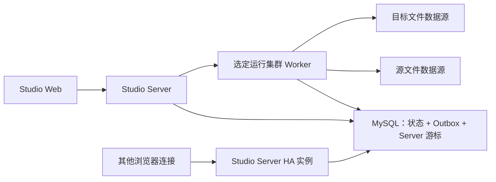

# Studio 单集群非结构化文件传输部署与安全边界

> 适用基线：2026-08-09 单集群文件传输、2026-08-12 MySQL Outbox 高可用事件分发，以及 2026-08-14 浏览器原生流下载。2026-08-13 本地 MySQL/双 Server/SSE 验收已通过。
>
> 文件访问模型：单运行集群、单 Worker、Worker-only。当前版本不提供跨集群文件传输，也不部署 Server Relay。

## 1. 部署拓扑



Studio Server 是控制面，负责认证、项目/集群/数据源适用性校验、任务编排、运行状态、指标、ACL 和下载流式转发。Studio Worker 是唯一文件数据平面，加载 DataAggregation 文件插件并访问 Local、FTP、SFTP、MinIO 或 OSS。源和目标数据源必须适用于同一个运行集群，由同一个 Worker 执行浏览、发现、传输、下载和文件管理操作。

文件传输事件不依赖 Redis、Kafka 或 RabbitMQ。Worker/Server 在更新运行、文件项、指标或删除状态的同一短事务中追加 MySQL Outbox；每个 Server 实例使用自己的数据库游标读取同一批事件，只向本机 SSE 连接投递。浏览器再以 `Last-Event-ID` 维护连接级游标，因此一个 Server 重启或发送失败不会推进其他 Server 或浏览器的确认位置。

跨集群新请求统一返回 `FILE_TRANSFER_CROSS_CLUSTER_DISABLED`。历史跨集群字段和记录保留查询兼容，但不能恢复、重试或再次执行。Server 不加载文件插件、不解密数据源凭据、不直接连接业务文件系统，也不接受任意 Worker URL。

## 2. 必需配置

### 2.1 Server

| 配置 | 说明 |
|---|---|
| `STUDIO_FILE_TRANSFER_ENABLED` | 文件传输和非结构化管理总开关，生产按环境显式设置 |
| `STUDIO_INTERNAL_API_TOKEN` | Server 到受管 Worker 内部端点的认证令牌 |
| `STUDIO_RUNTIME_CLUSTER_*` | 运行集群及 Worker 端点的现有配置 |
| `STUDIO_INSTANCE_ID` | Server 实例唯一 ID；多 Pod 不允许共享，优先使用稳定且唯一的 Pod UID |
| `STUDIO_FILE_TRANSFER_EVENT_MODE` | 默认 `OUTBOX`；迁移或回滚时才使用 `LEGACY_SCAN` |
| `STUDIO_DOWNLOAD_TICKET_TTL_SECONDS` | 原生下载票据有效期，默认并固定按产品配置为 `120` 秒 |
| `STUDIO_DOWNLOAD_READ_IDLE_TIMEOUT_MILLIS` | Server 到 Worker 下载响应连续无字节的读取空闲超时，默认 `1800000`（30 分钟），不是下载总时长 |
| Redis 连接 | 保存一次性下载票据摘要；Redis 不可用时票据创建和消费返回 `503`，不回退本机内存 |
| 数据库连接 | 需要包含传输字段、`created_by`、ACL、审计、Outbox 和消费者游标表 |

Server 不再需要任何 `SERVER_RELAY`、Relay HMAC、Relay 票据、Range、Relay 缓冲、Relay 队列或 Relay Base URL 配置。旧配置可以保留在部署清单中作为迁移提示，但应用不会读取或参与新运行。这里的 Relay 票据与 Redis 中 120 秒有效的浏览器原生下载票据是两个独立概念。

### 2.2 Worker

Worker 必须配置：

- 与 Server 绑定的运行集群身份和内部 API Token。
- 与 DataAggregation 版本匹配的 Local、FTP、SFTP、MinIO、OSS/Aliyun OSS 文件源插件。
- 插件缓存、临时文件和检查点目录，并保证运行用户拥有所需读写权限。
- 文件操作并发、传输重试和指标采样参数；使用有界线程池，避免 FTP/SFTP 会话跨线程共享。
- `STUDIO_FILE_TRANSFER_EVENT_MODE=OUTBOX`，确保所有文件传输状态更新附带写入事件；Worker 不消费 SSE 事件。

数据源凭据仅存储在 Studio 数据源定义中并由 Worker 读取。凭据不能进入日志、异常消息、SSE 事件、任务快照或测试文档。

Worker 重启时，旧 Dispatch 必须先进入终态以释放执行所有权，防止两个 Worker 同时写同一个 `.part`；这不表示文件传输 Run 或断点永久失败。对非暂停、非取消、非完成的文件传输，Worker 会将 Run、Outbox 事件和新 Dispatch 在同一短事务中重新入队，并保留 checkpoint、临时目标和源快照。新执行在校验运行/文件项/源目标身份、源快照、临时路径、确认偏移和 `.part` 长度后从 `confirmedOffset` 继续。用户主动 `PAUSED` 的运行保持暂停，`CANCELED` 和已完成运行不恢复。

默认 `runtime.checkpointRecoveryMode=FAST`。schema v2 checkpoint 保存安全写入偏移、可恢复 SHA-256 状态，以及文件头和确认边界各最多 64 KiB 的指纹；Worker 重启后仅校验小范围指纹并从确认偏移继续。升级前生成的 schema v1 checkpoint 没有摘要状态，FAST 模式会删除旧 `.part` 和 checkpoint 后从零重传，避免在慢速 FTP/SFTP 上先完整重读前缀、失败后又重传。只有明确需要兼容旧断点且接受恢复等待时才配置 `STRICT`。最终 SHA-256 不一致会清理无效断点并自动执行一次从零重传，第二次仍不一致则失败，不无限循环。

SFTP 数据源默认只协商现代 SSH 算法。旧服务器出现 `Algorithm negotiation fail` 时，可在该数据源中开启“允许旧 SSH 算法（兼容旧服务器，降低安全性）”，对应连接参数 `allowLegacyAlgorithms=true`。该开关只影响该数据源的 Worker 连接，追加 SHA-1 KEX、`ssh-rsa`/`ssh-dss`、CBC 和 HMAC-MD5；不得作为全局默认配置，服务端完成算法升级后应关闭并重新测试。

## 3. 网络边界

必须允许：

- 用户/Web 到 Studio Server 的 `/api/v1` 控制接口和 SSE 长连接。
- Studio Server 到受管运行集群 Worker 的内部数据源浏览、操作、下载和传输端点。
- Worker 到其所绑定的 Local 路径、FTP/SFTP 服务、MinIO 或 OSS 服务。

不要求不同运行集群之间互通，也不允许客户端提交 Worker URL、数据源连接串或代理地址。

Server 转发到 Worker 的内部请求必须使用受管 endpoint 地址和内部 Token，并固定携带
`X-Studio-Target-Cluster-Id`。该请求头由 Server 根据 endpoint 绑定的运行集群写入，不能由数据源或 endpoint 自定义配置覆盖；Worker 会同时校验内部 Token 和目标集群身份。

反向代理需要对 SSE 和下载流保持长连接和流式响应：

- `/api/v1/file-transfer/runs/events` 使用 `text/event-stream`，关闭响应缓冲，设置合理的空闲超时。
- `/api/v1/unstructured-management/download` 保持 `application/octet-stream`，不缓存、不压缩整包、不把文件落盘到 Server。
- `/api/v1/unstructured-management/download/native` 是唯一允许匿名访问的下载路径，只接受 120 秒有效且只能消费一次的票据；不得将票据查询串写入 access log。
- 内部 Worker 端点只允许受管网络和内部认证访问，不暴露公网。

SSE 重连请求需要透传 `Last-Event-ID` 请求头；代理不得缓存或合并 `id:`、`event:`、`data:` 行。Server 响应固定携带 `Cache-Control: no-cache`、`X-Accel-Buffering: no` 和 `Connection: keep-alive`，反向代理仍应显式关闭该路由的缓冲。默认 heartbeat 为 15 秒，代理空闲超时必须大于该周期并留出网络抖动余量。

原生下载链路不设置应用层总时限。Server 和 Worker 仅对下载路径关闭 Servlet 异步总超时，其他异步接口仍使用全局 5 分钟配置；Server 到 Worker 使用 30 分钟读取空闲超时。持续产生响应字节的下载可以超过 30 分钟，只有相邻响应字节之间连续空闲达到阈值才会中断。普通文件携带准确 `Content-Length`，浏览器可显示百分比；实时 ZIP 不预生成且没有总长度，浏览器只能显示已下载大小或不确定进度。当前不支持 `Range`、断点续传、暂停恢复或重试复用票据。

当前 WSL Nginx 统一入口使用以下精确 location。它必须位于通用 `/api` 正则 location 之前，且上游保持原配置：

```nginx
log_format native_download '$remote_addr [$time_local] '
    '"$request_method $uri $server_protocol" $status $body_bytes_sent '
    'request_time=$request_time';

location = /dfs/data-aggregation-studio/api/v1/unstructured-management/download/native {
    rewrite ^/dfs/data-aggregation-studio/(.*)$ /$1 break;
    proxy_pass http://host.docker.internal:18080;
    proxy_http_version 1.1;
    proxy_buffering off;
    proxy_cache off;
    proxy_read_timeout 30m;
    send_timeout 30m;
    proxy_set_header Host $host;
    proxy_set_header X-Real-IP $remote_addr;
    proxy_set_header X-Forwarded-For $proxy_add_x_forwarded_for;
    proxy_set_header X-Forwarded-Proto $scheme;
    proxy_set_header X-Forwarded-Prefix /dfs/data-aggregation-studio;
    access_log /var/log/nginx/native-download-access.log native_download;
}
```

专用日志格式只记录 `$uri`、状态、响应字节和耗时，不得加入 `$args`、`$request_uri` 或完整 `$request`。`proxy_read_timeout 30m` 和 `send_timeout 30m` 均为空闲超时，不是固定响应总时长。修改后必须执行 `nginx -t`、reload 和 `nginx -T`，确认精确 location 的匹配顺序、脱敏日志和 `proxy_pass` 未变化。

## 4. 数据库和升级

发布前按[数据库升级指南](../../数据库/studio-file-transfer-upgrade.md)执行备份和升级，确保以下三套结构同步：

- `backend/studio-server/src/main/resources/schema-mysql.sql`
- `backend/studio-desktop-runtime/src/main/resources/schema-sqlite.sql`
- `backend/studio-server/src/main/resources/update/20260809/20260809-unstructured-management.sql`
- `backend/studio-server/src/main/resources/update/20260811/20260811-unstructured-op-audit-message.sql`
- `backend/studio-server/src/main/resources/update/20260812/20260812-file-transfer-event-outbox.sql`

升级内容包括 `runtime_cluster_id` 规范字段、`datasource_definition.created_by`、ACL、操作审计，以及 `file_transfer_event_outbox`、`file_transfer_event_consumer_cursor` 两张事件表和七个索引。其中 `20260811` 脚本将历史 MySQL 的审计消息升级为 `TEXT`；`20260812` 脚本可重复执行，并能重建无数据的半成品 Outbox/游标表。非空半成品表缺少事件、运行或游标身份列时会拒绝升级，必须先备份并由 DBA 回填或重建，不能让应用猜测历史事件归属。`OUTBOX` 模式下表缺失会使 Server 健康检查降为 `DOWN`，不会静默退回旧扫描。

## 5. 发布顺序

1. 停止新增文件传输，备份 MySQL，执行 `20260812-file-transfer-event-outbox.sql`，重复执行一次验证幂等，并确认两张表和七个索引存在。
2. 混合版本阶段所有 Server 保持 `STUDIO_FILE_TRANSFER_EVENT_MODE=LEGACY_SCAN`。
3. 先升级全部 Studio Worker，使创建、进度、检查点、终态、恢复失败和孤立运行关闭都能写入 Outbox。
4. 再升级全部 Studio Server，确认文件插件未进入 Server 类路径、每个实例使用唯一 `STUDIO_INSTANCE_ID`，然后统一切换为 `OUTBOX`。不要同时开启旧扫描和 Outbox 推送。
5. 检查项目、运行集群和 FTP/OSS/SFTP 数据源绑定；旧 SFTP 服务器只对目标数据源开启 `allowLegacyAlgorithms`。
6. 最后发布 Web，确认 SSE `id:`、`Last-Event-ID` 重连和“非结构化管理”入口。
7. 扩容第二个 Server，以不同实例 ID 连接同一 MySQL，确认两个实例游标独立推进且都能投递同一事件。

## 6. 发布后健康检查

- Server health、Worker health 和运行集群身份均正常。
- Server health 中 `fileTransferOutbox=available`，显示当前最大事件 ID、本实例游标、真实积压事件行数、最近消费时间和最近清理时间。
- 2026-08-13 本地健康证据：Server `18080` 和 Worker `18081` 均为 `UP`，Web 统一入口 `http://127.0.0.1:8000/dfs/data-aggregation-studio/` 为 HTTP `200`；Server HA 返回 `OUTBOX`、七个索引、最大事件 ID/实例游标和 `cursor-lag=0`。第二个临时 Server 使用独立实例 ID 读取同一 MySQL，并与主 Server 补发相同事件后已停止。
- 延迟口径必须从 Outbox `occurredAt` 或创建事务提交/HTTP 响应后开始，不把创建运行事务本身的耗时计入事件总线。2026-08-13 统一入口 12 样本的 Outbox-to-SSE P95 为 `949 ms`、HTTP 响应后到 SSE P95 为 `440 ms`；样本运行全部清理。
- `file_transfer_event_consumer_cursor` 中每个 Server、租户、项目只有一行，两个 Server 的 `instance_id` 不同。
- 传输中心首次进入没有默认集群、源数据源、目标数据源或目录；按选择顺序加载选项和目录。
- 打开队列后只建立 SSE 长连接，没有 `setInterval` 列表轮询；前端唯一 `setTimeout` 只用于封顶退避重连。
- 初次连接收到带 ID 的 `SNAPSHOT_REQUIRED`；断网重连请求携带 `Last-Event-ID`，重复事件不会导致状态回退。
- 队列、运行记录和文件明细只显示数据源名称与源/目标路径，不显示方向、集群名称或集群 ID。
- Server 日志没有 Relay Controller、Relay Client、Relay Ticket 或 Server Relay 调用。
- Worker 能够通过已配置插件浏览并操作 OSS 和 FTP 测试源，且审计记录不含凭据。
- 对一条存在非零 checkpoint 的活动传输重启 Worker：旧 Dispatch 关闭，新 Dispatch 自动创建；Run 和文件项的已传输/已恢复字节不回退。`PAUSED`、`CANCELED` 和已完成运行不得被自动拉起。

## 7. 真实验收最小矩阵

对现有 OSS 测试源和用户新增 FTP 测试源分别执行：根目录浏览、新建目录、文件/目录重命名、同源移动、文件下载、文件删除、非空目录递归删除、目标冲突拒绝、路径穿越拒绝和 ACL 分层验证。再在同一运行集群内执行 OSS→FTP、FTP→OSS 文件传输；任何跨集群请求必须拒绝。

验收证据只记录脱敏后的数据源名称、操作类型、结果状态、运行集群名称和时间，不记录连接地址、用户名、密码、AccessKey、Secret 或完整路径中的敏感标识。

## 8. 监控与告警

至少监控：

- Worker 活动文件数、并发、吞吐、重试、摘要跳过、失败和临时文件容量。
- FTP/SFTP 会话数、连接失败、超时和被动模式错误。
- OSS/MinIO 请求失败、分页游标异常、对象冲突和递归删除耗时。
- Server 到 Worker 的内部请求 P95、SSE 连接数、断线重连和下载流异常。
- 文件传输运行失败率、文件失败率、指标写入延迟和 ACL/操作审计失败。
- Outbox 的 `events-written`、`events-suppressed`、`events-polled`、`events-published`、`events-replayed`、`send-failures`、`cleanup-deleted` 和 `cursor-lag`。标签仅允许 `event_type`、`mode`、`result`，禁止使用运行、文件项、用户或数据源 ID。
- 默认消费间隔 250 ms、批次 500、进度事件间隔 1 秒、重放上限 5,000；保留 7 天，48 小时未心跳的 Server 游标不阻塞清理，每次清理批量 1,000 行。
- Outbox 消费、心跳和清理使用两个专用调度线程。正常空轮询不得写消费者游标或执行全范围滞后计数；`last_seen_at` 保活和精确 `cursor-lag` 在 15 秒心跳执行，读取满批次时允许立即计算剩余积压。线程名应以 `studio-file-transfer-outbox-` 开头。

日志和告警不得打印文件内容、数据源凭据、内部 Token 或可复用下载链接。

## 9. 回滚边界

Outbox 回滚时先停止新增文件传输，将所有 Server 改为 `LEGACY_SCAN` 并重启，再回滚 Server、Worker 和 Web 应用代码。保留 Outbox、游标、ACL 表、新增字段和审计记录，不删除历史传输记录，也不同时开启两种事件模式。修复完成后重新按“Worker 先、Server 后”的顺序切回 `OUTBOX`；删除 Outbox 表必须单独评审和备份。
