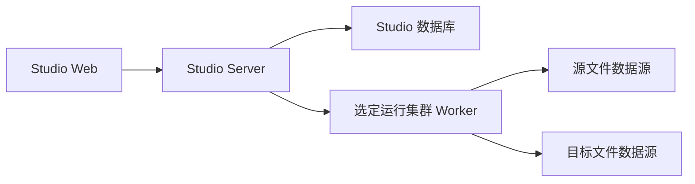

# Studio 单集群非结构化文件传输部署与安全边界

> 适用基线：2026-08-09。
>
> 文件访问模型：单运行集群、单 Worker、Worker-only。当前版本不提供跨集群文件传输，也不部署 Server Relay。

## 1. 部署拓扑

Studio Server 是控制面，负责认证、项目/集群/数据源适用性校验、任务编排、运行状态、指标、ACL 和下载流式转发。Studio Worker 是唯一文件数据平面，加载 DataAggregation 文件插件并访问 Local、FTP、SFTP、MinIO 或 OSS。源和目标数据源必须适用于同一个运行集群，由同一个 Worker 执行浏览、发现、传输、下载和文件管理操作。

跨集群新请求统一返回 `FILE_TRANSFER_CROSS_CLUSTER_DISABLED`。历史跨集群字段和记录保留查询兼容，但不能恢复、重试或再次执行。Server 不加载文件插件、不解密数据源凭据、不直接连接业务文件系统，也不接受任意 Worker URL。

## 2. 必需配置

### 2.1 Server

| 配置 | 说明 |
|---|---|
| `STUDIO_FILE_TRANSFER_ENABLED` | 文件传输和非结构化管理总开关，生产按环境显式设置 |
| `STUDIO_INTERNAL_API_TOKEN` | Server 到受管 Worker 内部端点的认证令牌 |
| `STUDIO_RUNTIME_CLUSTER_*` | 运行集群及 Worker 端点的现有配置 |
| 数据库连接 | 需要包含传输字段、`created_by`、ACL 和审计表 |

Server 不再需要任何 `SERVER_RELAY`、Relay HMAC、票据、Range、缓冲、Relay 队列或 Relay Base URL 配置。旧配置可以保留在部署清单中作为迁移提示，但应用不会读取或参与新运行。

### 2.2 Worker

Worker 必须配置：

- 与 Server 绑定的运行集群身份和内部 API Token。
- 与 DataAggregation 版本匹配的 Local、FTP、SFTP、MinIO、OSS/Aliyun OSS 文件源插件。
- 插件缓存、临时文件和检查点目录，并保证运行用户拥有所需读写权限。
- 文件操作并发、传输重试和指标采样参数；使用有界线程池，避免 FTP/SFTP 会话跨线程共享。

数据源凭据仅存储在 Studio 数据源定义中并由 Worker 读取。凭据不能进入日志、异常消息、SSE 事件、任务快照或测试文档。

## 3. 网络边界

必须允许：

- 用户/Web 到 Studio Server 的 `/api/v1` 控制接口和 SSE 长连接。
- Studio Server 到受管运行集群 Worker 的内部数据源浏览、操作、下载和传输端点。
- Worker 到其所绑定的 Local 路径、FTP/SFTP 服务、MinIO 或 OSS 服务。

不要求不同运行集群之间互通，也不允许客户端提交 Worker URL、数据源连接串或代理地址。

反向代理需要对 SSE 和下载流保持长连接和流式响应：

- `/api/v1/file-transfer/runs/events` 使用 `text/event-stream`，关闭响应缓冲，设置合理的空闲超时。
- `/api/v1/unstructured-management/download` 保持 `application/octet-stream`，不缓存、不压缩整包、不把文件落盘到 Server。
- 内部 Worker 端点只允许受管网络和内部认证访问，不暴露公网。

## 4. 数据库和升级

发布前按[数据库升级指南](../../数据库/studio-file-transfer-upgrade.md)执行备份和升级，确保以下三套结构同步：

- `backend/studio-server/src/main/resources/schema-mysql.sql`
- `backend/studio-desktop-runtime/src/main/resources/schema-sqlite.sql`
- `backend/studio-server/src/main/resources/update/20260809/20260809-unstructured-management.sql`

升级内容包括 `runtime_cluster_id` 规范字段、`datasource_definition.created_by`、`unstructured_source_acl`、`unstructured_path_acl` 和 `unstructured_op_audit`。脚本必须幂等；不删除旧的 source/target 集群字段和历史运行记录。

## 5. 发布顺序

1. 备份数据库并执行 MySQL/SQLite/在线升级脚本。
2. 发布 Studio Server，确认文件插件未进入 Server 类路径，启用非结构化管理 API 和 SSE。
3. 发布 Studio Worker，确认运行集群身份、内部认证和 Local/FTP/SFTP/MinIO/OSS 插件版本一致。
4. 检查项目对运行集群的授权，以及 FTP/OSS 数据源的适用集群绑定。
5. 发布 Web 静态资源，确认数据资产菜单显示“非结构化管理”。
6. 先执行同集群 OSS 和 FTP 浏览/文件操作，再执行同集群 OSS↔FTP 文件传输和工作流触发。

## 6. 发布后健康检查

- Server health、Worker health 和运行集群身份均正常。
- 传输中心首次进入没有默认集群、源数据源、目标数据源或目录；按选择顺序加载选项和目录。
- 打开队列后只建立 SSE 长连接，没有 `setInterval`、`setTimeout` 轮询列表的实现。
- 队列、运行记录和文件明细只显示数据源名称与源/目标路径，不显示方向、集群名称或集群 ID。
- Server 日志没有 Relay Controller、Relay Client、Relay Ticket 或 Server Relay 调用。
- Worker 能够通过已配置插件浏览并操作 OSS 和 FTP 测试源，且审计记录不含凭据。

## 7. 真实验收最小矩阵

对现有 OSS 测试源和用户新增 FTP 测试源分别执行：根目录浏览、新建目录、文件/目录重命名、同源移动、文件下载、文件删除、非空目录递归删除、目标冲突拒绝、路径穿越拒绝和 ACL 分层验证。再在同一运行集群内执行 OSS→FTP、FTP→OSS 文件传输；任何跨集群请求必须拒绝。

验收证据只记录脱敏后的数据源名称、操作类型、结果状态、运行集群名称和时间，不记录连接地址、用户名、密码、AccessKey、Secret 或完整路径中的敏感标识。

## 8. 监控与告警

至少监控：

- Worker 活动文件数、并发、吞吐、重试、摘要跳过、失败和临时文件容量。
- FTP/SFTP 会话数、连接失败、超时和被动模式错误。
- OSS/MinIO 请求失败、分页游标异常、对象冲突和递归删除耗时。
- Server 到 Worker 的内部请求 P95、SSE 连接数、断线重连和下载流异常。
- 文件传输运行失败率、文件失败率、指标写入延迟和 ACL/操作审计失败。

日志和告警不得打印文件内容、数据源凭据、内部 Token 或可复用下载链接。

## 9. 回滚边界

回滚时先停止新入口和调度，再回滚 Server、Worker 和 Web 应用代码；保留新增字段、ACL 表和审计记录，不删除历史传输记录。必要时仅隐藏非结构化管理菜单，保留后台只读查询和历史队列查询。
