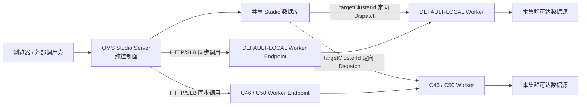

# Studio 多运行集群部署说明

更新时间：2026-07-30

## 1. 目标拓扑

OMS 是唯一控制面。浏览器、开放 API、配置、调度入口、统计和告警都访问 `studio-server`；所有数据面能力由目标运行集群中的 `studio-worker` 执行。



单集群就是图中只有一个运行集群和一个 Worker 端点。增加集群不会改变 Server 启动方式，也没有模式切换。

## 2. 部署不变量

- Server 不加载 DataAggregation 插件，不连接业务数据源，不执行用户 SQL、脚本、采集、质量或同步服务。
- Worker 使用全量且一致的执行能力；集群差异只表示网络位置和数据源可达范围。
- `runtimeClusterId` 是唯一运行目标，`workerGroupCode` 只是集群内部技术池标识。
- 异步任务通过共享数据库定向领取；同步操作通过受管 HTTP/SLB 端点。
- 目标离线时不跨集群转移：同步返回 `503`，异步保持 `QUEUED`。
- `DEFAULT-LOCAL` 是普通集群编码，不表示 Server 本地执行。
- 不再使用 `LEGACY/ENFORCED` 运行模式，运行时不推断空集群字段。

## 3. 进程部署

### OMS 网络

至少部署：

- `studio-server`
- Studio 元数据库连接
- 需要缓存时的共享 Redis
- 生产运行日志使用的共享对象存储
- 启用智能问数时的 `studio-flink` 规划服务

OMS 也需要执行能力时，再部署一个属于 OMS 运行集群的 Worker。仅启动 Server 不会执行任何任务。

### 其他执行网络

通常只部署 `studio-worker`，不部署第二套 Server。每个 Worker：

- 连接同一 Studio 元数据库。
- 配置本集群 `STUDIO_CLUSTER_CODE`。
- `EAGER_LOCAL` 挂载完整 `STUDIO_AGGREGATION_HOME`；`LAZY_OBJECT_STORAGE` 只挂载可写缓存目录并从对象存储按需加载插件。
- 使用与 Server 一致的 `STUDIO_INTERNAL_API_TOKEN` 和 `STUDIO_ENCRYPTION_SECRET`。
- 具备访问本集群适用数据源的网络权限。

## 4. 关键变量

| 变量 | Server | Worker | 说明 |
| --- | --- | --- | --- |
| `STUDIO_CLUSTER_CODE` | 不配置 | 必填 | Worker 集群身份，必须与数据库登记编码一致。 |
| `STUDIO_AGGREGATION_HOME` | 不配置 | 必填 | Worker 插件和运行资源目录。 |
| `STUDIO_INTERNAL_API_TOKEN` | 必填 | 必填 | 内部 HTTP 认证，所有进程一致。 |
| `STUDIO_ENCRYPTION_SECRET` | 必填 | 必填 | 数据源、端点秘密和短期 Dispatch 执行输入加密，所有进程一致。 |
| `STUDIO_RUNTIME_ENDPOINT_ALLOWED_HOSTS` | 按需 | 按需 | Server 精确放行内网 Worker/SLB；Worker 仅为历史私网 HTTP/HTTPS 脚本制品精确放行主机，逗号分隔。 |
| `STUDIO_RUNTIME_INVOCATION_MAX_CONCURRENCY` | 不使用 | `32` | 单 Worker 的同步数据面并发上限；超限返回 `503`，异步 Dispatch 线程不受影响。 |
| `STUDIO_WORKER_API_BASE_URL` | 不使用 | 必填 | Worker 上报的内部诊断地址。 |
| `STUDIO_RUNTIME_VERSION` | 不使用 | 建议 | Worker 版本观测值。 |
| `STUDIO_PLUGIN_FINGERPRINT` | 不使用 | 建议 | Worker 插件指纹。 |
| `STUDIO_PLUGIN_RUNTIME_MODE` | 不配置 | `EAGER_LOCAL` | `EAGER_LOCAL` 使用完整本地目录；`LAZY_OBJECT_STORAGE` 启用按需缓存和无重启热更新。 |
| `STUDIO_PLUGIN_BUCKET` | 不配置 | 按需 | 懒加载插件仓库 Bucket；为空时使用 `STUDIO_OBJECT_BUCKET`。 |
| `STUDIO_PLUGIN_PREFIX` | 不配置 | `aggregation-plugins` | 插件仓库相对前缀，不能包含父目录跳转。 |
| `STUDIO_PLUGIN_CHANNEL` | 不配置 | `production` | Worker 订阅的插件发布通道。 |
| `STUDIO_PLUGIN_REFRESH_INTERVAL_SECONDS` | 不配置 | `30` | 已使用或已缓存插件的后台刷新周期。 |
| `STUDIO_PLUGIN_REFRESH_JITTER_SECONDS` | 不配置 | `10` | 后台刷新随机抖动上限。 |
| `STUDIO_PLUGIN_COLD_LOAD_TIMEOUT_SECONDS` | 不配置 | `300` | 首次无缓存时等待单飞下载的最长秒数。 |
| `STUDIO_PLUGIN_MAX_ARTIFACT_BYTES` | 不配置 | `536870912` | 单插件 ZIP 上限。 |
| `STUDIO_PLUGIN_MAX_EXTRACTED_BYTES` | 不配置 | `1073741824` | 单插件解压后总量上限。 |
| `STUDIO_PLUGIN_MAX_ENTRY_COUNT` | 不配置 | `5000` | 单插件 ZIP 文件项上限。 |
| `STUDIO_PLUGIN_CACHE_MAX_BYTES` | 不配置 | `10737418240` | Worker 插件缓存软上限。 |
| `STUDIO_PLUGIN_RETAINED_RELEASES` | 不配置 | `2` | 每个插件默认保留的最近已验证版本数；活动和使用中版本不会删除。 |
| `STUDIO_SCRIPT_ARTIFACT_CONNECT_TIMEOUT_SECONDS` | 不使用 | `5` | HTTP/HTTPS 脚本环境依赖连接超时。 |
| `STUDIO_SCRIPT_ARTIFACT_READ_TIMEOUT_SECONDS` | 不使用 | `30` | HTTP/HTTPS 脚本环境依赖读取超时。 |
| `STUDIO_SCRIPT_ARTIFACT_MAX_BYTES` | 不使用 | `67108864` | 单个制品及 ZIP 解压后 JAR 总量上限，最大 64 MiB。 |
| `STUDIO_SCRIPT_ARTIFACT_ALLOW_LOCAL_FILES` | 不使用 | `false` | 生产保持关闭；仅用于受控历史兼容。 |
| `STUDIO_SCRIPT_ARTIFACT_ALLOWED_LOCAL_ROOTS` | 不使用 | 空 | 本地文件开启后的真实根目录列表，逗号分隔。 |
| `STUDIO_GATEWAY_TRUST_ENABLED` | 必须显式配置 | 应设为 `false` | 未接入可信网关时所有进程均关闭；启用时仅 Server 开启并配置非默认共享密钥。 |

启用智能问数时，Server 还需通过 `STUDIO_FLINK_BASE_URL` 或 `STUDIO_FLINK_SERVICE_NAME` 找到 `studio-flink`。该服务只生成计划，真实 Flink SQL 仍按 `runtimeClusterId` 在目标 Worker 执行；规划服务不可用时只影响智能问数入口，不得触发 Server 本地执行。

已废弃且不应继续配置：

```text
STUDIO_RUNTIME_CLUSTER_MODE
STUDIO_RUNTIME_CLUSTER_BACKFILL_ENABLED
STUDIO_RUNTIME_CLUSTER_BACKFILL_DRY_RUN
```

完整变量说明见 [Studio Server / Worker 配置说明](./studio-server-worker-configuration.md)。

### Worker OSS 按需插件模式

该模式只在 `studio-worker` 注册 OSS resolver，不改变独立 DataAggregation、Studio Server 或远程 Flink Connector/TaskManager。`STUDIO_AGGREGATION_HOME` 是可写运行目录，启动时会自动创建 `conf/core.json`、插件分类骨架、`.staging`、`.state` 和 `cache`，镜像无需携带完整 `aggregation/plugin`。

对象键固定为：

```text
{prefix}/{channel}/{type}/{name}/current.json
{prefix}/{channel}/{type}/{name}/releases/{release}/plugin.zip
```

每个 `release` 不可变。发布或回滚时先上传目标 `plugin.zip`，最后原子覆盖 `current.json`；不要覆盖已有 release 的 ZIP。运行中的任务实例继续持有旧 identity，新任务实例自动取得后台校验成功的新 identity。刷新失败时 Worker 保留最后有效版本并在心跳 `capabilities.pluginRuntime` 中报告 `DEGRADED`。

可从完整本地插件目录生成一个插件或全部仓库。构建机需要安装 `bash`、`jq`、`zip`，以及 `sha256sum` 或 `shasum`：

```bash
bash package_all/build_plugin_repository.sh \
  --type source --name mysql8 --release 20260730-v1 \
  --output-root /tmp/release/aggregation-plugins

bash package_all/build_plugin_repository.sh \
  --all --release 20260730-v1 \
  --output-root /tmp/release/aggregation-plugins
```

生成结果已包含 `plugin.zip`、SHA-256、大小和固定字段 `current.json`。本机验收统一使用 `C:\Users\jdrag\Desktop\oss-browser-win32-x64\oss-browser.exe` 上传：先上传不可变的 `releases/{release}/plugin.zip`，核对大小和 SHA-256，最后上传 `current.json`。生产 Worker 还需配置对象存储 provider、endpoint、access key、secret key，以及插件 Bucket 或通用对象存储 Bucket。

### 插件更新与应用代码重启

普通插件发布不重启 Worker。后台刷新校验成功后只切换 active identity；运行中的任务实例固定原 identity，新任务实例使用新 identity。回滚同样只把 `current.json` 指向已存在且校验通过的不可变 release。

Worker 应用代码变化时不承诺保留进程内任务，按以下顺序重启：

1. 停止接收新任务并等待已有任务结束。
2. 使用 Java 17 执行 DataAggregation 的 `plugins-loader-center,core` 定向测试和安装，再执行 Studio `studio-worker -am` 测试和安装。
3. 停止 IDEA 中现有的 `StudioWorkerApplication`。
4. 确认 Nacos 配置已经发布，并确认 IDEA 运行配置中的 `-Daggregation.home` 与 Nacos `studio.aggregation-home` 完全相同。`LAZY_OBJECT_STORAGE` 必须指向独立可写缓存目录，不能继续指向旧的完整 `package_all/aggregation`。
5. 使用 IDEA 原 `StudioWorkerApplication` 运行配置重新启动，保留原 JVM 内存参数和 `STUDIO_CLUSTER_CODE`；不要改用参数不一致的临时 `java -jar` 或 `spring-boot:run`。
6. 验证启动守门通过、Worker 重新上线、心跳报告 `LAZY_OBJECT_STORAGE`，并确认 `.state` 和 `cache` 中的 active release 已恢复且没有重新下载。

插件模式、Bucket、prefix、channel 和刷新参数只保留一个配置来源。本机 Nacos 验收时将它们放在 Nacos，不在 IDEA 环境变量中重复设置。

## 5. 控制面配置步骤

1. 创建运行集群，例如 `DEFAULT-LOCAL`、`C46`、`C50`。集群编码创建后不可修改。
2. 为项目授权可用集群，并设置首选集群和是否允许手动覆盖。
3. 为每个数据源选择适用集群。连接健康只做提示，不自动改变适用范围。
4. 为需要同步能力的集群配置一个启用的 `HTTP` Worker 或 SLB 基础地址。
5. 测试端点和数据源连接，再创建或迁移业务资源。
6. 确认所有资源、运行请求和新 Dispatch 都有真实集群 ID。

端点只填写基础地址，例如：

```text
http://studio-worker.default.svc:18081
https://worker-slb.internal.example
```

不要追加 `/internal/runtime`。Server 会按操作类型拼接内部路径。

旧 `LOCAL` 端点没有执行能力；迁移到 HTTP 端点后应停用并删除。

## 6. 安全边界

- Worker 内部接口不对用户网络暴露。
- 端点 Header/Token 用于 SLB 或内部网关，内部认证使用单独的 Studio 保留 Header。
- 自定义 Header 不能覆盖内部 Token、目标集群、Host、Content-Length 等保留字段。
- 未接入可信身份网关时显式设置 `STUDIO_GATEWAY_TRUST_ENABLED=false`；启用时禁止使用默认 `change-me`，并确保网关与 Server 时钟同步。
- 禁止重定向和自动业务重试，防止写入类调用重复执行。
- 默认拒绝 HTTP、回环、链路本地、私网、本机接口和云元数据地址；内网主机必须加入精确 allowed-hosts。
- URL 校验通过前不解密或发送端点秘密和业务请求体。
- 数据源密码、端点 Header 值、Token、Cookie 和完整请求体不写入日志。
- 工作流 Dispatch 只保存版本、节点和资源定位字段；Worker 从不可变工作流版本读取节点配置，HTTP Header、Body 和字段映射不会复制到 Dispatch Payload。
- Java 环境依赖优先使用受管 `oss://`；HTTP/HTTPS 固定 DNS、禁止重定向并限制超时/大小，私网制品主机必须加入 Worker allowed-hosts；本地文件默认拒绝。

allowed-hosts 示例：

```bash
STUDIO_RUNTIME_ENDPOINT_ALLOWED_HOSTS=studio-worker.default.svc,worker-slb.internal.example,127.0.0.1
```

## 7. 运行规则

- 定时运行使用资源保存的集群。
- 手动覆盖必须满足项目授权、允许覆盖以及全部引用数据源适用于目标集群。
- 工作流下游节点继承工作流运行目标，不重新选集群。
- Worker 只领取自身集群的非空 `targetClusterId` 任务。
- 项目授权或数据源适用范围变化后，受影响资源标记为运行配置失效，新的运行被拒绝。
- 同步代理不自动重试；Worker 业务响应的 HTTP 状态、Body 和允许的 Header 应保真返回。
- 运行记录和访问日志由实际执行路径写一次，并记录请求目标和实际集群。
- 即席脚本正文、运行参数和执行覆盖配置只以密文短期保存在 Dispatch；Worker 解密后、执行前清空，终态恢复路径也必须清空。

## 8. 单集群部署顺序

1. 执行数据库初始化或升级。升级已有库时，必须在启动新 Server/Worker 前完成 `20260720-runtime-cluster.sql`、`20260722-runtime-invocation-idempotency.sql` 和 `20260723-dispatch-protected-payload.sql` 对应结构升级。
2. 启动 Server，配置共享密钥，不配置集群代码和插件目录。
3. 创建或保留 `DEFAULT-LOCAL` 集群和项目授权。
4. 启动 `default-local` Worker：选择 `EAGER_LOCAL` 并挂载完整插件，或选择 `LAZY_OBJECT_STORAGE` 并挂载可写缓存目录、配置插件仓库；等待实例心跳和 Lease 在线。
5. 配置该 Worker 的 HTTP 端点并测试。
6. 为数据源绑定 `DEFAULT-LOCAL`，逐项测试。
7. 创建资源并验证同步探测、SQL、任务和开放服务均经过 Worker。
8. 停止 Worker，验证同步 `503` 和异步排队；恢复后验证继续执行。

## 9. 多集群扩容顺序

1. 创建新运行集群记录。
2. 在目标网络部署相同运行版本和插件通道的 Worker；本地模式挂载完整插件，懒加载模式使用相同 OSS 仓库配置。
3. 等待实例心跳和 Lease 在线。
4. 配置并测试 HTTP/SLB 端点。
5. 为项目授权新集群。
6. 将确认可达的数据源绑定到新集群。
7. 新建资源或编辑存量资源选择新运行集群。
8. 验证定向任务只能被该集群 Worker 领取。

不自动迁移存量资源，也不自动把失败任务切换到新集群。

## 10. 历史升级

历史数据中的空 `runtimeClusterId/targetClusterId` 必须在发布窗口处理：

1. 备份数据库，按版本顺序完成 `20260720`、`20260722`、`20260723` 结构升级，再运行一次性迁移工具 dry-run。
2. 对只有唯一无歧义集群的租户回填项目授权、数据源绑定和资源集群。
3. 多集群或存在歧义的租户由管理员确认，不自动推断。
4. 排空旧 Worker 和历史活动任务。
5. 排空并停止旧 Worker，部署只领取显式目标且支持短期 Dispatch 密文的新 Worker。
6. 确认新版 Worker 在线后再部署新版 Server；新版 Server 开始接收流量后不得让旧 Worker 继续领取即席脚本任务。
7. 配置并验证每个集群的 HTTP 端点。
8. 移除 Server 插件卷和业务数据源网络权限。

迁移工具不是正常启动逻辑，完成后不保留运行模式开关。

一次性资源回填工具不会修改 `dispatch_task.target_cluster_id`。空目标 Dispatch 必须按状态人工处置：

| Dispatch 状态 | 处置要求 |
| --- | --- |
| `QUEUED` | 新 Worker 不会领取。先通过现有运行停止/清理能力将旧记录置为终态；没有业务入口时由 DBA 按变更单处置并保留原因，再在确认资源集群、项目授权和数据源绑定后通过业务入口重新触发。只有目标无歧义且有变更单时才允许 DBA 显式回填。 |
| `RUNNING` | 保留兼容 Worker 等待完成；无法恢复的运行先按故障恢复流程进入终态，禁止直接修改已领取记录的目标集群。 |
| `SUCCESS/FAILED/STOPPED` 等终态 | 可以保留空值作为历史证据，不会被统一 Worker 再次领取；不得为了“清零”改写历史实际执行位置。 |

切换前必须停用调度入口并证明不存在空目标的活动任务：

```sql
select status, count(*) as task_count
from dispatch_task
where deleted = 0
  and target_cluster_id is null
group by status
order by status;

select count(*) as blocking_dispatch_count
from dispatch_task
where deleted = 0
  and status in ('QUEUED', 'RUNNING')
  and target_cluster_id is null;
```

只有 `blocking_dispatch_count = 0` 才能启动只领取显式目标的新 Worker。若需要回滚，先再次停止调度和新 Worker，保留数据库备份及处置前 Dispatch 清单，再回退应用；回滚不得自动把任务改派到其它集群。

加密密钥也必须在切换前确认。新部署应在首次写入秘密前确定最终非默认密钥；已有环境不能只修改 `STUDIO_ENCRYPTION_SECRET` 后重启。当前版本提供停机离线轮换工具，但不支持在线双密钥或滚动轮换。升级窗口必须停止 Server、Worker、调度和外部流量，先备份并 Dry Run，再双确认 Apply；覆盖范围包括数据源/模型/采集配置中的 `ENC(...)`、运行端点、告警 Webhook、短期 Dispatch 输入和幂等响应密文。完整命令、回退和验证要求见[数据库升级说明](../../数据库/runtime-cluster-upgrade.md#加密密钥迁移边界)。

## 11. 上线检查

在最终容器或 Pod 中完成 Secret 注入和 Worker 插件卷挂载后执行自动预检：

```powershell
powershell -ExecutionPolicy Bypass -File backend/scripts/check-studio-deployment.ps1 -Role Server
powershell -ExecutionPolicy Bypass -File backend/scripts/check-studio-deployment.ps1 -Role Worker -RequireSharedObjectStorage
```

脚本检查当前进程环境中的稳态配置且不输出秘密。`EAGER_LOCAL` 会核对 `conf/core.json` 与四类核心插件目录；`LAZY_OBJECT_STORAGE` 会核对缓存根目录可创建/可写以及 OSS 配置完整性，但不会调用会写健康探针对象的连通性检查。若配置由 Nacos 注入，应在渲染后的部署配置中做等价校验。预检通过只说明静态配置正确，生产 SLB Header、网络隔离、对象存储连通性/容量/生命周期/高可用仍须按[生产运行面验收](./studio-production-runtime-acceptance.md)在最终 Pod 和受控执行器中实测。目标环境验收工具只从环境变量读取 Token、Cookie、Header 值和对象存储凭据，输出报告不保存这些秘密。

```text
[ ] Server 未配置 STUDIO_CLUSTER_CODE 和 STUDIO_AGGREGATION_HOME
[ ] Server 镜像/Pod 没有 aggregation/plugin 和 conf/core.json
[ ] 每个启用集群至少有一个在线 Worker
[ ] Worker 集群编码与登记记录一致
[ ] 懒加载 Worker 镜像未携带完整 aggregation/plugin，缓存目录可写，插件仓库 release 不可变且 current.json 最后更新
[ ] Server/Worker 使用相同且非默认的内部 Token 和加密密钥
[ ] 若发生密钥切换，已停机备份并完成离线轮换；全部进程统一使用新密钥，数据源、运行端点、告警通道和同步服务已逐集群验证
[ ] 未接入可信网关时已显式关闭 gateway trust；启用时 shared secret 不是默认值
[ ] 每个同步集群只有一个受管 HTTP/SLB 基础端点
[ ] 内网端点主机已最小范围加入 allowed-hosts
[ ] 所有项目、数据源和资源的运行集群数据完整
[ ] 新 Dispatch 的 target_cluster_id 均非空
[ ] 历史 QUEUED/RUNNING Dispatch 的空 target_cluster_id 计数为 0
[ ] `dispatch_task.protected_payload_ciphertext` 已建列；新 Worker 领取即席脚本后该列会在执行前清空，历史终态记录不存在残留密文
[ ] Worker 版本、插件 manifest 和 fingerprint 与发布记录一致
[ ] 启用智能问数时 studio-flink 地址或 Nacos 发现已验证
[ ] 多集群运行日志使用共享对象存储，并显式声明 `MINIO` 或 `OSS` provider
[ ] Worker 停机时同步 503、异步排队和恢复执行符合预期
[ ] 访问日志、运行记录、统计和告警没有重复写入
[ ] 每个同步集群的真实 SLB 请求均返回 Worker 正向标记，错误内部 Token 返回独立认证错误标记，响应不回显秘密
[ ] OMS Pod 对代表性业务数据源端口为不可达，目标 Worker Pod 对同一端口为可达
[ ] 生产对象存储协议 IT 使用实际 provider（当前为阿里云 `OSS`）且为 1/1，网络 ACL、容量、生命周期和高可用均有独立证据
```

## 12. 排障顺序

1. 查看资源保存的 `runtimeClusterId` 和运行记录的 requested/actual cluster。
2. 查看目标集群是否启用、实例心跳和 Worker Lease 是否在线。
3. 查看项目授权、数据源绑定和运行配置失效记录。
4. 测试 HTTP 端点的内部认证和集群身份。
5. 检查 allowed-hosts、SLB Header、请求/响应大小限制和超时。
6. 查看目标 Worker 插件指纹、运行日志和业务数据源连通性。

健康状态 `UNKNOWN` 表示当前没有可用 Worker 完成探测，不等同于已确认数据源 `UNAVAILABLE`。
